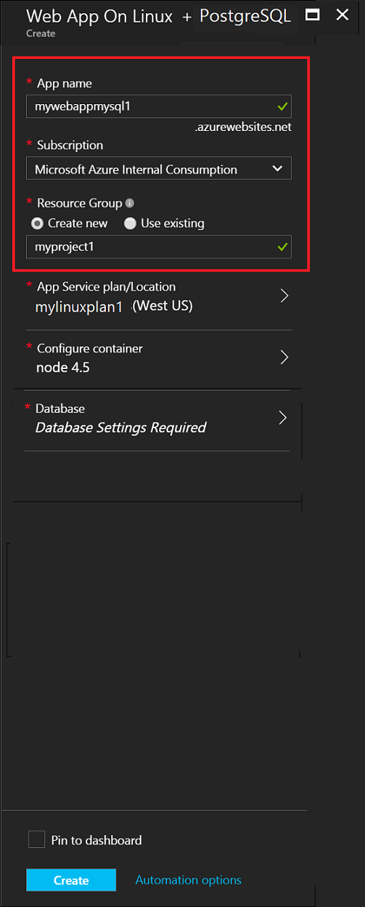
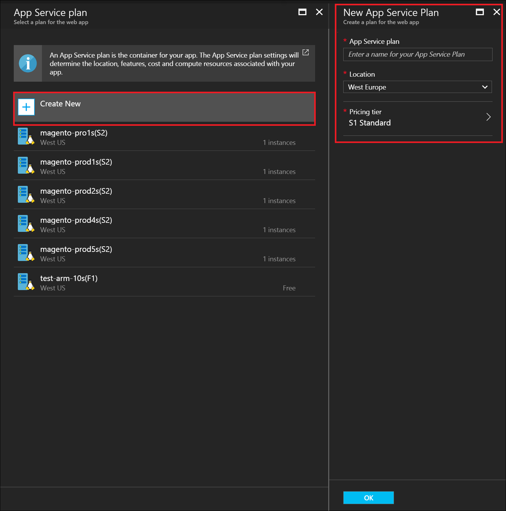
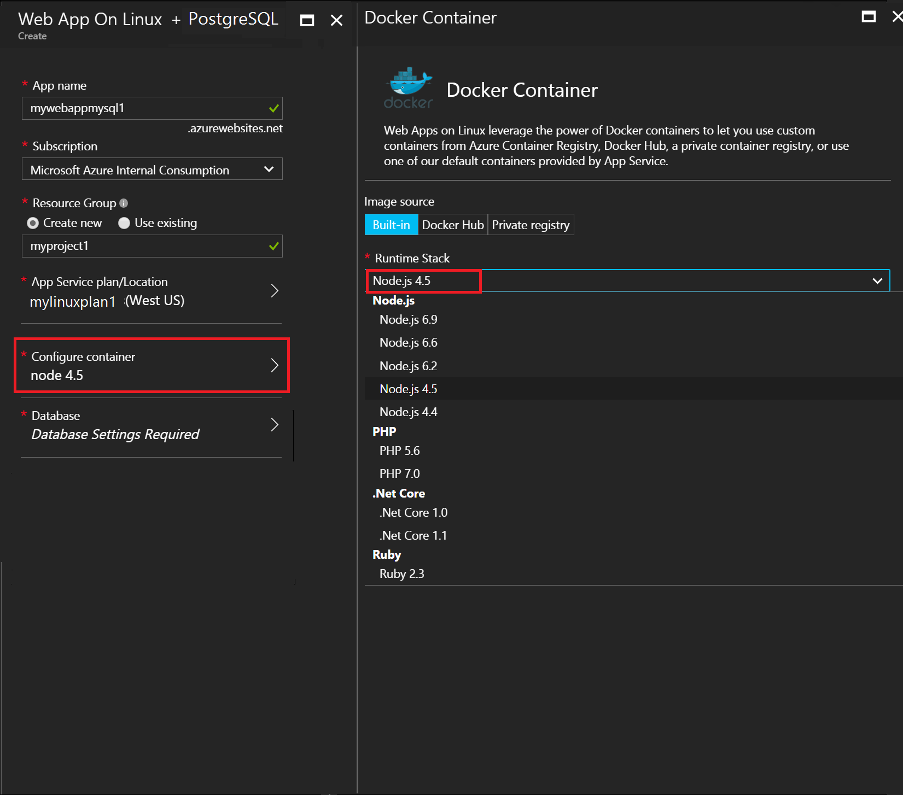
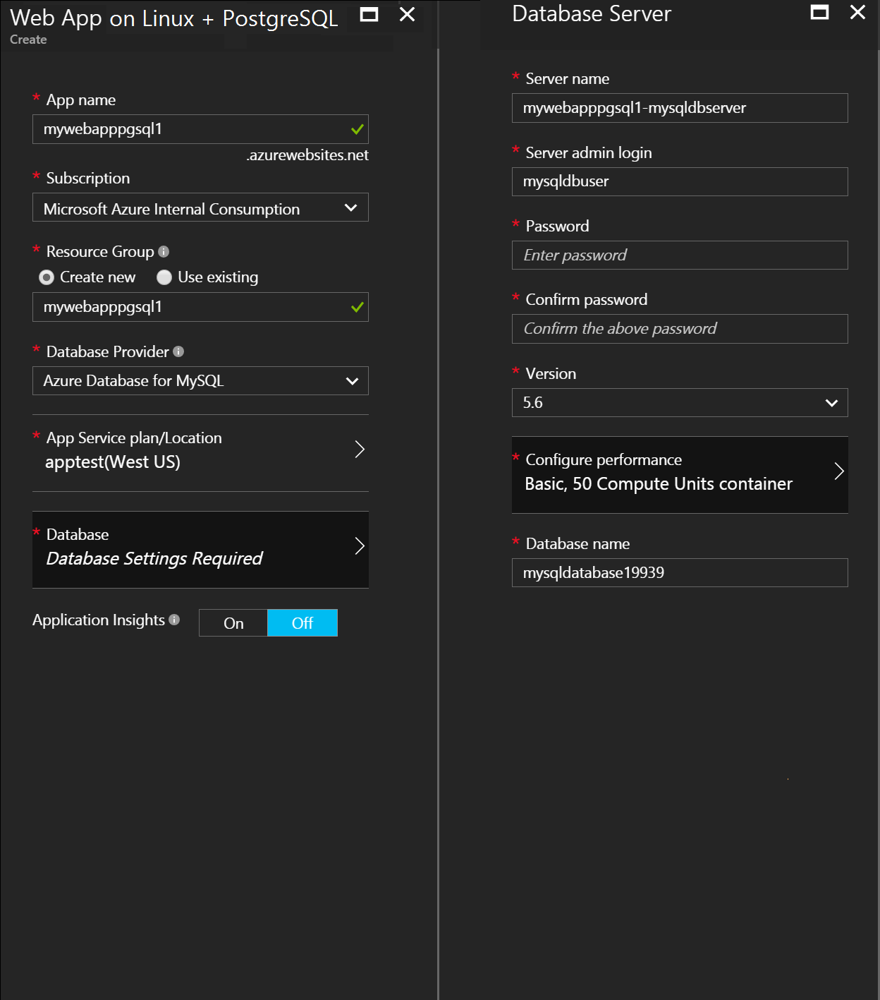
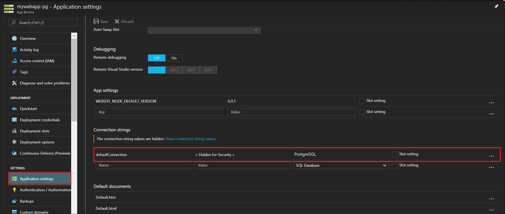

# Create a Web app in Azure with PostgreSQL Database

This tutorial shows you how to create a Web App running in [Azure App Service](../app-service/app-service-value-prop-what-is.md) with PostgreSQL database in Azure. Connect your web app to [Azure RDS for PostgreSQL](https://azure.microsoft.com/en-us/services/postgres) in just a few minutes, and enable your data-driven functionality with minimal configuration. 

## Before you begin

This tutorial demonstrates how to use provision a Web App with a PostgreSQL database.  Before we begin , you need to understand the different Web App options options available to you that you can use with Azure RDS for PostgreSQL.

There are two falvors of Web Apps in the Azure portal : 
- [Web App on Windows](https://azure.microsoft.com/en-us/services/app-service/web/) : Azure App Service on Windows supports running web apps natively on Windows.
- [Web App on Linux (Preview)](/app-service-linux-intro) : Azure App Service on Linux is currently in public preview and supports running web apps natively on Linux. 

### Create a Web app with PostgreSQL database using Azure marketplace 

The Microsoft Azure Marketplace provides solutions that are ready to use. Web App + MySQL is a solution that is available in Azure marketplace to quickly create a web app running on App Service connected to a MySQL database in Azure as an alternate way to using Azure CLI or Powershell. In this article , we will focus on Web App on Linux (Preview) with MySQL but the create flow in the portal is similar for Web App on Windows. 

1. Login in to [Azure portal](https://porta.azure.com).
2. Click [here](https://portal.azure.com/#create/Microsoft.AppSvcLinuxPGDatabase) to launch the **Web App on Linux + PostgreSQL** template in the marketplace. 
3. Enter  the following information:
    - a unique app name for your **Web App Name**. This name will be used as part of the default DNS name for your app (`<app_name>.azurewebsites.net`), so it needs to be unique across all apps in Azure. You can later map a custom domain name to your app before you expose it to your users.
    - Enter a **resource group** : A resource group is a logical container into which Azure resources like web apps, databases and storage accounts are deployed and managed. You can create a new resource group or use an existing one. 
    - Select a **Subcription** : If you have multiple subscriptions , choose the appropriate subcsription in which the resource will exist or billed for.
    

4.  Click on **App Service Plan** and then click **Create New**. Configure the new App Service plan : 
    - Enter a name for the new **App Service Plan**, such as **myAppServicePlan**. 
    - Select the **Location** such as **West Europe**, or any other region you like.
    - Select the **Pricing tier**.  Choose **Standard(S1)**, or any other [pricing tier](https://azure.microsoft.com/pricing/details/app-service/) you like.
    - Click **OK**.

> [!NOTE]
> an App Service plan represents the collection of physical resources used to host your apps. All apps assigned to an App Service plan share the resources defined by it, which enables you to save cost when hosting multiple apps. 
>

5. Choose the application stack that you intend to use. You can choose between several versions of Node.js, PHP, .Net Core, and Ruby.
 
 
6. Click on **Database**. Configure the new PostgreSQL database by creating a new resource group and select the appropriate location for it. 
 
> [!NOTE]
>- It is recommended that both Web App and PostgreSQL database be in the same location. Azure database for MySQL(Preview) and Web App on Linux (Preview) are not available in all regions. 
>- To use an existing database or existing server , make sure you select an existing resource group in which the existing Azure RDS for MySQL server belongs to.

7. Click on **Create** . 

10. Once the Web App with PostgreSQL database is deployed, click on **Application Settings-> Connectionstrings** where you can view that the Web App is now connected to PostgreSQL database. For security reasons it is hidden , click on **Show connection strings** to view the connection string. 

 

Now , you can bring yor files to this empty Web App and import your PostgreSQL database .  See **Next Steps** below. 

## Next steps

- [Deploy the files for your web app](./web-sites-deploy.md).
- [Migrate your PostgreSQL database using dump and restore](../postgresql/howto-migrate-using-dump-and-restore.md)
- [Manage your PostgreSQL database using pgAdmin](../postgresql/quickstart-connect-query-using-pgadmin.md)
