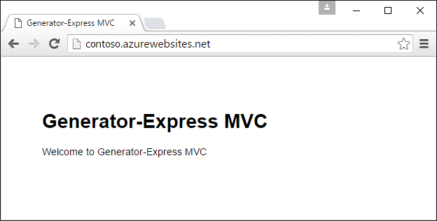
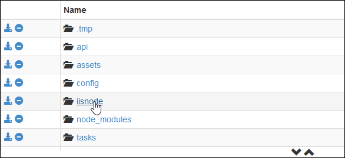
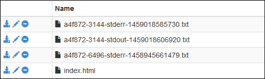

<properties
	pageTitle="Get started with Node.js web apps in Azure App Service"
	description="Learn how to deploy a Node.js application to a web app in Azure App Service."
	services="app-service\web"
	documentationCenter="nodejs"
	authors="cephalin"
	manager="wpickett"
	editor=""/>

<tags
	ms.service="app-service-web"
	ms.workload="web"
	ms.tgt_pltfrm="na"
	ms.devlang="nodejs"
	ms.topic="get-started-article"
	ms.date="03/31/2016"
	ms.author="cephalin;robmcm"/>

# Get started with Node.js web apps in Azure App Service

[AZURE.INCLUDE [tabs](../../includes/app-service-web-get-started-nav-tabs.md)]

This tutorial shows how to create a simple [Node.js](http://nodejs.org) application and deploy it to a [web app](app-service-web-overview.md) in 
[Azure App Service](../app-service/app-service-value-prop-what-is.md) from a command line such as cmd.exe or bash. The instructions in this tutorial can 
be followed on any operating system that is capable of running Node.js.

<a name="prereq"/>
## Prerequisites

- Node.js. Installation binaries are [here](https://nodejs.org/).
- Yoeman. Installation instructions are [here](http://yeoman.io/).
- Git. Installation binaries are [here](http://www.git-scm.com/downloads).
- Azure CLI. Installation instructions are [here](../xplat-cli-install.md).
- A Microsoft Azure account. If you don't have an account, you can
[sign up for a free trial](/pricing/free-trial/?WT.mc_id=A261C142F) or
[activate your Visual Studio subscriber benefits](/pricing/member-offers/msdn-benefits-details/?WT.mc_id=A261C142F).

## Create and deploy a simple Node.js web app

1. Open the command-line terminal of your choice install the [Express generator for Yoeman](https://github.com/petecoop/generator-express).

        npm install -g generator-express

2. `CD` to a working directory and generate an express app like so:

        yo express
        
    Choose the following options when prompted:  

    `? Would you like to create a new directory for your project?` **Yes**  
    `? Enter directory name` **&lt;appname>**  
    `? Select a version to install:` **MVC**  
    `? Select a view engine to use:` **Jade**  
    `? Select a css preprocessor to use (Sass Requires Ruby):` **None**  
    `? Select a database to use:` **None**  
    `? Select a build tool to use:` **Grunt**

3. `CD` to the root directory of your new app and start it to make sure it runs in your development environment:

        npm start

    In your browser, navigate to [http://localhost:3000](http://localhost:3000) to make sure that you can see the Express home page. Once you've verified
    your app runs properly, use `Ctrl-C` to stop it.
    
1. Log in to Azure like so (you need [Azure CLI](#prereq) for this):

        azure login

    Follow the prompt to continue the login in a browser with a Microsoft account that has your Azure subscription.

2. Make sure you're still in the root directory of your app. Create the App Service app resource in Azure with a unique
app name with the next command. Your web app's URL is http://&lt;appname>.azurewebsites.net.

        azure site create --git <appname>

    Follow the prompt to select an Azure region to deploy to. If you've never set up Git/FTP deployment credentials for your Azure
    subscription, you'll also be prompted to create them.

3. Open config/config.js and change the production port to `process.env.port`. Your production JSON object should look like:

        production: {
            root: rootPath,
            app: {
                name: 'express1'
            },
            port: process.env.port,
        }

    This lets your Node.js app respond to web requests on the default port that iisnode listens.
    
4. Save your changes, then use git to deploy your app to Azure:

        git add .
        git commit -m "<your commit message>"
        git push azure master

    The Express generator already provides a .gitignore file, so your `git push` won't consume bandwidth trying to upload 
    the node_modules/ directory.

5. Finally, just launch your live Azure app in the browser:

        azure site browse

    You should now see your Node.js web app running live in Azure App Service.
    
    

## Update your Node.js web app

To make updates to your Node.js web app running in App Service, just run `git add`, `git commit`, and `git push` like you did when 
you deployed it first.
     
## How App Service deploys your Node.js app

Azure App Service uses [iisnode](https://github.com/tjanczuk/iisnode/wiki) to run Node.js apps. The Azure CLI and the Kudu 
engine (Git deployment) work together to give you a streamlined experience when you develop and deploy Node.js apps from
the command line. 

- `azure site create --git` recognizes the common Node.js pattern of server.js or app.js and creates an iisnode.yml in your
root directory. You can use this file to customize iisnode.
- At `git push azure master`, Kudu automates the following deployment tasks:

    - If package.json is in the repository root, run `npm install --production`.
    - Generate a Web.config for iisnode that points to your start script in package.json (e.g. server.js or app.js).
    - Customize Web.config to ready your app for debugging with Node-Inspector.
    
## Use a Node.js framework

If you use a popular Node.js framework, such as [Sails.js](http://sailsjs.org/) or [MEAN.js](http://meanjs.org/) to develop
apps, you can deploy those to App Service. Popular Node.js frameworks have their specific quirks, and their package dependencies
keep getting updated. However, App Service makes the the stdout and stderr logs available to you, so you can know exactly 
what's happening with your app and make changes accordingly. For more information, see 
[Get stdout and stderr logs from iisnode](#iisnodelog).

Check out tutorials that show you how to work with a specific framework in App Service

- [Deploy a Sails.js web app to Azure App Service](app-service-web-nodejs-sails.md)
- [Create a Node.js chat application with Socket.IO in Azure App Service](web-sites-nodejs-chat-app-socketio.md)
- [How to use io.js with Azure App Service Web Apps](web-sites-nodejs-iojs.md)

## Use a specific Node.js engine

In your typical workflow, you can tell App Service to use a specific Node.js engine as you normally would in package.json.
For example:

    "engines": {
        "node": "5.5.0"
    }, 

The Kudu deployment engine determines which Node.js engine to use in the following order:

- First, look at iisnode.yml to see if `nodeProcessCommandLine` is specified. If yes, then use that.
- Next, look at package.json to see if `"node": "..."` is specified in the `engines` object. If yes, then use that.
- Choose a default Node.js version by default.

<a name="iisnodelog" />
## Get stdout and stderr logs from iisnode

To read iisnode logs, follow these steps:

1. Open the iisnode.yml file that Azure CLI gives you

2. Set the two following parameters: 

        loggingEnabled: true
        logDirectory: iisnode
    
    Together, they tell iisnode in App Service to put its stdout and stderror output in the D:\home\site\wwwroot\**iisnode** directory.

3. Save your changes, then push your changes to Azure with the following Git commands:

        git add .
        git commit -m "<your commit message>"
        git push azure master
   
   iisnode is now configured. The next steps show you how to access these logs.
     
4. In your browser, access the Kudu debug console for your app, which is at:

        https://<appname>.scm.azurewebsites.net/DebugConsole 

5. Navigate to D:\home\site\wwwroot\iisnode

    

6. Click the **Edit** icon for the log you want to read. You can also click **Download** or **Delete** if you want.

    

    Now you can see the log to help you debug your App Service deployment.
    
    

## Debug your app with Node-Inspector

If you use Node-Inspector to debug your Node.js apps, you can use it for your live App Service app. Node-Inspector is 
preinstalled in the iisnode installation for App Service. And if you deploy through Git, the auto-generated 
Web.config from Kudu already contains all the configuration you need to enable Node-Inspector.

To enable Node-Inspector, follow these steps:

1. Open iisnode.yml at your repository root and specify the following parameters: 

        debuggingEnabled: true
        debuggerExtensionDll: iisnode-inspector.dll

3. Save your changes, then push your changes to Azure with the following Git commands:

        git add .
        git commit -m "<your commit message>"
        git push azure master
   
4. Now, just navigate to your app's start file as specified by the start script in your package.json, with /debug added
to the URL. For example,

        http://<appname>.azurewebsites.net/server.js/debug
    
    Or,
    
        http://<appname>.azurewebsites.net/app.js/debug

## More resources

- [Specifying a Node.js version in an Azure application](../nodejs-specify-node-version-azure-apps.md)
- [How to debug a Node.js web app in Azure App Service](web-sites-nodejs-debug.md)
- [Using Node.js Modules with Azure applications](../nodejs-use-node-modules-azure-apps.md)
- [Azure App Service Web Apps: Node.js](http://blogs.msdn.com/b/silverlining/archive/2012/06/14/windows-azure-websites-node-js.aspx)
- [Node.js Developer Center](/develop/nodejs/)
- [Get started with web apps in Azure App Service](app-service-web-get-started.md)
