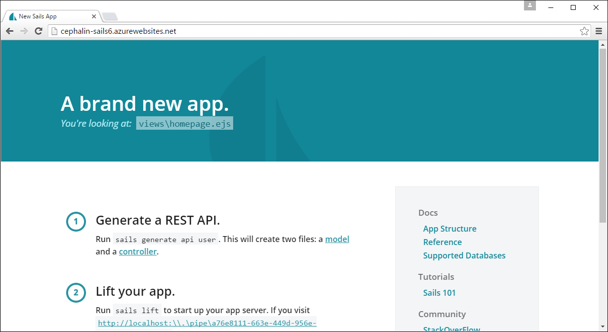

<properties
	pageTitle="Deploy a Sails.js web app to Azure App Service"
	description="Learn how to deploy a Node.js application Azure App Service. This tutorial shows you how to deploy a Sails.js web app."
	services="app-service\web"
	documentationCenter="nodejs"
	authors="cephalin"
	manager="wpickett"
	editor=""/>

<tags
	ms.service="app-service-web"
	ms.workload="web"
	ms.tgt_pltfrm="na"
	ms.devlang="nodejs"
	ms.topic="article"
	ms.date="07/01/2016"
	ms.author="cephalin"/>

# Deploy a Sails.js web app to Azure App Service

This tutorial shows you how to deploy a Sails.js app to Azure App Service. In the process, you can glean some general knowledge
on how to configure your Node.js app to run in App Service. 

## Prerequisites

- Node.js. Installation binaries are [here](https://nodejs.org/).
- Sails.js. Installation instructions are [here](http://sailsjs.org/get-started).
- Working knowledge of Sails.js. This tutorial is not intended to help you with issues related to running Sail.js in general.
- Git. Installation binaries are [here](http://www.git-scm.com/downloads).
- Azure CLI. Installation instructions are [here](../xplat-cli-install.md).
- A Microsoft Azure account. If you don't have an account, you can
[sign up for a free trial](/pricing/free-trial/?WT.mc_id=A261C142F) or
[activate your Visual Studio subscriber benefits](/pricing/member-offers/msdn-benefits-details/?WT.mc_id=A261C142F).

>[AZURE.NOTE] To see Azure App Service in action before signing up for an Azure account, go to [Try App Service](http://go.microsoft.com/fwlink/?LinkId=523751). There,
you can immediately create a short-lived starter app in App Service—no credit card required, no commitments.

## Step 1: Create a Sails.js app in your development environment

First, quickly create a default Sails.js app by following these steps:

1. Open the command-line terminal of your choice and `CD` to a working directory.

2. Create a new Sails.js app and run it:

        sails new <appname>
        cd <appname>
        sails lift

    Make sure you can navigate to the default home page at http://localhost:1377.

## Step 2: Create the App Service app resource in Azure

Next, create the App service app resource. You're going to deploy your Sails.js app to it later.

1. In the same terminal, log in to Azure like so:

        azure login

    Follow the prompt to continue the login in a browser with a Microsoft account that has your Azure subscription.

2. Make sure you're still in the root directory of your Sails.js project. Create the App Service app resource in Azure with a unique
app name with the next command. Your web app's URL is http://&lt;appname>.azurewebsites.net.

        azure site create --git <appname>

    Follow the prompt to select an Azure region to deploy to. If you've never set up Git/FTP deployment credentials for your Azure
    subscription, you'll also be prompted to create them.

    Once the App Service app resource is created:

    - Sails.js app is Git-initialized,
    - Your local Git-initialized repository is connected to the new App Service app as a Git remote, aptly named "azure", and
    - And iisnode.yml file is created in your root directory. You can use this file to configure [iisnode](https://github.com/tjanczuk/iisnode),
    which App Service uses to run Node.js apps.

## Step 3: Configure and deploy your Sails.js app

 Working with a Sails.js app in App Service consists of three main steps:

 - Configure your app for it to run in App Service
 - Deploy it to App Service
 - Read stderr and stdout logs to troubleshoot any deployment issues

Follow these steps:

1. Open the new iisnode.yml file in your root directory and add the following two lines:

        loggingEnabled: true
        logDirectory: iisnode

    Logging is now enabled for iisnode. For more information on how this works, see
    [Get stdout and stderr logs from iisnode](app-service-web-nodejs-get-started.md#iisnodelog).

2. Open config/env/production.js to configure your production environment, and set `port` and `hookTimeout`:

        module.exports = {

            // Use process.env.port to handle web requests to the default HTTP port
            port: process.env.port,
            // Increase hooks timout to 30 seconds
            // This avoids the Sails.js error documented at https://github.com/balderdashy/sails/issues/2691
            hookTimeout: 30000,

            ...
        };

    You can find documentation for these configuration settings in the
    [Sails.js Documentation](http://sailsjs.org/documentation/reference/configuration/sails-config).

    Next, you need to make sure that [Grunt](https://www.npmjs.com/package/grunt) is compatible with Azure's network 
    drives. As of the writing of this article, Grunt may produce the 
    ["ENOTSUP: operation not supported on socket" error](https://github.com/isaacs/node-glob/issues/205) because 
    it currently uses an outdated [glob](https://www.npmjs.com/package/glob) package (v3.1.21), which doesn't 
    support network drives. The next steps how you how to make Grunt use 
    [glob v5.0.14 or higher](https://github.com/isaacs/node-glob/commit/bf3381e90e283624fbd652835e1aefa55d45e2c7).

3. Since `npm install` has already run when your app was created, generate npm-shrinkwrap.json at the project root:

        npm shrinkwrap

4. Open npm-shrinkwrap.json, locate the json for `"grunt":` and then add the dependency for the glob version
you want. Your finished json should look like this:

        "grunt": {
            "version": "0.4.5",
            "from": "grunt@0.4.5",
            "resolved": "https://registry.npmjs.org/grunt/-/grunt-0.4.5.tgz",
            "dependencies": {
                "glob": {
                    "version": "5.0.14",
                    "from": "glob@5.0.14",
                    "resolved": "https://registry.npmjs.org/glob/-/glob-5.0.14.tgz"
                }
            }
        },

5. Locate all references to glob by searching for `"glob":`. If any reference is v3.1.21 or lower, change the json
to:

        "glob": {
            "version": "5.0.14",
            "from": "glob@5.0.14",
            "resolved": "https://registry.npmjs.org/glob/-/glob-5.0.14.tgz"
        }

6. Save your changes and test your changes to make sure that your app still runs locally:

        npm install
        sails lift

4. Now, use git to deploy your app to Azure:

        git add .
        git commit -m "<your commit message>"
        git push azure master

5. Finally, just launch your live Azure app in the browser:

        azure site browse

    You should now see the same Sails.js home page.
    
    

## Troubleshoot your deployment

If your Sails.js application fails for some reason in App Service, find the stderr logs to help troubleshoot it.
For more information, see [Get stdout and stderr logs from iisnode](app-service-web-nodejs-sails.md#iisnodelog).
If it has started successfully, the stdout log should show you the familiar message:

                .-..-.

    Sails              <|    .-..-.
    v0.12.1             |\
                        /|.\
                        / || \
                    ,'  |'  \
                    .-'.-==|/_--'
                    `--'-------' 
    __---___--___---___--___---___--___
    ____---___--___---___--___---___--___-__

    Server lifted in `D:\home\site\wwwroot`
    To see your app, visit http://localhost:\\.\pipe\a76e8111-663e-449d-956e-5c5deff2d304
    To shut down Sails, press <CTRL> + C at any time.

## Connect to a database in Azure

To connect to a database Azure, you create the database of your choice in Azure, such as Azure SQL Database,
MySQL, MongoDB, Azure (Redis) Cache, etc., and use the corresponding 
[datastore adapter](https://github.com/balderdashy/sails#compatibility) to connect to it. The steps in this section
shows you how to connect to an Azure SQL Database.

1. Follow the tutorial [here](../sql-database/sql-database-get-started.md) to create a blank Azure SQL Database in a new
SQL Server. The default firewall settings allow Azure services (e.g. App Service) to connect to it.

2. From your command-line terminal, install the SQL Server adapter:

        npm install sails-sqlserver --save

    Since you changed package.json, you need to regenerate npm-shrinkwrap.json. You'll do this next.
    
3. Delete the node_modules/ directory.

4. Run `npm shrinkwrap`.

5. Open npm-shrinkwrap.json again and update the `glob` package versions like you did in the previous section.

    Now, back to the main task.
        
3. Open config/connections.js and add the following json to the list of adapters: 

        sqlserver: {
            adapter: 'sails-sqlserver',
            user: process.env.dbuser,
            password: process.env.dbpassword,
            host: process.env.sqlserver, 
            database: process.env.dbname,
            options: {
                encrypt: true   // use this for Azure databases
            }
        },

4. For each environment variable (`process.env.*`), you need to set it in App Service. To do this, run the following commands 
from your terminal:

        azure site appsetting add dbuser="<database server administrator>"
        azure site appsetting add dbpassword="<database server password>"
        azure site appsetting add sqlserver="<database server name>.database.windows.net"
        azure site appsetting add dbname="<database name>"
        
4. Open config/env/production.js to configure your production environment, and set `connection` and `migrate` 
in the `models` JSON object:

        models: {
            connection: 'sqlserver',
            migrate: 'alter'
        },

4. From the terminal, [generate](http://sailsjs.org/documentation/reference/command-line-interface/sails-generate) a Sails.js 
[blueprint API](http://sailsjs.org/documentation/concepts/blueprints) like you normally would. For example:

         sails generate api mywidget
     
5. Save all your changes, push your changes to Azure, and browse to your app to make sure it still works.

        git add .
        git commit -m "<your commit message>"
        git push azure master
        azure site browse

6. Now, access the blueprint API you just created in the browser. For example:

        http://<appname>.azurewebsites.net/widget/create
    
    The API should return the created entry back to you in the browser window:
    
        {"id":1,"createdAt":"2016-03-28T23:08:01.000Z","updatedAt":"2016-03-28T23:08:01.000Z"}

## More resources

- [Get started with Node.js web apps in Azure App Service](app-service-web-nodejs-get-started.md)
- [Using Node.js Modules with Azure applications](../nodejs-use-node-modules-azure-apps.md)
