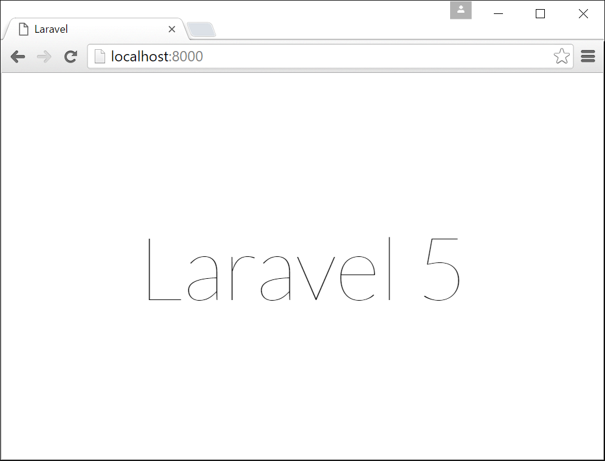
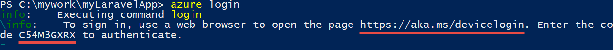
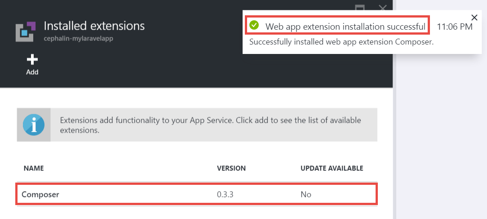
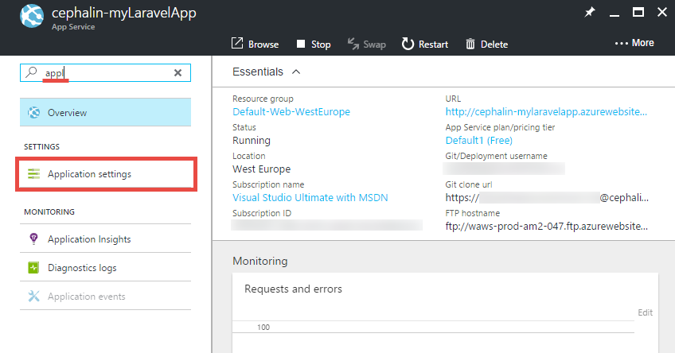
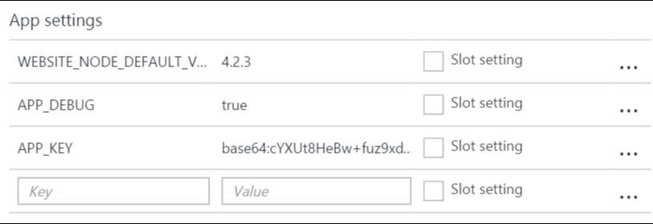
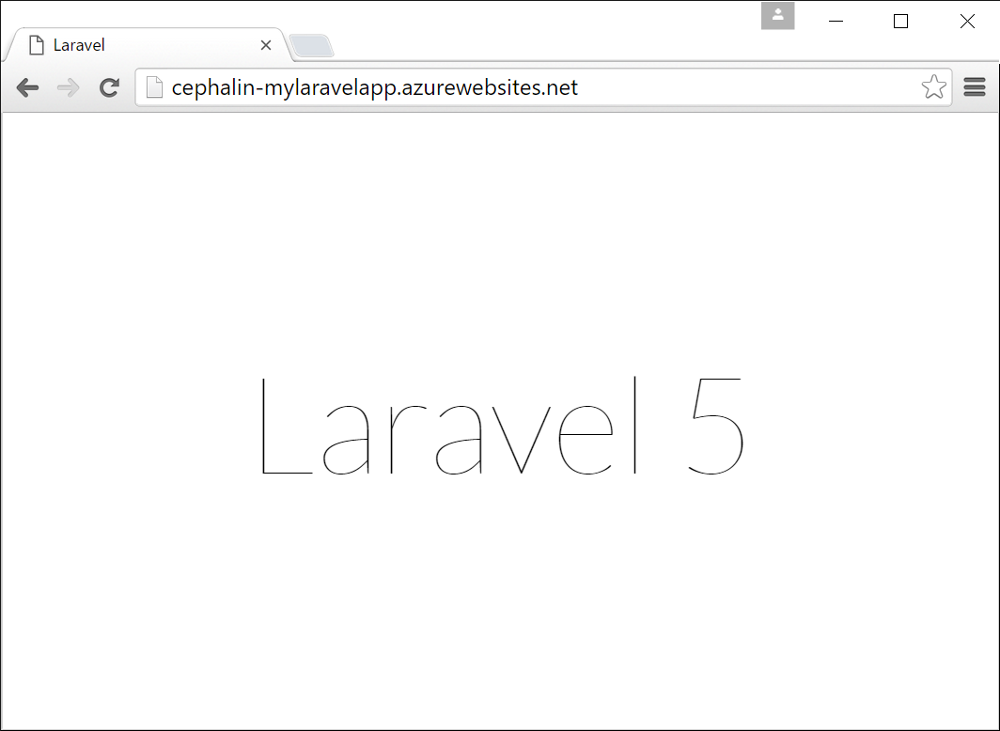
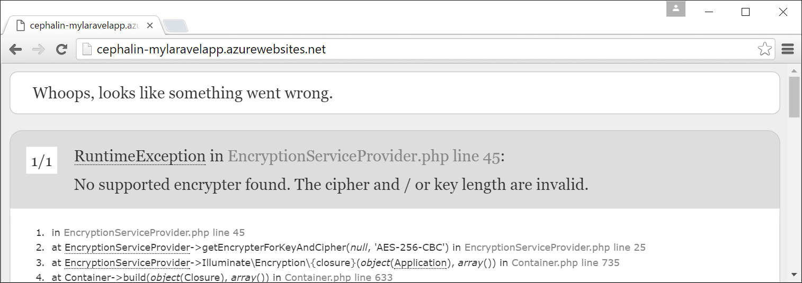

<properties
	pageTitle="Create, configure, and deploy a PHP web app to Azure"
	description="A tutorial that shows how to make a PHP (Laravel) web app run in Azure App Service. Learn how to configure Azure App Service to meet the requirements of the PHP framework you choose."
	services="app-service\web"
	documentationCenter="php"
	authors="cephalin"
	manager="wpickett"
	editor=""
	tags="mysql"/>

<tags
	ms.service="app-service-web"
	ms.workload="web"
	ms.tgt_pltfrm="na"
	ms.devlang="PHP"
	ms.topic="article"
	ms.date="06/03/2016" 
	ms.author="cephalin"/>

# Create, configure, and deploy a PHP web app to Azure

[AZURE.INCLUDE [tabs](../../includes/app-service-web-get-started-nav-tabs.md)]

This tutorial shows you how to create, configure, and deploy a PHP web app for Azure, and how to configure Azure App Service to meet the
requirements of your PHP web app. By the end of the tutorial, you will have a working [Laravel](https://www.laravel.com/) web app running 
live in [Azure App Service](../app-service/app-service-value-prop-what-is.md).

As a PHP developer, you can bring your favorite PHP framework to Azure. This tutorial uses Laravel simply as a concrete 
app example. You will learn: 

- Deploy using Git
- Set PHP version
- Use a start file that is not in the root application directory
- Access environment-specific variables
- Update your app in Azure

You can apply what you learn here to other PHP web apps that you deploy to Azure.

## Prerequisites

- Install [PHP 5.6.x](http://php.net/downloads.php) (PHP 7 support is beta)
- Install [Composer](https://getcomposer.org/download/)
- Install [Azure CLI](../xplat-cli-install.md)
- Install [Git](http://www.git-scm.com/downloads)
- Get a Microsoft Azure account. If you don't have an account, you can 
[sign up for a free trial](/pricing/free-trial/?WT.mc_id=A261C142F) or 
[activate your Visual Studio subscriber benefits](/pricing/member-offers/msdn-benefits-details/?WT.mc_id=A261C142F).

>[AZURE.NOTE] See a web app in action. [Try App Service](http://go.microsoft.com/fwlink/?LinkId=523751) immediately and create a short-lived starter app—no credit 
card required, no commitments.

## Create a PHP (Laravel) app on your dev machine

1. Open a new Windows command prompt, PowerShell window, Linux shell, or OS X terminal. Run the following commands to verify that the required tools are installed 
properly on your machine. 

        php --version
        composer --version
        azure --version
        git --version

    

    If you haven't installed the tools, see [Prerequisites](#Prerequisites) for download links.
    
2. Install Laravel like so:

        composer global require "laravel/installer

3. `CD` into a working directory and create a new Laravel application like so:

        cd <working_directory>
        laravel new <app_name>

4. `CD` into the newly created `<app_name>` directory and test the app like so:

        cd <app_name>
        php artisan serve
        
    You should be able to navigate to http://localhost:8000 in a browser now and see the Laravel splash screen.
    
    
    
So far, just the regular Laravel workflow, and you're not here to <a href="https://laravel.com/docs/5.2" rel="nofollow">learn Laravel</a>. So let's move on.

## Create an Azure web app and set up Git deployment

>[AZURE.NOTE] "Wait! What if I want to deploy with FTP?" There's an [FTP tutorial](web-sites-php-mysql-deploy-use-ftp.md) for your needs. 

With the Azure CLI, you can create an web app in Azure App Service and set it up for Git deployment with a single line
of command. Let's do this.

3. Log in to Azure like so:

        azure login
    
    Follow the help message to continue the login process.
    
    

4. Run the command to create the Azure web app with Git deployment. When prompted, specify the number of the desired region.

        azure site create --git <app_name>
    
    
    
    >[AZURE.NOTE] If you've never set up deployment credentials for your Azure subscription, you'll be prompted to create them. These credentials, not your
    Azure account credentials, are used by App Service only for Git deployments and FTP logins. 
    
    This command creates a new Git repository on the current directory (with `git init`) 
    and connects it to the repository in Azure as a Git remote (with `git remote add`).

<a name="configure"/>
## Configure the Azure web app

For your Laravel app to work in Azure, you need to pay attention to several things. You'll do this similar exercise
for your PHP framework of choice.

- Configure PHP 5.5.9 or above. See 
[Latest Laravel 5.2 Server Requirements](https://laravel.com/docs/5.2#server-requirements) for the whole list of server
requirements. The rest of the list are extensions that are already enabled by Azure's PHP installations. 
- Set the environment variables your app needs. Laravel uses the `.env` file for easy setting of environment 
variables. However, since it is not supposed to be committed into source control (see 
[Laravel Environment Configuration](https://laravel.com/docs/5.2/configuration#environment-configuration), 
you will set the app settings of your Azure web app instead.
- Make sure that the Laravel app's entry point, `public/index.php`, is loaded first. See 
[Laravel Lifecycle Overview](https://laravel.com/docs/5.2/lifecycle#lifecycle-overview). In other words, you need to
set the web app's root URL to point to the `public` directory.
- Enable the Composer extension in Azure, since you have a composer.json. That way, you can let Composer worry about
obtaining your required packages when you deploy with `git push`. It's a matter of convenience. 
If you don't enable Composer automation, you just need to remove `/vendor` from the `.gitignore` file so that Git 
includes ("un-ignores") everything in the `vendor` directory when committing and deploying code.

Let's configure these tasks sequentially.

4. Set the PHP version that your Laravel app requires.

        azure site set --php-version 5.6

    You're done setting the PHP version! 
    
4. Generate a new `APP_KEY` for your Azure web app and set it as an app setting for your Azure web app.

        php artisan key:generate --show
        azure site appsetting add APP_KEY="<output_of_php_artisan_key:generate_--show>"

4. Also, turn on Laravel debugging in order to preempt any cryptic `Whoops, looks like something went wrong.` page.

        azure site appsetting add APP_DEBUG=true

    You're done setting environment variables!
    
    >[AZURE.NOTE] Wait, let's slow down a bit and explain what Laravel does and what Azure does here. 
    Laravel uses the `.env` file in the root directory to supply environment variables to the app, where you'll find 
    the line `APP_DEBUG=true` (and also `APP_KEY=...`). This variable is accessed in `config/app.php` by the code 
    `'debug' => env('APP_DEBUG', false),`. [env()](https://laravel.com/docs/5.2/helpers#method-env) is a Laravel helper 
    method that uses the PHP [getenv()](http://php.net/manual/en/function.getenv.php) under the covers.
    >
    >However, `.env` is ignored by Git because it's called out by the `.gitignore` file in the root directory. Simply put, `.env` 
    in your local Git repository is not pushed to Azure with the rest of the files. Of course, you can just remove that line 
    from `.gitignore`, but we've already established that committing this file into source control is not recommended. Nevertheless, 
    you still need a way to specify these environment variables in Azure. 
    >
    >The good news is that app settings in Azure App Service supports [getenv()](http://php.net/manual/en/function.getenv.php) 
    in PHP. So while you can use FTP or other means to manually upload a `.env` file into Azure, you can just specify the variables
    you want as Azure app settings without a `.env` in Azure, like you just did. Furthermore, if a variable is in both a `.env` file 
    and in Azure app settings, the Azure app setting wins.     

4. The last two tasks (setting the virtual directory and enabling Composer) requires the [Azure portal](https://portal.azure.com), so log in to 
the [portal](https://portal.azure.com) with your Azure account.

4. Starting from the left menu, click **App Services** > **&lt;app_name>** > **Tools**.

    
    
    >[AZURE.TIP] If you click **Settings** instead of **Tools**, you'll be able to access the **Application Settings** 
    blade, which lets you set PHP versions, app settings, and virtual directories like you just did. 
    
4. Click **Extensions** > **Add** to add an extension.

4. Select **Composer** in the **Choose extension** [blade](../azure-portal-overview.md) (*blade*: a portal page that opens horizontally).

4. Click **OK** in the **Accept legal terms** blade. 

5. Click **OK** in the **Add extension** blade.

    When Azure is done adding the extension, you should see a friendly pop-up message in the corner, as well as 
    **Composer** listed in the **Extensions** blade.

    

    You're done enabling Composer!
    
4. Back in your web app's blade, click **Settings** > **Application Settings**.

    

    In the **Application Settings** blade, note the PHP version you set earlier:

    

    and the app settings you added:
    
    

4. Scroll to the bottom of the blade and change the root virtual directory to point to **site\wwwroot\public** instead of **site\wwwroot**.

    

4. Click **Save** at the top of the blade.

    You're done setting the virtual directory! 

## Deploy your web app with Git (and setting environment variables)

You're ready to deploy your code now. You'll do this back in your command prompt or terminal.

4. Commit all your changes and deploy your code to the Azure web app like you would in any Git repository:

        git add .
        git commit -m "Hurray! My first commit for my Azure app!"
        git push azure master 

    When running `git push`, you will be asked to supply your Git deployment password. If you asked to create deployment credentials at `azure site create` earlier,
    type in the password you used.
    
5. Let's see it run in the browser by running this command:

        azure site browse

    Your browser should show you the Laravel splash screen.
    
    
    
    Congratulations, you are now running a Laravel web app in Azure.
             
## Troubleshoot common errors

Here are some the errors you might run into when following this tutorial:

- [Azure CLI shows "'site' is not an azure command"](#clierror)
- [Web app shows HTTP 403 error](#http403)
- [Web app shows "Whoops, looks like something went wrong."](#whoops)
- [Web app shows "No supported encryptor found."](#encryptor)

### Azure CLI shows "'site' is not an azure command"

When running `azure site *` in the command-line terminal, you see the error `error:   'site' is not an azure command. See 'azure help'.` 

This is usually a result of switching in to "ARM" (Azure Resource Manager) mode. To resolve this, switch back into "ASM" (Azure Service
Management) mode by running `azure config mode asm`.

### Web app shows HTTP 403 error

You have deployed your web app to Azure successfully, but when you browse to your Azure web app, you get an `HTTP 403` or 
`You do not have permission to view this directory or page.`

This is most likely because the web app can't find the entry point to the Laravel app. Make sure that you have changed the
root virtual directory to point to `site\wwwroot\public`, where Laravel's `index.php` is (see 
[Configure the Azure web app](#configure)).

### Web app shows "Whoops, looks like something went wrong."

You have deployed your web app to Azure successfully, but when you browse to your Azure web app, you get the cryptic message 
`Whoops, looks like something went wrong.`

To get a more descriptive error, enable Laravel debugging by setting `APP_DEBUG` environment variable to `true` 
(see [Configure the Azure web app](#configure)).

### Web app shows "No supported encryptor found."

You have deployed your web app to Azure successfully, but when you browse to your Azure web app, you get the error message 
below:

    
That's a nasty error, but at least it's not cryptic since you turned on Laravel debugging. A cursory search of the error
string on the Laravel forums will show you that it is due to not setting the APP_KEY in `.env`, or in your case, not having 
`.env` in Azure at all. You can fix this by adding setting `APP_KEY` as an Azure app setting 
(see [Configure the Azure web app](#configure)).
    
## Next Steps

Learn how to add data to your app by [creating a MySQL database in Azure](../store-php-create-mysql-database.md). Also,
check out more helpful links for PHP in Azure below:

- [PHP Developer Center](/develop/php/).
- [Create a web app from the Azure Marketplace](app-service-web-create-web-app-from-marketplace.md)
- [Configure PHP in Azure App Service Web Apps](web-sites-php-configure.md)
- [Convert WordPress to Multisite in Azure App Service](web-sites-php-convert-wordpress-multisite.md)
- [Enterprise-class WordPress on Azure App Service](web-sites-php-enterprise-wordpress.md)
