<properties
   pageTitle="Use DevOps environments effectively for your web app"
   description="Learn how to use deployment slots to setup and manage multiple development environments for your application"
   services="app-service\web"
   documentationCenter=""
   authors="sunbuild"
   manager="yochayk"
   editor=""/>

<tags
   ms.service="app-service"
   ms.devlang="na"
   ms.topic="article"
   ms.tgt_pltfrm="na"
   ms.workload="web"
   ms.date="05/31/2016"
   ms.author="sumuth"/>

# Use DevOps environments effectively for your web apps

This article shows you how to setup and manage web application deployments  for multiple versions of your application such as development, staging, QA and production. Each version of your application can be considered a development environment for a specific need within your deployment process, for example QA environment can be used by your team of developers to test the quality of the application before you push the changes to production.
Setting up multiple development environments can be a challenging task as you need to track and manage the resources (compute, web app, database, cache etc.) across these environments and deploy content from one environment to another.

## Setting up a non-production environment (stage,dev,QA)
Once you have a production web app up and running, the next step is to create a non-production environment. In order to use deployment slots make sure you are running in the **Standard** or **Premium** App Service plan mode. Deployment slots are actually live web apps with their own hostnames. Web app content and configuration elements can be swapped between two deployment slots, including the production slot. Deploying your application to a deployment slot has the following benefits:

1. You can validate web app changes in a staging deployment slot before swapping it with the production slot.
2. Deploying a web app to a slot first and swapping it into production ensures that all instances of the slot are warmed up before being swapped into production. This eliminates downtime when you deploy your web app. The traffic redirection is seamless, and no requests are dropped due to swap operations. This entire workflow can be automated by configuring [Auto Swap](web-sites-staged-publishing.md#configure-auto-swap-for-your-web-app) when pre-swap validation is not needed.
3. After a swap, the slot with previously staged web app now has the previous production web app. If the changes swapped into the production slot are not as you expected, you can perform the same swap immediately to get your "last known good web app" back.

To setup a staging deployment slot, see [Set up staging environments for web apps in Azure App Service](web-sites-staged-publishing.md) . Every environment should include its own set of resources, for example if your web app uses a database then both production web app and staging web app should be using different databases.  Add staging development environment resources such as database, storage or cache for setting up your staging development environment.

## Examples of using multiple development environments

Any project should follow a source code management with at least two environments, a development and production environment, but when using Content management systems, Application frameworks etc we might run into issues where the application does not support this scenario out of the box. This is true for some of the popular frameworks discussed below. Lots of questions come to mind when working with a CMS/frameworks such as

1. How to break it out into different environments
2. What files can I change and wont impact framework version updates
3. How to manage configuration per environment
4. How to manage modules/plugins version updates,core framework version updates

There are many ways to setup a multiple environment for your project and the examples below are just one such method for the respective applications.

### WordPress
In this section you will learn how to setup a deployment workflow using slots for WordPress. WordPress like most CMS solutions does not support working with multiple development environments out of the box. App Service Web Apps have a few features that make it easier to store configuration settings outside of your code.

Before creating a staging slot, setup your application code to support multiple environments. To support multiple environments in WordPress you need to edit `wp-config.php` on your local development web app add the following code at the beginning of the file. This will allow your application to pick the correct configuration based on the selected environment.


	// Support multiple environments
	// set the config file based on current environment
	/**/
	if (strpos(filter_input(INPUT_SERVER, 'HTTP_HOST', FILTER_SANITIZE_STRING),'localhost') !== false) {
	    // local development
	    $config_file = 'config/wp-config.local.php';
	}
	elseif  ((strpos(getenv('WP_ENV'),'stage') !== false) ||  (strpos(getenv('WP_ENV'),'prod' )!== false )){
	      //single file for all azure development environments
	      $config_file = 'config/wp-config.azure.php';
	}
	$path = dirname(__FILE__) . '/';
	if (file_exists($path . $config_file)) {
	    // include the config file if it exists, otherwise WP is going to fail
	    require_once $path . $config_file;
	}


Create a folder under web app root called `config` and add two files: `wp-config.azure.php`  and `wp-config.local.php`  representing your azure and local environment respectively.

Copy the following in `wp-config.local.php` :

```
	
	<?php
	
	// MySQL settings
	/** The name of the database for WordPress */
	
	define('DB_NAME', 'yourdatabasename');
	
	/** MySQL database username */
	define('DB_USER', 'yourdbuser');
	
	/** MySQL database password */
	define('DB_PASSWORD', 'yourpassword');
	
	/** MySQL hostname */
	define('DB_HOST', 'localhost');
	/**
	 * For developers: WordPress debugging mode.
	 * * Change this to true to enable the display of notices during development.
	 * It is strongly recommended that plugin and theme developers use WP_DEBUG
	 * in their development environments.
	 */
	define('WP_DEBUG', true);
	
	//Security key settings
	define('AUTH_KEY',         'put your unique phrase here');
	define('SECURE_AUTH_KEY',  'put your unique phrase here');
	define('LOGGED_IN_KEY',    'put your unique phrase here');
	define('NONCE_KEY',        'put your unique phrase here');
	define('AUTH_SALT',        'put your unique phrase here');
	define('SECURE_AUTH_SALT', 'put your unique phrase here');
	define('LOGGED_IN_SALT',   'put your unique phrase here');
	define('NONCE_SALT',       'put your unique phrase here');
	
	/**
	 * WordPress Database Table prefix.
	 *
	 * You can have multiple installations in one database if you give each a unique
	 * prefix. Only numbers, letters, and underscores please!
	 */
	$table_prefix  = 'wp_';
```

Setting the security keys above can help preventing your web app from being hacked, so use unique values. If you need to generate the string for security keys mentioned above, you can go to the automatic generator to create new keys/values using this [link] (https://api.wordpress.org/secret-key/1.1/salt)

Copy the following code in `wp-config.azure.php`:


```

	<?php
	// MySQL settings
	/** The name of the database for WordPress */
	
	define('DB_NAME', getenv('DB_NAME'));
	
	/** MySQL database username */
	define('DB_USER', getenv('DB_USER'));
	
	/** MySQL database password */
	define('DB_PASSWORD', getenv('DB_PASSWORD'));
	
	/** MySQL hostname */
	define('DB_HOST', getenv('DB_HOST'));
	
	/**
	* For developers: WordPress debugging mode.
	*
	* Change this to true to enable the display of notices during development.
	* It is strongly recommended that plugin and theme developers use WP_DEBUG
	* in their development environments.
	* Turn on debug logging to investigate issues without displaying to end user. For WP_DEBUG_LOG to
	* do anything, WP_DEBUG must be enabled (true). WP_DEBUG_DISPLAY should be used in conjunction
	* with WP_DEBUG_LOG so that errors are not displayed on the page */
	
	*/
	define('WP_DEBUG', getenv('WP_DEBUG'));
	define('WP_DEBUG_LOG', getenv('TURN_ON_DEBUG_LOG'));
	define('WP_DEBUG_DISPLAY',false);
	
	//Security key settings
	/** If you need to generate the string for security keys mentioned above, you can go the automatic generator to create new keys/values: https://api.wordpress.org/secret-key/1.1/salt **/
	define('AUTH_KEY' ,getenv('DB_AUTH_KEY'));
	define('SECURE_AUTH_KEY',  getenv('DB_SECURE_AUTH_KEY'));
	define('LOGGED_IN_KEY', getenv('DB_LOGGED_IN_KEY'));
	define('NONCE_KEY', getenv('DB_NONCE_KEY'));
	define('AUTH_SALT',  getenv('DB_AUTH_SALT'));
	define('SECURE_AUTH_SALT', getenv('DB_SECURE_AUTH_SALT'));
	define('LOGGED_IN_SALT',   getenv('DB_LOGGED_IN_SALT'));
	define('NONCE_SALT',   getenv('DB_NONCE_SALT'));
	
	/**
	* WordPress Database Table prefix.
	*
	* You can have multiple installations in one database if you give each a unique
	* prefix. Only numbers, letters, and underscores please!
	*/
	$table_prefix  = getenv('DB_PREFIX');
```

#### Use Relative Paths
One last thing is to allow the WordPress app to use relative paths. WordPress stores URL information in the database. This makes moving content from one environment to another more difficult as you need to update the database every time you move from local to stage or stage to production environments. To reduce the risk of issues that can be caused with deploying a database every time you deploy from one environment to another use the [Relative Root links  plugin](https://wordpress.org/plugins/root-relative-urls/) which can be installed using WordPress administrator dashboard or download it manually from [here](https://downloads.wordpress.org/plugin/root-relative-urls.zip).

Add the following entries to your `wp-config.php` file before the `That's all, stop editing!` comment:

```

    define('WP_HOME', 'http://' . filter_input(INPUT_SERVER, 'HTTP_HOST', FILTER_SANITIZE_STRING));
	define('WP_SITEURL', 'http://' . filter_input(INPUT_SERVER, 'HTTP_HOST', FILTER_SANITIZE_STRING));
	define('WP_CONTENT_URL', '/wp-content');
	define('DOMAIN_CURRENT_SITE', filter_input(INPUT_SERVER, 'HTTP_HOST', FILTER_SANITIZE_STRING));
```

Activate the plugin through the `Plugins` menu in WordPress Administrator dashboard.  Save your permalink settings for WordPress app.

#### The final `wp-config.php` file
Any WordPress Core updates will not affect your `wp-config.php` , `wp-config.azure.php` and `wp-config.local.php` files  . In the end the `wp-config.php` file will look like this

```

	<?php
	/**
	 * The base configurations of the WordPress.
	 *
	 * This file has the following configurations: MySQL settings, Table Prefix,
	 * Secret Keys, and ABSPATH. You can find more information by visiting
	 *
	 * Codex page. You can get the MySQL settings from your web host.
	 *
	 * This file is used by the wp-config.php creation script during the
	 * installation. You don't have to use the web web app, you can just copy this file
	 * to "wp-config.php" and fill in the values.
	 *
	 * @package WordPress
	 */
	
	// Support multiple environments
	// set the config file based on current environment
	if (strpos($_SERVER['HTTP_HOST'],'localhost') !== false) { // local development
	    $config_file = 'config/wp-config.local.php';
	}
	elseif  ((strpos(getenv('WP_ENV'),'stage') !== false) ||  (strpos(getenv('WP_ENV'),'prod' )!== false )){
	    $config_file = 'config/wp-config.azure.php';
	}
	
	
	$path = dirname(__FILE__) . '/';
	if (file_exists($path . $config_file)) {
	    // include the config file if it exists, otherwise WP is going to fail
	    require_once $path . $config_file;
	}
	
	/** Database Charset to use in creating database tables. */
	define('DB_CHARSET', 'utf8');
	
	/** The Database Collate type. Don't change this if in doubt. */
	define('DB_COLLATE', '');
	
	
	/* That's all, stop editing! Happy blogging. */
	
	define('WP_HOME', 'http://' . filter_input(INPUT_SERVER, 'HTTP_HOST', FILTER_SANITIZE_STRING));
	define('WP_SITEURL', 'http://' . filter_input(INPUT_SERVER, 'HTTP_HOST', FILTER_SANITIZE_STRING));
	define('WP_CONTENT_URL', '/wp-content');
	define('DOMAIN_CURRENT_SITE', filter_input(INPUT_SERVER, 'HTTP_HOST', FILTER_SANITIZE_STRING));
	
	/** Absolute path to the WordPress directory. */
	if ( !defined('ABSPATH') )
		define('ABSPATH', dirname(__FILE__) . '/');
	
	/** Sets up WordPress vars and included files. */
	require_once(ABSPATH . 'wp-settings.php');
```

#### Setup a Staging Environment
Assuming you already have a WordPress web app running on Azure Web, login to [Azure Portal](https://portal.azure.com/) and go to your WordPress web app. If not you can create one from the marketplace. To learn more, click [here](web-sites-php-web-site-gallery.md).
Click on **Settings** -> **Deployment slots** -> **Add** to create a deployment slot with the name stage. A deployment slot is another web application sharing the same resources as the primary web app created above.

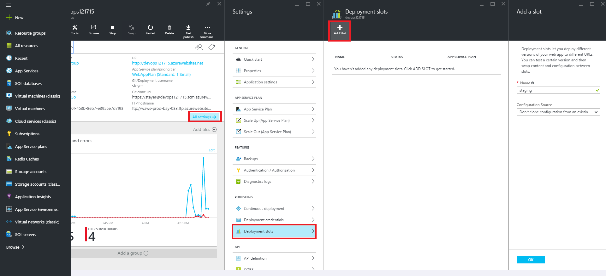

Add another MySQL database, say `wordpress-stage-db` to your resource group `wordpressapp-group`.

 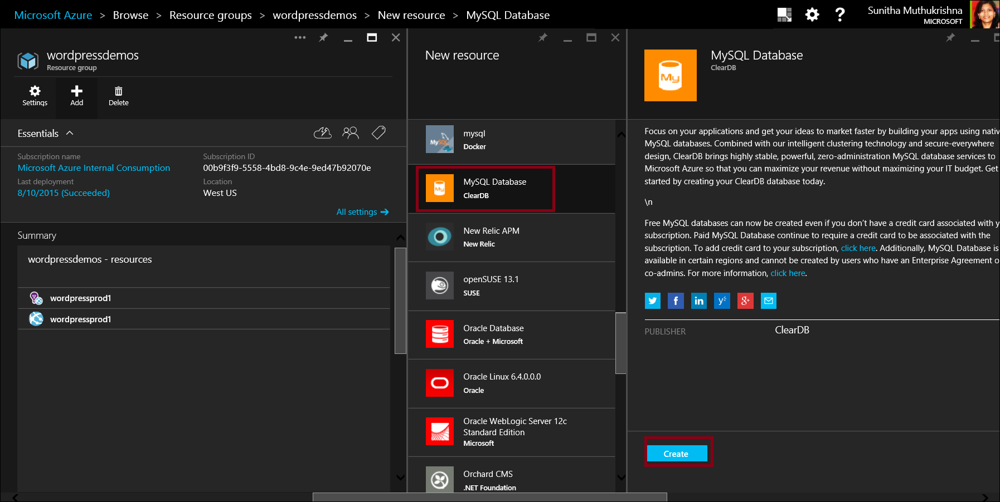

Update the Connection strings for your stage deployment slot to point to newly created database, `wordpress-stage-db`. Note that your production web app , `wordpressprodapp` and staging web app `wordpressprodapp-stage` must point to different databases.

#### Configure environment-specific app settings
Developers can store key-value string pairs in Azure as part of the configuration information associated with a web app called App Settings. At runtime, App Service Web Apps automatically retrieve these values for you and make them available to code running in your web app.  From a security perspective that is a benefit since sensitive information such as database connection strings with passwords should never show up as clear text in a file such as `wp-config.php`.

This process  defined below is useful when you perform updates as it includes both file changes and database changes for WordPress app:

- WordPress version upgrade
- Add new or edit or upgrade Plugins
- Add new or edit or upgrade themes

Configure app settings for:

- database information
- turning on/off  WordPress logging
- WordPress security settings

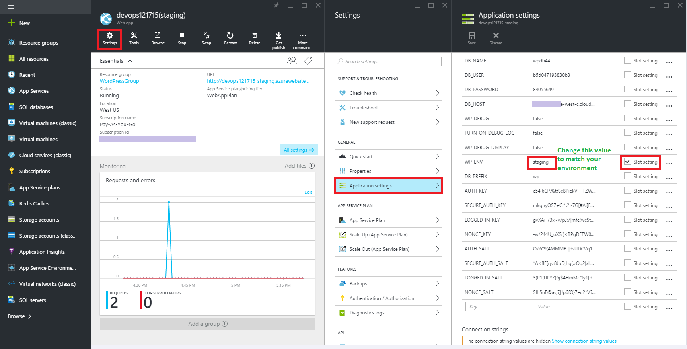

Make sure you have added the following app settings for your production web app and stage slot. Note that the production web app and Staging web app use different databases.
Uncheck **Slot Setting** checkbox for all the settings parameters except WP_ENV. This will swap the configuration for your web app, along with file content and database. If **Slot Setting** is **Checked**, the web app’s app settings and connection string configuration will NOT move across environments when doing a SWAP operation and hence if any database changes are present this will not break your production web app.

Deploy the local development environment web app to stage web app and database using WebMatrix or tool(s) of your choice such as FTP , Git or PhpMyAdmin.


Browse and test your staging web app. Considering a scenario where the theme of the web app is to be updated, here is the staging web app.

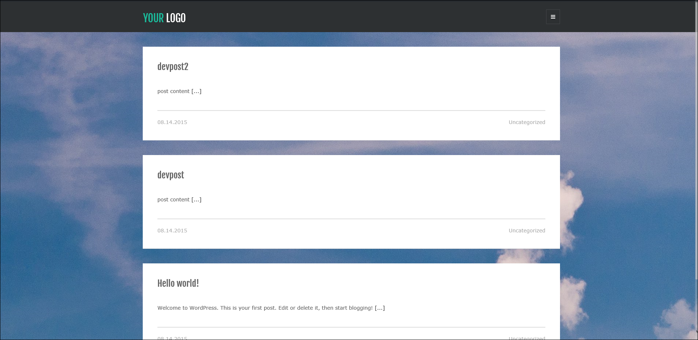


 If all looks good, click on the **Swap** button on your staging web app to move your content to the production environment. In this case you swap the web app and the database across environments during every **Swap** operation.

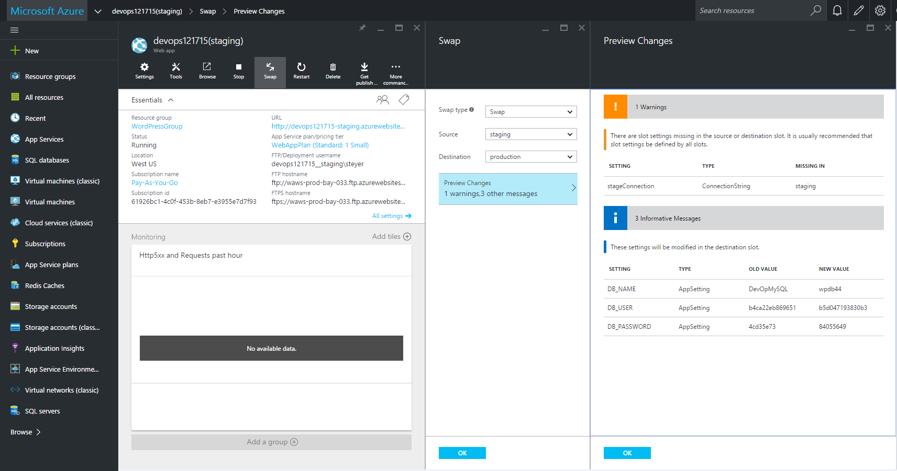

 > [AZURE.NOTE]
 >If you have a scenario where you need to only push files (no database updates), then **Check** the **Slot Setting** for all the database  related *app settings* and *connection strings settings* in web app setting blade within the Azure Portal before doing the SWAP. In this case DB_NAME, DB_HOST, DB_PASSWORD, DB_USER, default connection string setting should not show up in preview changes when doing a **Swap**. At this time, when you complete the **Swap** operation the WordPress web app will have the updated files **ONLY**.

Before doing a SWAP, here is the production WordPress web app
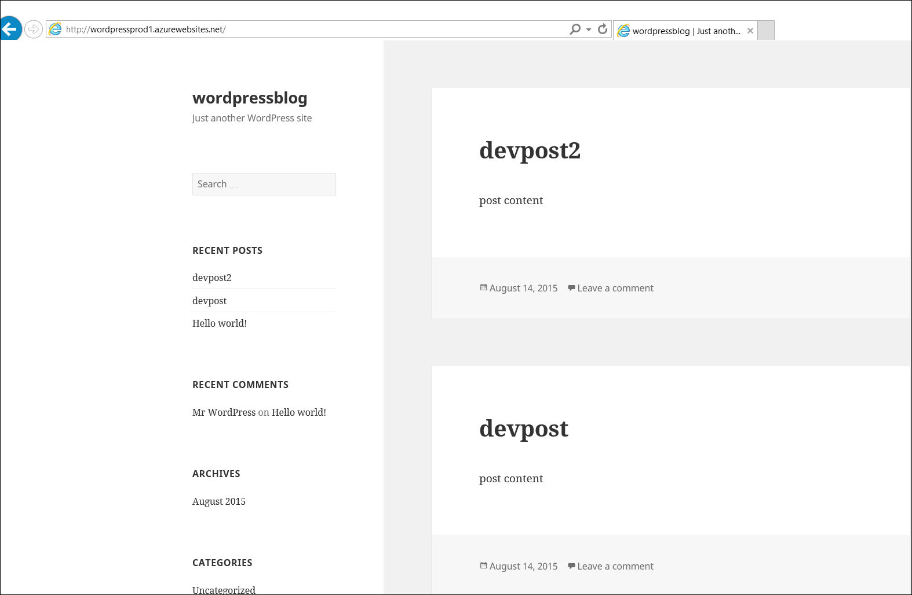

After the SWAP operation, the theme has been updated on your production web app.

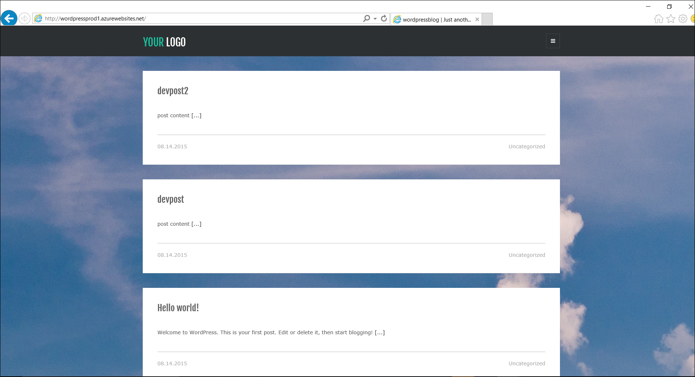

In a situation when you need to **rollback**, you can go to the production web app settings and click on the **Swap** button to swap the web app and database from production to staging slot. An important thing to remember is that if database changes are included with a **Swap** operation at any given time, then the next time you re-deploy to your staging web app you need to deploy the database changes to the current database for your staging web app which could be the previous production database or the stage database.

#### Summary
To generalize the process for any application with a database

1. Install application on your local environment
2. Include environment specific configuration (local and Azure Web App )
3. Setup  your environments in App Service Web Apps– Staging , Production
4. If you have a production application already running on Azure, sync your production content (files/code + database) to local and staging environment.
5. Develop your application on your local environment
6. Place your production web app under maintenance or locked mode and sync database content from production to staging and dev environments
7. Deploy to Staging environment and Test
8. Deploy to Production environment
9. Repeat steps 4 through 6

### Umbraco
In this section you will learn how the Umbraco CMS uses a custom module to deploy from across multiple DevOps environment. This example provides you with a different approach to managing multiple development environments.

[Umbraco CMS](http://umbraco.com/) is one of the popular .NET CMS solutions used by many developers which provides [Courier2](http://umbraco.com/products/more-add-ons/courier-2) module to deploy from development to staging to production environments. You can easily create a local development environment for an Umbraco CMS web app using Visual Studio or WebMatrix.

1. Create an Umbraco web app with Visual Studio, click [here](https://our.umbraco.org/documentation/Installation/install-umbraco-with-nuget) .
2. To create an Umbraco web app with WebMatrix, click [here](http://umbraco.com/help-and-support/video-tutorials/getting-started/working-with-webmatrix).

Always remember to remove the `install` folder under your application and never upload it to stage or production web apps. For this tutorial, I will be using WebMatrix

#### Setup a staging environment
Create a deployment slot as mentioned above for Umbraco CMS web app, assuming you already have an Umbraco CMS web app up and running. If not you can create one from the marketplace.

Update the Connection string for your stage deployment slot to point to newly created database, **umbraco-stage-db**. Your production web app (umbraositecms-1) and staging web app (umbracositecms-1-stage) **MUST** point to different databases.

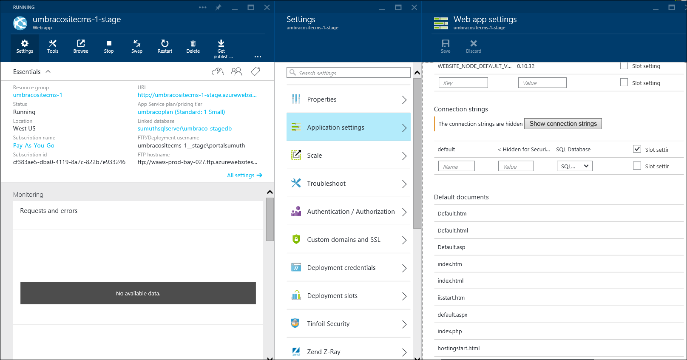

Click on **Get Publish settings** for the deployment slot **stage**. This will download a publish settings file that store all the information required by Visual Studio or Web Matrix to publish your application from local development web app to Azure web app.

 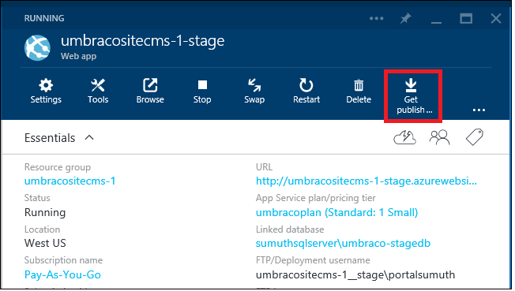

- Open your local development web app in **WebMatrix** or **Visual Studio**. In this tutorial I am using Web Matrix and first you need to import the publish settings file for your staging web app

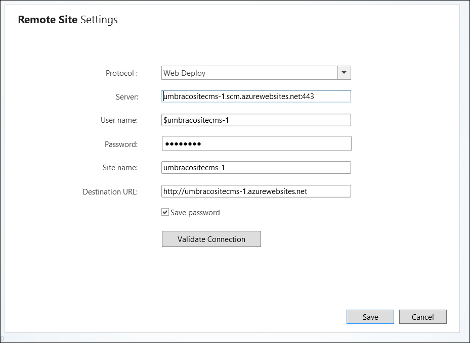

- Review changes in the dialog box and deploy your local web app to your Azure web app, *umbracositecms-1-stage*. When you deploy files directly to your staging web app you will omit any files in the `~/app_data/TEMP/` folder as these will be regenerated when the stage web app is first started. You should also omit the `~/app_data/umbraco.config` file as this, too, will be regenerated.

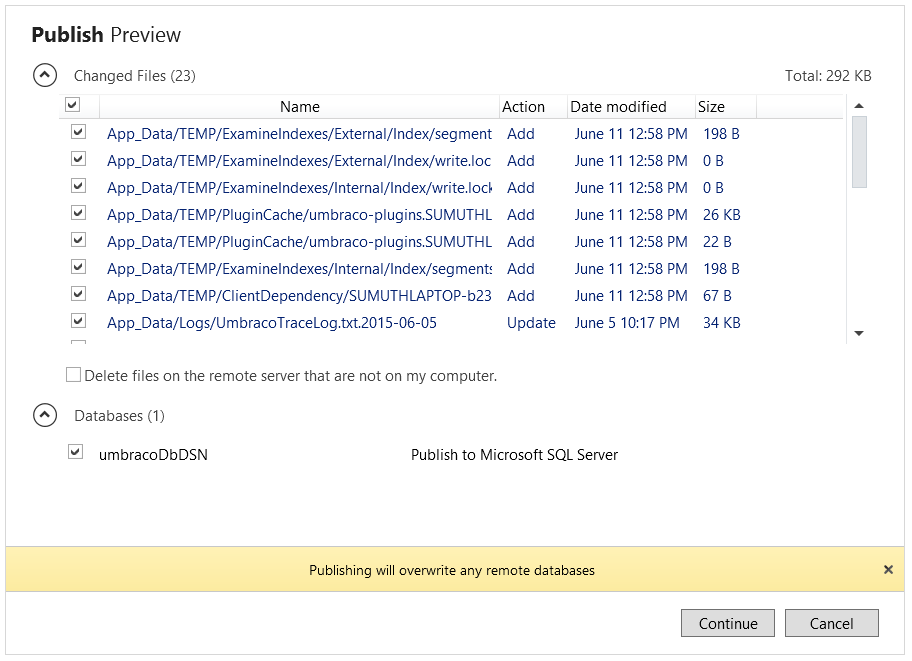

- After successfully publishing the Umbraco local web app to staging web app, browse to your staging web app and run a few tests to rule out any issues.

#### Setup Courier2 deployment module
With [Courier2](http://umbraco.com/products/more-add-ons/courier-2) module you can push content, stylesheets, development modules and more with a simple right-click from a staging web app to production web app for a more hassle free deployments and reducing risk of breaking your production web app when deploying an update.
Purchase a license for Courier2 for the domain `*.azurewebsites.net` and your custom domain (say http://abc.com) Once you have purchased the license, place the downloaded license (.LIC file) in the `bin` folder.


Download the Courier2 package from [here](https://our.umbraco.org/projects/umbraco-pro/umbraco-courier-2/) . Log on to your stage web app, say  http://umbracocms-site-stage.azurewebsites.net/umbraco and click on **Developer** Menu and Select **Packages** . Click on **Install** local package


Upload the courier2 package using the installer.

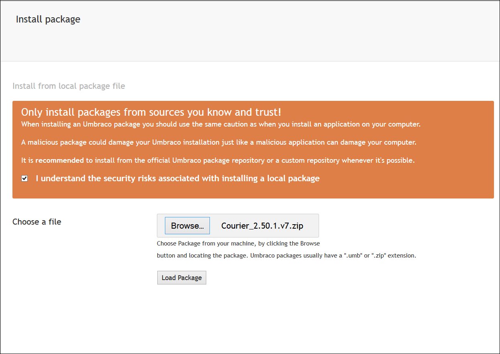

To configure you need to update courier.config file under **Config** folder of your web app.

```xml
<!-- Repository connection settings -->
  <!-- For each site, a custom repository must be configured, so Courier knows how to connect and authenticate-->
  <repositories>
        <!-- If a custom Umbraco Membership provider is used, specify login & password + set the passwordEncoding to clear:  -->
        <repository name="production web app" alias="stage" type="CourierWebserviceRepositoryProvider" visible="true">
            <url>http://umbracositecms-1.azurewebsites.net</url>
            <user>0</user>
            <!--<login>user@email.com</login> -->
            <!-- <password>user_password</password>-->
           <!-- <passwordEncoding>Clear</passwordEncoding>-->
           </repository>
  </repositories>
 ```

Under `<repositories>`, enter the production site URL and user information. If you are using default Umbraco Membership provider, then add the ID for the Administration user in <user> section . If you are using a custom Umbraco membership provider, use `<login>`,`<password>` to Courier2 module know how to connect to the production site. For more details, review the [documentation](http://umbraco.com/help-and-support/customer-area/courier-2-support-and-download/developer-documentation) for Courier module.

Similarly, install Courier module on your production site and configure it point to stage web app in its respective courier.config file as shown here

```xml
  <!-- Repository connection settings -->
  <!-- For each site, a custom repository must be configured, so Courier knows how to connect and authenticate-->
  <repositories>
        <!-- If a custom Umbraco Membership provider is used, specify login & password + set the passwordEncoding to clear:  -->
        <repository name="Stage web app" alias="stage" type="CourierWebserviceRepositoryProvider" visible="true">
            <url>http://umbracositecms-1-stage.azurewebsites.net</url>
            <user>0</user>
           </repository>
  </repositories>
```

Click on Courier2 tab in Umbraco CMS web app  dashboard and select locations. You should see the repository name as mentioned in `courier.config`. Do this on both your production and staging web apps.

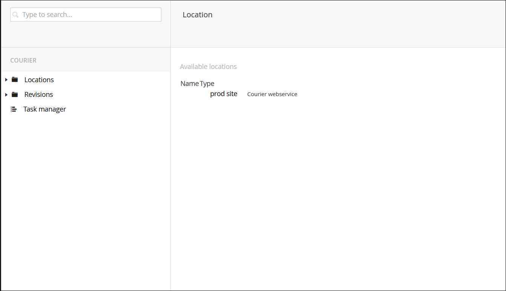

Now lets deploy some content from staging site to production site. Go to Content and select an existing page or create a new page. I will select an existing page from my web app where the title of the page is changed to **Getting Started – new** and now click on **Save and Publish**.

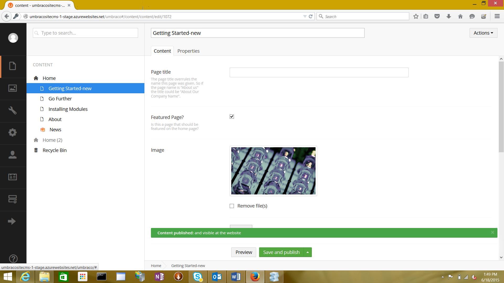

Now select the modified page and *right click* to view all the options. Click on **Courier** to view Deployment dialog . Click on **Deploy** to initiate deployment

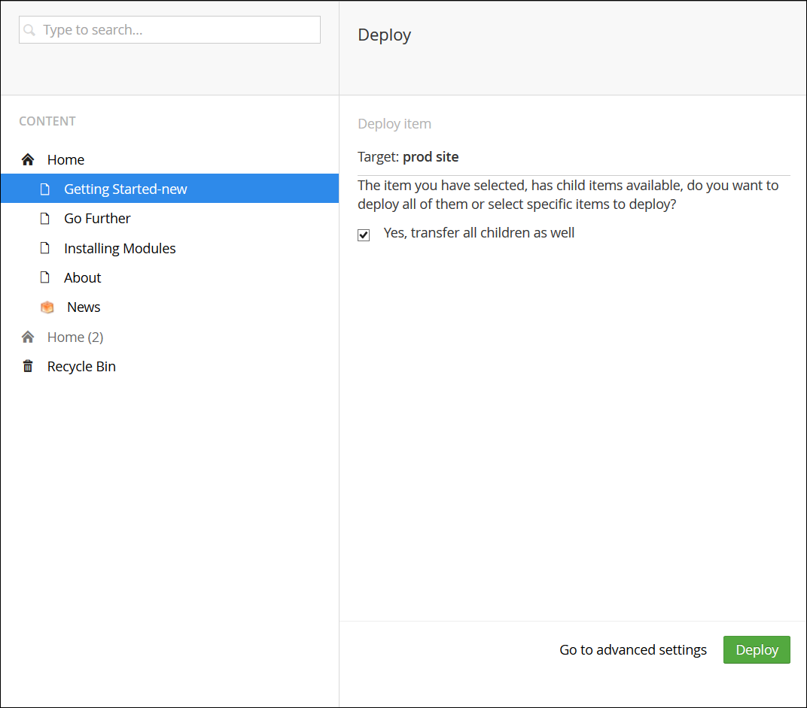

Review the changes and click on Continue.

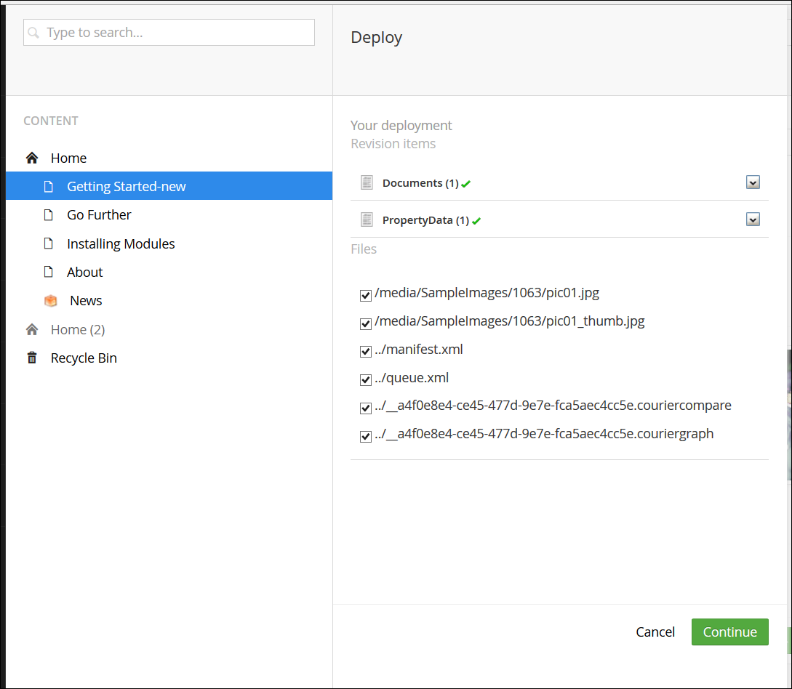

Deployment log shows if the deployment was successful.

 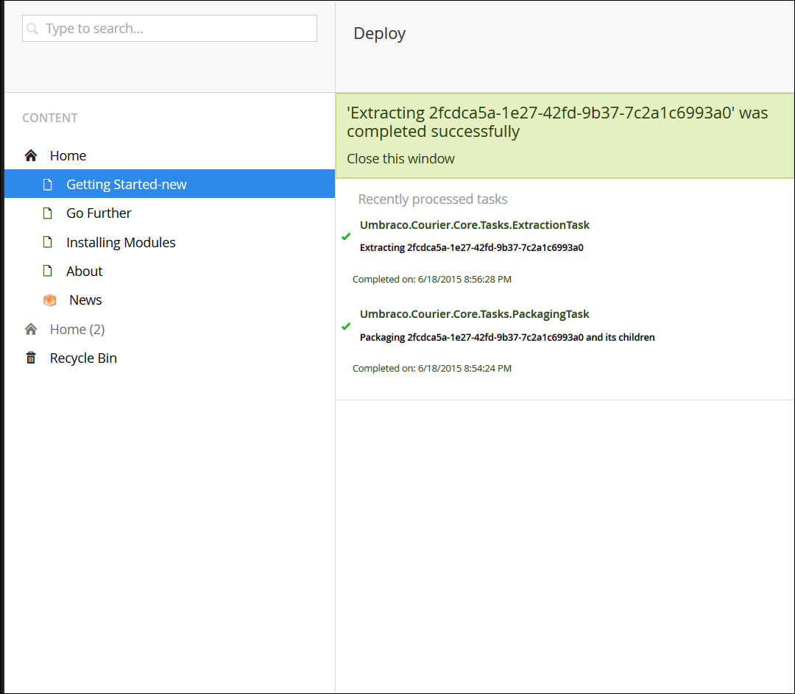

Browse your production web app to see if the changes are reflected .

 

To learn more about how to use Courier, review the documentation .

#### How to upgrade Umbraco CMS version

Courier will not help deploy with upgrading from one version of Umbraco CMS to another. When upgrading Umbraco CMS version, you must check for incompatibilities with your custom modules or third party modules and the Umbraco Core libraries. As a best practice

1. ALWAYS backup your web app and database before doing an upgrade. On Azure Web App, you can set up automatic backups for your websites using the backup feature and restore your site if needed using restore feature. For more details, see [How to back up your web app](web-sites-backup.md) and [How to restore your web app](web-sites-restore.md).

2. Check if the third party packages you're using are compatible with the version you're upgrading to. On the package's download page, review the Project compatibility with Umbraco CMS version.

For more details on how to upgrade your web app locally, follow the guidelines as mentioned [here](https://our.umbraco.org/documentation/getting-started/setup/upgrading/general).

Once your local development site is upgraded, publish the changes to staging web app. Test your application and if all looks good, use **Swap** button to **Swap** your staging site to production web app. When performing the **Swap** operation , you can view the changes that will be impacted in your web app's configuration. With this **Swap** operation, we are swapping the web apps and databases. This means, after the SWAP the production web app will now point to umbraco-stage-db database and staging web app will point to umbraco-prod-db database.

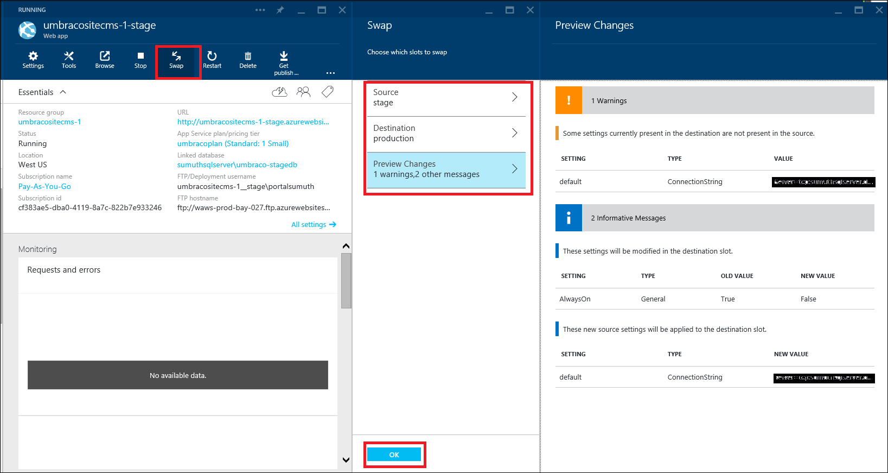

The advantage of swapping both the web app and database:
1. Gives you the ability to roll back to the previous version of your web app with another **Swap** if there are any application issues.
2. For an upgrade you need to deploy files and database from staging web app to production web app and database. There are many things that can go wrong when deploying files and database. By using the **Swap** feature of slots, we can reduces downtime during an upgrade and reduce the risk of failures that can occur when deploying changes.
3. Gives you the ability to do **A/B testing** using [Testing in production](https://azure.microsoft.com/documentation/videos/introduction-to-azure-websites-testing-in-production-with-galin-iliev/) feature

This example shows you the flexibility of the platform where you can build custom modules similar to Umbraco Courier module to manage deployment across environments.

## References
[Agile software development with Azure App Service](app-service-agile-software-development.md)

[Set up staging environments for web apps in Azure App Service](web-sites-staged-publishing.md)

[How to block web access to non-production deployment slots](http://ruslany.net/2014/04/azure-web-sites-block-web-access-to-non-production-deployment-slots/)
