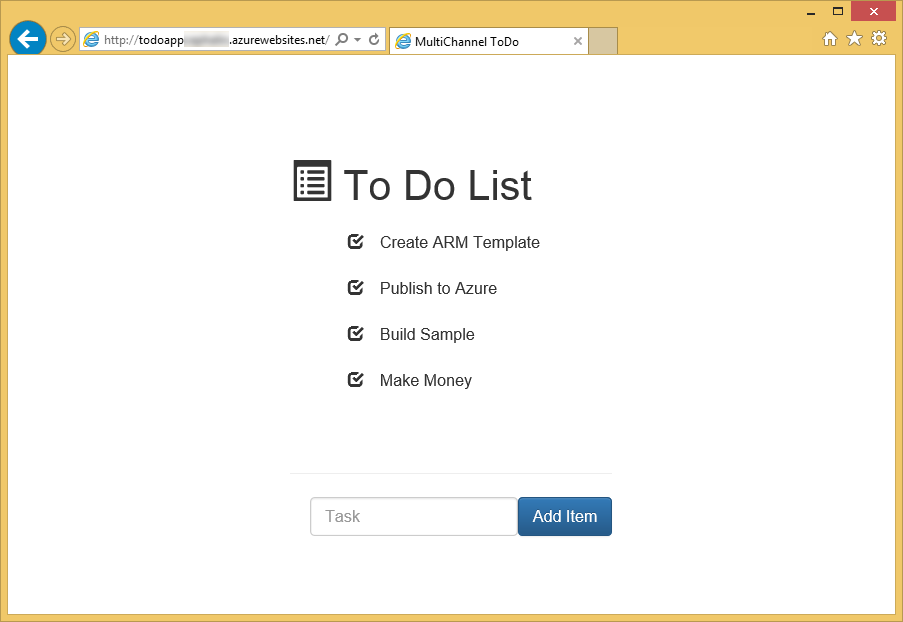
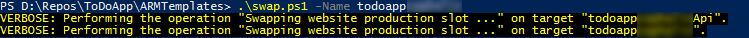
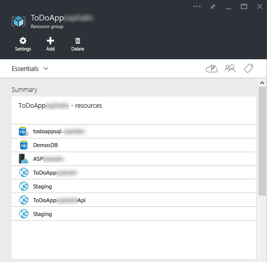
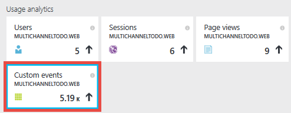
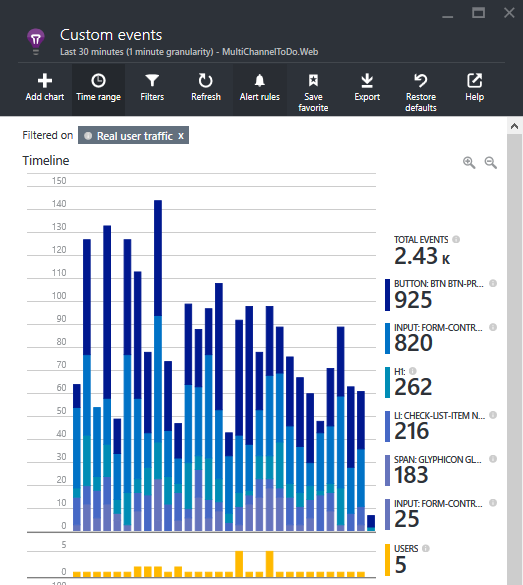
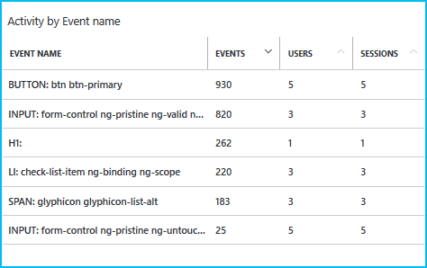
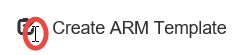
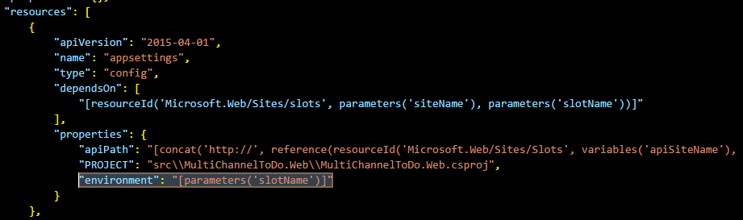
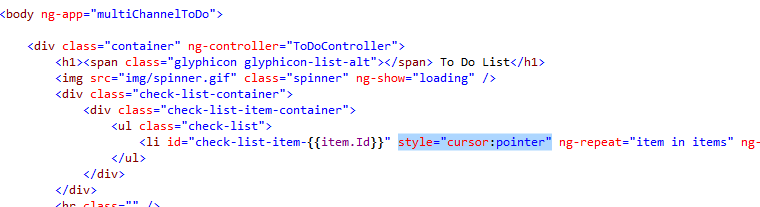
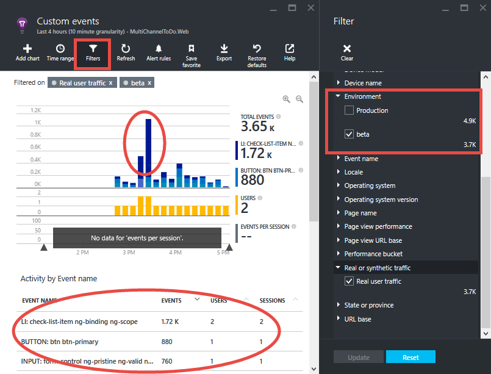

<properties
	pageTitle="Flighting deployment (beta testing) in Azure App Service"
	description="Learn how to flight new features in your app or beta test your updates in this end-to-end tutorial. It brings together App Service features like continuous publishing, slots, traffic routing, and Application Insights integration."
	services="app-service\web"
	documentationCenter=""
	authors="cephalin"
	manager="wpickett"
	editor=""/>

<tags
	ms.service="app-service-web"
	ms.workload="web"
	ms.tgt_pltfrm="na"
	ms.devlang="na"
	ms.topic="article"
	ms.date="02/02/2016"
	ms.author="cephalin"/>
# Flighting deployment (beta testing) in Azure App Service

This tutorial shows you how to do *flighting deployments* by integrating the various capabilities of [Azure App Service](http://go.microsoft.com/fwlink/?LinkId=529714) and [Azure Application Insights](/services/application-insights/). 

*Flighting* is a deployment process that validates a new feature or change with a limited number of real customers, and is a major testing in production 
scenario. It is akin to beta testing and is sometimes known as "controlled test flight". Many large enterprises with a web presence use this approach to 
get early validation on their app updates in their practice of [agile development](https://en.wikipedia.org/wiki/Agile_software_development). Azure App 
Service enables you to integrate test in production with continous publishing and Application Insights to implement the same DevOps scenario. Benefits of 
this approach include:

- **Gain real feedback _before_ updates are released to production** - The only thing better than gaining feedback as soon as you release is gaining 
feedback before you release. You can test updates with real user traffic and behaviors as early as you desire in the product life cycle.
- **Enhance [continuous test-driven development (CTDD)](https://en.wikipedia.org/wiki/Continuous_test-driven_development)** - By integrating test in 
production with continuous integration and instrumentation with Application Insights, user validation happens early and automatically in your product life 
cycle. This helps reduce time investments in manual test execution.
- **Optimize test workflow** - By automating test in production with continuous monitoring instrumentation, you can potentially accomplish the goals of 
various kinds of tests in a single process, such as [integration](https://en.wikipedia.org/wiki/Integration_testing), 
[regression](https://en.wikipedia.org/wiki/Regression_testing), [usability](https://en.wikipedia.org/wiki/Usability_testing), accessibility, localization, 
[performance](https://en.wikipedia.org/wiki/Software_performance_testing), [security](https://en.wikipedia.org/wiki/Security_testing), and 
[acceptance](https://en.wikipedia.org/wiki/Acceptance_testing).

A flighting deployment is not just about routing live traffic. In such a deployment you want to gain insight as quickly as possible, whether it be an unexpected bug, 
performance degradation, user experience issues. Remember, you are dealing with real customers. So to do it right, you must make sure that you have set up 
your flighting deployment to gather all the data you need in order to make an informed decision for your next step. This tutorial shows you how to collect data 
with Application Insights, but you can use New Relic or other technologies that suits your scenario. 

## What you will do

In this tutorial, you will learn how to bring the following scenarios together to test your App Service app in production:

- [Route production traffic](app-service-web-test-in-production-get-start.md) to your beta app
- [Instrument your app](../application-insights/app-insights-web-track-usage.md) to obtain useful metrics
- Continuously deploy your beta app and track live app metrics
- Compare metrics between the production app and the beta app to see how code changes translate to results

## What you will need

-	An Azure account
-	A [GitHub](https://github.com/) account
- Visual Studio 2015 - you can download the [Community edition](https://www.visualstudio.com/en-us/products/visual-studio-express-vs.aspx).
-	Git Shell (installed with [GitHub for Windows](https://windows.github.com/)) - this enables you to run both the Git and PowerShell commands in the same session
-	Latest [Azure PowerShell](https://github.com/Azure/azure-powershell/releases/download/v0.9.8-September2015/azure-powershell.0.9.8.msi) bits
-	Basic understanding of the following:
	-	[Azure Resource Manager](../resource-group-overview.md) template deployment (see [Deploy a complex application predictably in Azure](app-service-deploy-complex-application-predictably.md))
	-	[Git](http://git-scm.com/documentation)
	-	[PowerShell](https://technet.microsoft.com/library/bb978526.aspx)

> [AZURE.NOTE] You need an Azure account to complete this tutorial:
> + You can [open an Azure account for free](/pricing/free-trial/) - You get credits you can use to try out paid Azure services, and even after they're used up you can keep the account and use free Azure services, such as Web Apps.
> + You can [activate Visual Studio subscriber benefits](/pricing/member-offers/msdn-benefits-details/) - Your Visual Studio subscription gives you credits every month that you can use for paid Azure services.
>
> If you want to get started with Azure App Service before signing up for an Azure account, go to [Try App Service](http://go.microsoft.com/fwlink/?LinkId=523751), where you can immediately create a short-lived starter web app in App Service. No credit cards required; no commitments.

## Set up your production web app

>[AZURE.NOTE] The script used in this tutorial will automatically configure continuous publishing from your GitHub repository. This requires that your GitHub credentials are already stored in Azure, otherwise the scripted deployment will fail when attempting to configure source control settings for the web apps.
>
>To store your GitHub credentials in Azure, create a web app in the [Azure Portal](https://portal.azure.com/) and [configure GitHub deployment](app-service-continuous-deployment.md#Step7). You only need to do this once.

In a typical DevOps scenario, you have an application that’s running live in Azure, and you want to make changes to it through continuous publishing. In this scenario, you will deploy to production a template that you have developed and tested.

1.	Create your own fork of the [ToDoApp](https://github.com/azure-appservice-samples/ToDoApp) repository. For information on creating your fork, see [Fork a Repo](https://help.github.com/articles/fork-a-repo/). Once your fork is created, you can see it in your browser.

	

2.	Open a Git Shell session. If you don't have Git Shell yet, install [GitHub for Windows](https://windows.github.com/) now.
3.	Create a local clone of your fork by executing the following command:

        git clone https://github.com/<your_fork>/ToDoApp.git

4.	Once you have your local clone, navigate to *&lt;repository_root>*\ARMTemplates, and run the deploy.ps1 script with a unique suffix, as shown below:

        .\deploy.ps1 –RepoUrl https://github.com/<your_fork>/todoapp.git -ResourceGroupSuffix <your_suffix>

4.	When prompted, type in the desired username and password for database access. Remember your database credentials because you will need to specify them again when updating the resource group.

	You should see the provisioning progress of various Azure resources. When deployment completes, the script will launch the application in the browser and give you a friendly beep.
	

6.	Back in your Git Shell session, run:

        .\swap –Name ToDoApp<your_suffix>

	

7.	When the script finishes, go back to browse to the frontend’s address (http://ToDoApp*&lt;your_suffix>*.azurewebsites.net/) to see the application running in production.
5.	Log into the [Azure Portal](https://portal.azure.com/) and take a look at what’s created.

	You should be able to see two web apps in the same resource group, one with the `Api` suffix in the name. If you look at the resource group view, you will also see the SQL Database and server, the App Service plan, and the staging slots for the web apps. Browse through the different resources and compare them with *&lt;repository_root>*\ARMTemplates\ProdAndStage.json to see how they are configured in the template.

	

You have set up the production app.  Now, let's imagine that you receive feedback that usability is poor for the app. So you decide to investigate. You're going to instrument your app to give you feedback.

## Investigate: Instrument your client app for monitoring/metrics

5. Open *&lt;repository_root>*\src\MultiChannelToDo.sln in Visual Studio.
6. Restore all Nuget packages by right-clicking solution > **Manage NuGet Packages for Solution** > **Restore**.
6. Right-click **MultiChannelToDo.Web** > **Add Application Insights Telemetry** > **Configure Settings** > Change resource group to ToDoApp*&lt;your_suffix>* > **Add Application Insights to Project**.
7. In the Azure Portal, open the blade for the **MultiChannelToDo.Web** Application Insight resource. Then in the **Application health** part, click **Learn how to collect browser page load data** > copy code.
7. Add the copied JS instrumentation code to *&lt;repository_root>*\src\MultiChannelToDo.Web\app\Index.cshtml, just before the closing `<heading>` tag. It should contain the unique instrumentation key of your Application Insight resource.

        

11. Send custom events to Application Insights for mouse clicks by adding the following code to the bottom of body:

        

    This JavaScript snippet sends a custom event to Application Insights every time a user clicks anywhere in the web app.

12. In Git Shell, commit and push your changes to your fork in GitHub. Then, wait for clients to refresh browser.

        git add -A :/
        git commit -m "add AI configuration for client app"
        git push origin master

6.	Swap the deployed app changes to production:

        .\swap –Name ToDoApp<your_suffix>

13. Browse to the Application Insights resource that you configured. Click Custom events.

    

    If you don't see metrics for custom events, wait a few minutes and click **Refresh**.

Suppose you see a chart like below:

And the event grid below it:

According to your ToDoApp application code, the **BUTTON** event corresponds to the submit button, and the **INPUT** event corresponds to the textbox. So far, things make sense. However, it looks like there's a good amount of clicks and very few clicks on the to-do items (the **LI** events).

Based on this, you form your hypothesis that some users are confused which part of the UI is clickable and it is because the cursor is styled for text selection when it hovers on the list items and their icons.

This might be a contrived example. Nevertheless, you're going to make an improvement to your app, and then perform a flighting deployment to get usability feedback from live customers.

### Instrument your server app for monitoring/metrics
This is a tangent since the scenario demonstrated in this tutorial only deals with the client app. However, for completeness you will set up the server-side app.

6. Right-click **MultiChannelToDo** > **Add Application Insights Telemetry** > **Configure Settings** > Change resource group to ToDoApp*&lt;your_suffix>* > **Add Application Insights to Project**.
12. In Git Shell, commit and push your changes to your fork in GitHub. Then, wait for clients to refresh browser.

        git add -A :/
        git commit -m "add AI configuration for server app"
        git push origin master

6.	Swap the deployed app changes to production:

        .\swap –Name ToDoApp<your_suffix>

That's it!

## Investigate: Add slot-specific tags to your client app metrics

In this section, you will configure the different deployment slots to send slot-specific telemetry to the same Application Insights resource. This way, you can compare telemetry data between traffic from different slots (deployment environments) to easily see the effect of your app changes. At the same time, you can separate the production traffic from the rest so you can continue to monitor your production app as needed.

Since you're gathering data on client behavior, you will [add a telemetry initializer to your JavaScript code](../application-insights/app-insights-api-custom-events-metrics.md#js-initializer) in index.cshtml. If you want to test server-side performance, for example, you can also do similarly in your server code (see [Application Insights API for custom events and metrics](../application-insights/app-insights-api-custom-events-metrics.md).

1. First, add the code bewteen the two `//` comments below in the JavaScript block that you added to the `<heading>` tag earlier.

        window.appInsights = appInsights;

        // Begin new code
        appInsights.queue.push(function () {
            appInsights.context.addTelemetryInitializer(function (envelope) {
                var telemetryItem = envelope.data.baseData;
                telemetryItem.properties = telemetryItem.properties || {};
                telemetryItem.properties["Environment"] = "@System.Configuration.ConfigurationManager.AppSettings["environment"]";
            });
        });
        // End new code

        appInsights.trackPageView();

    This initializer code causes the `appInsights` object to add the a custom property called `Environment` to every piece of telemetry it sends.

2. Next, add this custom property as a [slot setting](web-sites-staged-publishing.md#AboutConfiguration) for your web app in Azure. To do this, run the following commands in your Git Shell session.

        $app = Get-AzureWebsite -Name todoapp<your_suffix> -Slot production
        $app.AppSettings.Add("environment", "Production")
        $app.SlotStickyAppSettingNames.Add("environment")
        $app | Set-AzureWebsite -Name todoapp<your_suffix> -Slot production

    The Web.config in your project already defines the `environment` app setting. With this setting, when you test the app locally, your metrics will be tagged with `VS Debugger`. However, when you push your changes to Azure, Azure will find and use the `environment` app setting in the web app's configuration instead, and your metrics will be tagged with `Production`.

3. Commit and push your code changes to your fork on GitHub, and then wait for your users to use the new app (need to refresh the browser). It takes about 15 minutes for the new property to show up in your Application Insights `MultiChannelToDo.Web` resource.

        git add -A :/
        git commit -m "add environment property to AI events for client app"
        git push origin master

4. Now, go to the **Custom events** blade again and filter the metrics on `Environment=Production`. You should now be able to see all the new custom events in the production slot with this filter.

    

5. Click the **Favorites** button to save the current Metrics Explorer settings to something like **Custom events: Production**. You can easily switch between this view and a deployment slot view later.

    > [AZURE.TIP] For even more powerful analytics, consider [integrating your Application Insights resource with Power BI](../application-insights/app-insights-export-power-bi.md).

### Add slot-specific tags to your server app metrics
Again, for completeness you will set up the server-side app. Unlike the client app which is instrumented in JavaScript, slot-specific tags for the server app is instrumented with .NET code.

1. Open *&lt;repository_root>*\src\MultiChannelToDo\Global.asax.cs. Add the code block below, just before the closing namespace curly brace.

		namespace MultiChannelToDo
		{
				...

				// Begin new code
		    public class ConfigInitializer
		    : ITelemetryInitializer
		    {
		        void ITelemetryInitializer.Initialize(ITelemetry telemetry)
		        {
		            telemetry.Context.Properties["Environment"] = System.Configuration.ConfigurationManager.AppSettings["environment"];
		        }
		    }
				// End new code
		}

2. Correct the name resolution errors by adding the `using` statements below to the beginning of the file:

		using Microsoft.ApplicationInsights.Channel;
		using Microsoft.ApplicationInsights.Extensibility;

3. Add the code below to the beginning of the `Application_Start()` method:

		TelemetryConfiguration.Active.TelemetryInitializers.Add(new ConfigInitializer());

3. Commit and push your code changes to your fork on GitHub, and then wait for your users to use the new app (need to refresh the browser). It takes about 15 minutes for the new property to show up in your Application Insights `MultiChannelToDo` resource.

        git add -A :/
        git commit -m "add environment property to AI events for server app"
        git push origin master

## Update: Set up your beta branch

2. Open *&lt;repository_root>*\ARMTemplates\ProdAndStagetest.json and find the `appsettings` resources (search for `"name": "appsettings"`). There are 4 of them, one for each slot. 

2. For each `appsettings` resource, add an  `"environment": "[parameters('slotName')]"` app setting to the end of the `properties` array. Don't forget to end the previous line with a comma.

    
    
    You have just added the `environment` app setting to all the slots in the template.
    
2. In the same file, find the `slotconfignames` resources (search for `"name": "slotconfignames"`). There are 2 of them, one for each app.

2. For each `slotconfignames` resource, add `"environment"` to the end of the `appSettingNames` array. Don't forget to end the previous line with a comma.

    You have just made the `environment` app setting stick to its respective deployment slot for both apps.  

3. In your Git Shell session, run the following commands with the same resource group suffix that you used before.

        git checkout -b beta
        git push origin beta
        .\deploy.ps1 -RepoUrl https://github.com/<your_fork>/ToDoApp.git -ResourceGroupSuffix <your_suffix> -SlotName beta -Branch beta

4. When prompted, specify the same SQL database credentials as before. Then, when asked to update the resource group, type `Y`, then `ENTER`.

    Once the script finishes, all your resources in the original resource group are retained, but a new slot named "beta" is created in it with the same configuration as the "Staging" slot that was created in the beginning.

    >[AZURE.NOTE] This method of creating different deployment environments is different from the method in [Agile software development with Azure App Service](app-service-agile-software-development.md). Here, you create deployment environments with deployment slots, where as there you create deployment environments with resource groups. Managing deployment environments with resource groups enables you to keep the production environment off-limits to developers, but it's not easy to do testing in production, which you can do easily with slots.

If you wish, you can also create an alpha app by running

    git checkout -b alpha
    git push origin alpha
    .\deploy.ps1 -RepoUrl https://github.com/<your_fork>/ToDoApp.git -ResourceGroupSuffix <your_suffix> -SlotName beta -Branch alpha

For this tutorial, you will just keep using your beta app.

## Update: Push your updates to the beta app

Back to your app that you want to improve.

1. Make sure you're now in your beta branch

        git checkout beta

2. In *&lt;repository_root>*\src\MultiChannelToDo.Web\app\Index.cshtml, find the `<li>` tag and add the `style="cursor:pointer"` attribute, as shown below.

    

3. commit and push to Azure.

4. Verify that the change is now reflected in the beta slot by navigating to http://todoapp*&lt;your_suffix>*-beta.azurewebsites.net/. If you don't see the change yet, refresh your browser to get the new javascript code.

    

Now that you have your change running in the beta slot, you are ready to perform a flighting deployment.

## Validate: Route traffic to the beta app

In this section, you will route traffic to the beta app. For sake of clarity of demonstration, you're going to route a significant portion of the user traffic to it. In reality, the amount of traffic you want to route will depend on your specific situation. For example, if your site is at the scale of microsoft.com, then you may need less than one percent of your total traffic in order to gain useful data.

1. In your Git Shell session, run the following commands to route half of the production traffic to the beta slot:

        $siteName = "ToDoApp<your suffix>"
        $rule = New-Object Microsoft.WindowsAzure.Commands.Utilities.Websites.Services.WebEntities.RampUpRule
        $rule.ActionHostName = "$siteName-beta.azurewebsites.net"
        $rule.ReroutePercentage = 50
        $rule.Name = "beta"
        Set-AzureWebsite $siteName -Slot Production -RoutingRules $rule

  The `ReroutePercentage=50` property specifies that 50% of the production traffic will be routed to the beta app's URL (specified by the `ActionHostName` property).

2. Now navigate to http://ToDoApp*&lt;your_suffix>*.azurewebsites.net. 50% of the traffic should now be redirected to the beta slot.

3. In your Application Insights resource, filter the metrics by environment="beta".

    > [AZURE.NOTE] If you save this filtered view as another favorite, then you can easily flip the metric explorer views between production and beta views.

Suppose in Application Insights you see something similar to the following:

Not only is this showing that there are many more clicks on the `<li>` tags, but there seems to be a surge of clicks on `<li>` tags. You can then conclude that people have discovered the new `<li>` tags are clickable and are now clearing all their previously-completed tasks in the app.

Based on the data of your flighting deployment, you decide that your new UI is ready for production.

## Go live: Move your new code into production

You're now ready to move your update to production. What's great is that now you know that your update has already been validated _before_ it is pushed to production. So now you can confidently deploy it. Since you made an update to the AngularJS client app, you only validated the client-side code. If you were to make changes to the back-end Web API app, you could validate your changes similarly and easily.

1. In Git Shell, remove the traffic routing rule by running the following command:

        Set-AzureWebsite $siteName -Slot Production -RoutingRules @()

2. Run the Git commands:

        git checkout master
        git pull origin master
        git merge beta
        git push origin master

2. Wait for a few minutes for the new code to be deployed to the staging slot, then launch http://ToDoApp*&lt;your_suffix>*-staging.azurewebsites.net to verify that the new update is warmed up in the staging slot. Remember that the your fork's master branch is linked to the staging slot of your app.

3. Now, swap the staging slot into production

        cd <ROOT>\ToDoApp\ARMTemplates
        .\swap.ps1 -Name todoapp<your_suffix>

## Summary ##

Azure App Service makes it easy for small- to medium-sized businesses to test their customer-facing apps in production, something that has been traditionally done in big enterprises. Hopefully, this tutorial has given you the knowledge you need to bring together App Service and Application Insights to make possible flighting deployment, and even other test-in-production scenarios, in your DevOps world. 

## More resources ##

-   [Agile software development with Azure App Service](app-service-agile-software-development.md)
-   [Set up staging environments for web apps in Azure App Service](web-sites-staged-publishing.md)
-	[Deploy a complex application predictably in Azure](app-service-deploy-complex-application-predictably.md)
-	[Authoring Azure Resource Manager Templates](../resource-group-authoring-templates.md)
-	[JSONLint - The JSON Validator](http://jsonlint.com/)
-	[Git Branching – Basic Branching and Merging](http://www.git-scm.com/book/en/v2/Git-Branching-Basic-Branching-and-Merging)
-	[Azure PowerShell](../powershell-install-configure.md)
-	[Project Kudu Wiki](https://github.com/projectkudu/kudu/wiki)
