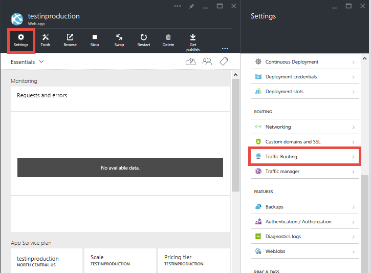
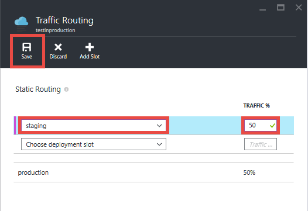
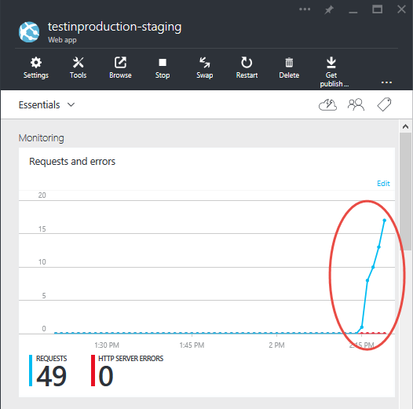
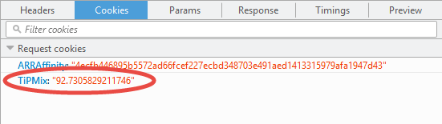
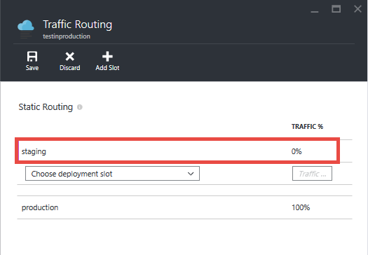
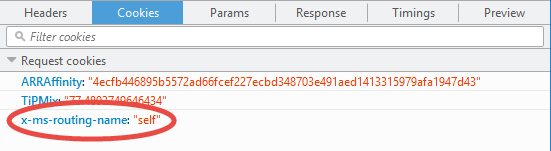

<properties
	pageTitle="Get started with test in production for Web Apps"
	description="Learn about the Test in Production (TiP) feature in Azure App Service Web Apps."
	services="app-service\web"
	documentationCenter=""
	authors="cephalin"
	manager="wpickett"
	editor=""/>

<tags
	ms.service="app-service-web"
	ms.workload="web"
	ms.tgt_pltfrm="na"
	ms.devlang="na"
	ms.topic="article"
	ms.date="01/13/2016"
	ms.author="cephalin"/>

# Get started with test in production for Web Apps

Testing in production, or live-testing your web app using live customer traffic, is a test strategy that app developers increasingly integrate into their [agile development](https://en.wikipedia.org/wiki/Agile_software_development) methodology. It enables you to test the quality of your apps with live user traffic in your production environment, as opposed to synthesized data in a test environment. By exposing your new app to real users, you can be informed on the real problems your app may face once it is deployed. You can verify the functionality, performance, and value of your app updates against the volume, velocity, and variety of real user traffic, which you can never approximate in a test environment.

## Traffic Routing in App Service Web Apps

With the Traffic Routing feature in [Azure App Service](http://go.microsoft.com/fwlink/?LinkId=529714), you can direct a portion of live user traffic to one or more [deployment slots](web-sites-staged-publishing.md), and then analyze your app with [Azure Application Insights](/services/application-insights/) or [Azure HDInsight](/services/hdinsight/), or a third-party tool like [New Relic](/marketplace/partners/newrelic/newrelic/) to validate your change. For example, you can implement the following scenarios with App Service:

- Discover functional bugs or pinpoint performance bottlenecks in your updates prior to site-wide deployment
- Perform "controlled test flights" of your changes by measuring usibility metrics on the beta app
- Gradually ramp up to a new update, and gracefully back down to the current version if an error occurs 
- Optimize your app's business results by running [A/B tests](https://en.wikipedia.org/wiki/A/B_testing) or [multivariate tests](https://en.wikipedia.org/wiki/Multivariate_testing_in_marketing) in multiple deployment slots

### Requirements for using Traffic Routing in Web Apps

- Your web app must run in **Standard** or **Premium** tier, as it is required for multiple deployment slots.
- In order to work properly, Traffic Routing requires cookies to be enabled in the users' browser. Traffic Routing uses cookies to pin a client browser to a deployment slot for the life the client session.
- Traffic Routing supports advanced TiP scenarios through Azure PowerShell cmdlets.

## Route traffic segment to a deployment slot

At the basic level in every TiP scenario, you route a predefined percentage of your live traffic to a non-production deployment slot. To do this, follow the steps below:

>[AZURE.NOTE] The steps here assumes that you already have a [non-production deployment slot](web-sites-staged-publishing.md) and that the desired web app content is already [deployed](web-sites-deploy.md) to it.

1. Log into the [Azure Portal](https://portal.azure.com/).
2. In your web app's blade, click **Settings** > **Traffic Routing**.
  
3. Select the slot that you want to route traffic to and the percentage of the total traffic you desire, then click **Save**.

	

4. Go to the deployment slot's blade. You should now see live traffic being routed to it.

	

Once Traffic Routing is configured, the specified percentage of clients will be randomly routed to your non-production slot. However, it is important to note that once a client is automatically routed to a specific slot, it will be "pinned" to that slot for the life of that client session. This done using a cookie to pin the user session. If you inspect the HTTP requests, you will find a `TipMix` cookie in every subsequent request.

## Force client requests to a specific slot

In addition to automatic traffic routing, App Service is able to route requests to a specific slot. This is useful when you want your users to be able to opt-into or opt-out of your beta app. To do this, you use the `x-ms-routing-name` query parameter.

To reroute users to a specific slot using `x-ms-routing-name`, you must make sure that the slot is already added to the Traffic Routing list. Since you want to route to a slot explicitly, the actual routing percentage you set doesn't matter. If you want, you can craft a "beta link" that users can click to access the beta app.

### Opt users out of beta app

To let users opt out of your beta app, for example, you can put this link in your web page:

    <a href="<webappname>.azurewebsites.net/?x-ms-routing-name=self">Go back to production app</a>

The string `x-ms-routing-name=self` specifies the production slot. Once the client browser access the link, not only is it redirected to the production slot, but every subsequent request will contain the `x-ms-routing-name=self` cookie that pins the session to the production slot.

### Opt users in to beta app

To let users opt in to your beta app, set the same query parameter to the name of the non-production slot, for example:

		<webappname>.azurewebsites.net/?x-ms-routing-name=staging

## More resources ##

-   [Set up staging environments for web apps in Azure App Service](web-sites-staged-publishing.md)
-	[Deploy a complex application predictably in Azure](app-service-deploy-complex-application-predictably.md)
-   [Agile software development with Azure App Service](app-service-agile-software-development.md)
-	[Use DevOps environments effectively for your web apps](app-service-web-staged-publishing-realworld-scenarios.md)