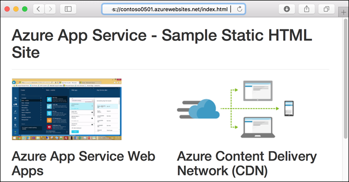
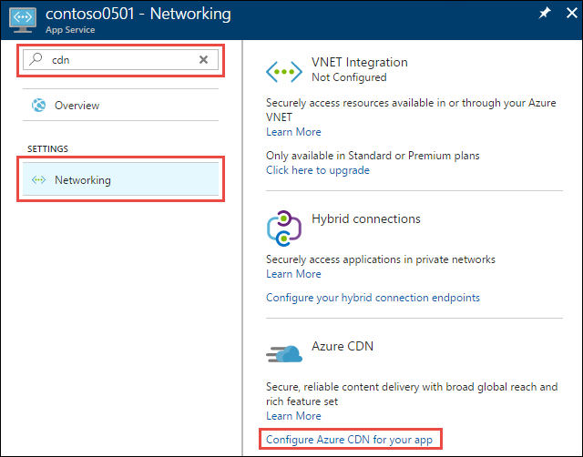
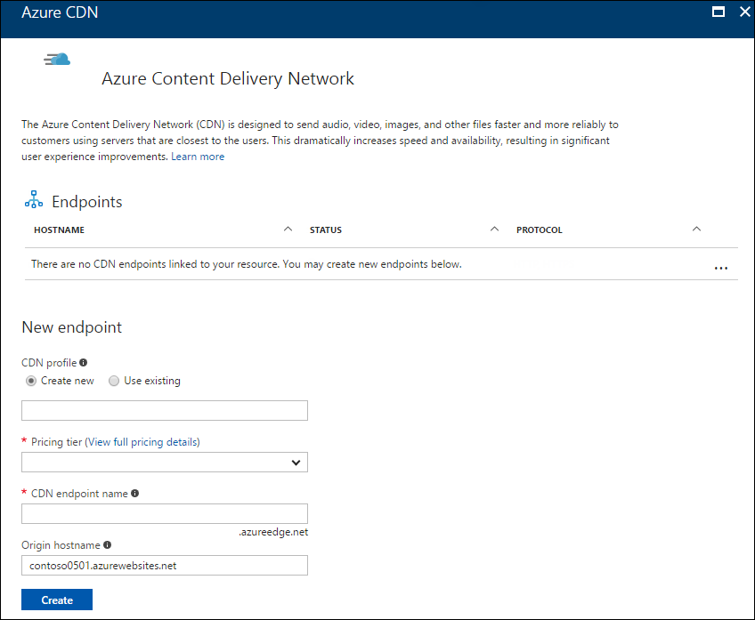
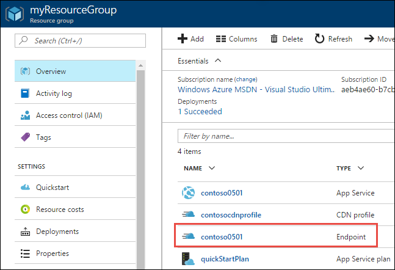
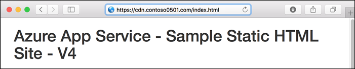

# Add a Content Delivery Network (CDN) to an Azure App Service

[Azure Content Delivery Network (CDN)](../cdn/cdn-overview.md) caches static web content at strategically placed locations to provide maximum throughput for delivering content to users. The CDN also decreases server load on your web app. This tutorial shows how to add Azure CDN to a [web app in Azure App Service](app-service-web-overview.md). 

In this tutorial, you learn how to:

> [!div class="checklist"]
> * Create a CDN endpoint.
> * Refresh cached assets.
> * Use query strings to control cached versions.
> * Use a custom domain for the CDN endpoint.

Here's the home page of the sample static HTML site that you'll work with:



## Create the web app

To create the web app that you'll work with, follow the [static HTML quickstart](app-service-web-get-started-html.md), but don't do the **Clean up resources** step.

When you finish the tutorial, keep the command prompt open so that you can deploy additional changes to the web app later in this tutorial.

### Have a custom domain ready

To complete the custom domain step of this tutorial, you need to have access to your DNS registry for your domain provider (such as GoDaddy). For example, to add DNS entries for `contoso.com` and `www.contoso.com`, you must have access to configure the DNS settings for the `contoso.com` root domain.

If you don't already have a domain name, consider following the [App Service domain tutorial](custom-dns-web-site-buydomains-web-app.md) to purchase a domain using the Azure portal. 

## Log in to the Azure portal

Open a browser and navigate to the [Azure portal](https://portal.azure.com).

## Create a CDN profile and endpoint

In the left navigation, select **App Services**, and then select the app that you created in the [static HTML quickstart](app-service-web-get-started-html.md).


In the **App Service** page, in the **Settings** section, select **Networking > Configure Azure CDN for your app**.



In the **Azure Content Delivery Network** page, provide the **New endpoint** settings as specified in the table.



| Setting | Suggested value | Description |
| ------- | --------------- | ----------- |
| **CDN profile** | myCDNProfile | Select **Create new** to create a new CDN profile. A CDN profile is a collection of CDN endpoints with the same pricing tier. |
| **Pricing tier** | Standard Akamai | The [pricing tier](../cdn/cdn-overview.md#azure-cdn-features) specifies the provider and available features. In this tutorial we are using Standard Akamai. |
| **CDN endpoint name** | Any name that is unique in the azureedge.net domain | You access your cached resources at the domain *\<endpointname>.azureedge.net*.

Select **Create**.

Azure creates the profile and endpoint. The new endpoint appears in the **Endpoints** list on the same page, and when it's provisioned the status is **Running**.


### Test the CDN endpoint

If you selected Verizon pricing tier, it typically takes about 90 minutes for endpoint propagation. For Akamai, it takes a couple minutes for propagation

The sample app has an `index.html` file and *css*, *img*, and *js* folders that contain other static assets. The content paths for all of these files are the same at the CDN endpoint. For example, both of the following URLs access the *bootstrap.css* file in the *css* folder:

```
http://<appname>.azurewebsites.net/css/bootstrap.css
```

```
http://<endpointname>.azureedge.net/css/bootstrap.css
```

Navigate a browser to the following URL and you see the same page that you ran earlier in an Azure web app, but now it's served from the CDN.

```
http://<endpointname>.azureedge.net/index.html
```


This shows that Azure CDN has retrieved the origin web app's assets and is serving them from the CDN endpoint. 

To ensure that this page is cached in the CDN, refresh the page. Two requests for the same asset are sometimes required for the CDN to cache the requested content.

For more information about creating Azure CDN profiles and endpoints, see [Getting started with Azure CDN](../cdn/cdn-create-new-endpoint.md).

## Purge the CDN

The CDN periodically refreshes its resources from the origin web app based on the time-to-live (TTL) configuration. The default TTL is 7 days.

At times you might need to refresh the CDN before the TTL expiration -- for example, when you deploy updated content to the web app. To trigger a refresh, you can manually purge the CDN resources. 

In this section of the tutorial, you deploy a change to the web app and purge the CDN to trigger the CDN to refresh its cache.

### Deploy a change to the web app

Open the `index.html` file and add "- V2" to the H1 heading, as shown in the following example: 

```
<h1>Azure App Service - Sample Static HTML Site - V2</h1>
```

Commit your change and deploy it to the web app.

```bash
git commit -am "version 2"
git push azure master
```

Once deployment has completed, browse to the web app URL and you see the change.

```
http://<appname>.azurewebsites.net/index.html
```


Browse to the CDN endpoint URL for the home page and you don't see the change because the cached version in the CDN hasn't expired yet. 

```
http://<endpointname>.azureedge.net/index.html
```


### Purge the CDN in the portal

To trigger the CDN to update its cached version, purge the CDN.

In the portal left navigation, select **Resource groups**, and then select the resource group that you created for your web app (myResourceGroup).


In the list of resources, select your CDN endpoint.



At the top of the **Endpoint** page, click **Purge**.


Enter the content paths you wish to purge. You can pass a complete file path to purge an individual file, or a path segment to purge and refresh all content in a folder. Since you changed `index.html`, make sure that is one of the paths.

At the bottom of the page, select **Purge**.


### Verify that the CDN is updated

Wait until the purge request finishes processing, typically a couple of minutes. To see the current status, select the bell icon at the top of the page. 


Browse to the CDN endpoint URL for `index.html`, and now you see the V2 that you added to the title on the home page. This shows that the CDN cache has been refreshed.

```
http://<endpointname>.azureedge.net/index.html
```


For more information, see [Purge an Azure CDN endpoint](../cdn/cdn-purge-endpoint.md). 

## Use query strings to version content

The Azure CDN offers the following caching behavior options:

* Ignore query strings
* Bypass caching for query strings
* Cache every unique URL 

The first of these is the default, which means there is only one cached version of an asset regardless of the query string used in the URL that accesses it. 

In this section of the tutorial, you change the caching behavior to cache every unique URL.

### Change the cache behavior

In the Azure portal **CDN Endpoint** page, select **Cache**.

Select **Cache every unique URL** from the **Query string caching behavior** drop-down list.

Select **Save**.


### Verify that unique URLs are cached separately

In a browser, navigate to the home page at the CDN endpoint, but include a query string: 

```
http://<endpointname>.azureedge.net/index.html?q=1
```

The CDN returns the current web app content, which includes "V2" in the heading. 

To ensure that this page is cached in the CDN, refresh the page. 

Open `index.html` and change "V2" to "V3", and deploy the change. 

```bash
git commit -am "version 3"
git push azure master
```

In a browser, go to the CDN endpoint URL with a new query string such as `q=2`. The CDN gets the current `index.html` file and displays "V3".  But if you navigate to the CDN endpoint with the `q=1` query string, you see "V2".

```
http://<endpointname>.azureedge.net/index.html?q=2
```


```
http://<endpointname>.azureedge.net/index.html?q=1
```


This output shows that each query string is treated differently:  q=1 was used before, so cached contents are returned (V2), while q=2 is new, so the latest web app contents are retrieved and returned (V3).

For more information, see [Control Azure CDN caching behavior with query strings](../cdn/cdn-query-string.md).

## Map a custom domain to a CDN endpoint

You'll map your custom domain to your CDN Endpoint by creating a CNAME record. A CNAME record is a DNS feature that maps a source domain to a destination domain. For example, you might map `cdn.contoso.com` or `static.contoso.com` to `contoso.azureedge.net`.

If you don't have a custom domain, consider following the [App Service domain tutorial](custom-dns-web-site-buydomains-web-app.md) to purchase a domain using the Azure portal. 

### Find the hostname to use with the CNAME

In the Azure portal **Endpoint** page, make sure **Overview** is selected in the left navigation, and then select the **+ Custom Domain** button at the top of the page.


In the **Add a custom domain** page, you see the endpoint host name to use in creating a CNAME record. The host name is derived from your CDN endpoint URL: **&lt;EndpointName>.azureedge.net**. 


### Configure the CNAME with your domain registrar

Navigate to your domain registrar's web site, and locate the section for creating DNS records. You might find this in a section such as **Domain Name**, **DNS**, or **Name Server Management**.

Find the section for managing CNAMEs. You may have to go to an advanced settings page and look for the words CNAME, Alias, or Subdomains.

Create a new CNAME record that maps your chosen subdomain (for example, **static** or **cdn**) to the **Endpoint host name** shown earlier in the portal. 

### Enter the custom domain in Azure

Return to the **Add a custom domain** page, and enter your custom domain, including the subdomain, in the dialog box. For example, enter `cdn.contoso.com`.   
   
Azure verifies that the CNAME record exists for the domain name you have entered. If the CNAME is correct, your custom domain is validated.

It can take time for the CNAME record to propagate to name servers on the Internet. If your domain is not validated immediately, and you believe the CNAME record is correct, wait a few minutes and try again.

### Test the custom domain

In a browser, navigate to the `index.html` file using your custom domain (for example, `cdn.contoso.com/index.html`) to verify that the result is the same as when you go directly to `<endpointname>azureedge.net/index.html`.



For more information, see [Map Azure CDN content to a custom domain](../cdn/cdn-map-content-to-custom-domain.md).

[!INCLUDE [cli-samples-clean-up](../../includes/cli-samples-clean-up.md)]

## Next Steps

In this tutorial, you learned how to:

> [!div class="checklist"]
> * Create a CDN endpoint.
> * Refresh cached assets.
> * Use query strings to control cached versions.
> * Use a custom domain for the CDN endpoint.

Learn how to optimize CDN performance in the following articles.

> [!div class="nextstepaction"]
> [Improve performance by compressing files in Azure CDN](../cdn/cdn-improve-performance.md)

> [!div class="nextstepaction"]
> [Pre-load assets on an Azure CDN endpoint](../cdn/cdn-preload-endpoint.md)

