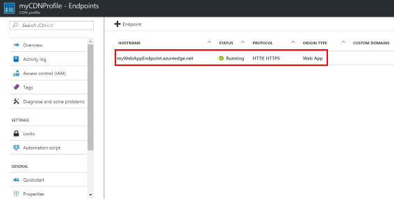
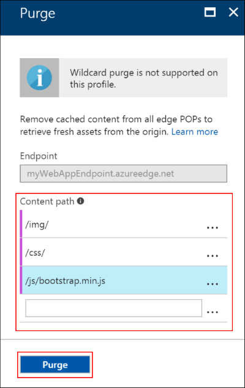

# Add a Content Deliver Network on an Azure App Service

In this tutorial, you will add a Content Delivery Network (CDN) to your Azure App Service to expose the static content on an edge server. You will create a CDN Profile, which is a collection of up to 10 CDN Endpoints.

A Content Delivery Network caches static web content at strategically placed locations to provide maximum throughput for delivering content to users. The benefits of using the CDN to cache web site assets include:

* Better performance and user experience for end users, especially when using applications where multiple round-trips are required to load content.
* Large scaling to better handle instantaneous high load, like at the start of a product launch event.
* By distributing user requests and serving content from edge servers, less traffic is sent to the origin.

> [!TIP]
> Review the up to date list of [Azure CDN pop locations](https://docs.microsoft.com/en-us/azure/cdn/cdn-pop-locations).
>

## Deploy the Sample

To complete this tutorial, you will need an application deployed in to Web App. Follow the [static HTML quickstart](app-service-web-get-started-html.md) to provide a basis for this tutorial.

## Step 1 - Login to Azure Portal

First, open your favorite browser and navigate to the Azure [Portal](https://portal.azure.com).

## Step 2 - Create a CDN Profile

Click the `+ New` button in the left hand navigation, Click on the **Web + Mobile**. Under the Web + Mobile category and select **CDN**.

Specify the following fields:

| Field | Sample value | Description |
|---|---|---|
| Name | myCDNProfile | A name for the CDN profile. |
| Location | West Europe | This is the Azure location where your CDN profile information will be stored. It has no impact on CDN endpoint locations. |
| Resource group | myResourceGroup | For more information on Resource Groups, see [Azure Resource Manager overview](../azure-resource-manager/resource-group-overview.md#resource-groups) |
| Pricing tier | Standard Akamai | See the [CDN Overview](../cdn/cdn-overview.md#azure-cdn-features) for a comparison of pricing tiers. |

Click **Create**.

Open the resource groups hub from the left hand navigation, select **myResourceGroup**. From the resource listing, select **myCDNProfile**.


## Step 3 - Create a CDN Endpoint

Click on **+ Endpoint** from the commands beside the search box, this will launch the Endpoint creation blade.

Specify the following fields:

| Field | Sample value | Description |
|---|---|
| Name |  | This name will be used to access your cached resources at the domain `<endpointname>.azureedge.net` |
| Origin type | Web App | Selecting an origin type provides you with contextual menus for the remaining fields. Selecting custom origin, will provide you with a text field for your origin hostname. |
| Origin hostname | |  The dropdown will list all available origins of the origin type you specified. If you selected Custom origin as your Origin type, you will type in the domain of your custom origin  |

Click **Add**.

The Endpoint will be created, once the Content Delivery Network endpoint is created the status will be updated to **running**.



## Step 4 - Serve from Azure CDN

Now that the CDN Endpoint is **running**, you should be able to access content from the CDN endpoint.

Considering we've used the [static HTML quickstart](app-service-web-get-started-html.md) as a basis for this tutorial, we should have the following folders available on our CDN: `css`, `img`, `js`.

The content paths between the Web App URL `http://<app_name>.azurewebsites.net/img/` and the CDN Endpoint URL `http://<endpointname>.azureedge.net/img/` are the same, this means you can simply substitute the CDN Endpoint domain for any static content for it to be served from the CDN.

Let's pull our first image from the CDN Endpoint by navigating to the following url in your favorite web browser:

```bash
http://<endpointname>.azureedge.net/img/03-enterprise.png
```

Now that the static content is available on the CDN, you can update your application to use the CDN endpoint to deliver the content to the end user.

Depending on the language your site is built with, there may be many frameworks to help with CDN fallback. For example, ASP.NET provides [bundling and minification](https://docs.microsoft.com/en-us/aspnet/mvc/overview/performance/bundling-and-minification#using-a-cdn) support which also enables CDN fallback capabilities.

If your language does not have built-in or a library for CDN failback support, you can use a javascript framework like [FallbackJS](http://fallback.io/), which supports loading [scripts](https://github.com/dolox/fallback/tree/master/examples/loading-scripts), [stylesheets](https://github.com/dolox/fallback/tree/master/examples/loading-stylesheets) and [images](https://github.com/dolox/fallback/tree/master/examples/loading-images).

## Step 5 - Purge the CDN

Sometimes it might be necessary to force a purge of the CDN, if you would like to expire the content prior to the time-to-live (TTL) expires.

It is possible to manually purge the Azure CDN, from either the CDN Profile blade, or the CDN Endpoint Blade. If you select purge from the Profile page, it will be necessary to select which endpoint you wish to purge.

To purge content, type the content paths you wish to purge. You can pass a complete file path to purge an individual file, or a path segment to purge and refresh the content from a parituclar folder.

Once you've provided all of the content paths you want to purge, click **Purge**.



## Step 6 - Map a custom domain

Mapping a custom domain to your CDN endpoint provides a uniform domain for your web application.

In order to map a custom domain to your CDN Endpoint, create a CNAME record with your domain registrar.

> [!NOTE]
> A CNAME record is a DNS feature that maps a source domain, like `www.contosocdn.com` or `static.contosocdn.com`, to a destination domain.

In this case, we'll add a `static.contosocdn.com` source domain, will point the the destination domain which is the CDN Endpoint.

| source domain | destination domain |
|---|---|
| static.contosocdn.com | &lt;endpointname&gt;.azureedge.net |

From the CDN Endpoint overview blade, click on the `+ Custom domain` button.

In the Add a custom domain blade, enter your custom domain, including the subdomain, in the dialog box. For example, enter the domain name in the format `static.contosocdn.com`.

Click **Add**.

## Step 7 - Version content

In the CDN Endpoint left hand navigation, select **Cache** from under the Settings heading.

The **Cache** blade allows you to configure how the CDN handles query strings in the request.

> [!NOTE]
> For a description of the query string cachine behavior options read the [Control Azure CDN caching behavior with query strings](../cdn/cdn-query-string.md) topic.

Select **Cache every unique URL** from the dropdown for the Query string caching behavior.

Click **save**.

## Next Steps

* [What is Azure CDN](../best-practices-cdn.md?toc=%2fazure%2fcdn%2ftoc.json)
* [Enable HTTPS on an Azure CDN custom domain](../cdn/cdn-custom-ssl.md)
* [Improve performance by compressing files in Azure CDN](../cdn/cdn-improve-performance.md)
* [Pre-load assets on an Azure CDN endpoint](../cdn/cdn-preload-endpoint.md)
