---
title: Map an existing custom DNS name to Azure Web Apps | Microsoft Docs 
description: Learn add an existing custom DNS domain name (vanity domain) to web app, mobile app backend, or API app in Azure App Service.
services: app-service\web
documentationcenter: nodejs
author: cephalin
manager: erikre
editor: ''

ms.assetid: dc446e0e-0958-48ea-8d99-441d2b947a7c
ms.service: app-service-web
ms.workload: web
ms.tgt_pltfrm: na
ms.devlang: nodejs
ms.topic: article
ms.date: 05/04/2017
ms.author: cephalin

---
# Map an existing custom DNS name to Azure Web Apps

This tutorial shows you how to map an existing custom DNS name to [Azure Web Apps](app-service-web-overview.md). 

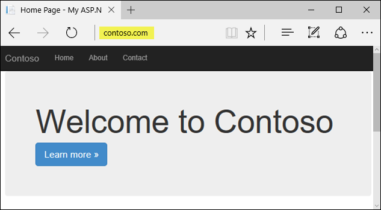

In this tutorial, you learn how to:

> [!div class="checklist"]
> * Map a subdomain (for example, `www.contoso.com`) by using a CNAME record
> * Map a root domain (for example, `contoso.com`) by using an A record
> * Map a wildcard domain (for example, `*.contoso.com`) by using a CNAME record
> * Automate domain mapping with scripts

You can use either a **CNAME record** or an **A record** to map a custom DNS name to App Service.

> [!NOTE]
> We recommend that you use a CNAME for all custom DNS names except a root domain (for example, `contoso.com`). 
> 
> 

## Prerequisites

To complete this tutorial, you need access to your DNS registry for your domain provider (such as GoDaddy), and the permissions to edit the configuration for your domain. 

For example, to add DNS entries for `contoso.com` and `www.contoso.com`, you must have access to configure the DNS settings for the `contoso.com` root domain. 

> [!NOTE]
> If you don't have an existing domain name, consider following the [App Service domain tutorial](custom-dns-web-site-buydomains-web-app.md) to purchase a domain using the Azure portal. 
>
>

## Prepare your app
To map a custom DNS name, your [App Service plan](https://azure.microsoft.com/pricing/details/app-service/) must be a paid tier (**Shared**, **Basic**, **Standard**, or **Premium**). In this step, you make sure that your App Service app is in the supported pricing tier.

### Sign in to Azure

Open the Azure portal. To do this, sign in to [https://portal.azure.com](https://portal.azure.com) with your Azure account.

### Navigate to your app
From the left menu, click **App Services**, then click the name of your app.


You have landed in the management blade of your App Service app (_blade_: a portal page that opens horizontally).  

### Check the pricing tier

In the left-hand navigation of your app blade, scroll to the **Settings** section and select **Scale up (App Service plan)**.

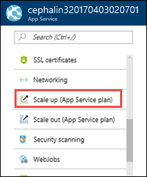

Check to make sure that your app is not in the **Free** tier. Your app's current tier is highlighted by a dark blue box. 

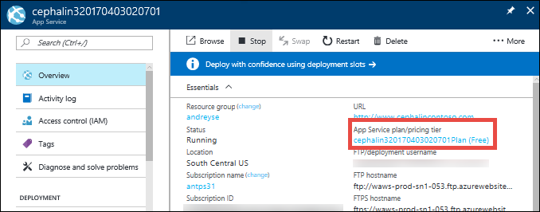

Custom DNS is not supported in the **Free** tier. If you need to scale up, follow the next section. Otherwise, close the **Choose your pricing tier** blade and skip to [Map a CNAME record](#cname) or [Map an A record](#a).

### Scale up your App Service plan

Select any of the non-free tiers (**Shared**, **Basic**, **Standard**, or **Premium**). 

Click **Select**.

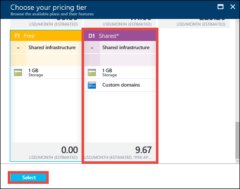

When you see the notification below, the scale operation is complete.

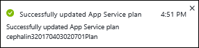

<a name="cname"></a>

## Map a CNAME record

In the tutorial example, you want to add a CNAME record for the `www` subdomain (`www.contoso.com`). 

### Access DNS records with domain provider

First, sign in to the website of your domain provider.

Find the page for managing DNS records. Every domain provider has its own DNS records interface, so you should consult your provider's documentation. Look for links or areas of the site labeled **Domain Name**, **DNS**, or **Name Server Management**. 

Often, you can find the link by viewing your account information, and then looking for a link such as **My domains**. Then look for a link that lets you manage DNS records. This link might be named **Zone file**, **DNS Records**, or **Advanced configuration**.

The following screenshot is an example of a DNS records page:


In the example screenshot, you click **Add** to create a record. Some providers have different links to add different record types. Again, consult your provider's documentation.

> [!NOTE]
> For certain providers, such as GoDaddy, changes to DNS records don't become effective until you click a separate **Save Changes** link. 
>
>

### Create the CNAME record

Add a CNAME record to map a subdomain to your app's default hostname (`<app_name>.azurewebsites.net`).

For the `www.contoso.com` domain example, your CNAME record should point the name `www` to `<app_name>.azurewebsites.net`.

Your DNS records page show look like the following screenshot:

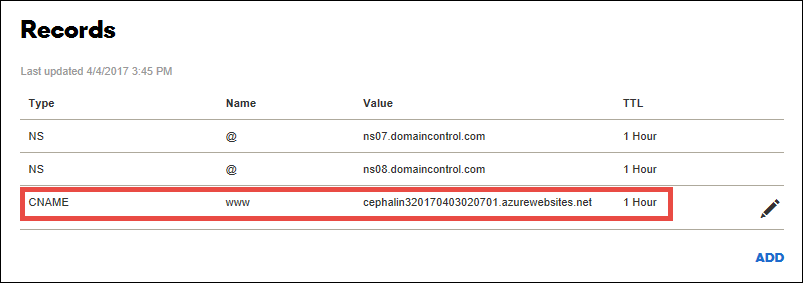

### Enable the CNAME record mapping in your app

You're now ready to add your configured DNS name to your app.

In the left-hand navigation of your app blade, click **Custom domains**. 


In the **Custom domains** blade of your app, you need to add the fully qualified custom DNS name (`www.contoso.com`) to the list.

Click the **+** icon next to **Add hostname**.

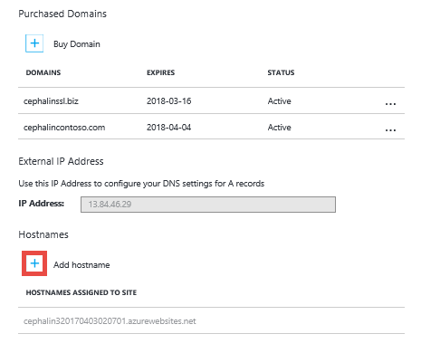

Type the fully qualified domain name for which you configured the CNAME record earlier (e.g. `www.contoso.com`), then click **Validate**.

Otherwise, the **Add hostname** button is activated. 

Make sure that **Hostname record type** is set to **CNAME record (example.com)**.

Click **Add hostname** to add the DNS name to your app.

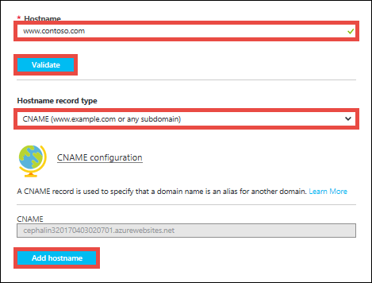

It might take some time for the new hostname to be reflected in your app's **Custom domains** page. Try refreshing the browser to update the data.

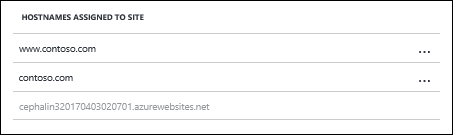

If you missed a step or made a typo somewhere earlier, you see a verification error at the bottom of the page.

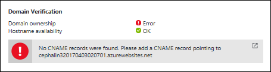

<a name="a"></a>

## Map an A record

In the tutorial example, you want to add an A record for the root domain, `contoso.com`. 

<a name="info"></a>

### Copy your app's IP address

To map an A record, you need your app's external IP address. You can find this IP address in the **Custom domains** blade.

In the left-hand navigation of your app blade, click **Custom domains**. 


In the **Custom domains** page, copy the app's IP address.

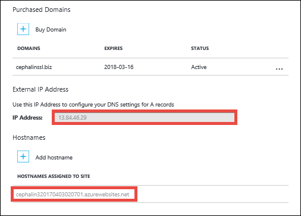

### Access DNS records with domain provider

First, sign in to the website of your domain provider.

Find the page for managing DNS records. Every domain provider has its own DNS records interface, so you should consult your provider's documentation. Look for links or areas of the site labeled **Domain Name**, **DNS**, or **Name Server Management**. 

Often, you can find the link by viewing your account information, and then looking for a link such as **My domains**. Then look for a link that lets you manage DNS records. This link might be named **Zone file**, **DNS Records**, or **Advanced configuration**.

The following screenshot is an example of a DNS records page:


In the example screenshot, you click **Add** to create a record. Some providers have different links to add different record types. Again, consult your provider's documentation.

> [!NOTE]
> For certain providers, such as GoDaddy, changes to DNS records don't become effective until you click a separate **Save Changes** link. 
>
>

<a name="create-a"></a>

### Create the A record

To map an A record to your app, App Service actually requires **two** DNS records:

- An **A** record to map to your app's IP address.
- A **TXT** record to map to your app's default hostname `<app_name>.azurewebsites.net`. This record lets App Service verify that you own the custom domain you want to map.

For the `www.contoso.com` domain example, create the A and TXT records according to the following table (`@` typically represents the root domain). 

| Record type | Host | Value |
| - | - | - |
| A | `@` | IP address from [Copy your app's IP address](#info) |
| TXT | `@` | `<app_name>.azurewebsites.net` |

Your DNS records page should look like the following screenshot:

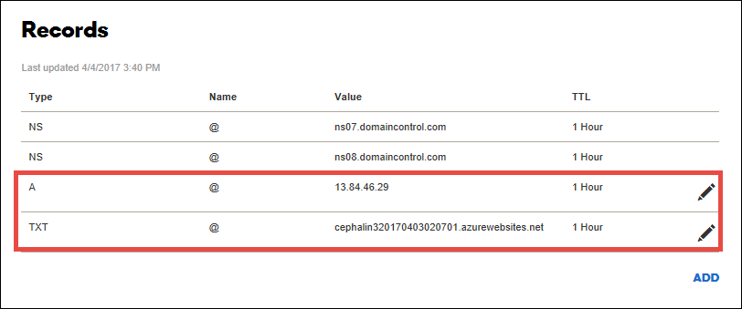

### Enable the A record mapping in your app

You are now ready to add your configured DNS name to your app.

Back in your app's **Custom domains** page in the Azure portal, you need to add the fully qualified custom DNS name (`contoso.com`) to the list.

Click the **+** icon next to **Add hostname**.


Type the fully qualified domain name for which you configured the A record earlier (for example, `contoso.com`), then click **Validate**.

Otherwise, the **Add hostname** button is activated. 

Make sure that **Hostname record type** is set to **A record (example.com)**.

Click **Add hostname** to add the DNS name to your app.

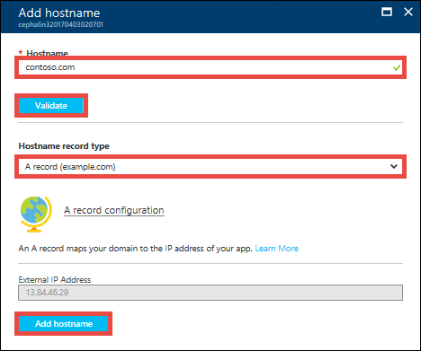

It might take some time for the new hostname to be reflected in your app's **Custom domains** page. Try refreshing the browser to update the data.


If you missed a step or made a typo somewhere earlier, you see a verification error at the bottom of the page.

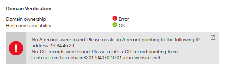

<a name="wildcard"></a>

## Map a wildcard domain

You can also map a [wildcard DNS](https://en.wikipedia.org/wiki/Wildcard_DNS_record) (for example, `*.contoso.com`) to your App Service app. 

The steps here show you how to map the wildcard domain `*.contoso.com` using a CNAME record. 

### Access DNS records with domain provider

First, sign in to the website of your domain provider.

Find the page for managing DNS records. Every domain provider has its own DNS records interface, so you should consult your provider's documentation. Look for links or areas of the site labeled **Domain Name**, **DNS**, or **Name Server Management**. 

Often, you can find the link by viewing your account information, and then looking for a link such as **My domains**. Then look for a link that lets you manage DNS records. This link might be named **Zone file**, **DNS Records**, or **Advanced configuration**.

The following screenshot is an example of a DNS records page:


In the example screenshot, you click **Add** to create a record. Some providers have different links to add different record types. Again, consult your provider's documentation.

> [!NOTE]
> For certain providers, such as GoDaddy, changes to DNS records don't become effective until you click a separate **Save Changes** link. 
>
>

### Create the CNAME record

Add a CNAME record to map a wildcard name to your app's default hostname (`<app_name>.azurewebsites.net`).

For the `*.contoso.com` domain example, your CNAME record should point the name `*` to `<app_name>.azurewebsites.net`.

Your DNS records page show look like the following screenshot:


### Enable the CNAME record mapping in your app

You can now add any subdomain that matches your wildcard name.

For the `*.contoso.com` wildcard example, you can now add `sub1.contoso.com` and `sub2.contoso.com`. 

In the left-hand navigation of your app blade, click **Custom domains**. 


Click the **+** icon next to **Add hostname**.


Type the fully qualified domain name for a subdomain that matches your wildcard domain (for example, `sub1.contoso.com`), then click **Validate**.

Otherwise, the **Add hostname** button is activated. 

Make sure that **Hostname record type** is set to **CNAME record (example.com)**.

Click **Add hostname** to add the DNS name to your app.


It might take some time for the new hostname to be reflected in your app's **Custom domains** page. Try refreshing the browser to update the data.

You can click the **+** icon again to add another hostname that matches your wildcard domain.

For example, add `sub2.contoso.com` using the same steps above.


## Test in browser

In your browser, browse to the DNS name(s) that you configured earlier (`contoso.com` and `www.contoso.com`).


## Automate with scripts

You can automate management of custom domains with scripts, using the [Azure CLI](/cli/azure/install-azure-cli) or [Azure PowerShell](/powershell/azure/overview). 

### Azure CLI 

The following command adds a configured custom DNS name to an App Service app. 

```bash 
az appservice web config hostname add \
    --webapp <app_name> \
    --resource-group <resourece_group_name> \ 
    --name <fully_qualified_domain_name> 
``` 

For more information, see [Map a custom domain to a web app](scripts/app-service-cli-configure-custom-domain.md) 

### Azure PowerShell 

The following command adds a configured custom DNS name to an App Service app. 

```PowerShell  
Set-AzureRmWebApp `
    -Name <app_name> `
    -ResourceGroupName <resourece_group_name> ` 
    -HostNames @("<fully_qualified_domain_name>","<app_name>.azurewebsites.net") 
```

For more information, see [Assign a custom domain to a web app](scripts/app-service-powershell-configure-custom-domain.md).

## Next steps

In this tutorial, you learned how to:

> [!div class="checklist"]
> * Map a subdomain by using a CNAME record
> * Map a root domain by using an A record
> * Map a wildcard domain by using a CNAME record
> * Automate domain mapping with scripts

Advance to the next tutorial to learn how to bind a custom SSL certificate to it.

> [!div class="nextstepaction"]
> [Bind an existing custom SSL certificate to Azure Web Apps](app-service-web-tutorial-custom-ssl.md)
