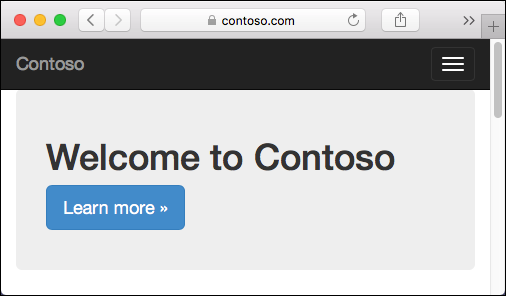
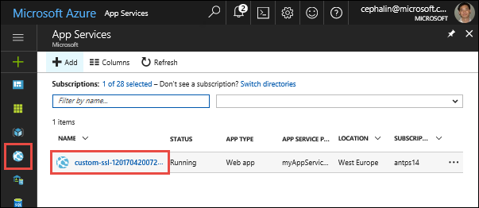
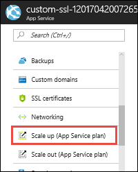
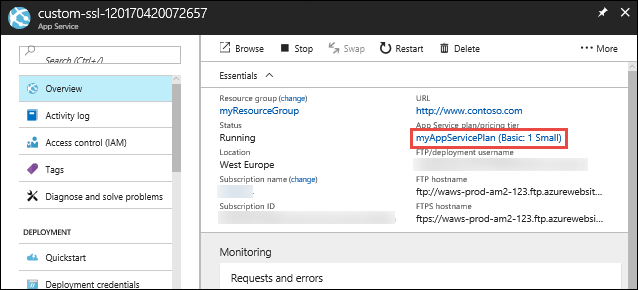
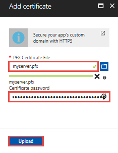
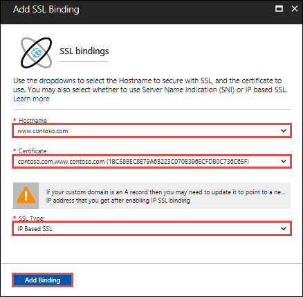
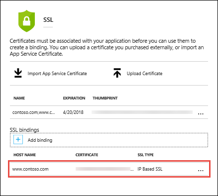

---
title: Bind an existing custom SSL certificate to Azure Web Apps | Microsoft Docs 
description: Learn to to bind a custom SSL certificate to your web app, mobile app backend, or API app in Azure App Service.
services: app-service\web
documentationcenter: nodejs
author: cephalin
manager: erikre
editor: ''

ms.assetid: 5d5bf588-b0bb-4c6d-8840-1b609cfb5750
ms.service: app-service-web
ms.workload: web
ms.tgt_pltfrm: na
ms.devlang: nodejs
ms.topic: article
ms.date: 05/04/2017
ms.author: cephalin

---
# Bind an existing custom SSL certificate to Azure Web Apps

This tutorial shows you how to bind a custom SSL certificate that you purchased from a trusted certificate authority to [Azure Web Apps](app-service-web-overview.md). When you're finished, you'll be able to access your web app at the HTTPS endpoint of your custom DNS domain.



In this tutorial, you learn how to:

> [!div class="checklist"]
> * Upgrade your app's pricing tier
> * Bind your custom SSL certificate to App Service
> * Enforce HTTPS for your app
> * Automate SSL certificate binding with scripts

> [!TIP]
> If you need to get a custom SSL certificate, you can get one in the Azure portal directly and bind it to your web app. Follow the [App Service Certificates tutorial](web-sites-purchase-ssl-web-site.md). 
>
> 

## Prerequisites
Before following this tutorial, make sure that you have done the following:

- [Create an App Service app](/azure/app-service/)
- [Map a custom DNS name to your web app](web-sites-custom-domain-name.md)
- Acquire an SSL certificate from a trusted certificate authority

<a name="requirements"></a>

### Requirements for your SSL certificate

To use your certificate in App Service, your certificate must meet all the following requirements:

* Signed by a trusted certificate authority
* Exported as a password-protected PFX file
* Contains private key at least 2048 bits long
* Contains all intermediate certificates in the certificate chain

> [!NOTE]
> **Elliptic Curve Cryptography (ECC) certificates** can work with App Service, but outside the scope
> of this article. Work with your certificate authority on the exact steps to create ECC certificates.
> 
>

## Prepare your web app
To bind a custom SSL certificate to your web app, your [App Service plan](https://azure.microsoft.com/pricing/details/app-service/) must be in the **Basic**, **Standard**, or **Premium** tier. In this step, you make sure that your web app is in the supported pricing tier.

### Log in to Azure

Open the Azure portal. To do this, sign in to [https://portal.azure.com](https://portal.azure.com) with your Azure account.

### Navigate to your web app
From the left menu, click **App Services**, then click the name of your web app.



You have landed in the management blade of your web app (_blade_: a portal page that opens horizontally).  

### Check the pricing tier

In the left-hand navigation of your web app blade, scroll to the **Settings** section and select **Scale up (App Service plan)**.



Check to make sure that your web app is not in the **Free** or **Shared** tier. Your web app's current tier is highlighted by a dark blue box. 



Custom SSL is not supported in the **Free** and **Shared** tier. If you need to scale up, follow the next section. Otherwise, close the **Choose your pricing tier** blade and skip to [Upload and bind your SSL certificate](#upload).

### Scale up your App Service plan

Select one of the **Basic**, **Standard**, or **Premium** tiers. 

Click **Select**.


When you see the notification below, the scale operation is complete.


<a name="upload"></a>

## Bind your SSL certificate

You are ready to upload your SSL certificate to your web app. 

### Export certificate to PFX

You must export your custom SSL certificate with the private key that your certificate request was generated with.

If you generated your certificate request using OpenSSL, then you have created a private key. To export your certificate to PFX, run the following command:

```bash
openssl pkcs12 -export -out myserver.pfx -inkey myserver.key -in myserver.crt
```

If you used IIS or _Certreq.exe_ to generate your certificate request, then first install your certificate to your local machine, then export it to PFX by following the steps at [Export a Certificate with the Private Key](https://technet.microsoft.com/library/cc754329(v=ws.11).aspx).

### Upload your SSL certificate

To upload your SSL certificate, click **SSL certificates** in the left-hand navigation of your web app.

Click **Upload Certificate**.

In **PFX Certificate File**, select your PFX file that. In **Certificate password**, type the password that you created when exporting the PFX file.

Click **Upload**.



When App Service finishes uploading your certificate, it appears in the **SSL certificates** page.


### Bind your SSL certificate

You should now see your uploaded certificate back in the **SSL certificate** page.

In the **SSL bindings** section, click **Add binding**.

In the **Add SSL Binding** blade, use the dropdowns to select the domain name to secure, and the certificate to use. 

In **SSL Type**, select whether to use **[Server Name Indication (SNI)](http://en.wikipedia.org/wiki/Server_Name_Indication)** or IP-based SSL.
   
- **SNI based SSL** - Multiple SNI-based SSL bindings may be added. This option allows multiple SSL certificates to secure multiple domains on the same IP address. Most modern browsers (including Internet Explorer, Chrome, Firefox, and Opera) support SNI (find more comprehensive browser support information at [Server Name Indication](http://wikipedia.org/wiki/Server_Name_Indication)).
- **IP based SSL** - Only one IP-based SSL binding may be added. This option allows only one SSL certificate to secure a dedicated public IP address. To secure multiple domains, you must secure them all using the same SSL certificate. This is the traditional option for SSL binding. 

Click **Add Binding**.



When App Service finishes uploading your certificate, it appears in the **SSL bindings** sections.



## Remap A record for IP SSL

If you don't use IP-based SSL in your web app, skip to [Test HTTPS for your custom domain](#test). 

By default, your web app uses a shared public IP address. As soon as you bind a certificate with IP-based SSL, App Service creates a new, dedicated IP address for your web app.

If you have mapped an A record to your web app, update your domain registry with this new, dedicated IP address.

Your web app's **Custom domain** page is updated with the new, dedicated IP address. [Copy this IP address](app-service-web-tutorial-custom-domain.md#info), then [remap the A record](app-service-web-tutorial-custom-domain.md#create-a) to this new IP address.

<a name="test"></a>

## Test HTTPS
All that's left to do now is to make sure that HTTPS works for your custom domain. In various browsers, browse
to `https://<your.custom.domain>` to see that it serves up your web app.


> [!NOTE]
> If your web app gives you certificate validation errors, you're probably using a self-signed certificate.
>
> If that's not the case, you may have left out intermediate certificates when you export your certificate to the PFX file. 
>
>

<a name="bkmk_enforce"></a>

## Enforce HTTPS
If you still want to allow HTTP access to your web app, skip this step. 

App Service does *not* enforce HTTPS, so anyone can still access your web app using HTTP. To enforce HTTPS for your web app, you can define a rewrite rule in the _web.config_ file for your web app. App Service uses this file, regardless of the language framework of your web app.

> [!NOTE]
> There is language-specific redirection of requests. ASP.NET MVC can use the [RequireHttps](http://msdn.microsoft.com/library/system.web.mvc.requirehttpsattribute.aspx) filter instead of the rewrite rule in _web.config_ (see [Deploy a secure ASP.NET MVC 5 app to a web app](web-sites-dotnet-deploy-aspnet-mvc-app-membership-oauth-sql-database.md)).
> 
> 

If you're a .NET developer, you should be relatively familiar with this file. It is in the root of your solution.

Alternatively, if you develop with PHP, Node.js, Python, or Java, there is a chance we generated this file on your behalf in App Service.

Connect to your web app's FTP endpoint by following the instructions at [Deploy your app to Azure App Service using FTP/S](app-service-deploy-ftp.md). 

This file should be located in _/home/site/wwwroot_. If not, create a _web.config_ in this folder with the following XML:

```xml   
<?xml version="1.0" encoding="UTF-8"?>
<configuration>
  <system.webServer>
    <rewrite>
      <rules>
        <!-- BEGIN rule TAG FOR HTTPS REDIRECT -->
        <rule name="Force HTTPS" enabled="true">
          <match url="(.*)" ignoreCase="false" />
          <conditions>
            <add input="{HTTPS}" pattern="off" />
          </conditions>
          <action type="Redirect" url="https://{HTTP_HOST}/{R:1}" appendQueryString="true" redirectType="Permanent" />
        </rule>
        <!-- END rule TAG FOR HTTPS REDIRECT -->
      </rules>
    </rewrite>
  </system.webServer>
</configuration>
```

For an existing _web.config_, you just need to copy the entire `<rule>` tag into your _web.config_'s `configuration/system.webServer/rewrite/rules` element. If there are other `<rule>` tags in your _web.config_, then place the copied `<rule>` tag before the other `<rule>` tags.

This rule returns an HTTP 301 (permanent redirect) to the HTTPS protocol whenever the user makes an HTTP request to your web app. For example, it redirects from `http://contoso.com` to `https://contoso.com`.

For more information on the IIS URL Rewrite module, see the [URL Rewrite](http://www.iis.net/downloads/microsoft/url-rewrite) documentation.

## Automate with scripts

You can automate SSL bindings for your web app with scripts, using the [Azure CLI](/cli/azure/install-azure-cli) or [Azure PowerShell](/powershell/azure/overview).

### Azure CLI

The following command uploads an exported PFX file and gets the thumbprint. 

```bash
thumprint=$(az appservice web config ssl upload \
    --name <app_name> \
    --resource-group <resource_group_name> \
    --certificate-file <path_to_PFX_file> \
    --certificate-password <PFX_password> \
    --query thumbprint \
    --output tsv)
```

The following command adds an SNI-based SSL binding, using the thumbprint from the previous command.

```bash
az appservice web config ssl bind \
    --name <app_name> \
    --resource-group <resource_group_name>
    --certificate-thumbprint $thumbprint \
    --ssl-type SNI \
```

### Azure PowerShell

The following command uploads an exported PFX file and adds an SNI-based SSL binding.

```PowerShell
New-AzureRmWebAppSSLBinding `
    -WebAppName <app_name> `
    -ResourceGroupName <resource_group_name> `
    -Name <dns_name> `
    -CertificateFilePath <path_to_PFX_file> `
    -CertificatePassword <PFX_password> `
    -SslState SniEnabled
```
## What you have learned

In this tutorial, you learned how to:

> [!div class="checklist"]
> * Upgrade your app's pricing tier
> * Bind your custom SSL certificate to App Service
> * Enforce HTTPS for your app
> * Automate SSL certificate binding with scripts
