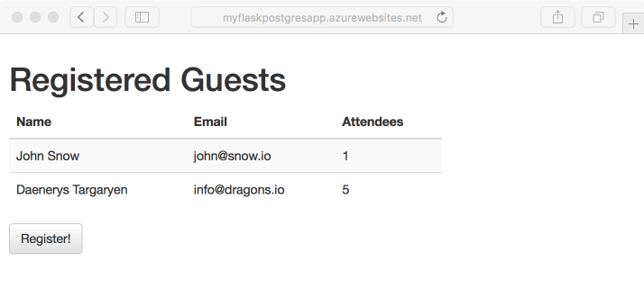
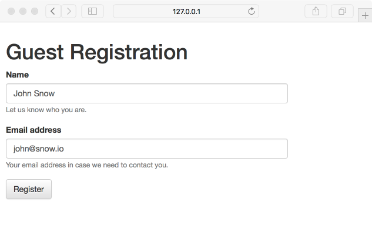
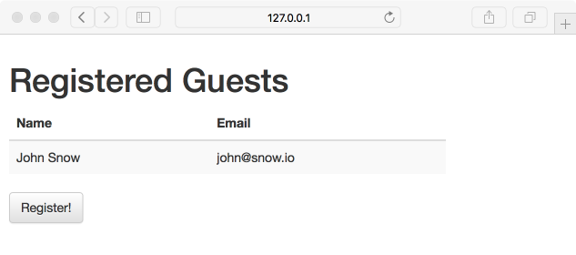
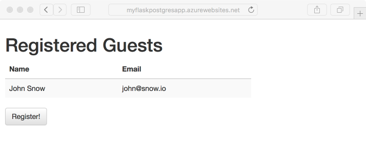
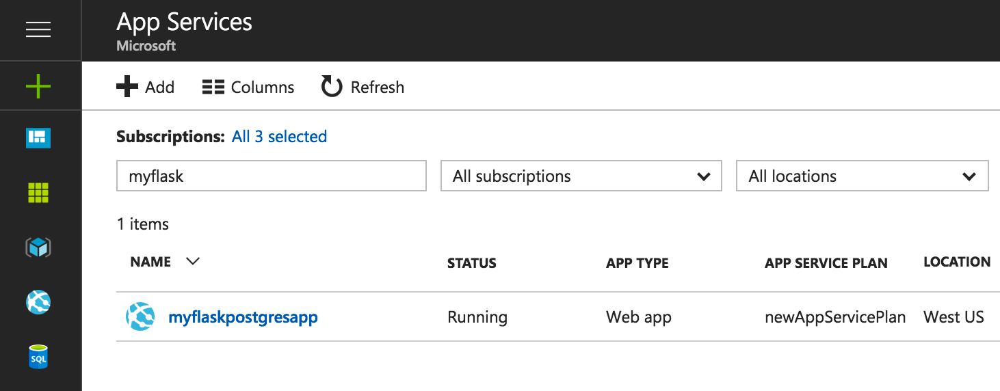
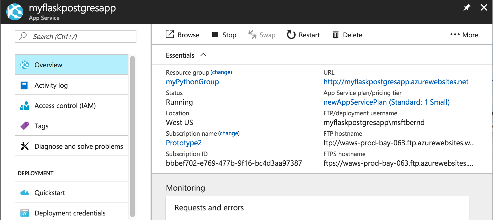

# Build a Docker Python and PostgreSQL web app in Azure

Azure Web Apps provides a highly scalable, self-patching web hosting service. This tutorial shows how to create a basic Docker Python web app in Azure. You'll connect this app to a PostgreSQL database. When you're done, you'll have a Python Flask application running within a Docker container on [Azure App Service Web Apps](app-service-web-overview.md).



You can follow the steps below on macOS. Linux and Windows instructions are the same in most cases, but the differences are not detailed in this tutorial.
 
## Prerequisites

To complete this tutorial:

1. [Install Git](https://git-scm.com/)
1. [Install Python](https://www.python.org/downloads/)
1. [Install and run PostgreSQL](https://www.postgresql.org/download/)
1. [Install Docker Community Edition](https://www.docker.com/community-edition)

[!INCLUDE [quickstarts-free-trial-note](../../includes/quickstarts-free-trial-note.md)]

[!INCLUDE [cloud-shell-try-it.md](../../includes/cloud-shell-try-it.md)]

If you choose to install and use the CLI locally, this topic requires that you are running the Azure CLI version 2.0 or later. Run `az --version` to find the version. If you need to install or upgrade, see [Install Azure CLI 2.0]( /cli/azure/install-azure-cli). 

## Test local PostgreSQL installation and create a database

Open the terminal window and run `psql postgres` to connect to your local PostgreSQL server.

```bash
psql postgres
```

If your connection is successful, your PostgreSQL database is running. If not, make sure that your local PostgresQL database is started by following the steps at [Downloads - PostgreSQL Core Distribution](https://www.postgresql.org/download/).

Create a database called *eventregistration* and set up a separate database user named *manager* with password *supersecretpass*.

```bash
CREATE DATABASE eventregistration;
CREATE USER manager WITH PASSWORD 'supersecretpass';
GRANT ALL PRIVILEGES ON DATABASE eventregistration TO manager;
```
Type *\q* to exit the PostgreSQL client. 

<a name="step2"></a>

## Create local Python Flask application

In this step, you set up the local Python Flask project.

### Clone the sample application

Open the terminal window, and `CD` to a working directory.  

Run the following commands to clone the sample repository and go to the *0.1-initialapp* release.

```bash
git clone https://github.com/Azure-Samples/docker-flask-postgres.gi
cd docker-flask-postgres
git checkout tags/0.1-initialapp
```

This sample repository contains a [Flask](http://flask.pocoo.org/) application. 

### Run the application

> [!NOTE] 
> In a later step you simplify this process by building a Docker container to use with the production database.

Install the required packages and start the application.

```bash
pip install virtualenv
virtualenv venv
source venv/bin/activate
pip install -r requirements.txt
cd app
FLASK_APP=app.py DBHOST="localhost" DBUSER="manager" DBNAME="eventregistration" DBPASS="supersecretpass" flask db upgrade
FLASK_APP=app.py DBHOST="localhost" DBUSER="manager" DBNAME="eventregistration" DBPASS="supersecretpass" flask db run
```

When the app is fully loaded, you see something similar to the following message:

```bash
INFO  [alembic.runtime.migration] Context impl PostgresqlImpl.
INFO  [alembic.runtime.migration] Will assume transactional DDL.
INFO  [alembic.runtime.migration] Running upgrade  -> 791cd7d80402, empty message
 * Serving Flask app "app"
 * Running on http://127.0.0.1:5000/ (Press CTRL+C to quit)
```

Navigate to http://127.0.0.1:5000 in a browser. Click **Register!** and create a test user.



The Flask sample application stores user data in the database. If you are successful at registering a user, your app is writing data to the local PostgreSQL database.

To stop the Flask server at anytime, type Ctrl+C in the terminal. 

## Create a production PostgreSQL database

In this step, you create a PostgreSQL database in Azure. When your app is deployed to Azure, it will use this cloud database.

### Log in to Azure

You are now going to use the Azure CLI 2.0 to create the resources needed to host your Python application in Azure App Service.  Log in to your Azure subscription with the [az login](/cli/azure/#login) command and follow the on-screen directions. 

```azurecli
az login 
``` 
   
### Create a resource group

Create a [resource group](../azure-resource-manager/resource-group-overview.md) with the [az group create](/cli/azure/group#create). 

[!INCLUDE [Resource group intro](../../includes/resource-group.md)]

The following example creates a resource group in the West US region:

```azurecli-interactive
az group create --name myResourceGroup --location "West US"
```

Use the [az appservice list-locations](/cli/azure/appservice#list-locations) Azure CLI command to list available locations.

### Create an Azure Database for PostgreSQL server

Create a PostgreSQL server with the [az postgres server create](/cli/azure/documentdb#create) command.

In the following command, substitute a unique server name for the *\<postgresql_name>* placeholder and a user name for the *\<admin_username>* placeholder. The server name is used as part of your PostgreSQL endpoint (`https://<postgresql_name>.postgres.database.azure.com`), so the name needs to be unique across all servers in Azure. The user name is for the initial database admin user account. You are prompted to pick a password for this user.

```azurecli-interactive
az postgres server create --resource-group myResourceGroup --name <postgresql_name> --admin-user <admin_username>
```

When the Azure Database for PostgreSQL server is created, the Azure CLI shows information similar to the following example:

```json
{
  "administratorLogin": "<my_admin_username>",
  "fullyQualifiedDomainName": "<postgresql_name>.postgres.database.azure.com",
  "id": "/subscriptions/00000000-0000-0000-0000-000000000000/resourceGroups/myResourceGroup/providers/Microsoft.DBforPostgreSQL/servers/<postgresql_name>",
  "location": "westus",
  "name": "<postgresql_name>",
  "resourceGroup": "myResourceGroup",
  "sku": {
    "capacity": 100,
    "family": null,
    "name": "PGSQLS3M100",
    "size": null,
    "tier": "Basic"
  },
  "sslEnforcement": null,
  "storageMb": 2048,
  "tags": null,
  "type": "Microsoft.DBforPostgreSQL/servers",
  "userVisibleState": "Ready",
  "version": null
}
```

### Create a firewall rule for the Azure Database for PostgreSQL server

Run the following Azure CLI command to allow access to the database from all IP addresses.

```azurecli-interactive
az postgres server firewall-rule create --resource-group myResourceGroup --server-name <postgresql_name> --start-ip-address=0.0.0.0 --end-ip-address=255.255.255.255 --name AllowAllIPs
```

The Azure CLI confirms the firewall rule creation with output similar to the following example:

```json
{
  "endIpAddress": "255.255.255.255",
  "id": "/subscriptions/00000000-0000-0000-0000-000000000000/resourceGroups/myResourceGroup/providers/Microsoft.DBforPostgreSQL/servers/<postgresql_name>/firewallRules/AllowAllIPs",
  "name": "AllowAllIPs",
  "resourceGroup": "myResourceGroup",
  "startIpAddress": "0.0.0.0",
  "type": "Microsoft.DBforPostgreSQL/servers/firewallRules"
}
```

## Connect your Python Flask application to the database

In this step, you connect your Python Flask sample application to the Azure Database for PostgreSQL server you created.

### Create an empty database and set up a new database application user

Create a database user with access to a single database only. You'll use these credentials to avoid giving the application full access to the server.

Connect to the database (you're prompted for your admin password).

```bash
psql -h <postgresql_name>.postgres.database.azure.com -U <my_admin_username>@<postgresql_name> postgres
```

Create the database and user from the PostgreSQL CLI.

```bash
CREATE DATABASE eventregistration;
CREATE USER manager WITH PASSWORD 'supersecretpass';
GRANT ALL PRIVILEGES ON DATABASE eventregistration TO manager;
```

Type *\q* to exit the PostgreSQL client.

### Test the application locally against the Azure PostgreSQL database 

Going back now to the *app* folder of the cloned Github repository, you can run the Python Flask application by updating the database environment variables.

```bash
FLASK_APP=app.py DBHOST="<postgresql_name>.postgres.database.azure.com" DBUSER="manager@<postgresql_name>" DBNAME="eventregistration" DBPASS="supersecretpass" flask db upgrade
FLASK_APP=app.py DBHOST="<postgresql_name>.postgres.database.azure.com" DBUSER="manager@<postgresql_name>" DBNAME="eventregistration" DBPASS="supersecretpass" flask run
```

When the app is fully loaded, you see something similar to the following message:

```bash
INFO  [alembic.runtime.migration] Context impl PostgresqlImpl.
INFO  [alembic.runtime.migration] Will assume transactional DDL.
INFO  [alembic.runtime.migration] Running upgrade  -> 791cd7d80402, empty message
 * Serving Flask app "app"
 * Running on http://127.0.0.1:5000/ (Press CTRL+C to quit)
```

Navigate to http://127.0.0.1:5000 in a browser. Click **Register!** and create a test registration. You are now writing data to the database in Azure.


### Running the application from a Docker Container

Build the Docker container image.

```bash
cd ..
docker build -t flask-postgresql-sample .
```

Docker displays a confirmation that it successfully created the container.

```bash
Successfully built 7548f983a36b
```

Add database environment variables to an environment variable file *db.env*. The app will connect to the PostgreSQL production database in Azure.

```text
DBHOST="<postgresql_name>.postgres.database.azure.com"
DBUSER="manager@<postgresql_name>"
DBNAME="eventregistration"
DBPASS="supersecretpass"
```

Run the app from within the Docker container. The following command specifies the environment variable file and maps the default Flask port 5000 to local port 5000.

```bash
docker run -it --env-file db.env -p 5000:5000 flask-postgresql-sample
```

The output is similar to what you saw earlier. However, the initial database migration no longer needs to be performed and therefore is skipped.

```bash
INFO  [alembic.runtime.migration] Context impl PostgresqlImpl.
INFO  [alembic.runtime.migration] Will assume transactional DDL.
 * Serving Flask app "app"
 * Running on http://0.0.0.0:5000/ (Press CTRL+C to quit)
```

The database already contains the registration you created previously.



## Upload the Docker container to a container registry

In this step, you upload the Docker container to a container registry. You'll use Azure Container Registry, but you could also use other popular ones such as Docker Hub.

### Create an Azure Container Registry

In the following command to create a container registry replace *\<registry_name>* with a unique Azure container registry name of your choice.

```azurecli-interactive
az acr create --name <registry_name> --resource-group myResourceGroup --location "West US" --sku Basic
```

Output
```json
{
  "adminUserEnabled": false,
  "creationDate": "2017-05-04T08:50:55.635688+00:00",
  "id": "/subscriptions/00000000-0000-0000-0000-000000000000/resourceGroups/myResourceGroup/providers/Microsoft.ContainerRegistry/registries/<registry_name>",
  "location": "westus",
  "loginServer": "<registry_name>.azurecr.io",
  "name": "<registry_name>",
  "provisioningState": "Succeeded",
  "sku": {
    "name": "Basic",
    "tier": "Basic"
  },
  "storageAccount": {
    "name": "<registry_name>01234"
  },
  "tags": {},
  "type": "Microsoft.ContainerRegistry/registries"
}
```

### Retrieve the registry credentials for pushing and pulling Docker images

To show registry credentials, enable admin mode first.

```azurecli-interactive
az acr update --name <registry_name> --admin-enabled true
az acr credential show -n <registry_name>
```

You see two passwords. Make note of the user name and the first password.

```json
{
  "passwords": [
    {
      "name": "password",
      "value": "<registry_password>"
    },
    {
      "name": "password2",
      "value": "<registry_password2>"
    }
  ],
  "username": "<registry_name>"
}
```

### Upload your Docker container to Azure Container Registry

```bash
docker login <registry_name>.azurecr.io -u <registry_name> -p "<registry_password>"
docker tag flask-postgresql-sample <registry_name>.azurecr.io/flask-postgresql-sample
docker push <registry_name>.azurecr.io/flask-postgresql-sample
```

## Deploy the Docker Python Flask application to Azure

In this step, you deploy your Docker container-based Python Flask application to Azure App Service.

### Create an App Service plan

Create an App Service plan with the [az appservice plan create](/cli/azure/appservice/plan#create) command. 

[!INCLUDE [app-service-plan](../../includes/app-service-plan.md)]

The following example creates a Linux-based App Service plan named *myAppServicePlan* using the S1 pricing tier:

```azurecli-interactive
az appservice plan create --name myAppServicePlan --resource-group myResourceGroup --sku S1 --is-linux
```

When the App Service plan is created, the Azure CLI shows information similar to the following example:

```json 
{
  "adminSiteName": null,
  "appServicePlanName": "myAppServicePlan",
  "geoRegion": "West US",
  "hostingEnvironmentProfile": null,
  "id": "/subscriptions/00000000-0000-0000-0000-000000000000/resourceGroups/myResourceGroup/providers/Microsoft.Web/serverfarms/myAppServicePlan", 
  "kind": "linux",
  "location": "West US",
  "maximumNumberOfWorkers": 10,
  "name": "myAppServicePlan",
  "numberOfSites": 0,
  "perSiteScaling": false,
  "provisioningState": "Succeeded",
  "reserved": true,
  "resourceGroup": "myResourceGroup",
  "sku": {
    "capabilities": null,
    "capacity": 1,
    "family": "S",
    "locations": null,
    "name": "S1",
    "size": "S1",
    "skuCapacity": null,
    "tier": "Standard"
  },
  "status": "Ready",
  "subscription": "00000000-0000-0000-0000-000000000000",
  "tags": null,
  "targetWorkerCount": 0,
  "targetWorkerSizeId": 0,
  "type": "Microsoft.Web/serverfarms",
  "workerTierName": null
}
``` 

### Create a web app

Create a web app in the *myAppServicePlan* App Service plan with the [az webapp create](/cli/azure/webapp#create) command. 

The web app gives you a hosting space to deploy your code and provides a URL for you to view the deployed application. Use  to create the web app. 

In the following command, replace the *\<app_name>* placeholder with a unique app name. This name is part of the default URL for the web app, so the name needs to be unique across all apps in Azure App Service. 

```azurecli
az webapp create --name <app_name> --resource-group myResourceGroup --plan myAppServicePlan
```

When the web app has been created, the Azure CLI shows information similar to the following example: 

```json 
{
  "availabilityState": "Normal",
  "clientAffinityEnabled": true,
  "clientCertEnabled": false,
  "cloningInfo": null,
  "containerSize": 0,
  "dailyMemoryTimeQuota": 0,
  "defaultHostName": "<app_name>.azurewebsites.net",
  "enabled": true,
  ...
  < Output has been truncated for readability >
}
```

### Configure the database environment variables

Earlier in the tutorial, you defined environment variables to connect to your PostgreSQL database.

In App Service, you set environment variables as _app settings_ by using the [az webapp config appsettings set](/cli/azure/webapp/config/appsettings#set) command. 

The following example specifies the database connection details as app settings. It also uses the *PORT* variable to map PORT 5000 from your Docker Container to receive HTTP traffic on PORT 80.

```azurecli-interactive
az webapp config appsettings set --name <app_name> --resource-group myResourceGroup --settings DBHOST="<postgresql_name>.postgres.database.azure.com" DBUSER="manager@<postgresql_name>" DBPASS="supersecretpass" DBNAME="eventregistration" PORT=5000
```

### Configure Docker container deployment 

AppService can automatically download and run a Docker container.

```azurecli
az webapp config container set --resource-group myResourceGroup --name <app_name> --docker-registry-server-user "<registry_name>" --docker-registry-server-password "<registry_password>" --docker-custom-image-name "<registry_name>.azurecr.io/flask-postgresql-sample" --docker-registry-server-url "https://<registry_name>.azurecr.io"
```

Whenever you update the Docker container or change the settings, restart the app. Restarting ensures that all settings are applied and the latest container is pulled from the registry.

```azurecli-interactive
az webapp restart --resource-group myResourceGroup --name <app_name>
```

### Browse to the Azure web app 

Browse to the deployed web app using your web browser. 

```bash 
http://<app_name>.azurewebsites.net 
```
> [!NOTE]
> The web app takes longer to load because the container has to be downloaded and started after the container configuration is changed.

You see previously registered guests that were saved to the Azure production database in the previous step.



**Congratulations!** You're running a Docker container-based Python Flask app in Azure App Service.

## Update data model and redeploy

In this step, you add the number of attendees to each event registration by updating the Guest model.

Check out the *0.2-migration* release with the following git command:

```bash
git checkout tags/0.2-migration
```

This release already made the necessary changes to views, controllers, and model. It also includes a database migration generated via *alembic* (`flask db migrate`). You can see all changes made via the following git command:

```bash
git diff 0.1-initialapp 0.2-migration
```

### Test your changes locally

Run the following commands to test your changes locally by running the flask server.

Mac / Linux:
```bash
source venv/bin/activate
cd app
FLASK_APP=app.py DBHOST="localhost" DBUSER="manager" DBNAME="eventregistration" DBPASS="supersecretpass" flask db upgrade
FLASK_APP=app.py DBHOST="localhost" DBUSER="manager" DBNAME="eventregistration" DBPASS="supersecretpass" flask run
```

Navigate to http://127.0.0.1:5000 in your browser to view the changes. Create a test registration.


### Publish changes to Azure

Build the new docker image, push it to the container registry, and restart the app.

```bash
docker build -t flask-postgresql-sample .
docker tag flask-postgresql-sample <registry_name>.azurecr.io/flask-postgresql-sample
docker push <registry_name>.azurecr.io/flask-postgresql-sample
az appservice web restart --resource-group myResourceGroup --name <app_name>
```

Navigate to your Azure web app and try out the new functionality again. Create another event registration.

```bash 
http://<app_name>.azurewebsites.net 
```


## Manage your Azure web app

Go to the [Azure portal](https://portal.azure.com) to see the web app you created.

From the left menu, click **App Services**, then click the name of your Azure web app.



By default, the portal shows your web app's **Overview** page. This page gives you a view of how your app is doing. Here, you can also perform basic management tasks like browse, stop, start, restart, and delete. The tabs on the left side of the page show the different configuration pages you can open.



## Next steps

Advance to the next tutorial to learn how to map a custom DNS name to your web app.

> [!div class="nextstepaction"] 
> [Map an existing custom DNS name to Azure Web Apps](app-service-web-tutorial-custom-domain.md)
