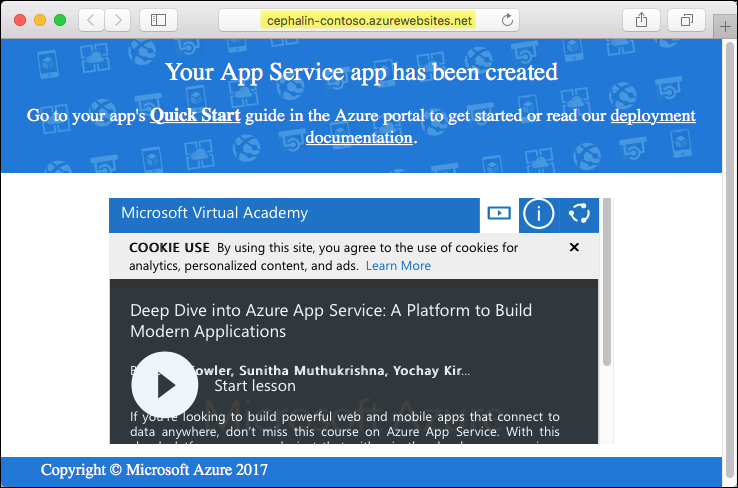
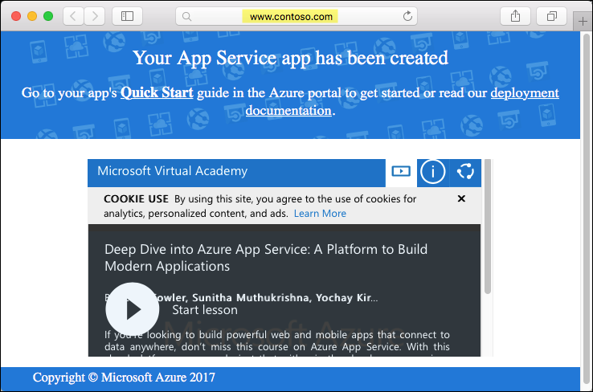
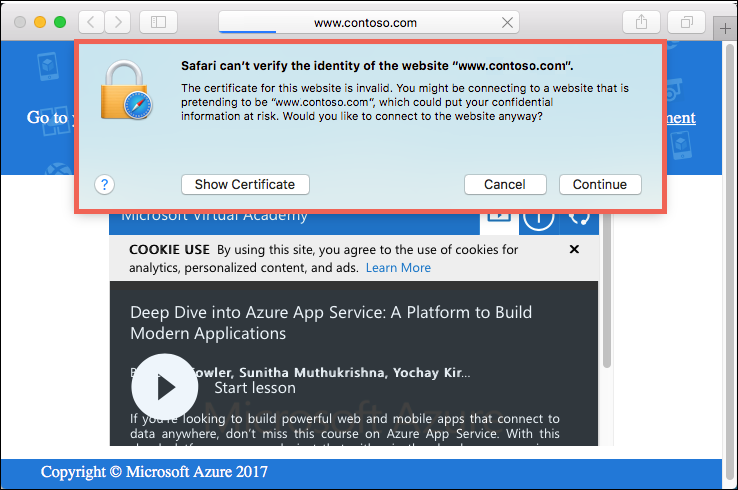
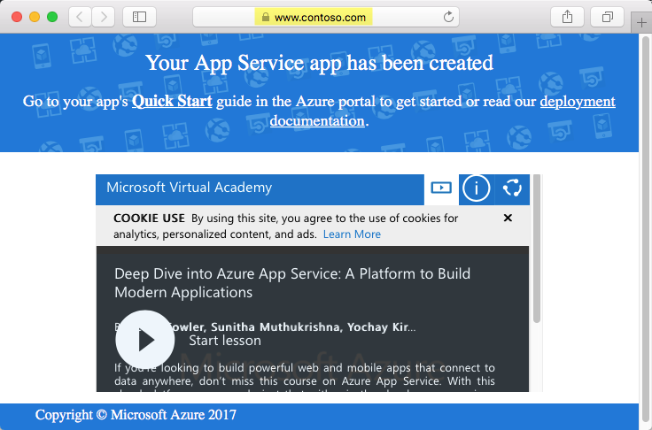

# Add custom domain and SSL to an Azure web app

This tutorial shows you how to quickly map a custom domain name to your Azure web app and then secure it with a custom SSL certificate. 

## Before you begin

Before running this sample, install the [Azure CLI 2.0](https://docs.microsoft.com/en-us/cli/azure/install-azure-cli) locally.

You also need administrative access to the DNS configuration page for your respective domain provider. For example, to add `www.contoso.com`, you need to be able to configure DNS entries for `contoso.com`.

Lastly, you need a valid .PFX file _and_ its password for the SSL certificate you want to upload and bind. This SSL certificate should be configured to secure the custom domain name you want. In the above example, your SSL certificate should secure `www.contoso.com`. 

## Step 1 - Create an Azure web app

### Log in to Azure

We are now going to use the Azure CLI 2.0 in a terminal window to create the resources needed to host our Node.js app in Azure.  Log in to your Azure subscription with the [az login](/cli/azure/#login) command and follow the on-screen directions. 

```azurecli 
az login 
``` 
   
### Create a resource group   
Create a resource group with the [az group create](/cli/azure/group#create). An Azure resource group is a logical container into which Azure resources like web apps, databases and storage accounts are deployed and managed. 

```azurecli
az group create --name myResourceGroup --location westeurope 
```

To see what possible values you can use for `---location`, use the `az appservice list-locations` Azure CLI command.

## Create an App Service plan

Create an App Service plan with the [az appservice plan create](/cli/azure/appservice/plan#create) command. 

[!INCLUDE [app-service-plan](../../includes/app-service-plan.md)]

The following example creates an App Service plan named `myAppServicePlan` using the **Basic** pricing tier.

az appservice plan create --name myAppServicePlan --resource-group myResourceGroup --sku B1

When the App Service plan has been created, the Azure CLI shows information similar to the following example. 

```json 
{ 
    "id": "/subscriptions/00000000-0000-0000-0000-000000000000/resourceGroups/myResourceGroup/providers/Microsoft.Web/serverfarms/myAppServicePlan", 
    "kind": "app", 
    "location": "West Europe", 
    "sku": { 
    "capacity": 1, 
    "family": "B", 
    "name": "B1", 
    "tier": "Basic" 
    }, 
    "status": "Ready", 
    "type": "Microsoft.Web/serverfarms" 
} 
``` 

## Create a web app

Now that an App Service plan has been created, create a web app within the `myAppServicePlan` App Service plan. The web app gives your a hosting space to deploy your code as well as provides a URL for you to view the deployed application. Use the [az appservice web create](/cli/azure/appservice/web#create) command to create the web app. 

In the command below, please substitute your own unique app name where you see the `<app_name>` placeholder. This unique name will be used as the part of the default domain name for the web app, so the name needs to be unique across all apps in Azure. You can later map any custom DNS entry to the web app before you expose it to your users. 

```azurecli
az appservice web create --name <app_name> --resource-group myResourceGroup --plan myAppServicePlan 
```

When the web app has been created, the Azure CLI shows information similar to the following example. 

```json 
{ 
    "clientAffinityEnabled": true, 
    "defaultHostName": "<app_name>.azurewebsites.net", 
    "id": "/subscriptions/00000000-0000-0000-0000-000000000000/resourceGroups/myResourceGroup/providers/Microsoft.Web/sites/<app_name>", 
    "isDefaultContainer": null, 
    "kind": "app", 
    "location": "West Europe", 
    "name": "<app_name>", 
    "repositorySiteName": "<app_name>", 
    "reserved": true, 
    "resourceGroup": "myResourceGroup", 
    "serverFarmId": "/subscriptions/00000000-0000-0000-0000-000000000000/resourceGroups/myResourceGroup/providers/Microsoft.Web/serverfarms/myAppServicePlan", 
    "state": "Running", 
    "type": "Microsoft.Web/sites", 
} 
```

From the JSON output, `defaultHostName` shows your web app's default domain name. In your browser, navigate to this address.

```
http://<app_name>.azurewebsites.net 
``` 
 
  

## Step 2 - Configure DNS mapping

In this step, you add a mapping from a custom domain to your web app's default domain name, `<app_name>.azurewebsites.net`. Typically, you perform this step in your domain provider's website. Every domain registrar's website is slightly different, so you should consult your provider's documentation. However, here are some general guidelines. 

### Navigate to to DNS management page

First, log in to your domain registrar's website.  

Then, find the page for managing DNS records. Look for links or areas of the site labeled **Domain Name**, **DNS**, or **Name Server Management**. Often, you can find the link by viewing your account information, and then looking for a link such as **My domains**.

Once you find this page, look for a link that lets you add or edit DNS records. This might be a **Zone file** or **DNS Records** link, or an **Advanced configuration** link.

### Create a CNAME record

Add a CNAME record that maps the desired subdomain name to your web app's default domain name (`<app_name>.azurewebsites.net`, where `<app_name>` is your app's unique name).

For the `www.contoso.com` example, you create a CNAME that maps the `www` hostname to `<app_name>.azurewebsites.net`.

## Step 3 - Configure the custom domain on your web app

When you finish configuring the hostname mapping in your domain provider's website, you're ready to configure the custom domain on your web app. Use the [az appservice web config hostname add](/cli/azure/appservice/web/config/hostname#add) command to add this configuration. 

In the command below, please substitute `<app_name>` with your unique app name, and <your_custom_domain> with the fully qualified custom domain name (e.g. `www.contoso.com`). 

```azurecli
az appservice web config hostname add --webapp <app_name> --resource-group myResourceGroup --name <your_custom_domain>
```

The custom domain now is fully mapped to your web app. In your browser, navigate to the custom domain name. For example:

```
http://www.contoso.com 
``` 

  

## Step 4 - Bind a custom SSL certificate to your web app

You now have an Azure web app, with the domain name you want in the browser's address bar. However, if you navigate to the `https://<your_custom_domain>` now, you get a certificate error. 

  

This error occurs because your web app doesn't yet have an SSL certificate binding that matches your custom domain name. However, you don't get an error if you navigate to `https://<app_name>.azurewebsites.net`. This is because your app, as well as all Azure App Service apps, is secured with the SSL certificate for the `*.azurewebsites.net` wildcard domain by default. 

In order to access your web app by your custom domain name, you need to bind the SSL certificate for your custom domain to the web app. You will do it in this step. 

### Upload the SSL certificate

Upload the SSL certificate for your custom domain to your web app by using the [az appservice web config ssl upload](/cli/azure/appservice/web/config/ssl#upload) command.

In the command below, please substitute `<app_name>` with your unique app name, `<path_to_ptx_file>` with the path to your .PFX file, and `<password>` with your certificate's password. 

```azurecli
az appservice web config ssl upload --name <app_name> --resource-group myResourceGroup --certificate-file <path_to_pfx_file> --certificate-password <password> 
```

When the certificate is uploaded, the Azure CLI shows information similar to the following example:

```json
{
  "cerBlob": null,
  "expirationDate": "2018-03-29T14:12:57+00:00",
  "friendlyName": "",
  "hostNames": [
    "www.contoso.com"
  ],
  "hostingEnvironmentProfile": null,
  "id": "/subscriptions/00000000-0000-0000-0000-000000000000/resourceGroups/myResourceGroup/providers/Microsoft.Web/cert
ificates/9FD1D2D06E2293673E2A8D1CA484A092BD016D00__West Europe_myResourceGroup",
  "issueDate": "2017-03-29T14:12:57+00:00",
  "issuer": "www.contoso.com",
  "keyVaultId": null,
  "keyVaultSecretName": null,
  "keyVaultSecretStatus": "Initialized",
  "kind": null,
  "location": "West Europe",
  "name": "9FD1D2D06E2293673E2A8D1CA484A092BD016D00__West Europe_myResourceGroup",
  "password": null,
 "pfxBlob": null,
  "publicKeyHash": null,
  "resourceGroup": "myResourceGroup",
  "selfLink": null,
  "serverFarmId": null,
  "siteName": null,
  "subjectName": "www.contoso.com",
  "tags": null,
  "thumbprint": "9FD1D2D06E2293673E2A8D1CA484A092BD016D00",
  "type": "Microsoft.Web/certificates",
  "valid": null
}
```

From the JSON output, `thumbprint` shows your uploaded certificate's thumbprint. Copy its value for the next step.

### Bind the uploaded SSL certificate to the web app

Your web app now has the custom domain name you want, and it also has a SSL certificate that secures that custom domain. The only thing left to do is to bind the uploaded certificate to the web app. You do this by using the [az appservice web config ssl bind](/cli/azure/appservice/web/config/ssl#bind) command.

In the command below, please substitute `<app_name>` with your unique app name and `<thumbprint-from-previous-output>` with the certificate thumbprint that you get from the previous command. 

az appservice web config ssl bind --name <app_name> --resource-group myResourceGroup --certificate-thumbprint <thumbprint-from-previous-output> --ssl-type SNI

When the certificate is bound to your web app, the Azure CLI shows information similar to the following example:

{
  "availabilityState": "Normal",
  "clientAffinityEnabled": true,
  "clientCertEnabled": false,
  "cloningInfo": null,
  "containerSize": 0,
  "dailyMemoryTimeQuota": 0,
  "defaultHostName": "<app_name>.azurewebsites.net",
  "enabled": true,
  "enabledHostNames": [
    "www.contoso.com",
    "<app_name>.azurewebsites.net",
    "<app_name>.scm.azurewebsites.net"
  ],
  "gatewaySiteName": null,
  "hostNameSslStates": [
    {
      "hostType": "Standard",
      "name": "<app_name>.azurewebsites.net",
      "sslState": "Disabled",
      "thumbprint": null,
      "toUpdate": null,
      "virtualIp": null
    },
    {
      "hostType": "Repository",
      "name": "<app_name>.scm.azurewebsites.net",
      "sslState": "Disabled",
      "thumbprint": null,
      "toUpdate": null,
      "virtualIp": null
    },
    {
      "hostType": "Standard",
      "name": "www.contoso.com",
      "sslState": "SniEnabled",
      "thumbprint": "9FD1D2D06E2293673E2A8D1CA484A092BD016D00",
      "toUpdate": null,
      "virtualIp": null
    }
  ],
  "hostNames": [
    "www.contoso.com",
    "<app_name>.azurewebsites.net"
  ],
  "hostNamesDisabled": false,
  "hostingEnvironmentProfile": null,
  "id": "/subscriptions/00000000-0000-0000-0000-000000000000/resourceGroups/myResourceGroup/providers/Microsoft.Web/site
s/<app_name>",
  "isDefaultContainer": null,
  "kind": "WebApp",
  "lastModifiedTimeUtc": "2017-03-29T14:36:18.803333",
  "location": "West Europe",
  "maxNumberOfWorkers": null,
  "microService": "false",
  "name": "<app_name>",
  "outboundIpAddresses": "13.94.143.57,13.94.136.57,40.68.199.146,13.94.138.55,13.94.140.1",
  "premiumAppDeployed": null,
  "repositorySiteName": "<app_name>",
  "reserved": false,
  "resourceGroup": "myResourceGroup",
  "scmSiteAlsoStopped": false,
  "serverFarmId": "/subscriptions/00000000-0000-0000-0000-000000000000/resourceGroups/myResourceGroup/providers/Microsof
t.Web/serverfarms/myAppServicePlan",
  "siteConfig": null,
  "slotSwapStatus": null,
  "state": "Running",
  "suspendedTill": null,
  "tags": null,
  "targetSwapSlot": null,
  "trafficManagerHostNames": null,
  "type": "Microsoft.Web/sites",
  "usageState": "Normal"
}

In your browser, navigate to HTTPS endpoint of your custom domain name. For example:

```
https://www.contoso.com 
``` 

  

## More resources

[Buy and Configure a custom domain name in Azure App Service](custom-dns-web-site-buydomains-web-app.md)
[Buy and Configure an SSL Certificate for your Azure App Service](web-sites-purchase-ssl-web-site.md)
