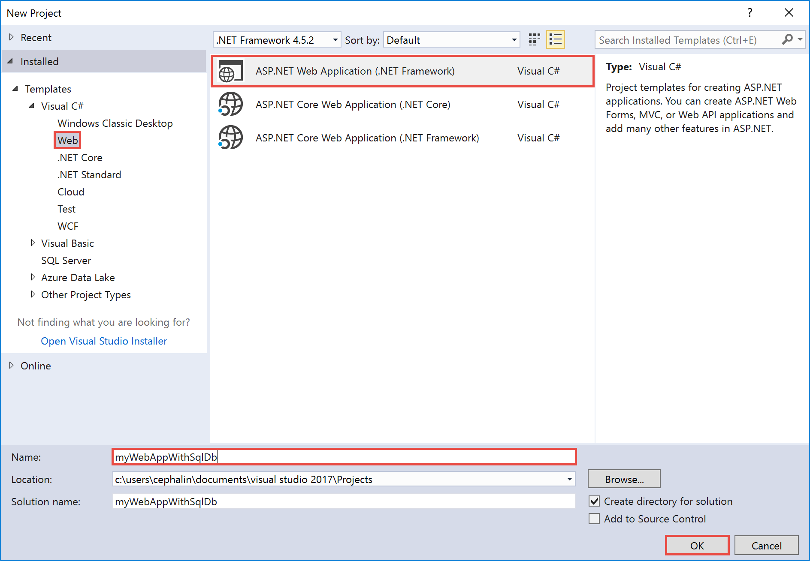
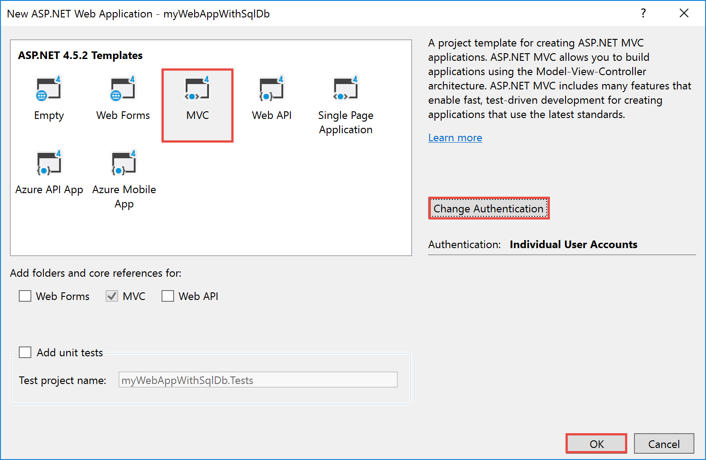
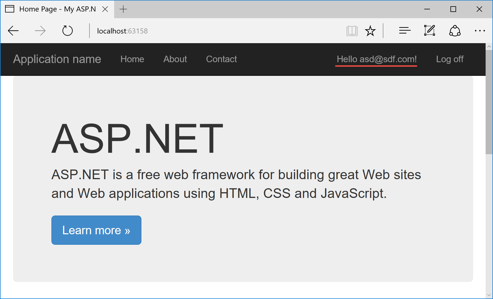

# Create a data-driven ASP.NET app with Azure with SQL Database

This tutorial shows you how to get started in developing a data-driven ASP.NET web app in [Azure App Service](../app-service/app-service-value-prop-what-is.md). Connect your web app to Azure SQL Database in just a few minutes, and enable your data-driven functionality with minimal configuration.

This tutorial uses the ASP.NET template with **Individual User Accounts**. This template uses [ASP.NET Entity Framework](https://docs.microsoft.com/aspnet/entity-framework) to manage user profiles in the web application. 

## Before you begin

This tutorial demonstrates how to use Visual Studio 2017 to build and deploy an ASP.NET web app to Azure. If you don’t already have Visual Studio 2017 installed, you can download and use the free [Visual Studio 2017 Community Edition](https://www.visualstudio.com/downloads/). Make sure that you enable **Azure development** during the Visual Studio setup.

## Create an ASP.NET web app

In Visual Studio, create a new project with `Ctrl`+`Shift`+`N`.

In the **New Project** dialog, click **Visual C# > Web > ASP.NET Web Application (.NET Framework)**.

Name the application **myWebAppWithSqlDb**, and then click **OK**.
   

Select the **MVC** template. Then, change authentication to Individual User Accounts by clicking **Change Authentication > Individual User Accounts > OK**.

Click **OK**.

Once the project is created, the project overview page is opened. 

## Test data-driven functionality

Type `F5` to run the web app in the browser.

In the homepage, click **Register** and follow the on-page instructions to register a dummy user.

Once registered, you should see **Hello &lt;user_name>!** in place of **Register**. This change indicates that database connectivity is working in ASP.NET Entity Framework.

Your app is only connected to the [LocalDB](https://docs.microsoft.com/sql/database-engine/configure-windows/sql-server-2016-express-localdb) instance on your machine. Visual Studio will help you create the SQL Database in Azure as well as connect your Azure web app to it in the same integrated wizard.

## Publish to Azure

In the **Solution Explorer**, right-click your **myWebAppWithSqlDb** project and select **Publish**.

Make sure that **Microsoft Azure App Service** is selected and click **Publish**.

This opens the **Create App Service** dialog, which helps you create all the Azure resources you need to run your ASP.NET web app in Azure.

## Sign in to Azure

In the **Create App Service** dialog, click **Add an account**, and then sign in to your Azure subscription. If you're already signed into a Microsoft account, make sure that account holds your Azure subscription. If the signed-in Microsoft account doesn't have your Azure subscription, click it to add the correct account.
   

Once signed in, you're ready to create all the resources you need for your Azure web app in this dialog.

## Create a resource group

First, you need a _resource group_. 

> [!NOTE] 
> A resource group is a logical container into which Azure resources like web apps, databases and storage accounts are deployed and managed.
>
>

Next to **Resource Group**, click **New**.

Name your resource group **myResourceGroup** and click **OK**.

## Create an App Service plan

Your Azure web app also needs an _App Service plan_. 

> [!NOTE]
> An App Service plan represents the collection of physical resources used to host your apps. All apps assigned to an App Service plan share the resources defined by it, which enables you to save cost when hosting multiple apps. 
>
> App Service plans define:
>
> - Region (North Europe, East US, Southeast Asia)
> - Instance Size (Small, Medium, Large)
> - Scale Count (one, two or three instances, etc.) 
> - SKU (Free, Shared, Basic, Standard, Premium)
>
>

Next to **App Service Plan**, click **New**. 

In the **Configure App Service Plan** dialog, configure the new App Service plan with the following settings:

- **App Service Plan**: Type **myAppServicePlan**. 
- **Location**: Choose **West Europe**, or any other region you like.
- **Size**: Choose **Free**, or any other [pricing tier](https://azure.microsoft.com/pricing/details/app-service/) you like.

Click **OK**.

## Configure a SQL Database

Click **Explore additional Azure services**.

In the **Services** tab, click the **+** sign next to **SQL Database**. 

In the **Configure SQL Database** dialog, click **New** for a new database server. Configure this database server and click **OK**.

The rest of the dialog is now automatically filled. You can accept the default values. 

> [!NOTE]
> **Connection String Name** is set to **DefaultConnection** by default, which is the default connection string name for your ASP.NET application. You can find this connection string name in `Web.config`. 
>
> The value in **Connection String Name** allows the Azure .NET SDK to create a connection string specific to your Azure SQL Database in the Azure web app. When deployed to Azure, your ASP.NET application knows to use this SQL Database connection string instead of the one configured in `Web.config`. However, if the DbContext in your code uses a different connection string name, you should change this value in the dialog accordingly. 
>
>

## Create and publish the web app

Click **Create**. 

Once the wizard finishes creating the Azure resources, it automatically publishes your ASP.NET application to Azure for the first time, and then launches the published Azure web app in your default browser.

Congratulations, your first ASP.NET web app is running live in Azure App Service.

## Next steps

Explore pre-created [Web apps PowerShell scripts](app-service-powershell-samples.md).