# Build an ASP.NET app in Azure with SQL Database

[Azure Web Apps](https://docs.microsoft.com/azure/app-service-web/app-service-web-overview) provides a highly scalable, self-patching web hosting service. This tutorial shows you how to deploy a data-driven ASP.NET web app in Azure and connect it to [Azure SQL Database](../sql-database/sql-database-technical-overview.md). When you're finished, you have a ASP.NET app running in [Azure App Service](../app-service/app-service-value-prop-what-is.md) and connected to SQL Database.

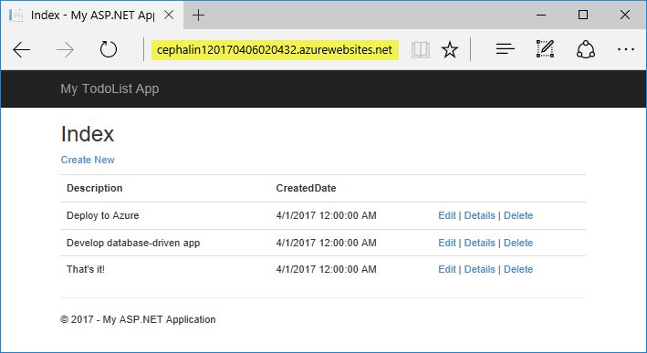

In this tutorial, you learn how to:

> [!div class="checklist"]
> * Create a SQL Database in Azure
> * Connect an ASP.NET app to SQL Database
> * Deploy the app to Azure
> * Update the data model and redeploy the app
> * Stream logs from Azure to your terminal
> * Manage the app in the Azure portal

## Prerequisites

To complete this tutorial:

* Install [Visual Studio 2017](https://www.visualstudio.com/en-us/visual-studio-homepage-vs.aspx) with the following workloads:
  - **ASP.NET and web development**
  - **Azure development**

  

[!INCLUDE [quickstarts-free-trial-note](../../includes/quickstarts-free-trial-note.md)]

## Download the sample

[Download the sample project](https://github.com/Azure-Samples/dotnet-sqldb-tutorial/archive/master.zip).

Extract (unzip) the  *dotnet-sqldb-tutorial-master.zip* file.

The sample project contains a basic [ASP.NET MVC](https://www.asp.net/mvc) CRUD (create-read-update-delete) app using [Entity Framework Code First](/aspnet/mvc/overview/getting-started/getting-started-with-ef-using-mvc/creating-an-entity-framework-data-model-for-an-asp-net-mvc-application).

### Run the app

Open the *dotnet-sqldb-tutorial-master/DotNetAppSqlDb.sln* file in Visual Studio. 

Type `Ctrl+F5` to run the app without debugging. The app is displayed in your default browser. Select the **Create New** link and create a couple *to-do* items. 

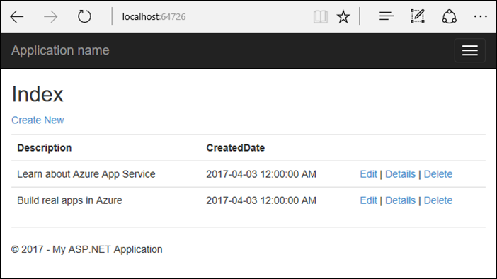

Test the **Edit**, **Details**, and **Delete** links.

The app uses a database context to connect with the database. In this sample, the database context uses a connection string named `MyDbConnection`. The connection string is set in the *Web.config* file and referenced in the *Models/MyDatabaseContext.cs* file. The connection string name is used later in the tutorial to connect the Azure web app to an Azure SQL Database. 

## Publish to Azure with SQL Database

In the **Solution Explorer**, right-click your **DotNetAppSqlDb** project and select **Publish**.

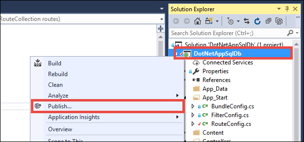

Make sure that **Microsoft Azure App Service** is selected and click **Publish**.

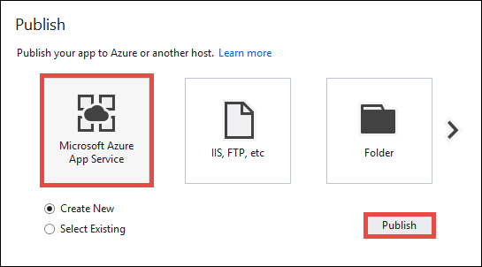

Publishing opens the **Create App Service** dialog, which helps you create all the Azure resources you need to run your ASP.NET web app in Azure.

### Sign in to Azure

In the **Create App Service** dialog, click **Add an account**, and then sign in to your Azure subscription. If you're already signed into a Microsoft account, make sure that account holds your Azure subscription. If the signed-in Microsoft account doesn't have your Azure subscription, click it to add the correct account.
   
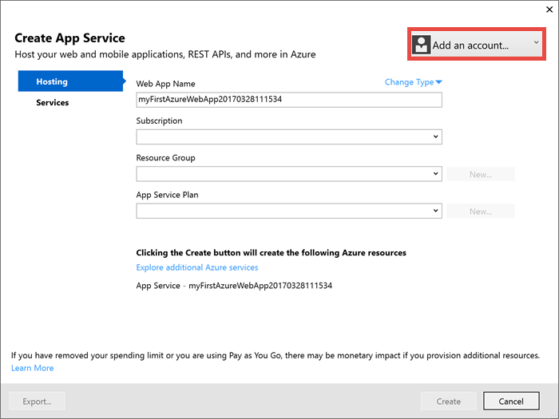

Once signed in, you're ready to create all the resources you need for your Azure web app in this dialog.

### Configure the web app name

You can keep the generated web app name, or change it to another unique name. The web app name is used as part of the default URL for your app (`<app_name>.azurewebsites.net`). The web app name needs to be unique across all apps in Azure. 

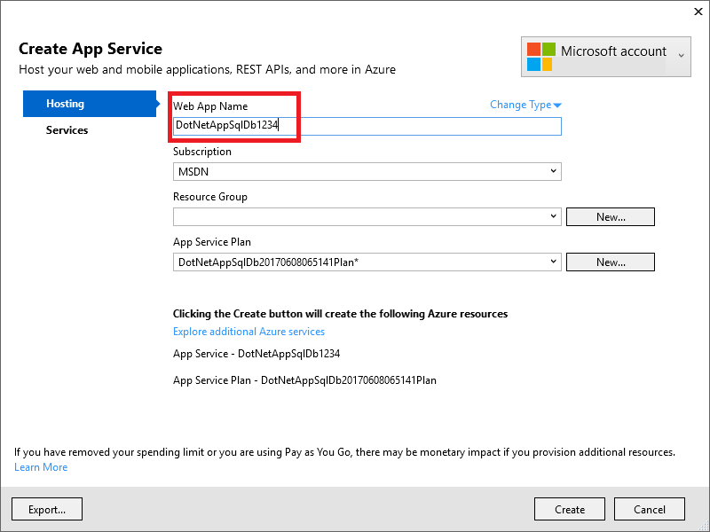

### Create a resource group

[!INCLUDE [resource-group](../../includes/resource-group.md)]

Next to **Resource Group**, click **New**.


Name the resource group **myResourceGroup**.

> [!NOTE]
> Do not click **Create**. You first need to set up a SQL Database in a later step.

### Create an App Service plan

[!INCLUDE [app-service-plan](../../includes/app-service-plan.md)]

Next to **App Service Plan**, click **New**. 

In the **Configure App Service Plan** dialog, configure the new App Service plan with the following settings:

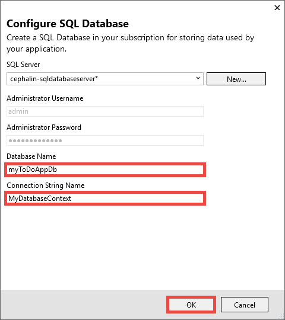

| Setting  | Value | For more information |
| ----------------- | ------------ | ----|
|**App Service Plan**| myAppServicePlan | [App Service plans](../app-service/azure-web-sites-web-hosting-plans-in-depth-overview.md) |
|**Location**| West Europe | [Azure regions](https://azure.microsoft.com/regions/) |
|**Size**| Free | [Pricing tiers](https://azure.microsoft.com/pricing/details/app-service/)|

### Create a SQL Server instance

Select **Explore additional Azure services**.

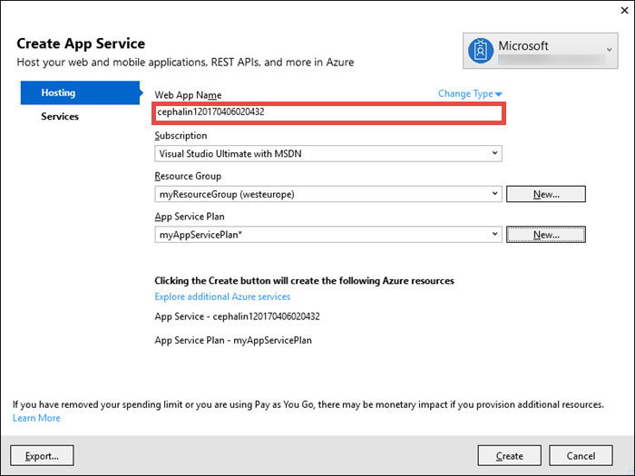

In the **Services** tab, click the **+** icon next to **SQL Database**. 


In the **Configure SQL Database** dialog, click **New** next to **SQL Server**. 

A unique server name is generated. This name is used as part of the default URL for your database server, `<server_name>.database.windows.net`. It must be unique across all SQL Server instances in Azure. You can change the server name, but for this tutorial, keep the generated value.

Add an administrator username and password, and then select **OK**.

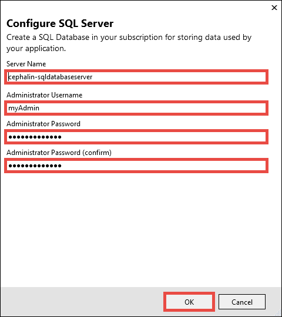

The **Configure SQL Database** dialog is displayed: 

* Keep the default generated **Database Name**.
* In **Connection String Name**, type *MyDbConnection*. This name must match the connection string that is referenced in *Models/MyDatabaseContext.cs*.
* Select **OK**.


The **Create App Service** dialog shows the resources you've created. Click **Create**. 


Once the wizard finishes creating the Azure resources, it  publishes your ASP.NET app to Azure. Your default browser is launched with the URL to the deployed app. 

Add a few to-do items.


Congratulations! Your data-driven ASP.NET application is running live in Azure App Service.

## Access the SQL Database locally

Visual Studio lets you explore and manage your new SQL Database easily in the **SQL Server Object Explorer**.

### Create a database connection

From the **View** menu, select **SQL Server Object Explorer**.

At the top of **SQL Server Object Explorer**, click the **Add SQL Server** button.

### Configure the database connection

In the **Connect** dialog, expand the **Azure** node. All your SQL Database instances in Azure are listed here.

Select the `DotNetAppSqlDb` SQL Database. The connection you created earlier is automatically filled at the bottom.

Type the database administrator password you created earlier and click **Connect**.

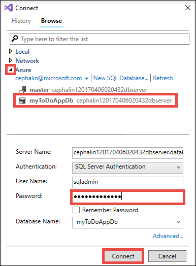

### Allow client connection from your computer

The **Create a new firewall rule** dialog is opened. By default, your SQL Database instance only allows connections from Azure services, such as your Azure web app. To connect to your database, create a firewall rule in the SQL Database instance. The firewall rule allows the public IP address of your local computer.

The dialog is already filled with your computer's public IP address.

Make sure that **Add my client IP** is selected and click **OK**. 

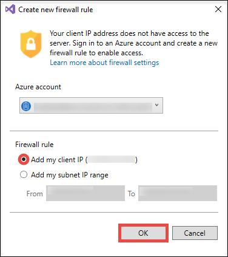

Once Visual Studio finishes creating the firewall setting for your SQL Database instance, your connection shows up in **SQL Server Object Explorer**.

Here, you can perform the most common database operations, such as run queries, create views and stored procedures, and more. 

Right-click on the `Todoes` table and select **View Data**. 

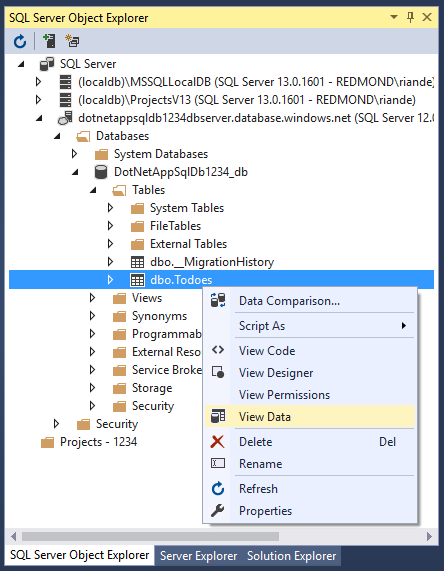

## Update app with Code First Migrations

In this step, you use Code First Migrations in Entity Framework to make a change to your database schema and publish it to Azure.

### Update your data model

Open _Models\Todo.cs_ in the code editor. Add the following property to the `ToDo` class:

```csharp
public bool Done { get; set; }
```

### Run Code First Migrations locally

Run a few commands to make updates to your local database. 

From the **Tools** menu, click **NuGet Package Manager** > **Package Manager Console**.

Enable Code First Migrations:

```PowerShell
Enable-Migrations
```

Add a migration:

```PowerShell
Add-Migration AddProperty
```

Update the local database:

```PowerShell
Update-Database
```

Type `Ctrl+F5` to run the app. Test the edit, details, and create links.

If the application loads without errors, then Code First Migrations has succeeded. However, your page still looks the same because your application logic is not using this new property yet. 

### Use the new property

Make some changes in your code to use the `Done` property. For simplicity in this tutorial, you're only going to change the `Index` and `Create` views to see the property in action.

Open _Controllers\TodosController.cs_.

Find the `Create()` method and add `Done` to the list of properties in the `Bind` attribute. When you're done, your `Create()` method signature looks like the following code:

```csharp
public ActionResult Create([Bind(Include = "id,Description,CreatedDate,Done")] Todo todo)
```

Open _Views\Todos\Create.cshtml_.

In the Razor code, you should see a `<div class="form-group">` element that uses `model.Description`, and then another `<div class="form-group">` element that uses `model.CreatedDate`. Immediately following these two elements, add another `<div class="form-group">` element that uses `model.Done`:

```csharp
<div class="form-group">
    @Html.LabelFor(model => model.Done, htmlAttributes: new { @class = "control-label col-md-2" })
    <div class="col-md-10">
        <div class="checkbox">
            @Html.EditorFor(model => model.Done)
            @Html.ValidationMessageFor(model => model.Done, "", new { @class = "text-danger" })
        </div>
    </div>
</div>
```

Open _Views\Todos\Index.cshtml_.

Search for the empty `<th></th>` element. Just above this element, add the following Razor code:

```csharp
<th>
    @Html.DisplayNameFor(model => model.Done)
</th>
```

Find the `<td>` element that contains the `Html.ActionLink()` helper methods. Just above this element, add the following Razor code:

```csharp
<td>
    @Html.DisplayFor(modelItem => item.Done)
</td>
```

That's all you need to see the changes in the `Index` and `Create` views. 

Type `Ctrl+F5` to run the app.

You can now add a to-do item and check **Done**. Then it should show up in your homepage as a completed item. Remember that the `Edit` view doesn't show the `Done` field, because you didn't change the `Edit` view.

### Enable Code First Migrations in Azure

Now that your code change works, including database migration, you publish it to your Azure web app and update your SQL Database with Code First Migrations too.

Just like before, right-click your project and select **Publish**.

Click **Settings** to open the publish wizard.

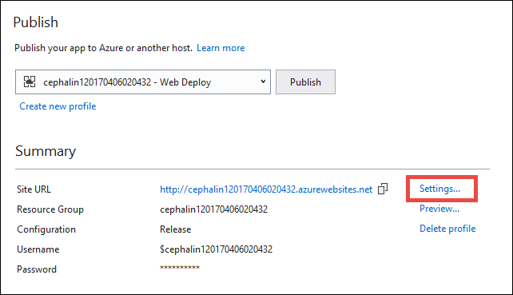

In the wizard, click **Next**.

Make sure that the connection string for your SQL Database is populated in **MyDatabaseContext (MyDbConnection)**. You may need to select the **myToDoAppDb** database from the dropdown. 

Select **Execute Code First Migrations (runs on application start)**, then click **Save**.

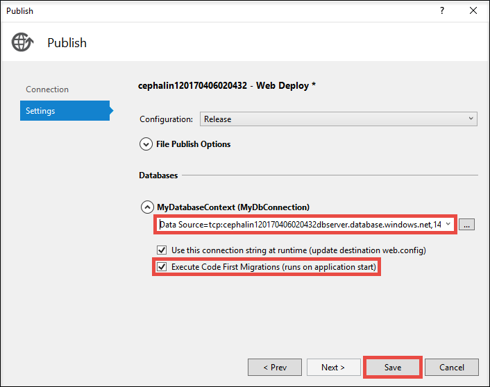

### Publish your changes

Now that you enabled Code First Migrations in your Azure web app, publish your code changes.

In the publish page, click **Publish**.

Try adding to-do items again and select **Done**, and they should show up in your homepage as a completed item.

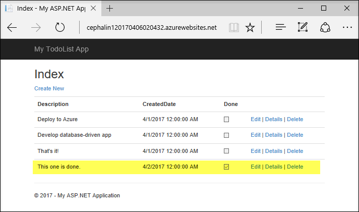

All your existing to-do items are still displayed. When you republish your ASP.NET application, existing data in your SQL Database is not lost. Also, Code First Migrations only changes the data schema and leaves your existing data intact.


## Stream application logs

You can stream tracing messages directly from your Azure web app to Visual Studio.

Open _Controllers\TodosController.cs_.

Each action starts with a `Trace.WriteLine()` method. This code is added to show you how to add trace messages to your Azure web app.

### Open Server Explorer

From the **View** menu, select **Server Explorer**. You can configure logging for your Azure web app in **Server Explorer**. 

### Enable log streaming

In **Server Explorer**, expand **Azure** > **App Service**.

Expand the **myResourceGroup** resource group, you created when you first created the Azure web app.

Right-click your Azure web app and select **View Streaming Logs**.

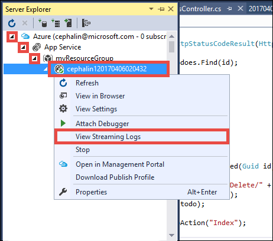

The logs are now streamed into the **Output** window. 


However, you don't see any of the trace messages yet. That's because when you first select **View Streaming Logs**, your Azure web app sets the trace level to `Error`, which only logs error events (with the `Trace.TraceError()` method).

### Change trace levels

To change the trace levels to output other trace messages, go back to **Server Explorer**.

Right-click your Azure web app again and select **Settings**.

In the **Application Logging (File System)** dropdown, select **Verbose**. Click **Save**.

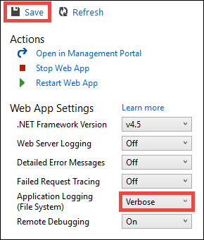

> [!TIP]
> You can experiment with different trace levels to see what types of messages are displayed for each level. For example, the **Information** level includes all logs created by `Trace.TraceInformation()`, `Trace.TraceWarning()`, and `Trace.TraceError()`, but not logs created by `Trace.WriteLine()`.
>
>

In your browser, try clicking around the to-do list application in Azure. The trace messages are now streamed to the **Output** window in Visual Studio.

```
Application: 2017-04-06T23:30:41  PID[8132] Verbose     GET /Todos/Index
Application: 2017-04-06T23:30:43  PID[8132] Verbose     GET /Todos/Create
Application: 2017-04-06T23:30:53  PID[8132] Verbose     POST /Todos/Create
Application: 2017-04-06T23:30:54  PID[8132] Verbose     GET /Todos/Index
```


### Stop log streaming

To stop the log-streaming service, click the **Stop monitoring** button in the **Output** window.

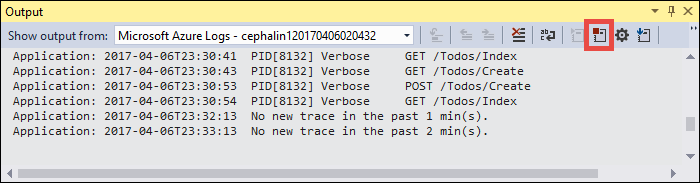

## Manage your Azure web app

Go to the [Azure portal](https://portal.azure.com) to see the web app you created. 


From the left menu, click **App Service**, then click the name of your Azure web app.


You have landed in your web app's page. 

By default, the portal shows the **Overview** page. This page gives you a view of how your app is doing. Here, you can also perform basic management tasks like browse, stop, start, restart, and delete. The tabs on the left side of the page show the different configuration pages you can open. 

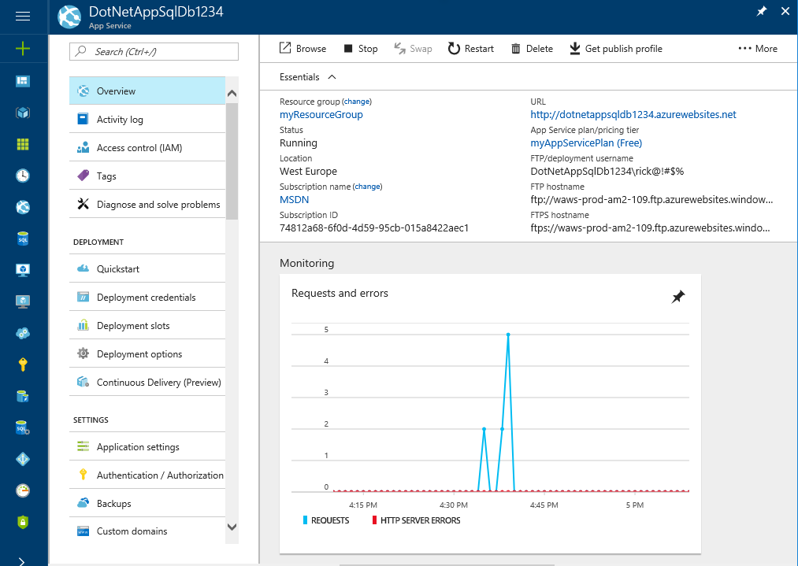

[!INCLUDE [Clean up section](../../includes/clean-up-section-portal-web-app.md)]

<a name="next"></a>

## Next steps

In this tutorial, you learned how to:

> [!div class="checklist"]
> * Create a SQL Database in Azure
> * Connect an ASP.NET app to SQL Database
> * Deploy the app to Azure
> * Update the data model and redeploy the app
> * Stream logs from Azure to your terminal
> * Manage the app in the Azure portal

Advance to the next tutorial to learn how to map a custom DNS name to the web app.

> [!div class="nextstepaction"]
> [Map an existing custom DNS name to Azure Web Apps](app-service-web-tutorial-custom-domain.md)
