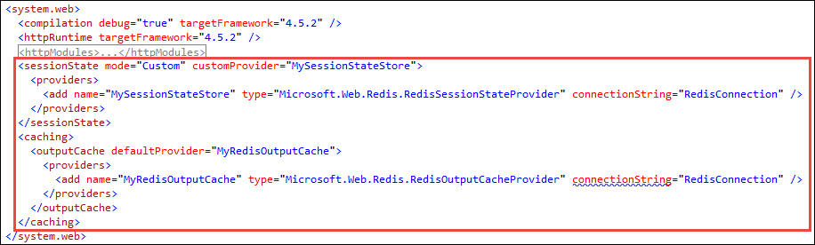

# Build a hyper-scale web app in Azure

This tutorial shows you how to scale out an ASP.NET web app in Azure to maximize user requests.

Before starting this tutorial, ensure that [the Azure CLI is installed](https://docs.microsoft.com/en-us/cli/azure/install-azure-cli) on your machine. In addition, you need [Visual Studio](https://www.visualstudio.com/vs/) on your local machine to run the sample application.

## Step 1 - Get sample application
In this step, you set up the local ASP.NET project.

### Clone the application repository

Open the command-line terminal of your choice and `CD` to a working directory. Then, run the following commands to clone the sample application. 

```powershell
git clone https://github.com/cephalin/HighScaleApp.git
```

### Run the sample application in Visual Studio

Open the solution in Visual Studio.

```powershell
cd HighScaleApp
.\HighScaleApp.sln
```

Type `F5` to run the application.

This sample ASP.NET web application comes from the default template, and persists user sessions and uses the output cache. Take a look at `HighScaleApp\Controllers\HomeController.cs`. The `Index()` method adds a piece of data to the session.

```csharp
Session.Add("visited", "true"); 
```

And the `About()` and `Contact()` methods cache their output.

```csharp
[OutputCache(Duration = 60)]
```

## Step 2 - Deploy to Azure
In this step, you create an Azure web app and deploy your sample ASP.NET application to it.

### Create a resource group   
Use [az group create](https://docs.microsoft.com/cli/azure/group#az_group_create) to create a [resource group](../azure-resource-manager/resource-group-overview.md) in the West Europe region. A resource group is where you put all the Azure resources that you want to manage together, such as the web app and any SQL Database back end.

```azurecli
az group create --location "West Europe" --name myResourceGroup
```

To see what possible values you can use for `---location`, use the [az appservice list-locations](https://docs.microsoft.com/en-us/cli/azure/appservice#az_appservice_list_locations) command.

### Create an App Service plan
Use [az appservice plan create](https://docs.microsoft.com/en-us/cli/azure/appservice/plan#az_appservice_plan_create) to create a "B1" [App Service plan](../app-service/azure-web-sites-web-hosting-plans-in-depth-overview.md). 

```azurecli
az appservice plan create --name myAppServicePlan --resource-group myResourceGroup --sku B1
```

An App Service plan is a scale unit, which can include any number of apps that you want to scale up or out together over the same App Service infrastructure. Each plan is also assigned a [pricing tier](https://azure.microsoft.com/en-us/pricing/details/app-service/). Higher tiers include better hardware and more features, such as more scale-out instances.

For this tutorial, B1 is the minimum tier that enables scale out to three instances. You can always move your app up or down the pricing tier later by running [az appservice plan update](https://docs.microsoft.com/cli/azure/appservice/plan#az_appservice_plan_update). 

### Create a web app
Use [az appservice web create](https://docs.microsoft.com/en-us/cli/azure/appservice/web#az_appservice_web_create) to create a web app with a unique name in `$appName`.

```azurecli
$appName = "<replace-with-a-unique-name>"
az appservice web create --name $appName --resource-group myResourceGroup --plan myAppServicePlan
```

### Set deployment credentials
Use [az appservice web deployment user set](https://docs.microsoft.com/en-us/cli/azure/appservice/web/deployment/user#az_appservice_web_deployment_user_set) to set your account-level deployment credentials for App Service.

```azurecli
az appservice web deployment user set --user-name <letters-numbers> --password <mininum-8-char-captital-lowercase-letters-numbers>
```

### Configure Git deployment
Use [az appservice web source-control config-local-git](https://docs.microsoft.com/en-us/cli/azure/appservice/web/source-control#az_appservice_web_source_control_config_local_git) to configure local Git deployment.

```azurecli
az appservice web source-control config-local-git --name $appName --resource-group myResourceGroup
```

This command gives you an output that looks like the following:

```json
{
  "url": "https://user123@myuniqueappname.scm.azurewebsites.net/myuniqueappname.git"
}
```

Use the returned URL to configure your Git remote. The following command uses the preceding output example.

```powershell
git remote add azure https://user123@myuniqueappname.scm.azurewebsites.net/myuniqueappname.git
```

### Deploy the sample application
You are now ready to deploy your sample application. Run `git push`.

```powershell
git push azure master
```

When prompted for password, use the password that you specified when you ran `az appservice web deployment user set`.

### Browse to Azure web app
Use [az appservice web browse](https://docs.microsoft.com/en-us/cli/azure/appservice/web#az_appservice_web_browse) to see your app running live in Azure, run this command.

```azurecli
az appservice web browse --name $appName --resource-group myResourceGroup
```

## Step 3 - Connect to Redis
In this step, you set up Azure Redis Cache as an external, colocated cache to your Azure web app. You can quickly utilize Redis to cache your page output. In addition, when you scale out your web apps later, Redis helps you persist user sessions across multiple instances reliably.

### Create an Azure Redis Cache
Use [az redis create](https://docs.microsoft.com/en-us/cli/azure/redis#az_redis_create) to create an Azure Redis Cache and save the JSON output. Use a unique name in `$cacheName`.

```powershell
$cacheName = "<replace-with-a-unique-cache-name>"
$redis = (az redis create --name $cacheName --resource-group myResourceGroup --location "West Europe" --sku-capacity 0 --sku-family C --sku-name Basic | ConvertFrom-Json)
```

### Configure the application to use Redis
Format the connection string for your cache.

```powershell
$connstring = "$($redis.hostname):$($redis.sslPort),password=$($redis.accessKeys.primaryKey),ssl=True,abortConnect=False"
$connstring 
```

The second line should give you an output that looks like this:

```
mycachename.redis.cache.windows.net:6380,password=/rQP/TLz1mrEPpmh9b/gnfns/t9vBRXqXn3i1RwBjGA=,ssl=True,abortConnect=False
```

In Visual Studio, create a web configuration file in your project root called `redis.config` and paste the following code into it. In `value`, use the connection string from the PowerShell output.

```xml
<appSettings>
  <add key="RedisConnection" value="your-azure-redis-cache-connection-string"/>
</appSettings>
```

If you look at the `.gitignore` file in your Git repository, you'll see that this file is excluded from source control. That way your sensitive information is kept safe. 

Open `Web.config`. Notice the `<appSettings file="redis.config">` element, which gets the setting you created in `redis.config`. 

Find the commented section that includes `<sessionState>` and `<caching>`. Uncomment this section.



This code looks for the Redis connection string you defined in `RedisConnection`. 

Your application now uses Redis to manage sessions and caching. Type `F5` to run the application. If you like, you can download a Redis management client to visualize the data that is now saved to the cache.

### Configure the connection string in Azure

For your application to work in Azure, you need to configure the same Redis connection string in your Azure web app. Since `redis.config` is not maintained in source control, it is not deployed to Azure when you run Git deployment.

Use [az appservice web config appsettings update](https://docs.microsoft.com/cli/azure/appservice/web/config/appsettings#az_appservice_web_config_appsettings_update) to add the connection string with the same name (`RedisConnection`).

az appservice web config appsettings update --settings "RedisConnection=$connstring" --name $appName --resource-group myResourceGroup

Remember that `$connstring` contains the formatted connection string.

### Redeploy the application to Azure
Use Git commands to push your changes to Azure

```bash
git add .
git commit -m "now use Redis providers"
git push azure master
```

When prompted for password, use the password that you specified when you ran `az appservice web deployment user set`.

### Browse to the Azure web app
Use [az appservice web browse](https://docs.microsoft.com/en-us/cli/azure/appservice/web#az_appservice_web_browse) to see the changes live in Azure.

```azurecli
az appservice web browse --name $appName --resource-group myResourceGroup
```

## Step 4 - Scale to multiple instances
The App Service plan is the scale unit for your Azure web apps. To scale out your web app, you scale the App Service plan.

Use [az appservice plan update](https://docs.microsoft.com/cli/azure/appservice/plan#az_appservice_plan_update) to scale out the App Service plan to three instances, which is the maximum number allowed by the B1 pricing tier. Remember that B1 is the pricing tier that you chose when you created the App Service plan earlier. 

```azurecli
az appservice plan update --name myAppServicePlan --resource-group myResourceGroup --number-of-workers 3 
```

## Step 5 - Scale geographically
When scaling geographically, you run your app in multiple regions of the Azure cloud. This setup load-balances your app further based on geography and lowers the response time by placing your app closer to client browsers.

In this step, you scale your ASP.NET web app to a second region with [Azure Traffic Manager](https://docs.microsoft.com/en-us/azure/traffic-manager/). At the end of the step, you will have a web app running in West Europe (already created) and a web app running in Southeast Asia (not yet created). Both apps will be served from the same Traffic Manager URL.

### Scale up the Europe app to Standard tier
In App Service, integration with Azure Traffic Manager requires the Standard pricing tier. Use [az appservice plan update](https://docs.microsoft.com/cli/azure/appservice/plan#az_appservice_plan_update) to scale up your App Service plan to S1. 

```azurecli
az appservice plan update --name myAppServicePlan --resource-group myResourceGroup --sku S1
```
### Create a Traffic Manager profile 
Use [az network traffic-manager profile create](https://docs.microsoft.com/cli/azure/network/traffic-manager/profile#az_network_traffic_manager_profile_create) to create a Traffic Manager profile and add it to your resource group. Use a unique DNS name in $dnsName.

```azurecli
$dnsName = "<replace-with-unique-dns-name>"
az network traffic-manager profile create --name myTrafficManagerProfile --resource-group myResourceGroup --routing-method Performance --unique-dns-name $dnsName
```

> [!NOTE]
> `--routing-method Performance` specifies that this profile [routes user traffic to the closest endpoint](../traffic-manager/traffic-manager-routing-methods.md).

### Get the resource ID of the Europe app
Use [az appservice web show](https://docs.microsoft.com/en-us/cli/azure/appservice/web#az_appservice_web_show) to get the resource ID of your web app.

```azurecli
$appId = az appservice web show --name $appName --resource-group myResourceGroup --query id --output tsv
```

### Add a Traffic Manager endpoint for the Europe app
Use [az network traffic-manager endpoint create](https://docs.microsoft.com/cli/azure/network/traffic-manager/endpoint#az_network_traffic_manager_endpoint_create) to add an endpoint to your Traffic Manager profile and use the resource ID of your web app as the target.

```azurecli
az network traffic-manager endpoint create --name myWestEuropeEndpoint --profile-name myTrafficManagerProfile --resource-group myResourceGroup --type azureEndpoints --target-resource-id $appId
```

### Get the Traffic Manager endpoint URL
Your Traffic Manager profile now has an endpoint that points to your existing web app. Use [az network traffic-manager profile show](https://docs.microsoft.com/cli/azure/network/traffic-manager/profile#az_network_traffic_manager_profile_show) to get its URL. 

```azurecli
az network traffic-manager profile show --name myTrafficManagerProfile --resource-group myResourceGroup --query dnsConfig.fqdn --output tsv
```

Copy the output into your browser. You should see your web app again.

### Create an Azure Redis Cache in Asia
Now, you replicate your Azure web app to the Southeast Asia region. To start, use [az redis create](https://docs.microsoft.com/en-us/cli/azure/redis#az_redis_create) to create a second Azure Redis Cache in Southeast Asia. This cache needs to be colocated with your app in Asia.

```powershell
$redis = (az redis create --name $cacheName-asia --resource-group myResourceGroup --location "Southeast Asia" --sku-capacity 0 --sku-family C --sku-name Basic | ConvertFrom-Json)
```

`--name $cacheName-asia` gives the cache the name of the West Europe cache, with the `-asia` suffix.

### Create an App Service plan in Asia
Use [az appservice plan create](https://docs.microsoft.com/cli/azure/appservice/plan#az_appservice_plan_create) to create a second App Service plan in the Southeast Asia region, using the same S1 tier as the West Europe plan.

```azurecli
az appservice plan create --name myAppServicePlanAsia --resource-group myResourceGroup --location "Southeast Asia" --sku S1
```

### Create a web app in Asia
Use [az appservice web create](https://docs.microsoft.com/en-us/cli/azure/appservice/web#az_appservice_web_create) to create a second web app.

```azurecli
az appservice web create --name $appName-asia --resource-group myResourceGroup --plan myAppServicePlanAsia
```

`--name $appName-asia` gives the app the name of the West Europe app, with the `-asia` suffix.

### Configure the connection string for Redis
Use [az appservice web config appsettings update](https://docs.microsoft.com/cli/azure/appservice/web/config/appsettings#az_appservice_web_config_appsettings_update) to add to the web app the connection string for the Southeast Asia cache.

az appservice web config appsettings update --settings "RedisConnection=$($redis.hostname):$($redis.sslPort),password=$($redis.accessKeys.primaryKey),ssl=True,abortConnect=False" --name $appName-asia --resource-group myResourceGroup

### Configure Git deployment for the Asia app.
Use [az appservice web source-control config-local-git](https://docs.microsoft.com/en-us/cli/azure/appservice/web/source-control#az_appservice_web_source_control_config_local_git) to configure local Git deployment for the second web app.

```azurecli
az appservice web source-control config-local-git --name $appName-asia --resource-group myResourceGroup
```

This command gives you an output that looks like the following:

```json
{
  "url": "https://user123@myuniqueappname-asia.scm.azurewebsites.net/myuniqueappname.git"
}
```

Use the returned URL to configure a second Git remote for your local repository. The following command uses the preceding output example.

```bash
git remote add azure-asia https://user123@myuniqueappname-asia.scm.azurewebsites.net/myuniqueappname.git
```

### Deploy your sample application
Run `git push` to deploy your sample application to the second Git remote. 

```bash
git push azure-asia master
```

When prompted for password, use the password that you specified when you ran `az appservice web deployment user set`.

### Browse to the Asia app
Use [az appservice web browse](https://docs.microsoft.com/en-us/cli/azure/appservice/web#az_appservice_web_browse) to verify that your app is running live in Azure.

```azurecli
az appservice web browse --name $appName-asia --resource-group myResourceGroup
```

### Get the resource ID of the Asia app
Use [az appservice web show](https://docs.microsoft.com/en-us/cli/azure/appservice/web#az_appservice_web_show) to get the resource ID of your web app in Southeast Asia.

```azurecli
$appIdAsia = az appservice web show --name $appName-asia --resource-group myResourceGroup --query id --output tsv
```

### Add a Traffic Manager endpoint for the Asia app
Use [az network traffic-manager endpoint create](https://docs.microsoft.com/cli/azure/network/traffic-manager/endpoint#az_network_traffic_manager_endpoint_create) to add a second endpoint to the Traffic Manager profile.

```azurecli
az network traffic-manager endpoint create --name myAsiaEndpoint --profile-name myTrafficManagerProfile --resource-group myResourceGroup --type azureEndpoints --target-resource-id $appIdAsia
```

### Add region identifier to web apps
Use [az appservice web config appsettings update](https://docs.microsoft.com/cli/azure/appservice/web/config/appsettings#az_appservice_web_config_appsettings_update) to add a region-specific environment variable.

```azurecli
az appservice web config appsettings update --settings "Region=West Europe" --name $appName --resource-group myResourceGroup
az appservice web config appsettings update --settings "Region=Southeast Asia" --name $appName-asia --resource-group myResourceGroup
```

Your application code already uses this application setting. Take a look at `HighScaleApp\Views\Home\Index.cshtml`.

### Complete!

Now, try to access the URL of your Traffic Manager profile from browsers in different geographical regions. Client browsers from Europe should show "ASP.NET West Europe", and client browser from Asia should show "ASP.NET Southeast Asia."

## More resources
