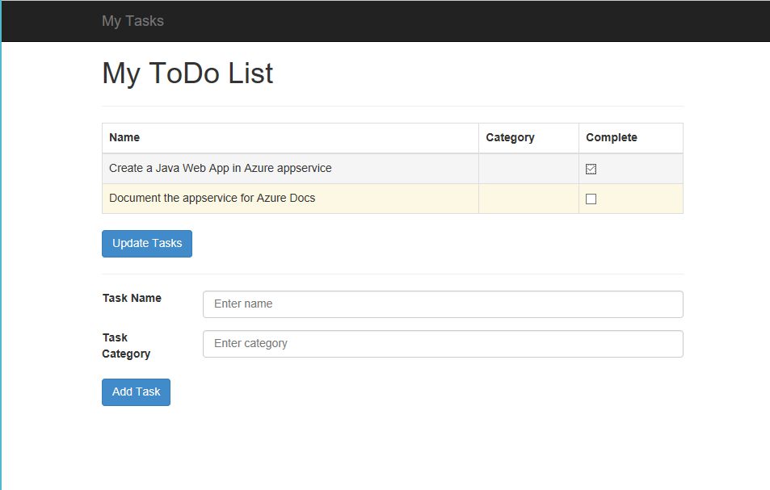

# Build a Java and MySQL web app in Azure

This tutorial shows you how to create a Java web app in Azure and connect it to a MySQL database. 
When you are finished, you will have a Spring Boot framework to-do list application storing data in [Azure Database for MySQL](https://docs.microsoft.com/azure/mysql/overview) running on [Azure App Service Web Apps](https://docs.microsoft.com/azure/app-service-web/app-service-web-overview).



In this tutorial, you learn how to:

> [!div class="checklist"]
> * Create a MySQL database in Azure
> * Connect a sample app to the MySQL database
> * Deploy the app to Azure
> * Update and redeploy the app
> * Stream diagnostic logs from Azure
> * Monitor the app in the Azure portal


## Prerequisites
Before running this sample, install the following prerequisites locally:

1. [Git](https://git-scm.com/)
1. [Java 7 JDK or above](http://www.oracle.com/technetwork/java/javase/downloads/index.html)
1. [MySQL](https://dev.mysql.com/doc/refman/5.7/en/installing.html) 
1. [Azure CLI 2.0](https://docs.microsoft.com/cli/azure/install-azure-cli)

[!INCLUDE [quickstarts-free-trial-note](../../includes/quickstarts-free-trial-note.md)]

## Prepare local MySQL 

In this step, you create a database in a local MySQL server for use in testing the app locally on your machine.

### Connect to MySQL server

Connect to your local MySQL server from the command line:

```bash
mysql -u root -p
```

If your command runs successfully, then your MySQL server is already running. If not, make sure that your local MySQL server is started by following the [MySQL post-installation steps](https://dev.mysql.com/doc/refman/5.7/en/postinstallation.html).

If you're prompted for a password, enter the password for the `root` account. If you don't remember your root account password, see [MySQL: How to Reset the Root Password](https://dev.mysql.com/doc/refman/5.7/en/resetting-permissions.html).

### Create a database and table

In the `mysql` prompt, create a database and a table for the to-do items.

```sql
CREATE DATABASE tododb;
```

Exit your server connection by typing `quit`.

```sql
quit
```

## Create and run the sample app 

In this step, you clone a GitHub repo, configure the MySQL database connection, and run the app on your computer. 

### Clone the sample

From the command prompt, navigate to a working directory and clone the sample repository. 

```bash
git clone https://github.com/Azure-Samples/azure-mysql-java-todo-app
```

### Configure MySQL

Update the application.properties file in `src/main/resources` with your the same MySQL password used when logging into to create the database:

```
spring.datasource.password=mysqlpass
```

### Build and run the sample

Build and run the sample using the Maven wrapper included in the repo:

```
mvnw package spring-boot:run
```

Open your browser to [http://localhost:8080](http://localhost:8080) the sample app. Add a few tasks in the page. You can view the updates in the MySQL database as you work in the sample using the folloowing commands:

```SQL
use testdb;
select * from todo_item;
```

Stop the application by hitting `Ctrl`+`C` in the command prompt. 

## Create an MySQL database in Azure

In this step, you create an [Azure Database for MySQL](../mysql/quickstart-create-mysql-server-database-using-azure-cli.md) instance. You will configure the Java application to connect to this database in a later step in the tutorial.

### Log in to Azure

Use the Azure CLI 2.0 in a terminal window to create the resources needed to host your Java application in Azure appservice. Log in to your Azure subscription with the [az login](/cli/azure/#login) command and follow the on-screen directions. 

```azurecli 
az login 
``` 

### Create a resource group
Create a [resource group](../azure-resource-manager/resource-group-overview.md) with the [az group create](/cli/azure/group#create) command. An Azure resource group is a logical container where related resources like web apps, databases, and storage accounts are deployed and managed. 

Create a resource group for the sample in the North Europe region:

```azurecli
az group create --name myResourceGroup  --location "North Europe"
```

To available value for `--location`, use the [az appservice list-locations](/cli/azure/appservice#list-locations) command.

### Create the server

Create a server in Azure Database for MySQL (Preview) with the [az mysql server create](/cli/azure/mysql/server#create) command.

Substitute your own unique MySQL server name where you see the `<mysql_server_name>` placeholder. This name is part of your MySQL server's hostname, `<mysql_server_name>.mysql.database.azure.com`, so it needs to be globally unique. Also substitute `<admin_user>` and `<admin_password>` with your own values.

```azurecli
az mysql server create --name <mysql_server_name> --resource-group myResourceGroup --location "North Europe" --user <admin_user> --password <admin_password>
```

When the MySQL server is created, the Azure CLI shows information similar to the following example:

```json
{
  "administratorLogin": "admin_user",
  "administratorLoginPassword": null,
  "fullyQualifiedDomainName": "mysql_server_name.mysql.database.azure.com",
  "id": "/subscriptions/00000000-0000-0000-0000-000000000000/resourceGroups/myResourceGroup/providers/Microsoft.DBforMySQL/servers/mysql_server_name",
  "location": "northeurope",
  "name": "mysql_server_name",
  "resourceGroup": "mysqlJavaResourceGroup",
  ...
}
```

### Configure a server firewall

Create a firewall rule for your MySQL server to allow client connections by using the [az mysql server firewall-rule create](/cli/azure/mysql/server/firewall-rule#create) command. 

```azurecli
az mysql server firewall-rule create --name allIPs --server mysql_server_name --resource-group myResourceGroup --start-ip-address 0.0.0.0 --end-ip-address 255.255.255.255
```

> [!NOTE]
> Azure Database for MySQL (Preview) does not currently automatically enable connections from Azure services. As IP addresses in Azure are dynamically assigned, it is better to enable all IP addresses for now. As the service continues its preview, better methods for securing your database will be enabled.

### Connect to the MySQL server

In the terminal window on your computer, connect to the MySQL server in Azure. Use the value you specified previously for `<admin_user>` and `<mysql_server_name>`.

```bash
mysql -u <admin_user>@<mysql_server_name> -h <mysql_server_name>.mysql.database.azure.com -P 3306 -p
```

### Create a database and table in the Azure MySQL Service

In the `mysql` prompt, create a database and a table for the to-do items.

```sql
CREATE DATABASE tododb;
```

### Create a user with permissions

Create a database user and give it all privileges in the `tododb` database. Replace the placeholders `<Javaapp_user>` and `<Javaapp_password>` with your own unique app name.

```sql
CREATE USER '<Javaapp_user>' IDENTIFIED BY '<Javaapp_password>'; 
GRANT ALL PRIVILEGES ON todoItemDb.* TO '<Javaapp_user>';
```

Exit your server connection by typing `quit`.

```sql
quit
```

### Configure the sample to use the Azure Database for MySQL database

In this step, you connect your Java application to the MySQL database you created in Azure Database for MySQL. 

Update the application.properties file in `src/main/resources` with your database URL in Azure and the  username and password you created in the previous step.

```
spring.datasource.url=jdbc:mysql://<mysql_server_name>.mysql.database.azure.com/tododb
spring.datasource.username=Javaapp_user
spring.datasource.password=Javaapp_password
```

## Test the application

Use the same commands as before to run the sample. This time the app will store the todo items in the Azure Database for MySQL service: 

```bash
mvnw clean package spring-boot:run
```

Open your browser to [http://localhost:8080](http://localhost:8080) to load the sample app. Add a few tasks in the page. 

Stop the application by hitting `Ctrl`+`C` in the command prompt.  

### Secure sensitive data

Make sure that the sensitive data in `src/main/resources/application.properties` is not committed in Git.

To do this, open `.gitignore` from the repository root and add `src/main/resources/application.properties` in a new line. Save your changes.

Commit your changes to `.gitignore`.

```bash
git add .gitignore
git commit -m "keep sensitive data out of the repo"
```

## Deploy the Java application to Azure

Next we deploy the Java application to an Azure.

### Create an appservice plan

Create an appservice plan with the [az appservice plan create](/cli/azure/appservice/plan#create) command. 

> [!NOTE] 
> An appservice plan represents the collection of physical resources used to host your apps. All applications assigned to an appservice plan share the resources defined by it allowing you to save cost when hosting multiple apps. 
> 
> appservice plans define: 
>
> * Region (North Europe, East US, Southeast Asia) 
> * Instance Size (Small, Medium, Large) 
> * Scale Count (one, two, or three instances, etc.) 
> * SKU (Free, Shared, Basic, Standard, Premium) 


The following example creates an appservice plan named `myAppServicePlan` using the **FREE** pricing tier:

```azurecli
az appservice plan create --name myAppServicePlan --resource-group myResourceGroup --sku FREE
```

When the appservice plan is created, the Azure CLI shows information similar to the following example:

```json 
{ 
  "adminSiteName": null,
  "appServicePlanName": "myAppServicePlan",
  "geoRegion": "North Europe",
  "hostingEnvironmentProfile": null,
  "id": "/subscriptions/0000-0000/resourceGroups/myResourceGroup/providers/Microsoft.Web/serverfarms/myAppServicePlan",
  "kind": "app",
  "location": "North Europe",
  "maximumNumberOfWorkers": 1,
  "name": "myAppServicePlan",
  <JSON data removed for brevity.>
  "targetWorkerSizeId": 0,
  "type": "Microsoft.Web/serverfarms",
  "workerTierName": null
} 
``` 

### Create an Azure Web app
Now that an appservice plan has been created, create an Azure Web app within the `myAppServicePlan` appservice plan. The web app gives you a hosting space to deploy your code and provides a URL for you to view the deployed application. Use the [az appservice web create](/cli/azure/appservice/web#create) command to create the web app. 

In the following command, substitute the `<app_name>` placeholder with your own unique app name. This unique name will be used as the part of the default domain name for the web app, so the name needs to be unique across all apps in Azure. You can later map any custom DNS entry to the web app before you expose it to your users. 

```azurecli
az appservice web create --name <app_name> --resource-group myResourceGroup --plan myAppServicePlan
```

When the web app has been created, the Azure CLI shows information similar to the following example: 

```json 
{
  "availabilityState": "Normal",
  "clientAffinityEnabled": true,
  "clientCertEnabled": false,
  "cloningInfo": null,
  "containerSize": 0,
  "dailyMemoryTimeQuota": 0,
  "defaultHostName": "<app_name>.azurewebsites.net",
  "enabled": true,
  "enabledHostNames": [
    "<app_name>.azurewebsites.net",
    "<app_name>.scm.azurewebsites.net"
  ],
  "gatewaySiteName": null,
  "hostNameSslStates": [
    {
      "hostType": "Standard",
      "name": "<app_name>.azurewebsites.net",
      "sslState": "Disabled",
      "thumbprint": null,
      "toUpdate": null,
      "virtualIp": null
    }
    <JSON data removed for brevity.>
}
```

### Set the Java version, the Java Application Server type, and the Application Server version

Set the Java version, Java App Server (container) type, and container version by using the [az appservice web config update](/cli/azure/appservice/web/config#update) command.

The following command sets the Java version to 8, the Java App Server to Tomcat, and the Tomcat version to 8.

```azurecli
az appservice web config update --name <app_name> --resource-group myResourceGroup --java-version 1.8 --java-container Tomcat --java-container-version 8.0
```

### Get credentials for deployment to the Web App using FTP 
You can deploy your application to Azure appservice in various ways including FTP, local Git, GitHub, Visual Studio Team Services, and BitBucket. 
For this example, FTP to deploy the .WAR file built with Maven to the Web App:

To determine what credentials to pass along in an ftp command to the Web App, Use [az appservice web deployment list-publishing-profiles](https://docs.microsoft.com/cli/azure/appservice/web/deployment#list-publishing-profiles) command: 

```azurecli

az appservice web deployment list-publishing-profiles --name <app_name> --resource-group myResourceGroup --query "[?publishMethod=='FTP'].{URL:publishUrl, Username:userName,Password:userPWD}" --o table

```
### Compile the local application to deply to the Web App 

To prepare the local Java application to run on the Azure Web App, recompile all the resources in the Java application into a single .WAR file ready for deployment. Navigate to the directory where the applications pom.xml is located, and type:

```bash 
mvn clean package
``` 
Toward the end of the Maven package process, notice the location of the .WAR file.  The output should look like this:

```bash

[INFO] Processing war project
[INFO] Copying webapp resources [local-location\GitHub\mysql-java-todo-app\WebContent]
[INFO] Webapp assembled in [1519 msecs]
[INFO] Building war: /Users/raisa/mysql-java-todo-app/target/TodoDemo-0.0.1-SNAPSHOT.war
[INFO] ------------------------------------------------------------------------
[INFO] BUILD SUCCESS
[INFO] ------------------------------------------------------------------------

```

Note the location of the .War file, and use your favorite FTP method to deploy the .WAR file to the /site/wwwroot/webapps , removing the existing default (ROOT) application and replacing it with the sample.

```
cd /site/wwwroot/webapps
rmdir ROOT/
put target\TodoDemo-0.0.1-SNAPSHOT.war ROOT.war
```

### Browse to the Azure web app

Browse to `http://<app_name>.azurewebsites.net/` and add a few tasks to the list. 


**Congratulations!** You're running a data-driven Java app in Azure appservice.
To update the app, repeat the maven clean package command and redeploy the app via FTP.

## Manage your Azure web app
Go to the Azure portal to see the web app you created by signing in to [https://portal.azure.com](https://portal.azure.com).

From the left menu, click **appservice**, then click the name of your Azure web app.

You should now be in your web app's _blade_ (a portal page that opens horizontally).

By default, your web app's blade shows the **Overview** page. This page gives you a view of how your app is doing. Here, you can also perform basic management tasks like browse, stop, start, restart, and delete. The tabs on the left side of the blade show the different configuration pages you can open.

In the **Application Settings** page, 


These tabs in the blade show the many great features you can add to your web app. The following list gives you just a few of the possibilities:
* Map a custom DNS name
* Bind a custom SSL certificate
* Configure continuous deployment
* Scale up and out
* Add user authentication

## More resources
- [Map an existing custom DNS name to Azure Web Apps](app-service-web-tutorial-custom-domain.md)
- [Bind an existing custom SSL certificate to Azure Web Apps](app-service-web-tutorial-custom-ssl.md)
- [Web apps CLI scripts](app-service-cli-samples.md)
