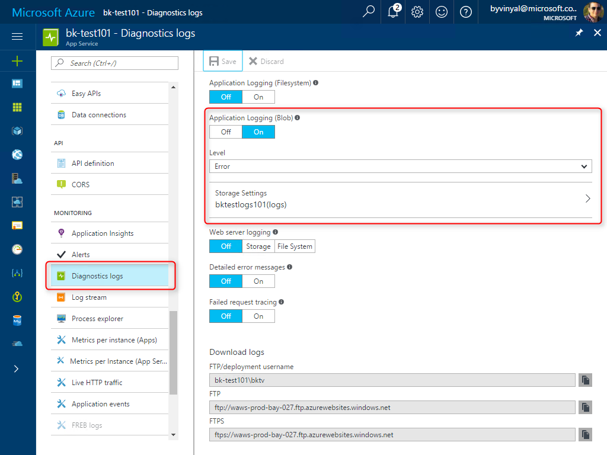
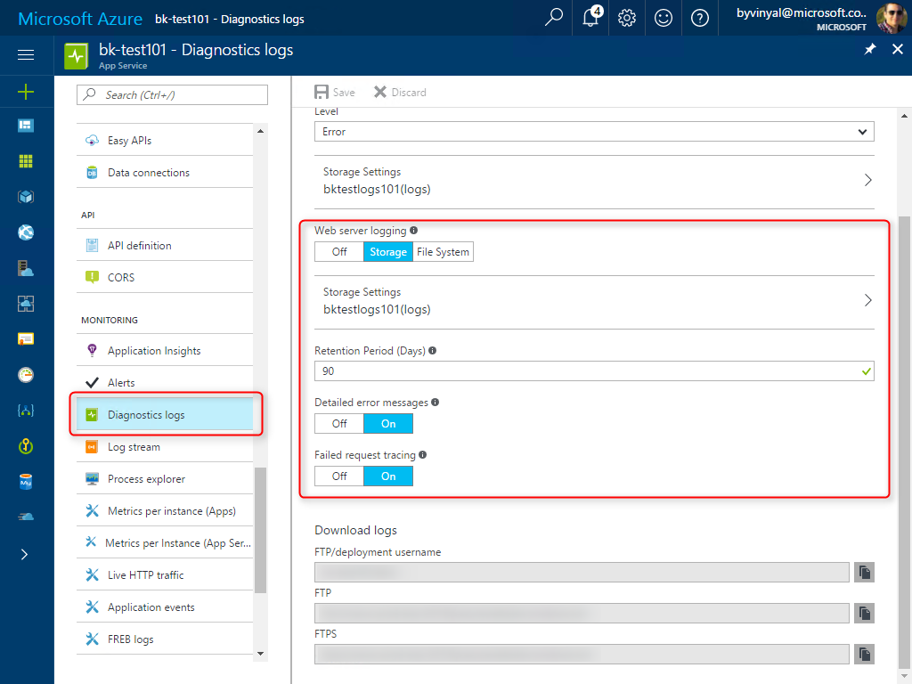

# Monitor App Service
This tutorial shows you how to use the built-in platform tools to monitor and diagnose your app hosted in App Service. 

## Before you begin
For this tutorial, you need a Web app to monitor. You can create an application following the steps described in the [Create an ASP.NET app in Azure with SQL Database](app-service-web-tutorial-dotnet-sqldatabase.md) tutorial.

If you want to try out **Remote Debugging** of your application, you need Visual Studio. If you don’t already have Visual Studio 2017 installed, you can download and use the free [Visual Studio 2017 Community Edition](https://www.visualstudio.com/downloads/). Make sure that you enable Azure development during the Visual Studio setup.

## In this Tutorial

1. [Logging](#logging)
    - Learn how to collection for both server and application logs.
    - Learn about the different places to store your logs and how to reach them.
1. [Streaming Logs](#streaming)
    - Use Streaming logs to view your application and wc3 logs as they are emitted.
1. [Remote Debugging](#remote)
    - Use visual studio to remotely debug your project running on app service.
1. [Process Explorer](#explorer)
    - 
1. [App Service Metrics](#metrics) 
   - Learn how to monitor your app using the portal built in charts
   - Configure charts to suit your needs
   - Create a custom dashboard by pinning your custom charts
1. [Configure Alerts](#alerts)
    - Learn how to configure alerts for both your App and App Service plan
    - Get started with a suggested set of alerts for your app.
1. [Diagnose and solve problems](#diagnose)
1. [Application Insights](#insights)

##  Step 1 - Logging
In this section, learn how to enable diagnostic logging, add instrumentation to your app and where to find the generated logs.

App Service can collect both **Application Diagnostics** and **Web Server Diagnostics** logs.

### Application Diagnostics
Application diagnostics allows you to capture traces produced by the application at runtime. 

To enable Application logging, go to **Monitoring** > **Diagnostic Logs**. From here you can enable Application Logging, select the verbosity and the storage location for the logs.

In ASP.NET, you can log application traces using [System.Diagnostics.Trace class](https://msdn.microsoft.com/library/system.diagnostics.trace.aspx) to generate events that are captured by the log infrastructure. You can also specify the severity of the trace for easier filtering.

`System.Diagnostics.Trace.TraceError("This is an Error");`

`System.Diagnostics.Trace.TraceWarning("This is a Warning");`

`System.Diagnostics.Trace.TraceInformation("This is Information");`

In a node.js app you log events using:

`console.log("My trace statement").`

> [!IMPORTANT]
> Enabling logging has an impact on your application performance and resource utilization. For Production Scenarios, Error logs are recommended, Only Enable more verbose logging when investigating issues.

Application logs can be stored to your apps file system, or pushed out to blob storage.
> [!TIP]
> For production scenarios it's recommended to use blob storage

 ### Web Server Diagnostics
To enable Server logging, go to **Monitoring** > **Diagnostic Logs**. 

App Service can collect three different types of server logs:

- **Web Server Logging** - Information about HTTP transactions using the [W3C extended log file format](https://msdn.microsoft.com/library/windows/desktop/aa814385.aspx). Useful when determining overall site metrics such as the number of requests handled or how many requests are from a specific IP address.
- **Detailed Error Logging** - Detailed error information for HTTP status codes that indicate a failure (status code 400 or greater). This may contain information that can help determine why the server returned the error code.
- **Failed Request Tracing** - Detailed information on failed requests, including a trace of the IIS components used to process the request and the time taken in each component. Failed request logs are useful when trying to isolate what is causing a specific HTTP error.

> [!IMPORTANT]
> Enabling logging has an impact on your application performance and resource utilization. For Production Scenarios, Error logs are recommended, Only Enable more verbose logging when investigating issues.

### Accessing Logs
Logs can be collected the app's file system or blob storage.

You can access the logs in blob storage using Azure Storage Explorer.

Logs stored in the app's filesystem you can access them through FTP under the following paths:

- **Application logs** - /LogFiles/Application/. 
    - This folder contains one or more text files containing information produced by application logging.
- **Failed Request Traces** - /LogFiles/W3SVC#########/. 
    - This folder contains an XSL file and one or more XML files. 
- **Detailed Error Logs** - /LogFiles/DetailedErrors/. 
    - This folder contains one or more .htm files with extensive information on HTTP errors generated by your app.
- **Web Server Logs** - /LogFiles/http/RawLogs. 
    - This folder contains one or more text files formatted using the W3C extended log file format.

##  Step 2 - Streaming Logs
App Service can stream **Application Logs** and **Web Server Logs** as they are generated. Streaming logs are useful when debugging an application as it saves time compared to accessing the logs through FTP other methods.

> [!TIP]
> Before trying to stream logs, make sure you have enabled collecting logs as described in the [Logging](#logging) section.

You can view the streaming logs using the Azure portal under: **Monitoring** > **Log Stream**

From here, you can switch views between Application and Server logs. You can also pause, restart, and clear the buffer.

> [!TIP]
> Logs are only generated when there is traffic on the app, you can also increase the verbosity of logs to get more events or information.

##  Step 3 - Remote Debugging

##  Step 4 - Process Explorer

##  Step 5 - View App Service metrics
For any app hosted in app service, you must monitor the app and the App Service plan.

- **App** metrics provide information about http requests/failures and average response time.
- **App Service Plan** metrics provide information about resource utilization.

Azure portal has a quick way to visually inspect the metrics of your app using **Azure Monitor**.

- Go to the **Overview** blade of the app you want to monitor.

- You can view the app's metrics as a Monitoring tile.
- You can then edit the tile and configure what metrics to view and the time range to display.

> [!TIP]
> Learn more about Azure Monitor with the following links:
> - [Get started with Azure Monitor](..\monitoring-and-diagnostics\monitoring-overview.md)
> - [Azure Metrics](..\monitoring-and-diagnostics\monitoring-overview-metrics.md)
> - [Supported metrics with Azure Monitor](..\monitoring-and-diagnostics\monitoring-supported-metrics.md#microsoftwebsites-including-functions)

- You can pin custom charts to the dashboard for easy access and quick reference.

##  Step 6 - Configure Alerts
Alerts allow you to automate the monitoring of your application.

- Go to the **Overview** blade of the app you want to monitor.
- From the menu, navigate to **Monitoring** > **Alerts**
- Select **[+] Add Alert**
- Configure the alert as needed.

As an example, a simple set of Alerts to monitor an app hosted in app service could include:

> [!NOTE]
> The values provided are for illustration purposes only. Values vary depending on the applications traffic patterns and characteristics under load.

|   App Service Plan              | |
|---------------------------------|---------------------------------|
|  - High CPU utilization         |  - High memory utilization      |
|    - Resource: App Service Plan |    - Resource: App Service Plan |
|    - Metric: CPU Percentage     |    - Metric: Memory Percentage  |
|    - Condition: Greater than    |    - Condition: Greater than    |
|    - Threshold: 80%             |    - Threshold: 80%             |
|    - Period: 5 minutes          |    - Period: 5 minutes          |

|   Web App                       | |
|---------------------------------|-------------------------------|
|  - High failure rate            |  - High traffic               |
|    - Resource: Web App          |    - Resource: Web App        |
|    - Metric: HTTP Server Errors |    - Metric: Requests         |
|    - Condition: Greater than    |    - Condition: Greater than  |
|    - Threshold: 1,000           |    - Threshold: 10,000        |
|    - Period: 5 minutes          |    - Period: 5 minutes        |

> [!TIP]
> Learn more about Azure Alerts with the following links:
> - [What are alerts in Microsoft Azure](..\monitoring-and-diagnostics\monitoring-overview-alerts.md)
> - [Take Action On Metrics](..\monitoring-and-diagnostics\monitoring-overview.md)

##  Step 8 - Application Insights
This is how you enable AI for your app...
For more info

##  Step 7 - Diagnose and solve problems

##  Next steps
Check out **Application Insights** for more advanced monitoring capabilities for App Service:

 - [What is Application Insights](..\application-insights\app-insights-overview.md)
 - [Monitor Azure web app performance with Application Insights](..\application-insights\app-insights-azure-web-apps.md)
 - [Monitor availability and responsiveness of any web site with Application Insights](..\application-insights\app-insights-monitor-web-app-availability.md)