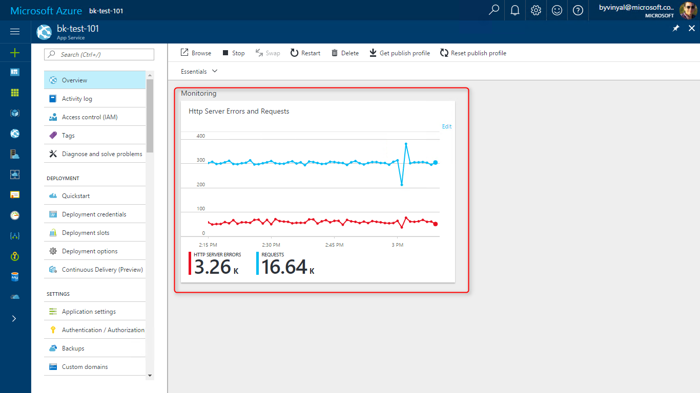
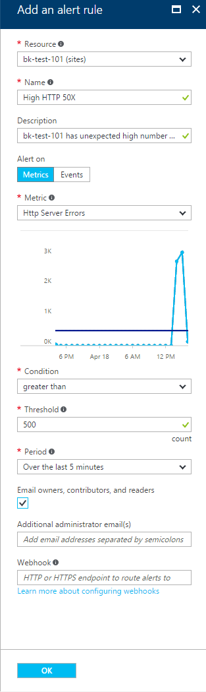
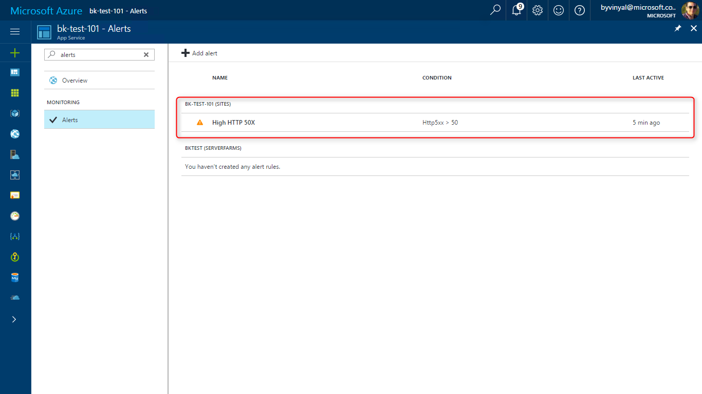
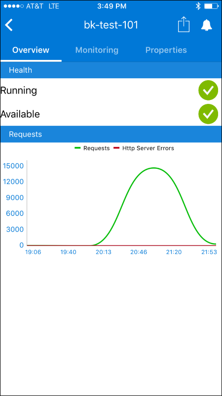
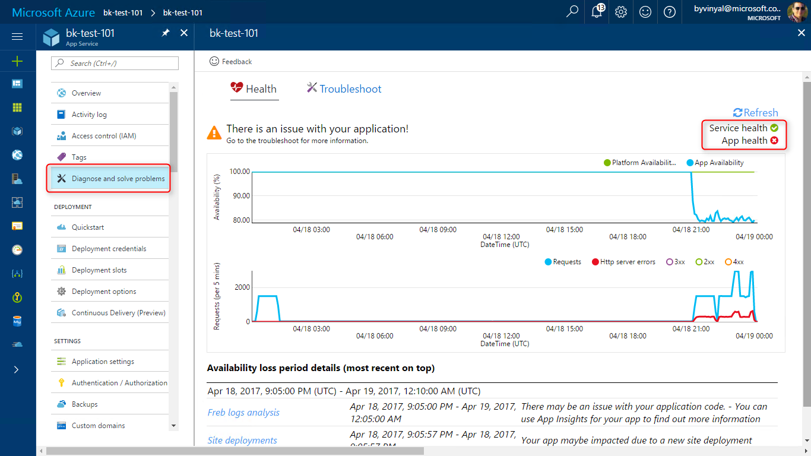
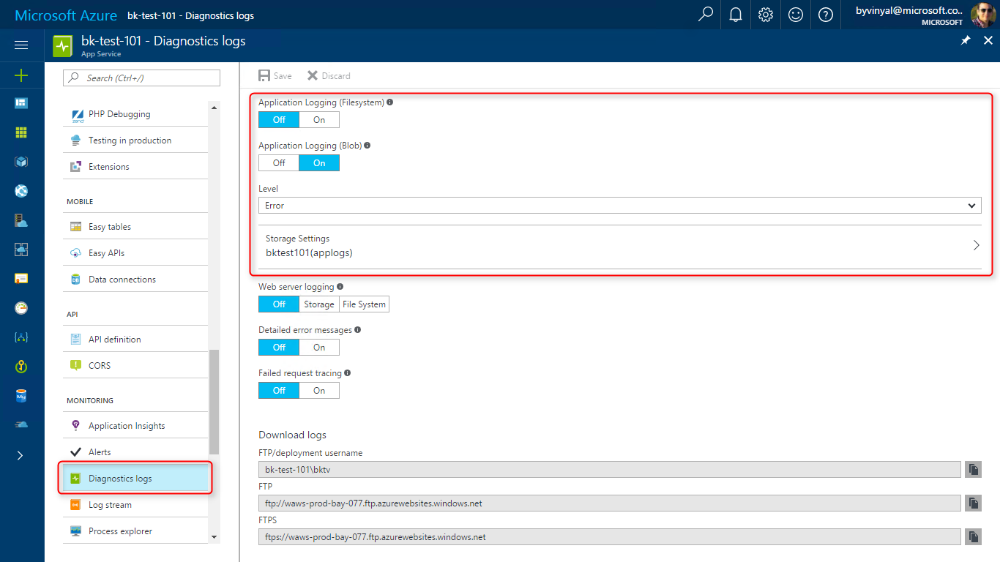
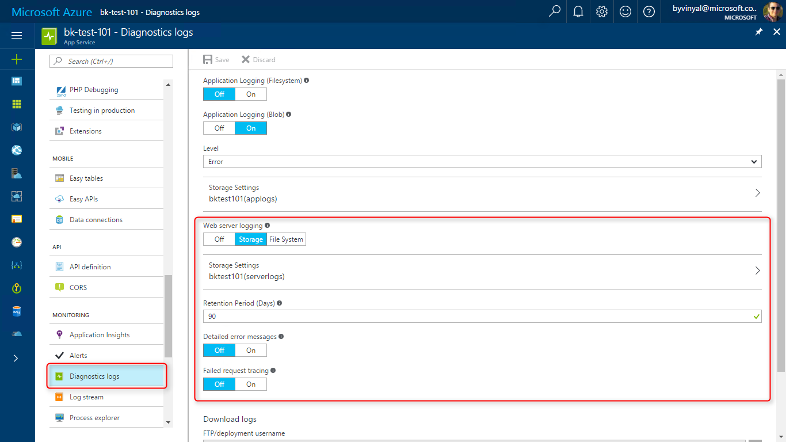
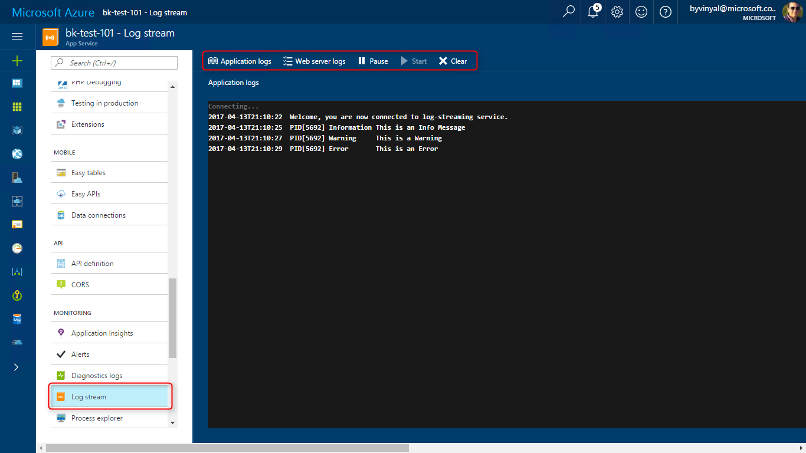
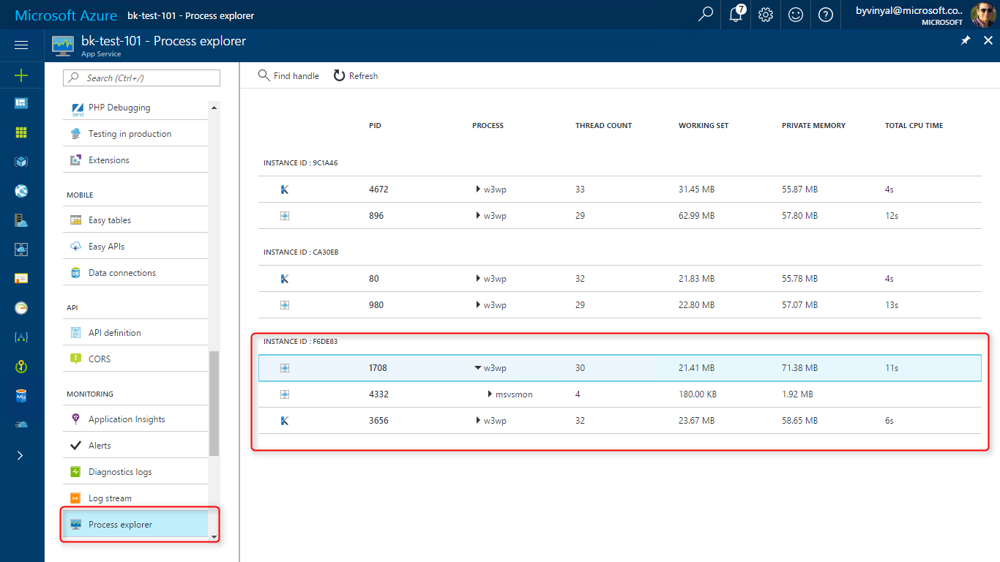
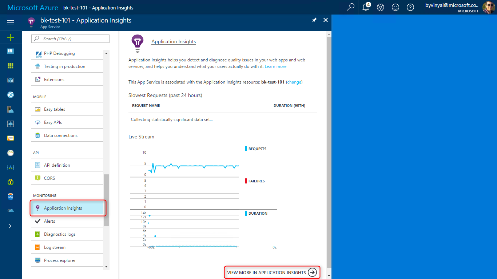

# Monitor App Service
This tutorial walks you through monitoring your app and using the built-in platform tools to solve problems when they occur.

Each section of this document goes over a specific feature. Using the features together let you:
- Identifying an issue in your app.
- Determining when the issue is caused by your code or the platform.
- Narrow down the source of the problem in your code.
- Debugging and fixing the issue.

## Before you begin
- You need a Web App to monitor and follow the outlined steps.
    - You can create an application following the steps described in the [Create an ASP.NET app in Azure with SQL Database](app-service-web-tutorial-dotnet-sqldatabase.md) tutorial.

- If you want to try out **Remote Debugging** of your application, you need Visual Studio.
    - If you don’t already have Visual Studio 2017 installed, you can download and use the free [Visual Studio 2017 Community Edition](https://www.visualstudio.com/downloads/).
    - Make sure that you enable **Azure development** during the Visual Studio setup.

## <a name="metrics"></a> Step 1 - View metrics
**Metrics** are useful to understand:
- Application health
- App performance
- Resource consumption

When investigating an application issue, reviewing metrics is a good place to start. Azure portal has a quick way to visually inspect the metrics of your app using **Azure Monitor**.

Metrics provide a historical view across several key aggregations for your app. For any app hosted in app service, you should monitor both the Web App and the App Service plan.

> [!NOTE]
> An App Service plan represents the collection of physical resources used to host your apps. All applications assigned to an App Service plan share the resources defined by it allowing you to save cost when hosting multiple apps.
>
> App Service plans define:
> * Region: North Europe, East US, Southeast Asia, etc.
> * Instance Size: Small, Medium, Large, etc.
> * Scale Count: one, two, or three instances, etc.
> * SKU: Free, Shared, Basic, Standard, Premium, etc.

To review metrics for your Web App, go to the **Overview** blade of the app you want to monitor. From here, you can view a chart for your app's metrics as a **Monitoring tile**. Click the tile to edit and configure what metrics to view and the time range to display.

By default the resource blade provides a view for the Application Requests and errors for the last hour.


As you can see in the example, we have an application that is generating many **HTTP Server Errors**. The high volume of errors is the first indication we need to investigate this application.

> [!TIP]
> Learn more about Azure Monitor with the following links:
> - [Get started with Azure Monitor](..\monitoring-and-diagnostics\monitoring-overview.md)
> - [Azure Metrics](..\monitoring-and-diagnostics\monitoring-overview-metrics.md)
> - [Supported metrics with Azure Monitor](..\monitoring-and-diagnostics\monitoring-supported-metrics.md)
> - [Azure Dashboards](..\azure-portal\azure-portal-dashboards.md)

## <a name="alerts"></a> Step 2 - Configure Alerts
**Alerts** can be configured to trigger on specific conditions for your app.

In [Step 1 - View metrics](#metrics), we saw that the application had a high number of errors.

Lets configure an alert to automatically get notified when errors occur. In this case, we want the alert to send and e-mail every time the number of HTTP 50X errors goes over a certain threshold.

To create an alert, navigate to **Monitoring** > **Alerts** and click **[+] Add Alert**.



Provide values for the Alert configuration:
- **Resource:** The site to monitor with the alert.
- **Name:** A name for your alert, in this case: *High HTTP 50X*.
- **Description:** Plain text explanation of what this alert is looking at.
- **Alert on:** Alerts can look at Metrics or Events, for this example we are looking at metrics.
- **Metric:** What metric to monitor, in this case: *HTTP Server Errors*.
- **Condition:** When to alert, in this case select the *greater than* option.
- **Threshold:** What is value to look for, in this case: *400*.
- **Period:** Alerts operate over the average value of a metric. Smaller periods of time yield more sensitive alerts. in this case we are looking at *5 Minutes*.
- **Email Owners and contributors:** in this case: *Enabled*.

Now that the alert is created an email is sent every time the app goes over the configured threshold. Active alerts can also be reviewed in the Azure portal.




> [!TIP]
> Learn more about Azure Alerts with the following links:
> - [What are alerts in Microsoft Azure](..\monitoring-and-diagnostics\monitoring-overview-alerts.md)
> - [Take Action On Metrics](..\monitoring-and-diagnostics\monitoring-overview.md)
> - [Create metric alerts](..\monitoring-and-diagnostics\insights-alerts-portal.md)

## <a name="companion"></a> Step 3 - App Service Companion
**App Service companion** offers a convenient way to monitor your app with a native experience in your mobile device (iOS or Android).

Use App Service Companion to:
- Review application metrics
- Review and act on application alerts and recommendations
- Perform basic troubleshooting (browse, start, stop, restart the app)
- Get push notifications for critical events.



[](https://itunes.apple.com/app/azure-app-service-companion/id1146659260)
[](https://play.google.com/store/apps/details?id=azureApps.AzureApps)

You can install App Service companion from the [App Store](https://itunes.apple.com/app/azure-app-service-companion/id1146659260) or [Google Play](https://play.google.com/store/apps/details?id=azureApps.AzureApps)

## <a name="diagnose"></a> Step 4 - Diagnose and solve problems
**Diagnose and solve problems** helps you separate application issues form platform issues. It can also suggest possible mitigations to get your Web App back to healthy.



Continuing with the example form previous steps, we can see that the application has been having availably issues. In contrast, the platform availability has not moved from 100%.

When the app is having issue and the platform stays up, it's a clear indication that we are dealing with an application issue.

## <a name="logging"></a> Step 5 - Logging
Now that we have narrowed down the failures to an application issue, we can look at the application and server logs to get more information.

Logging allows you to collect both **Application Diagnostics** and **Web Server Diagnostics** logs for your Web App.

### Application Diagnostics
Application diagnostics allows you to capture traces produced by the application at runtime.

Adding tracing to your application greatly improves your ability to debug and pin-point issues.

In ASP.NET, you can log application traces using [System.Diagnostics.Trace class](https://msdn.microsoft.com/library/system.diagnostics.trace.aspx) to generate events that are captured by the log infrastructure. You can also specify the severity of the trace for easier filtering.

```csharp
public ActionResult Delete(Guid? id)
{
    System.Diagnostics.Trace.TraceInformation("GET /Todos/Delete/" + id);
    if (id == null)
    {
        System.Diagnostics.Trace.TraceError("/Todos/Delete/ failed, ID is null");
        return new HttpStatusCodeResult(HttpStatusCode.BadRequest);
    }
    Todo todo = db.Todoes.Find(id);
    if (todo == null)
    {
        System.Diagnostics.Trace.TraceWarning("/Todos/Delete/ failed, ID: " + id + " could not be found");
        return HttpNotFound();
    }
    System.Diagnostics.Trace.TraceInformation("GET /Todos/Delete/" + id + "completed successfully");
    return View(todo);
}
```
To enable Application logging Go to **Monitoring** > **Diagnostic Logs** and Enable Application Logging using the toggles.



Application logs can be stored to your Web App's file system or pushed out to blob storage. For production scenarios, it's recommended to use blob storage.

> [!IMPORTANT]
> Enabling logging has an impact on your application performance and resource utilization. For production scenarios, error logs are recommended. Only enable more verbose logging when investigating issues.

 ### Web Server Diagnostics
Web Server logs are generated even if your app is not instrumented. App Service can collect three different types of server logs:

- **Web Server Logging**
    - Information about HTTP transactions using the [W3C extended log file format](https://msdn.microsoft.com/library/windows/desktop/aa814385.aspx).
    - Useful when determining overall site metrics such as the number of requests handled or how many requests are from a specific IP address.
- **Detailed Error Logging**
    - Detailed error information for HTTP status codes that indicate a failure (status code 400 or greater).
    - [Learn more about detailed error logging](https://www.iis.net/learn/troubleshoot/diagnosing-http-errors/how-to-use-http-detailed-errors-in-iis)
- **Failed Request Tracing**
    - Detailed information on failed requests, including a trace of the IIS components used to process the request and the time taken in each component.
    - Failed request logs are useful when trying to isolate what is causing a specific HTTP error.
    - [Learn more about failed request tracing](https://www.iis.net/learn/troubleshoot/using-failed-request-tracing/troubleshooting-failed-requests-using-tracing-in-iis)

To enable Server logging:
- go to **Monitoring** > **Diagnostic Logs**.
- Enable the different types of Web Server Diagnostics using the toggles.



> [!IMPORTANT]
> Enabling logging has an impact on your application performance and resource utilization. For Production Scenarios, Error logs are recommended, Only Enable more verbose logging when investigating issues.

### Accessing Logs
Logs stored in blob storage are accessed using Azure Storage Explorer. Logs stored in the Web App's filesystem are accessed through FTP under the following paths:

- **Application logs** - `%HOME%/LogFiles/Application/`.
    - This folder contains one or more text files containing information produced by application logging.
- **Failed Request Traces** - `%HOME%/LogFiles/W3SVC#########/`.
    - This folder contains an XSL file and one or more XML files.
- **Detailed Error Logs** - `%HOME%/LogFiles/DetailedErrors/`.
    - This folder contains one or more .htm files with extensive information on HTTP errors generated by your app.
- **Web Server Logs** - `%HOME%/LogFiles/http/RawLogs`.
    - This folder contains one or more text files formatted using the W3C extended log file format.

## <a name="streaming"></a> Step 6 - Log Streaming
Streaming logs are convenient when debugging an application since it saves time compared to [accessing the logs](#Accessing-Logs) through FTP.

App Service can stream **Application Logs** and **Web Server Logs** as they are generated.

> [!TIP]
> Before trying to stream logs, make sure you have enabled collecting logs as described in the [Logging](#logging) section.

To stream logs, go to **Monitoring**> **Log Stream**. Select **Application Logs** or **Web server logs** depending what information you are looking for. From here, you can also pause, restart, and clear the buffer.



> [!TIP]
> Logs are only generated when there is traffic on the app, you can also increase the verbosity of logs to get more events or information.

## <a name="remote"></a> Step 7 - Remote Debugging
Once you have pin-pointed the source of the applications problems, use **Remote Debugging** to walk through the code.

Remote debugging lets you attach a debugger to your Web App running in the cloud. You can set breakpoints, manipulate memory directly, step through code, and even change the code path just like you do for an app running locally.

To attach the debugger to your app running in the cloud:

- Using Visual Studio 2017, open the solution for the app you want to debug
- Set some brake points just like you would for local development.
- Open **cloud explorer** (ctr + /, ctrl + x).
- Log in with your azure credentials as needed.
- Find the app you want to debug
- Select **Attach Debugger** form the **Actions** pane.


Visual Studio configures your application for remote debugging and launches a browser window that navigates to your app. Browse through your app to trigger break points and step through the code.

> [!WARNING]
> Running in debug mode in production is not recommended. If your production app is not scaled out to multiple server instances, debugging prevent the web server from responding to other requests. For troubleshooting production problems, your best resource is to [configure logging](#logging) and [Application Insights](#insights).


## <a name="explorer"></a> Step 8 - Process Explorer
When your application is scaled out to more than one instance, **process explorer** can help you identify instance specific problems.

Use **Process Explorer** to:

- Enumerate all the processes across different instances of your App Service plan.
- Drill down and view the handles and modules associated with each process.
- View CPU, Working Set, and Thread count at the process level to help you identify runaway processes
- Find open file handles, and even kill a specific process instance.

Process Explorer can be found under **Monitoring** > **Process Explorer**.




## <a name="insights"></a> Step 9 - Application Insights
**Application Insights** provides application profiling and advanced monitoring capabilities for your app.

Use Application Insights to detect and diagnose exceptions and performance issues in your Web App.

You can enable Application Insights for your Web App under **Monitoring** > **Application Insights**

> [!NOTE]
> Application Insights might prompt you to install the Application Insights site extension to start collecting data. Installing the site extension causes an application restart.



Application Insights has a rich feature set, to learn more, follow the links included in the [Next Steps](#next) section.

## <a name="next"></a> Next steps

 - [What is Application Insights](..\application-insights\app-insights-overview.md)
 - [Monitor Azure web app performance with Application Insights](..\application-insights\app-insights-azure-web-apps.md)
 - [Monitor availability and responsiveness of any web site with Application Insights](..\application-insights\app-insights-monitor-web-app-availability.md)
