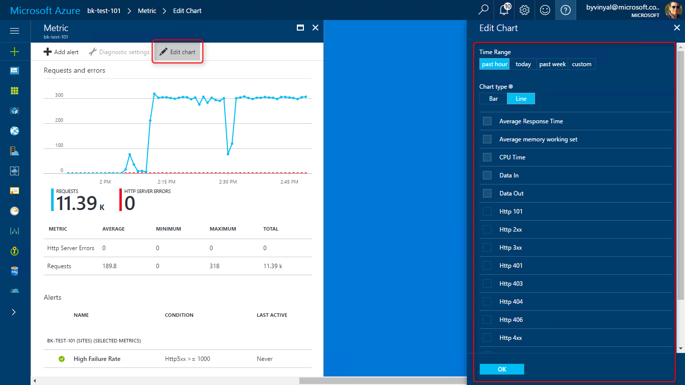
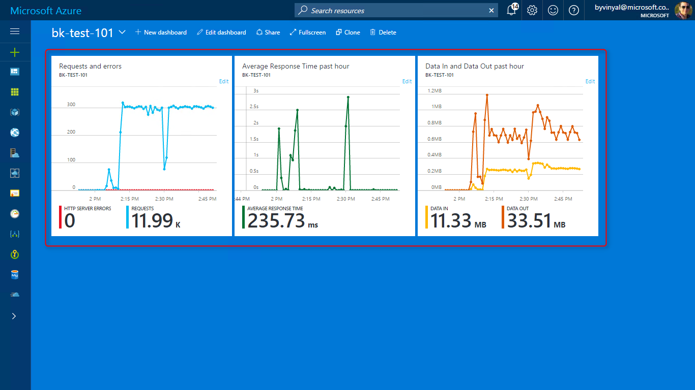

# Monitor App Service
This tutorial shows you how to use the built-in platform tools to monitor and diagnose your app hosted in App Service. 

## In this Tutorial

1. [Process Explorer](#explorer)
    - Get detailed information about your app running across instances of your App Service plan
1. [App Service Metrics](#metrics) 
   - Learn how to monitor your app using the built-in charts
   - Configure charts to suit your needs
   - Create a custom dashboard by pinning your custom charts
1. [Configure Alerts](#alerts)
    - Learn how to configure alerts for both your App and App Service plan
1. [App Service Companion](#Companion)
    - Monitor and troubleshoot your app using a mobile device.
1. [Configure Logging](#logging)
    - Learn how to collect both server and application logs.
    - Learn about the different places to store your logs and how to reach them.
1. [Log Streaming](#streaming)
    - Use Streaming logs to view your application and wc3 logs as they are emitted.
1. [Remote Debugging](#remote)
    - Use visual studio to remotely debug your project running on app service.
1. [Diagnose and solve problems](#diagnose)
    - Identify issues with your application and get information on how to solve them.
1. [Application Insights](#insights)
    - Advanced profiling and monitoring for your app

## Before you begin

- You need a Web App to monitor and follow the outlined steps. 
    - You can create an application following the steps described in the [Create an ASP.NET app in Azure with SQL Database](app-service-web-tutorial-dotnet-sqldatabase.md) tutorial.

- If you want to try out **Remote Debugging** of your application, you need Visual Studio. 
    - If you don’t already have Visual Studio 2017 installed, you can download and use the free [Visual Studio 2017 Community Edition](https://www.visualstudio.com/downloads/). 
    - Make sure that you enable **Azure development** during the Visual Studio setup.

## <a name="explorer"></a> Step 1 - Process Explorer

Process Explorer is a tool that lets you get detailed information about the inner working of your App Service plan.

Use **Process Explorer** to:

- Enumerate all the processes across different instances of your App Service plan.
- Drill down and view the handles and modules associated with each process. 
- View CPU, Working Set, and Thread count at the process level to help you identify runaway processes
- Find open file handles, and even kill a specific process instance.

Process Explorer can be under **Monitoring** > **Process Explorer**.


## <a name="metrics"></a> Step 2 - View App Service metrics
**Metrics** provide detailed information about your Web App and it's and interactions with its users and the platform.

You can use metrics to gain insights on:
- how many resources your app is using
- traffic volume for your app
- overall request/failures
- data in / data out volume

For any app hosted in app service, you must monitor the Web App and the App Service plan.

- **App** metrics provide information about http requests/failures and average response time.
- **App Service Plan** metrics provide information about resource utilization.

Azure portal has a quick way to visually inspect the metrics of your app using **Azure Monitor**.

- Go to the **Overview** blade of the app you want to monitor.


- You can view the app's metrics as a **Monitoring tile**.
- Click the tile to edit and configure what metrics to view and the time range to display.



- You can pin custom charts to the dashboard for easy access and quick reference.



> [!TIP]
> Learn more about Azure Monitor with the following links:
> - [Get started with Azure Monitor](..\monitoring-and-diagnostics\monitoring-overview.md)
> - [Azure Metrics](..\monitoring-and-diagnostics\monitoring-overview-metrics.md)
> - [Supported metrics with Azure Monitor](..\monitoring-and-diagnostics\monitoring-supported-metrics.md#microsoftwebsites-including-functions)
> - [Azure portal Dashboards](..\azure-portal\azure-portal-dashboards.md)

## <a name="alerts"></a> Step 3 - Configure Alerts

**Alerts** allow you to automate the monitoring of your application.

Use alerts to get notified when interesting conditions affecting your app are detected.

To create an alert:
- Go to the **Overview** blade of the app you want to monitor.
- From the menu, navigate to **Monitoring** > **Alerts**
- Select **[+] Add Alert**
- Configure the alert as needed.


> [!TIP]
> Learn more about Azure Alerts with the following links:
> - [What are alerts in Microsoft Azure](..\monitoring-and-diagnostics\monitoring-overview-alerts.md)
> - [Take Action On Metrics](..\monitoring-and-diagnostics\monitoring-overview.md)

## <a name="companion"></a> Step 4 - App Service Companion
**App Service companion** offers a convenient way to monitor your app with a native experience in your mobile device (iOS or Android).

Use App Service Companion to:
- Review application metrics
- Review and act on application alerts and recommendations
- Perform basic troubleshooting (browse, start, stop, restart the app)
- Get push notifications for critical events.


[](https://itunes.apple.com/app/azure-app-service-companion/id1146659260)
[](https://play.google.com/store/apps/details?id=azureApps.AzureApps)

You can install App Service companion from the [App Store](https://itunes.apple.com/app/azure-app-service-companion/id1146659260) or [Google Play](https://play.google.com/store/apps/details?id=azureApps.AzureApps)

## <a name="logging"></a> Step 5 - Logging
Logging allows you to collect both **Application Diagnostics** and **Web Server Diagnostics** logs for your Web App.

Use Diagnostic Logs to understand your application behavior, troubleshooting application issues and understand failure conditions.

### Application Diagnostics
Application diagnostics allows you to capture traces produced by the application at runtime. 

To enable Application logging:

- Go to **Monitoring** > **Diagnostic Logs**. 
- Enable Application Logging using the toggles.

Application logs can be stored to your Web App's file system or pushed out to blob storage.

> [!TIP]
> For production scenarios it's recommended to use blob storage


In ASP.NET, you can log application traces using [System.Diagnostics.Trace class](https://msdn.microsoft.com/library/system.diagnostics.trace.aspx) to generate events that are captured by the log infrastructure. You can also specify the severity of the trace for easier filtering.

```csharp
public ActionResult Delete(Guid? id)
{
    System.Diagnostics.Trace.TraceInformation("GET /Todos/Delete/" + id);
    if (id == null)
    {
        System.Diagnostics.Trace.TraceError("/Todos/Delete/ failed, ID is null");
        return new HttpStatusCodeResult(HttpStatusCode.BadRequest);
    }
    Todo todo = db.Todoes.Find(id);
    if (todo == null)
    {
        System.Diagnostics.Trace.TraceWarning("/Todos/Delete/ failed, ID: " + id + " could not be found");
        return HttpNotFound();
    }
    System.Diagnostics.Trace.TraceInformation("GET /Todos/Delete/" + id + "completed successfully");
    return View(todo);
}
```

> [!IMPORTANT]
> Enabling logging has an impact on your application performance and resource utilization. For production scenarios, error logs are recommended. Only enable more verbose logging when investigating issues.

 ### Web Server Diagnostics
App Service can collect three different types of server logs:

- **Web Server Logging** 
    - Information about HTTP transactions using the [W3C extended log file format](https://msdn.microsoft.com/library/windows/desktop/aa814385.aspx). 
    - Useful when determining overall site metrics such as the number of requests handled or how many requests are from a specific IP address.
- **Detailed Error Logging** 
    - Detailed error information for HTTP status codes that indicate a failure (status code 400 or greater). 
- **Failed Request Tracing** 
    - Detailed information on failed requests, including a trace of the IIS components used to process the request and the time taken in each component. 
    - Failed request logs are useful when trying to isolate what is causing a specific HTTP error.

To enable Server logging:
- go to **Monitoring** > **Diagnostic Logs**. 
- Enable the different types of Web Server Diagnostics using the toggles.


> [!IMPORTANT]
> Enabling logging has an impact on your application performance and resource utilization. For Production Scenarios, Error logs are recommended, Only Enable more verbose logging when investigating issues.

### Accessing Logs
Logs stored in blob storage are accessed using Azure Storage Explorer.

Logs stored in the Web App's filesystem are accessed through FTP under the following paths:

- **Application logs** - /LogFiles/Application/. 
    - This folder contains one or more text files containing information produced by application logging.
- **Failed Request Traces** - /LogFiles/W3SVC#########/. 
    - This folder contains an XSL file and one or more XML files. 
- **Detailed Error Logs** - /LogFiles/DetailedErrors/. 
    - This folder contains one or more .htm files with extensive information on HTTP errors generated by your app.
- **Web Server Logs** - /LogFiles/http/RawLogs. 
    - This folder contains one or more text files formatted using the W3C extended log file format.

## <a name="streaming"></a> Step 6 - Log Streaming
App Service can stream **Application Logs** and **Web Server Logs** as they are generated. 

Streaming logs are convenient when debugging an application since it saves time compared to accessing the logs through FTP other methods.

> [!TIP]
> Before trying to stream logs, make sure you have enabled collecting logs as described in the [Logging](#logging) section.

To stream logs:
- go to **Monitoring**> **Log Stream**
- Select **Application Logs** or **Web server logs** depending what information you are looking for.
- From here, you can also pause, restart, and clear the buffer.


> [!TIP]
> Logs are only generated when there is traffic on the app, you can also increase the verbosity of logs to get more events or information.

## <a name="remote"></a> Step 7 - Remote Debugging
**Remote debugging** lets you attach a debugger to your Web App running in the cloud. You can set breakpoints, manipulate memory directly, step through code, and even change the code path just like you do for an app running locally.

Use remote debugging along with diagnostics logs to find and fix problems with your application.

To attach the debugger to your app running in the cloud:

- Using Visual Studio 2017, open the solution for the app you want to debug 
- Set some brake points just like you would for local development.
- Open **cloud explorer** (ctr + /, ctrl + x).
- Log in with your azure credentials as needed.
- Find the app you want to debug
- Select **Attach Debugger** form the **Actions** pane.


Visual Studio configures your application for remote debugging and launches a browser window that navigates to your app. Browse through your app to trigger break points and step through the code.

> [!WARNING]
> Running in debug mode in production is not recommended. If your production app is not scaled out to multiple server instances, debugging prevent the web server from responding to other requests. For troubleshooting production problems, your best resource is to [configure logging](#logging) and [Application Insights](#insights)

## <a name="diagnose"></a> Step 8 - Diagnose and solve problems
**Diagnose and solve problems** is a built-in tool that scans the last 24 hours of activity for your Web App. The UX presents a summary view of any issues identified.

Use this feature to help you distinguish application issues form platform issues and find possible mitigations to help get your Web App back to healthy.


## <a name="insights"></a> Step 9 - Application Insights
**Application Insights** provides application profiling and advanced monitoring capabilities for your app. 

Use Application Insights to detect and diagnose exceptions and performance issues in your Web App.

You can enable Application Insights for your Web App under **Monitoring** > **Application Insights** 

> [!NOTE]
> Application Insights might prompt you to install the Application Insights site extension to start collecting data. Installing the site extension causes an application restart.


Application Insights has a rich feature set, to learn more, follow the links included in the [Next Steps](#next) section.

## <a name="next"></a> Next steps

 - [What is Application Insights](..\application-insights\app-insights-overview.md)
 - [Monitor Azure web app performance with Application Insights](..\application-insights\app-insights-azure-web-apps.md)
 - [Monitor availability and responsiveness of any web site with Application Insights](..\application-insights\app-insights-monitor-web-app-availability.md)