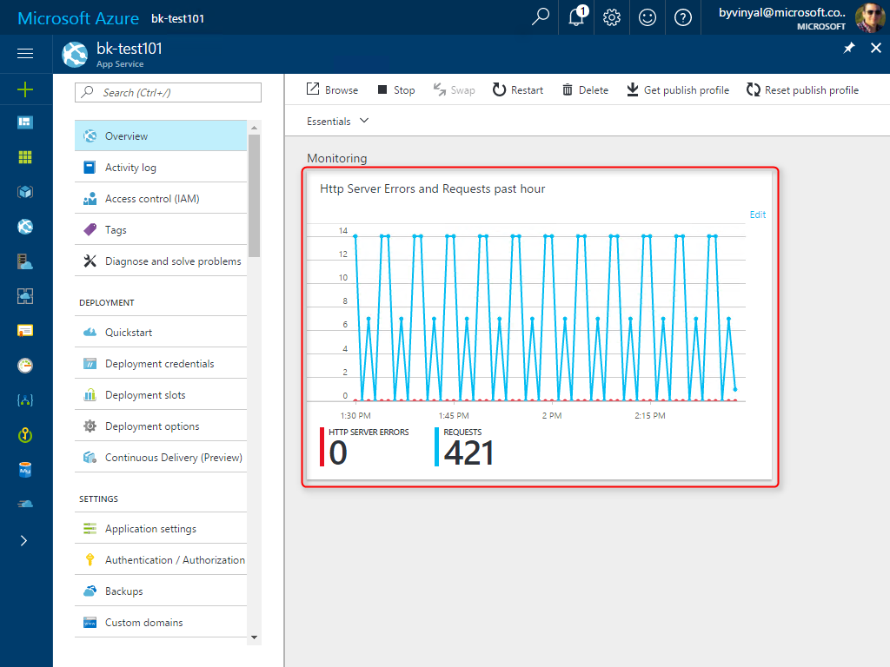
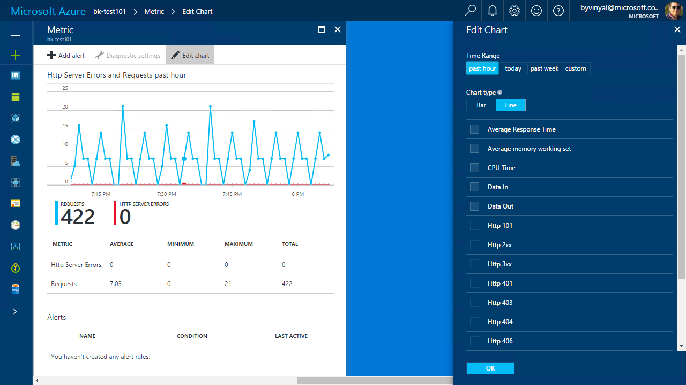
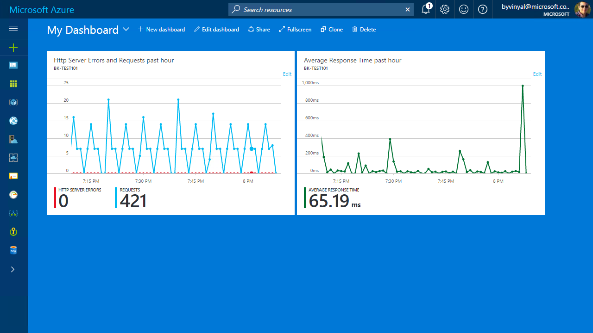
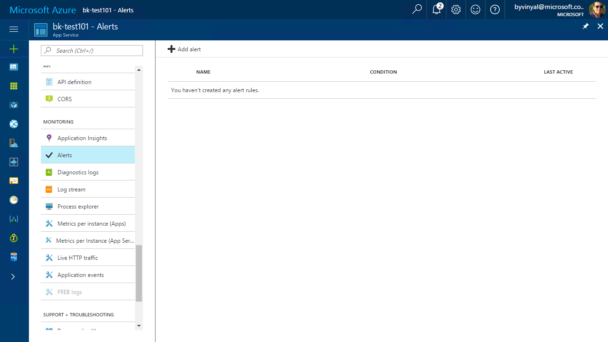
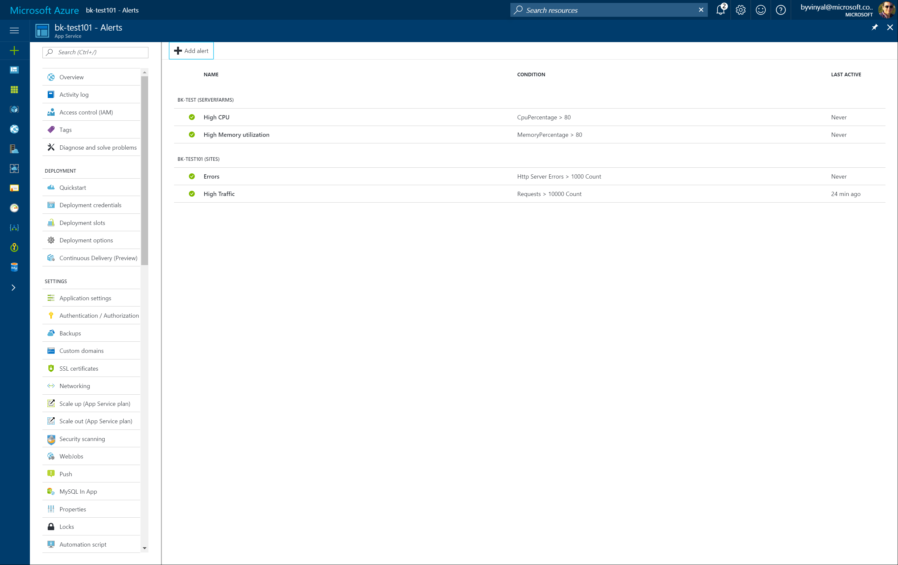

# Monitor App Service
This tutorial is a continuation from the [Create App Service Web App](app-service-web-get-started-dotnet.md). Following these steps, you can learn to set up metrics based configurable charts and alerts. 

## Step 1 - View App Service metrics
For any app hosted in app service, you must monitor the app and the App Service plan.

- **App** metrics provide information about http requests/failures and average response time.
- **App Service Plan** metrics provide information about resource utilization.

Azure portal has a quick way to visually inspect the metrics of your app using **Azure Monitor**.

- Go to the **Overview** blade of the app you want to monitor.

- You can view the app's metrics as a Monitoring tile.
- You can then edit the tile and configure what metrics to view and the time range to display.

> [!TIP]
> Learn more about Azure Monitor with the following links:
> - [Get started with Azure Monitor](..\monitoring-and-diagnostics\monitoring-overview.md)
> - [Azure Metrics](..\monitoring-and-diagnostics\monitoring-overview-metrics.md)
> - [Supported metrics with Azure Monitor](..\monitoring-and-diagnostics\monitoring-supported-metrics.md#microsoftwebsites-including-functions)

- You can pin custom charts to the dashboard for easy access and quick reference.

## Step 2 - Configure Alerts
Alerts allow you to automate the monitoring of your application.

- Go to the **Overview** blade of the app you want to monitor.
- From the menu, navigate to **Monitoring** > **Alerts**
- Select **[+] Add Alert**
- Configure the alert as needed.

As an example, a simple set of Alerts to monitor an app hosted in app service could include:

> [!NOTE]
> The values provided are for illustration purposes only. Values vary depending on the applications traffic patterns and characteristics under load.

|   App Service Plan              | |
|---------------------------------|---------------------------------|
|  - High CPU utilization         |  - High memory utilization      |
|    - Resource: App Service Plan |    - Resource: App Service Plan |
|    - Metric: CPU Percentage     |    - Metric: Memory Percentage  |
|    - Condition: Greater than    |    - Condition: Greater than    |
|    - Threshold: 80%             |    - Threshold: 80%             |
|    - Period: 5 minutes          |    - Period: 5 minutes          |

|   Web App                       | |
|---------------------------------|-------------------------------|
|  - High failure rate            |  - High traffic               |
|    - Resource: Web App          |    - Resource: Web App        |
|    - Metric: HTTP Server Errors |    - Metric: Requests         |
|    - Condition: Greater than    |    - Condition: Greater than  |
|    - Threshold: 1,000           |    - Threshold: 10,000        |
|    - Period: 5 minutes          |    - Period: 5 minutes        |

> [!TIP]
> Learn more about Azure Alerts with the following links:
> - [What are alerts in Microsoft Azure](..\monitoring-and-diagnostics\monitoring-overview-alerts.md)
> - [Take Action On Metrics](..\monitoring-and-diagnostics\monitoring-overview.md)

## Next steps
Check out **Application Insights** for more advanced monitoring capabilities for App Service:

 - [What is Application Insights](..\application-insights\app-insights-overview.md)
 - [Monitor Azure web app performance with Application Insights](..\application-insights\app-insights-azure-web-apps.md)
 - [Monitor availability and responsiveness of any web site with Application Insights](..\application-insights\app-insights-monitor-web-app-availability.md)