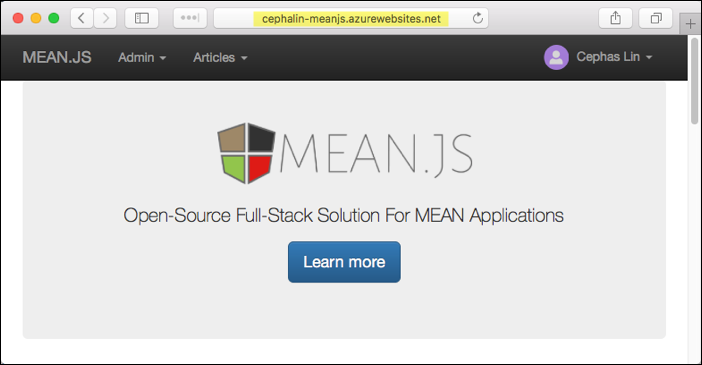
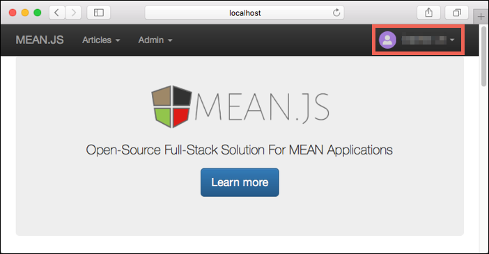
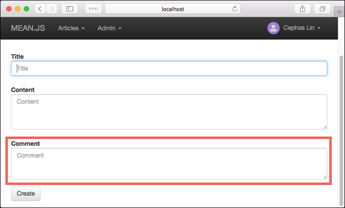
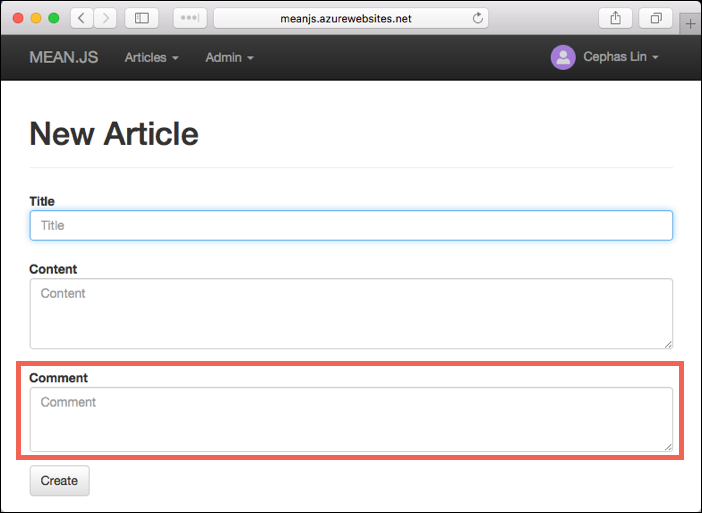
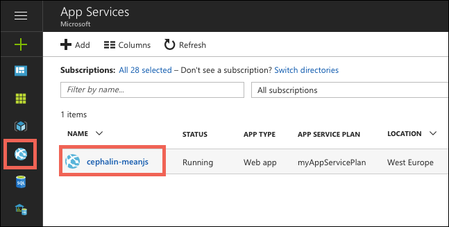
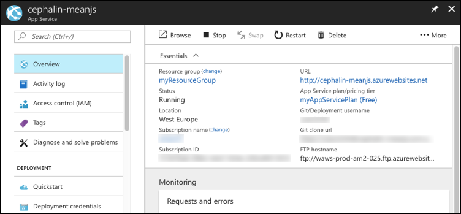

# Build a Node.js and MongoDB web app in Azure

Azure Web Apps provides a highly scalable, self-patching web hosting service. This tutorial shows how to create a Node.js web app in Azure and connect it to a MongoDB database. When you're done, you'll have a MEAN application (MongoDB, Express, AngularJS, and Node.js) running in [Azure App Service](app-service-web-overview.md). For simplicity, the sample application uses the [MEAN.js web framework](http://meanjs.org/).



What you'll learn:

> [!div class="checklist"]
> * Create a MongoDB database in Azure
> * Connect a Node.js app to MongoDB
> * Deploy the app to Azure
> * Update the data model and redeploy the app
> * Stream diagnostic logs from Azure
> * Manage the app in the Azure portal

## Prerequisites

To complete this tutorial:

1. [Install Git](https://git-scm.com/)
1. [Install Node.js and NPM](https://nodejs.org/)
1. [Install Gulp.js](http://gulpjs.com/) (required by [MEAN.js](http://meanjs.org/docs/0.5.x/#getting-started))
1. [Install and run MongoDB Community Edition](https://docs.mongodb.com/manual/administration/install-community/) 

[!INCLUDE [quickstarts-free-trial-note](../../includes/quickstarts-free-trial-note.md)]

[!INCLUDE [cloud-shell-try-it.md](../../includes/cloud-shell-try-it.md)]

If you choose to install and use the CLI locally, this topic requires that you are running the Azure CLI version 2.0 or later. Run `az --version` to find the version. If you need to install or upgrade, see [Install Azure CLI 2.0]( /cli/azure/install-azure-cli). 

## Test local MongoDB

Open the terminal window and `cd` to the `bin` directory of your MongoDB installation. 

Run `mongo` in the terminal to connect to your local MongoDB server.

```bash
mongo
```

If your connection is successful, then your MongoDB database is already running. If not, make sure that your local MongoDB database is started by following the steps at [Install MongoDB Community Edition](https://docs.mongodb.com/manual/administration/install-community/). Often, MongoDB is installed, but you still need to start it by running `mongod`. 

When you're done testing your MongoDB database, type Ctrl+C in the terminal. 

## Create local Node.js app

In this step, you set up the local Node.js project.

### Clone the sample application

Open the terminal window and `cd` to a working directory.  

Run the following command to clone the sample repository. 

```bash
git clone https://github.com/Azure-Samples/meanjs.git
```

This sample repository contains a copy of the [MEAN.js repository](https://github.com/meanjs/mean). It is modified to run on App Service (for more information, see the MEAN.js repository [README file](https://github.com/Azure-Samples/meanjs/blob/master/README.md)).

### Run the application

Run the following commands to install the required packages and start the application.

```bash
cd meanjs
npm install
npm start
```

When the app is fully loaded, you see something similar to the following message:

```
--
MEAN.JS - Development Environment

Environment:     development
Server:          http://0.0.0.0:3000
Database:        mongodb://localhost/mean-dev
App version:     0.5.0
MEAN.JS version: 0.5.0
--
```

Navigate to http://localhost:3000 in a browser. Click **Sign Up** in the top menu and create a test user. 

The MEAN.js sample application stores user data in the database. If you are successful at creating a user and signing in, then your app is writing data to the local MongoDB database.



Select **Admin > Manage Articles** to add some articles.

To stop Node.js at any time, press Ctrl+C in the terminal. 

## Create production MongoDB

In this step, you create a MongoDB database in Azure. When your app is deployed to Azure, it uses this cloud database.

For MongoDB, this tutorial uses [Azure Cosmos DB](/azure/documentdb/). Cosmos DB supports MongoDB client connections.

### Log in to Azure

You'll use the Azure CLI 2.0 to create the resources needed to host your app in Azure. Log in to your Azure subscription with the [az login](/cli/azure/#login) command and follow the on-screen directions.

```azurecli-interactive
az login
```   

### Create a resource group

Create a resource group with the [az group create](/cli/azure/group#create) command.

[!INCLUDE [Resource group intro](../../includes/resource-group.md)]

The following example creates a resource group in the West Europe region.

```azurecli-interactive
az group create --name myResourceGroup --location "West Europe"
```

Use the [az appservice list-locations](/cli/azure/appservice#list-locations) Azure CLI command to list available locations. 

### Create a Cosmos DB account

Create a Cosmos DB account with the [az cosmosdb create](/cli/azure/cosmosdb#create) command.

In the following command, substitute a unique Cosmos DB name for the *\<cosmosdb_name>* placeholder. This name is used as the part of the Cosmos DB endpoint, `https://<cosmosdb_name>.documents.azure.com/`, so the name needs to be unique across all Cosmos DB accounts in Azure. The name must contain only lowercase letters, numbers, and the hyphen (-) character, and must be between 3 and 50 characters long.

```azurecli-interactive
az cosmosdb create \
    --name <cosmosdb_name> \
    --resource-group myResourceGroup \
    --kind MongoDB
```

The *--kind MongoDB* parameter enables MongoDB client connections.

When the Cosmos DB account is created, the Azure CLI shows information similar to the following example:

```json
{
  "consistencyPolicy":
  {
    "defaultConsistencyLevel": "Session",
    "maxIntervalInSeconds": 5,
    "maxStalenessPrefix": 100
  },
  "databaseAccountOfferType": "Standard",
  "documentEndpoint": "https://<cosmosdb_name>.documents.azure.com:443/",
  "failoverPolicies": 
  ...
  < Output truncated for readability >
}
```

## Connect app to production MongoDB

In this step, you connect your MEAN.js sample application to the Cosmos DB database you just created, using a MongoDB connection string. 

### Retrieve the database key

To connect to the Cosmos DB database, you need the database key. Use the [az cosmosdb list-keys](/cli/azure/cosmosdb#list-keys) command to retrieve the primary key.

```azurecli-interactive
az cosmosdb list-keys --name <cosmosdb_name> --resource-group myResourceGroup
```

The Azure CLI shows information similar to the following example:

```json
{
  "primaryMasterKey": "RS4CmUwzGRASJPMoc0kiEvdnKmxyRILC9BWisAYh3Hq4zBYKr0XQiSE4pqx3UchBeO4QRCzUt1i7w0rOkitoJw==",
  "primaryReadonlyMasterKey": "HvitsjIYz8TwRmIuPEUAALRwqgKOzJUjW22wPL2U8zoMVhGvregBkBk9LdMTxqBgDETSq7obbwZtdeFY7hElTg==",
  "secondaryMasterKey": "Lu9aeZTiXU4PjuuyGBbvS1N9IRG3oegIrIh95U6VOstf9bJiiIpw3IfwSUgQWSEYM3VeEyrhHJ4rn3Ci0vuFqA==",
  "secondaryReadonlyMasterKey": "LpsCicpVZqHRy7qbMgrzbRKjbYCwCKPQRl0QpgReAOxMcggTvxJFA94fTi0oQ7xtxpftTJcXkjTirQ0pT7QFrQ=="
}
```

Copy the value of `primaryMasterKey`. You need this information in the next step.

<a name="devconfig"></a>
### Configure the connection string in your Node.js application

In your MEAN.js repository, open _config/env/production.js_.

In the `db` object, update the value of `uri`:

* Replace the two *\<cosmosdb_name>* placeholders with your Cosmos DB database name.
* Replace the *\<primary_master_key>* placeholder with the key you copied in the previous step.

The following code shows the `db` object:

```javascript
db: {
  uri: 'mongodb://<cosmosdb_name>:<primary_master_key>@<cosmosdb_name>.documents.azure.com:10250/mean?ssl=true&sslverifycertificate=false',
  ...
},
```

The `ssl=true` option is required because [Cosmos DB requires SSL](../cosmos-db/connect-mongodb-account.md#connection-string-requirements). 

Save your changes.

### Test the application in production mode 

Run the following command to minify and bundle scripts for the production environment. This process generates the files needed by the production environment.

```bash
gulp prod
```

Run the following command to use the connection string you configured in _config/env/production.js_.

```bash
NODE_ENV=production node server.js
```

`NODE_ENV=production` sets the environment variable that tells Node.js to run in the production environment.  `node server.js` starts the Node.js server with `server.js` in your repository root. This is how your Node.js application is loaded in Azure. 

When the app is loaded, check to make sure that it's running in the production environment:

```
--
MEAN.JS

Environment:     production
Server:          http://0.0.0.0:8443
Database:        mongodb://<cosmosdb_name>:<primary_master_key>@<cosmosdb_name>.documents.azure.com:10250/mean?ssl=true&sslverifycertificate=false
App version:     0.5.0
MEAN.JS version: 0.5.0
```

Navigate to http://localhost:8443 in a browser. Click **Sign Up** in the top menu and create a test user. If you are successful creating a user and signing in, then your app is writing data to the Cosmos DB database in Azure. 

In the terminal, stop Node.js by typing Ctrl+C. 

## Deploy app to Azure

In this step, you deploy your MongoDB-connected Node.js application to Azure App Service.

### Create an App Service plan

Create an App Service plan with the [az appservice plan create](/cli/azure/appservice/plan#create) command. 

[!INCLUDE [app-service-plan](../../includes/app-service-plan.md)]

The following example creates an App Service plan named _myAppServicePlan_ using the **FREE** pricing tier:

```azurecli-interactive
az appservice plan create --name myAppServicePlan --resource-group myResourceGroup --sku FREE
```

When the App Service plan is created, the Azure CLI shows information similar to the following example:

```json 
{ 
  "adminSiteName": null,
  "appServicePlanName": "myAppServicePlan",
  "geoRegion": "North Europe",
  "hostingEnvironmentProfile": null,
  "id": "/subscriptions/00000000-0000-0000-0000-000000000000/resourceGroups/myResourceGroup/providers/Microsoft.Web/serverfarms/myAppServicePlan", 
  "kind": "app",
  "location": "North Europe",
  "maximumNumberOfWorkers": 1,
  "name": "myAppServicePlan",
  ...
  < Output has been truncated for readability >
} 
```

### Create a web app

Create a web app in the `myAppServicePlan` App Service plan with the [az webapp create](/cli/azure/webapp#create) command. 

The web app gives you a hosting space to deploy your code and provides a URL for you to view the deployed application. Use  to create the web app. 

In the following command, replace the *\<app_name>* placeholder with a unique app name. This name is used as the part of the default URL for the web app, so the name needs to be unique across all apps in Azure App Service. 

```azurecli-interactive
az webapp create --name <app_name> --resource-group myResourceGroup --plan myAppServicePlan
```

When the web app has been created, the Azure CLI shows information similar to the following example: 

```json 
{
  "availabilityState": "Normal",
  "clientAffinityEnabled": true,
  "clientCertEnabled": false,
  "cloningInfo": null,
  "containerSize": 0,
  "dailyMemoryTimeQuota": 0,
  "defaultHostName": "<app_name>.azurewebsites.net",
  "enabled": true,
  ...
  < Output has been truncated for readability >
}
```

### Configure an environment variable

Earlier in the tutorial, you hardcoded the database connection string in _config/env/production.js_. In keeping with security best practice, you want to keep this sensitive data out of your Git repository. For your app running in Azure, you'll use an environment variable instead.

In App Service, you set environment variables as _app settings_ by using the [az webapp config appsettings update](/cli/azure/webapp/config/appsettings#update) command. 

The following example configures a `MONGODB_URI` app setting in your Azure web app. Replace the *\<app_name>*, *\<cosmosdb_name>*, and *\<primary_master_key>* placeholders.

```azurecli-interactive
az webapp config appsettings update \
    --name <app_name> \
    --resource-group myResourceGroup \
    --settings MONGODB_URI="mongodb://<cosmosdb_name>:<primary_master_key>@<cosmosdb_name>.documents.azure.com:10250/mean?ssl=true"
```

In Node.js code, you access this app setting with `process.env.MONGODB_URI`, just like you would access any environment variable. 

Now, undo your changes to _config/env/production.js_ with the following command:

```bash
git checkout -- .
```

Open _config/env/production.js_ again. Note that the default MEAN.js app is already configured to use the `MONGODB_URI` environment variable that you created.

```javascript
db: {
  uri: ... || process.env.MONGODB_URI || ...,
  ...
},
```

### Configure local git deployment 

Use the [az webapp deployment user set](/cli/azure/webapp/deployment/user#set) command to create credentials for deployment.

You can deploy your application to Azure App Service in various ways including FTP, local Git, GitHub, Visual Studio Team Services, and BitBucket. For FTP and local Git, it is necessary to have a deployment user configured on the server to authenticate your deployment. This deployment user is account-level and is different from your Azure subscription account. You only need to configure this deployment user once.

In the following command, replace *\<user-name>* and *\<password>* with a new user name and password. The user name must be unique. The password must be at least eight characters long, with two of the following three elements:  letters, numbers, symbols. If you get a ` 'Conflict'. Details: 409` error, change the username. If you get a ` 'Bad Request'. Details: 400` error, use a stronger password.

```azurecli-interactive
az appservice web deployment user set --user-name <username> --password <password>
```

Record the user name and password for use in later steps when you deploy the app.

Use the [az webapp deployment source config-local-git](/cli/azure/webapp/deployment/source#config-local-git) command to configure local Git access to the Azure web app. 

```azurecli-interactive
az webapp deployment source config-local-git --name <app_name> --resource-group myResourceGroup
```

When the deployment user is configured, the Azure CLI shows the deployment URL for your Azure web app in the following format:

```bash 
https://<username>@<app_name>.scm.azurewebsites.net:443/<app_name>.git 
``` 

Copy the output from the terminal, as it will be used in the next step. 

### Push to Azure from Git

Add an Azure remote to your local Git repository. 

```bash
git remote add azure <paste_copied_url_here> 
```

Push to the Azure remote to deploy your Node.js application. You will be prompted for the password you supplied earlier as part of the creation of the deployment user. 

```bash
git push azure master
```

During deployment, Azure App Service communicates its progress with Git.

```bash
Counting objects: 5, done.
Delta compression using up to 4 threads.
Compressing objects: 100% (5/5), done.
Writing objects: 100% (5/5), 489 bytes | 0 bytes/s, done.
Total 5 (delta 3), reused 0 (delta 0)
remote: Updating branch 'master'.
remote: Updating submodules.
remote: Preparing deployment for commit id '6c7c716eee'.
remote: Running custom deployment command...
remote: Running deployment command...
remote: Handling node.js deployment.
.
.
.
remote: Deployment successful.
To https://<app_name>.scm.azurewebsites.net/<app_name>.git
 * [new branch]      master -> master
``` 

You may notice that the deployment process runs [Gulp](http://gulpjs.com/) after `npm install`. App Service does not run Gulp or Grunt tasks during deployment, so this sample repository has two additional files in its root directory to enable it: 

- _.deployment_ - This file tells App Service to run `bash deploy.sh` as the custom deployment script.
- _deploy.sh_ - The custom deployment script. If you review the file, you will see that it runs `gulp prod` after `npm install` and `bower install`. 

You can use this approach to add any step to your Git-based deployment. If you restart your Azure web app at any point, App Service doesn't rerun these automation tasks.

### Browse to the Azure web app 

Browse to the deployed web app using your web browser. 

```bash 
http://<app_name>.azurewebsites.net 
``` 

Click **Sign Up** in the top menu and create a dummy user. 

If you are successful and the app automatically signs in to the created user, then your MEAN.js app in Azure has connectivity to the MongoDB (Cosmos DB) database. 


Select **Admin > Manage Articles** to add some articles. 

**Congratulations!** You're running a data-driven Node.js app in Azure App Service.

## Update data model and redeploy

In this step, you change the `article` data model and publish your change to Azure.

### Update the data model

Open _modules/articles/server/models/article.server.model.js_.

In `ArticleSchema`, add a `String` type called `comment`. When you're done, your schema code should look like this:

```javascript
var ArticleSchema = new Schema({
  ...,
  user: {
    type: Schema.ObjectId,
    ref: 'User'
  },
  comment: {
    type: String,
    default: '',
    trim: true
  }
});
```

### Update the articles code

Update the rest of your `articles` code to use `comment`.

There are five files you need to modify: the server controller and the four client views. 

Open _modules/articles/server/controllers/articles.server.controller.js_.

In the `update` function, add an assignment for `article.comment`. The following code shows the completed `update` function:

```javascript
exports.update = function (req, res) {
  var article = req.article;

  article.title = req.body.title;
  article.content = req.body.content;
  article.comment = req.body.comment;

  ...
};
```

Open _modules/articles/client/views/view-article.client.view.html_.

Just above the closing `</section>` tag, add the following line to display `comment` along with the rest of the article data:

```HTML
<p class="lead" ng-bind="vm.article.comment"></p>
```

Open _modules/articles/client/views/list-articles.client.view.html_.

Just above the closing `</a>` tag, add the following line to display `comment` along with the rest of the article data:

```HTML
<p class="list-group-item-text" ng-bind="article.comment"></p>
```

Open _modules/articles/client/views/admin/list-articles.client.view.html_.

Inside the `<div class="list-group">` element and just above the closing `</a>` tag, add the following line to display `comment` along with the rest of the article data:

```HTML
<p class="list-group-item-text" data-ng-bind="article.comment"></p>
```

Open _modules/articles/client/views/admin/form-article.client.view.html_.

Find the `<div class="form-group">` element that contains the submit button, which looks like this:

```HTML
<div class="form-group">
  <button type="submit" class="btn btn-default">{{vm.article._id ? 'Update' : 'Create'}}</button>
</div>
```

Just above this tag, add another `<div class="form-group">` element that lets people edit the `comment` field. Your new element should look like this:

```HTML
<div class="form-group">
  <label class="control-label" for="comment">Comment</label>
  <textarea name="comment" data-ng-model="vm.article.comment" id="comment" class="form-control" cols="30" rows="10" placeholder="Comment"></textarea>
</div>
```

### Test your changes locally

Save all your changes.

Test your changes in production mode again.

```bash
gulp prod
NODE_ENV=production node server.js
```

> [!NOTE]
> Remember that your _config/env/production.js_ has been reverted, and the `MONGODB_URI` environment variable is only set in your Azure web app and not on your local machine. If you look at the config file, you find that the production configuration defaults to use a local MongoDB database. This makes sure that you don't touch production data when you test your code changes locally.

Navigate to `http://localhost:8443` in a browser and make sure that you're signed in.

Select **Admin > Manage Articles**, then add an article by selecting the **+** button.

You see the new `Comment` textbox now.



In the terminal, stop Node.js by typing Ctrl+C. 

### Publish changes to Azure

Commit your changes in Git, then push the code changes to Azure.

```bash
git commit -am "added article comment"
git push azure master
```

Once the `git push` is complete, navigate to your Azure web app and try out the new functionality.



If you added any articles earlier, you still can see them. Existing data in your Cosmos DB is not lost. Also, your updates to the data schema and leaves your existing data intact.

## Stream diagnostic logs 

While your Node.js application runs in Azure App Service, you can get the console logs piped to your terminal. That way, you can get the same diagnostic messages to help you debug application errors.

To start log streaming, use the [az webapp log tail](/cli/azure/webapp/log#tail) command.

```azurecli-interactive
az webapp log tail --name <app_name> --resource-group myResourceGroup
``` 

Once log streaming has started, refresh your Azure web app in the browser to get some web traffic. You now see console logs piped to your terminal.

Stop log streaming at any time by typing Ctrl+C. 

## Manage your Azure web app

Go to the [Azure portal](https://portal.azure.com) to see the web app you created.

From the left menu, click **App Services**, then click the name of your Azure web app.



By default, the portal shows your web app's **Overview** page. This page gives you a view of how your app is doing. Here, you can also perform basic management tasks like browse, stop, start, restart, and delete. The tabs on the left side of the page show the different configuration pages you can open.



[!INCLUDE [cli-samples-clean-up](../../includes/cli-samples-clean-up.md)]

<a name="next"></a>
## Next steps

What you learned:

> [!div class="checklist"]
> * Create a MongoDB database in Azure
> * Connect a Node.js app to MongoDB
> * Deploy the app to Azure
> * Update the data model and redeploy the app
> * Stream logs from Azure to your terminal
> * Manage the app in the Azure portal

Advance to the next tutorial to learn how to map a custom DNS name to your web app.

> [!div class="nextstepaction"] 
> [Map an existing custom DNS name to Azure Web Apps](app-service-web-tutorial-custom-domain.md)
