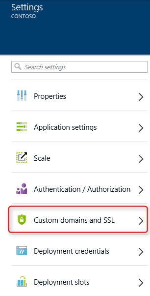
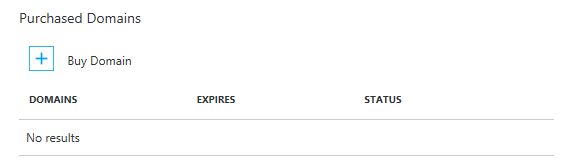

<properties
	pageTitle="How to buy a custom domain name in Azure App Service Web Apps"
	description="Learn how to buy a custom domain name with a web app in Azure App Service."
	services="app-service\web"
	documentationCenter=""
	authors="rmcmurray"
	manager="wpickett"
	editor=""/>

<tags
	ms.service="app-service-web"
	ms.workload="web"
	ms.tgt_pltfrm="na"
	ms.devlang="na"
	ms.topic="article"
	ms.date="06/24/2016"
	ms.author="robmcm"/>

# Buy and Configure a custom domain name in Azure App Service

> [AZURE.SELECTOR]
- [Buy Domain for Web Apps](custom-dns-web-site-buydomains-web-app.md)
- [Web Apps with External Domains](web-sites-custom-domain-name.md)
- [Web Apps with Traffic Manager](web-sites-traffic-manager-custom-domain-name.md)
- [GoDaddy](web-sites-godaddy-custom-domain-name.md)

[AZURE.INCLUDE [websites-cloud-services-css-guided-walkthrough](../../includes/websites-cloud-services-css-guided-walkthrough.md)]

When you create a web app, Azure assigns it to a subdomain of azurewebsites.net. For example, if your web app is named **contoso**, the URL is **contoso.azurewebsites.net**. Azure also assigns a virtual IP address.

For a production web app, you probably want users to see a custom domain name. This article explains how to buy and configure a custom domain with [App Service Web Apps](http://go.microsoft.com/fwlink/?LinkId=529714). 

[AZURE.INCLUDE [introfooter](../../includes/custom-dns-web-site-intro-notes.md)]

## Overview

> [AZURE.NOTE] Please do not attempt to purchase a domain using a subscription that does not have an Active Credit Card associated with it. This could result in your subscription being disabled. 

If you don't have a domain name for your web app, you can easily buy one on [Azure Portal](https://portal.azure.com/). During the purchase process you can choose to have WWW and root domain's DNS records be mapped to your web app automatically. You also can manage your domain right inside Azure Portal.

Use the following steps to buy domain names and assign to your web app.

1. In your browser, open the [Azure Portal](https://portal.azure.com/).

2. In the **Web Apps** tab, click the name of your web app, select **Settings**, and then select **Custom domains and SSL**

	

3. In the **Custom domains and SSL** blade, click **Buy domains**.

	

4. In the **Buy Domains** blade, use the text box to type the domain name you want to buy and hit Enter. The suggested available domains will be shown just below the text box. Select what domain you want to buy. You can choose to purchase multiple domains at once. 

  

5. Click the **Contact Information** and fill the domain's contact information form.

  

> [AZURE.NOTE] It is very important that you fill out all required fields with as much accuracy as possible, especially the email address. In case of purchasing the domain without "Privacy protection", you might be asked to verify your email before the domain becomes active. In some cases, incorrect data for contact information will result in failure to purchase domains. 

6. Now you can choose to,

	a) "Auto renew" your domain every year
	
	b) Opt-in for "Privacy protection" which is included in the purchase price for FREE
	
	c) "Assign default hostnames" for WWW and root domain to the current Web App. 

  
  
> [AZURE.NOTE] Option C configures DNS bindings and Hostname bindings automatically for you.  This way, your Web App can be accessed using custom domain as soon as the purchase is complete (baring DNS propagation delays in few cases). In case, your Web App is behind Azure Traffic Manager, you will not see an option to assign root domain, as A-Records do not work with the Traffic Manager. 
>
>You can always assign the domains/sub-domains purchased through one Web App to another Web App and vice-versa. See step 8 for more details. 

	
7. Click the **Select** on **Buy Domains** blade, then you will see the purchase information on **Purchase confirmation** blade. If you accept the legal terms and click **Buy**, your order will be submitted and you can monitor the purchasing process on **Notification**. Domain purchase can take few minutes to complete. 

  

  

8. If you successfully ordered a domain, you can manage the domain and assign to your web app. Click the **"..."** at the right side of your domain. Then you can **Cancel purchase** or **Manage domain**. Click **Manage domain**, then we can bind **subdomain** to our web app on **Manage domain** blade. If you want to bind a  **subdomain** to a different Web App then perform this step from within the context of the respective Web App. Over here you an choose to assign the domain to Traffic manager endpoint (if Web App is behind TM) by simply selecting Traffic manager name from the Drop down menu. By doing this, domain/subdomain will be automatically assigned to all the Web Apps behind that Traffic Manager endpoint. 

	

> [AZURE.NOTE] You can "Cancel purchase" within 5 days for full refund. After 5 days you will not be able to "Cancel purchase", instead you will see an option to "Delete" the domain. Deleting the domain will result in releasing it from your subscription without refund and will become available domain. 

Once configuration has completed, the custom domain name will be listed in the **Hostname bindings** section of your web app.

At this point, you should be able to enter the custom domain name in your browser and see that it successfully takes you to your web app.
 
## What happens to the custom domain you bought

The custom domain you bought in the **Custom domains and SSL** blade is tied to the Azure subscription. As an Azure resource, this
custom domain is separate and independent from the App Service app that you first bought the domain for. This means that:

- Within the Azure portal, you can use the custom domain you bought for more than one App Service app, and not just for the app
that you first bought the custom domain for. 
- You can manage all the custom domains you bought in the Azure subscription by going to the **Custom domains and SSL** blade of *any* 
App Service app in that subscription.
- You can assign any App Service app from the same Azure subscription to a subdomain within that custom domain.
- If you decide to delete an App Service app, you can choose not to delete the custom domain it is bound to if you want to keep using 
it for other apps.

## If you can't see the custom domain you bought

If you have bought the custom domain from within the **Custom domains and SSL** blade, but cannot see the custom domain under 
**Managed domains**, verify the following things:

- The custom domain creation may not have finished. Check the notification bell at the top of the Azure portal for the progress.
- The custom domain creation may have failed for some reason. Check the notification bell at the top of the Azure portal for the progress.
- The custom domain may have succeeded but the blade may not be refreshed yet. Try reopening the **Custom domains and SSL** blade.
- You may have deleted the custom domain at some point. Check the audit logs by clicking **Settings** > **Audit Logs** from your app's 
main blade. 
- The **Custom domains and SSL** blade you're looking in may belong to an app that's created in a different Azure subscription. Switch to
another app in a different subscription and check its **Custom domains and SSL** blade.  
    Within the portal, you won't be able to see or manage custom domains created in a different Azure subscription than the app. 
    However, if you click **Advanced management** in the domain's **Manage domain** blade, you'll be redirected to the domain
    provider's website, where you'll be able to 
    [manually configure your custom domain like any external custom domain](web-sites-custom-domain-name.md) 
    for apps created in a different Azure subscription. 

