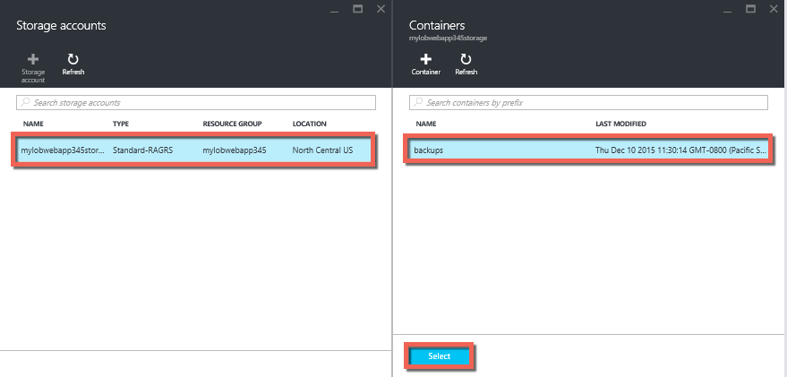
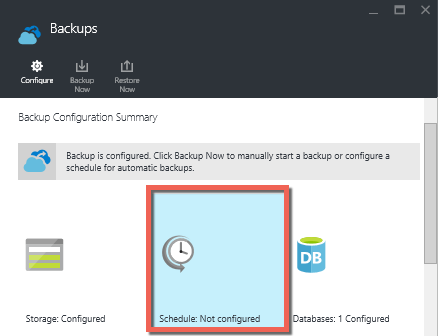

<properties 
	pageTitle="Back up your app in Azure" 
	description="Learn how to create backups of your apps in Azure App Service." 
	services="app-service" 
	documentationCenter="" 
	authors="cephalin" 
	manager="wpickett" 
	editor="jimbe"/>

<tags 
	ms.service="app-service" 
	ms.workload="na" 
	ms.tgt_pltfrm="na" 
	ms.devlang="na" 
	ms.topic="article" 
	ms.date="07/06/2016" 
	ms.author="cephalin"/>

# Back up your app in Azure

The Backup and Restore feature in [Azure App Service](../app-service/app-service-value-prop-what-is.md) lets you easily
create app backups manually or automatically. You can restore your app to a previous state, or create a new app based on 
one of your original app's backups. 

For information on restoring an app from backup, see [Restore an app in Azure](web-sites-restore.md).

## What gets backed up 
App Service can back up the following information:

* App configuration
* File content
* Any Azure SQL Databases or Azure MySQL (ClearDB) databases connected to your app (you can choose which ones to include 
in the backup)

This information is backed up to the Azure storage account and container that you specify. 

> [AZURE.NOTE] Each backup is a complete offline copy of your app, not an incremental update.

## Requirements and restrictions

* The Backup and Restore feature requires the App Service plan to be in the **Standard** tier or higher. For more information 
about scaling your App Service plan to use a higher tier, see [Scale up an app in Azure](web-sites-scale.md). Note that 
**Premium** tier allows a greater number of daily backups than **Standard** tier.
* You need an Azure storage account and container in the same subscription as the app that 
you want to back up. For more information on Azure storage accounts, see the 
[links](#moreaboutstorage) at the end of this article.
* Backups can be up to 10GB of app and database content. You will get an error if the backup size exceeds this limit. 

## Create a manual backup

2. In the [Azure Portal](https://portal.azure.com), navigate to your app's blade, select **Settings**, then **Backups**. The **Backups** blade will be displayed.
	
	![Backups page][ChooseBackupsPage]

	>[AZURE.NOTE] If you see the message below, click it to upgrade your App Service plan before you can proceed with backups.
	See [Scale up an app in Azure](web-sites-scale.md) for more information.  
	>

3. In the **Backups** blade, click **Storage: Not configured** to configure a storage account.

	![Choose storage account][ChooseStorageAccount]
	
4. Choose your backup destination by selecting a **Storage Account** and **Container**. The storage account must belong to the same subscription as the app you want to back up. If you wish, you can create a new storage account or a new container in the respective blades. When you're done, click **Select**.
	
	
	
5. In the **Configure Backup Settings** blade that is still left open, click **Database Settings**, then select the databases you want to include in the backups (SQL database or MySQL), then click **OK**.  

	

	> [AZURE.NOTE] 	For a database to appear in this list, its connection string must exist in the **Connection strings** section of the **Application settings** blade for your app.

6. In the **Configure Backup Settings** blade, click **Save**.	

7. In the command bar of the **Backups** blade, click **Backup Now**.
	
	![BackUpNow button][BackUpNow]
	
	You will see a progress message during the backup process.

After you have configured a storage account and container for backups, you can make a manual backup at any time.  

## Configure automated backups

1. In the **Backups** blade, click **Schedule: Not configured**. 

	
	
1. On the **Backup Schedule Settings** blade, set **Scheduled Backup** to **On**, then configure the backup schedule as desired and click **OK**.
	
	![Enable automated backups][SetAutomatedBackupOn]
	
4. In the **Configure Backup Settings** blade that is still left open, click **Storage Settings**, then choose your backup destination by selecting a **Storage Account** and **Container**. The storage account must belong to the same subscription as the app you want to back up. If you wish, you can create a new storage account or a new container in the respective blades. When you're done, click **Select**.
	
	
	
5. In the **Configure Backup Settings** blade, click **Database Settings**, then select the databases you want to include in the backups (SQL database or MySQL), then click **OK**.  

	

	> [AZURE.NOTE] 	For a database to appear in this list, its connection string must exist in the **Connection strings** section of the **Application settings** blade for your app.

6. In the **Configure Backup Settings** blade, click **Save**.	

## Backup just part of your app

Sometimes you don't want to backup everything on your app. Here are a few examples:

-	You [set up weekly backups](web-sites-backup.md#configure-automated-backups) of your app that contains static content that never changes, such as old blog posts or images.
-	Your app has over 10GB of content (that's the max amount you can backup at a time).
-	You don't want to back up the log files.

Partial backups will let you choose exactly which files you want to back up.

### Exclude files from your backup

To exclude files and folders from your backups, create a `_backup.filter` file in the D:\home\site\wwwroot folder of your app and specify the list of files and folders you want to exclude in there. An easy way to access this is through the [Kudu Console](https://github.com/projectkudu/kudu/wiki/Kudu-console). 

Suppose you have an app that contains log files and static images from past years that are never going to change. You already have a full backup of the app that includes the old images. Now you want to backup the app every day, but you don't want to pay for storing log files or the static image files that never change.

![Logs Folder][LogsFolder]
![Images Folder][ImagesFolder]
	
The below steps show how you would exclude these files from the backup.

1. Go to `http://{yourapp}.scm.azurewebsites.net/DebugConsole` and identify the folders that you want to exclude from your backups. In this example, you would want to exclude the following files and folders shown in that UI:

		D:\home\site\wwwroot\Logs
		D:\home\LogFiles
		D:\home\site\wwwroot\Images\2013
		D:\home\site\wwwroot\Images\2014
		D:\home\site\wwwroot\Images\brand.png

	[AZURE.NOTE] The last line shows that you can exclude individuals files as well as folders.

2. Create a file called `_backup.filter` and put the list above in the file, but remove `D:\home`. List one directory or file per line. So the content of the file should be:

    \site\wwwroot\Logs
    \LogFiles
    \site\wwwroot\Images\2013
    \site\wwwroot\Images\2014
    \site\wwwroot\Images\brand.png

3. Upload this file to the `D:\home\site\wwwroot\` directory of your site using [ftp](web-sites-deploy.md#ftp) or any other method. If you wish, you can create the file directly in `http://{yourapp}.scm.azurewebsites.net/DebugConsole` and insert the content there.

4. Run backups the same way you would normally do it, [manually](#create-a-manual-backup) or [automatically](#configure-automated-backups).

Now, any files and folders that are specified in `_backup.filter` will be excluded from the backup. In this example, the log files and the 2013 and 2014 image files will no longer be backed up, as well as brand.png.

>[AZURE.NOTE] You restore partial backups of your site the same way you would [restore a regular backup](web-sites-restore.md). The restore process will do the right thing.
>
>When a full backup is restored, all content on the site is replaced with whatever is in the backup. If a file is on the site but not in the backup it gets deleted. But when a partial backup is restored, any content that is located in one of the blacklisted directories, or any blacklisted file, is left as is.

## How backups are stored

After you have made one or more backups for your app, the backups will be visible on the **Containers** blade of your storage account, as well as your app. In the storage account, each backup consists of a .zip file that contains the backup data and an .xml file that contains a manifest of the .zip file contents. You can unzip and browse these files if you want to access your backups without actually performing an app restore.

The database backup for the app is stored in the root of the .zip file. For a SQL database, this is a BACPAC file (no file extension) and can be imported. To create a new SQL database based on the BACPAC export, see [Import a BACPAC File to Create a New User Database](http://technet.microsoft.com/library/hh710052.aspx).

> [AZURE.WARNING] Altering any of the files in your **websitebackups** container can cause the backup to become invalid and therefore non-restorable.

## Next Steps
For information on restoring an app from a backup, see [Restore an app in Azure](web-sites-restore.md). You can also backup and restore App Service apps
using REST API (see [Use REST to back up and restore App Service apps](websites-csm-backup.md)).

>[AZURE.NOTE] If you want to get started with Azure App Service before signing up for an Azure account, go to [Try App Service](http://go.microsoft.com/fwlink/?LinkId=523751), where you can immediately create a short-lived starter web app in App Service. No credit cards required; no commitments.

<!-- IMAGES -->
[ChooseBackupsPage]: ./media/web-sites-backup/01ChooseBackupsPage.png
[ChooseStorageAccount]: ./media/web-sites-backup/02ChooseStorageAccount.png
[IncludedDatabases]: ./media/web-sites-backup/03IncludedDatabases.png
[BackUpNow]: ./media/web-sites-backup/04BackUpNow.png
[BackupProgress]: ./media/web-sites-backup/05BackupProgress.png
[SetAutomatedBackupOn]: ./media/web-sites-backup/06SetAutomatedBackupOn.png
[Frequency]: ./media/web-sites-backup/07Frequency.png
[StartDate]: ./media/web-sites-backup/08StartDate.png
[StartTime]: ./media/web-sites-backup/09StartTime.png
[SaveIcon]: ./media/web-sites-backup/10SaveIcon.png
[ImagesFolder]: ./media/web-sites-backup/11Images.png
[LogsFolder]: ./media/web-sites-backup/12Logs.png
[GhostUpgradeWarning]: ./media/web-sites-backup/13GhostUpgradeWarning.png
 
