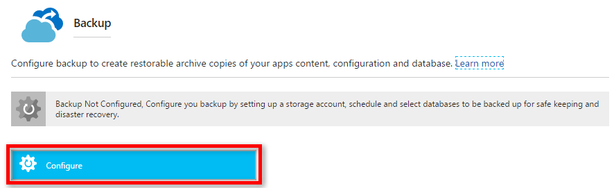
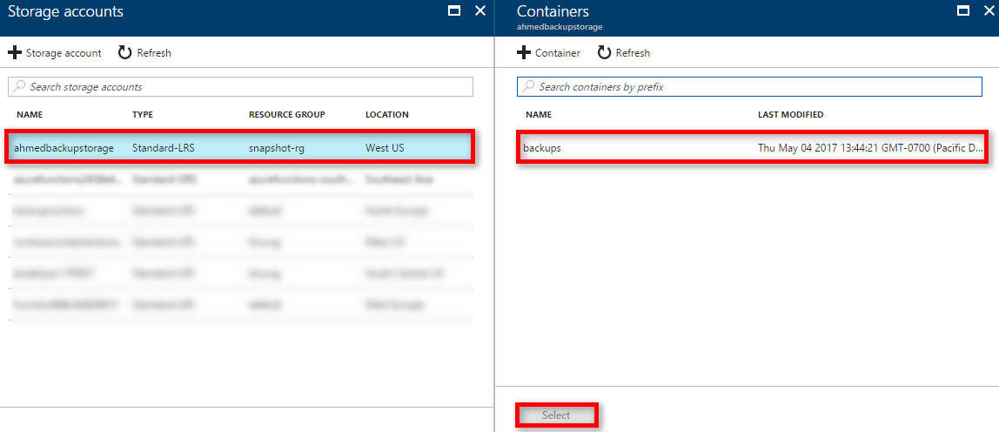

# Back up your app in Azure
The Back up and Restore feature in [Azure App Service](../app-service/app-service-value-prop-what-is.md) lets you easily
create app backups manually or on a schedule. You can restore the app to a snapshot of a previous state by overwriting the existing app or restoring to another app. 

For information on restoring an app from backup, see [Restore an app in Azure](web-sites-restore.md).

<a name="whatsbackedup"></a>

## What gets backed up
App Service can backup the following information to an Azure storage account and container that you have configured your app to use. 

* App configuration
* File content
* Database connected to your app

The following database solutions are supported with backup feature: 
   - [SQL Database](https://azure.microsoft.com/en-us/services/sql-database/)
   - [Azure Database for MySQL (Preview)](https://azure.microsoft.com/en-us/services/mysql)
   - [Azure Database for PostgreSQL (Preview)](https://azure.microsoft.com/en-us/services/postgres)
   - [ClearDB MySQL](https://azuremarketplace.microsoft.com/en-us/marketplace/apps/SuccessBricksInc.ClearDBMySQLDatabase?tab=Overview)
   - [MySQL in-app](https://blogs.msdn.microsoft.com/appserviceteam/2017/03/06/announcing-general-availability-for-mysql-in-app)
 

> [!NOTE]
>  Each backup is a complete offline copy of your app, not an incremental update.
>  

<a name="requirements"></a>

## Requirements and restrictions
* The Back up and Restore feature requires the App Service plan to be in the **Standard** tier or **Premium** tier. For more information 
  about scaling your App Service plan to use a higher tier, see [Scale up an app in Azure](web-sites-scale.md).  
  **Premium** tier allows a greater number of daily back ups than **Standard** tier.
* You need an Azure storage account and container in the same subscription as the app that 
  you want to backup. For more information on Azure storage accounts, see the 
  [links](#moreaboutstorage) at the end of this article.
* Backups can be up to 10 GB of app and database content. If the backup size exceeds this limit, you get an error .

<a name="manualbackup"></a>

## Create a manual backup
1. In the [Azure Portal](https://portal.azure.com), navigate to your app's blade, select **Backups**. The **Backups** blade will be displayed.
   
    ![Backups page][ChooseBackupsPage]
   
   > [!NOTE]
   > If you see the message below, click it to upgrade your App Service plan before you can proceed with backups.
   > See [Scale up an app in Azure](web-sites-scale.md) for more information.  
   > 
   > 
   > 

2. In the **Backup** blade, Click **Configure**

3. In the **Backup Configuration** blade, click **Storage: Not configured** to configure a storage account.
   
    ![Choose storage account][ChooseStorageAccount]
4. Choose your backup destination by selecting a **Storage Account** and **Container**. The storage account must belong to the same subscription as the app you want to back up. If you wish, you can create a new storage account or a new container in the respective blades. When you're done, click **Select**.
   
    
5. In the **Backup Configuration** blade that is still left open, you can configure **Backup Database**, then select the databases you want to include in the backups (SQL database or MySQL), then click **OK**.  
   
    
   
   > [!NOTE]
   > For a database to appear in this list, its connection string must exist in the **Connection strings** section of the **Application settings** blade for your app.
   > 
   > 
6. In the **Backup Configuration** blade, click **Save**.    
7. In the  **Backups** blade, click **Backup**.
   
    ![BackUpNow button][BackUpNow]
   
    You see a progress message during the backup process.

Once the storage account and container is configured you can initiate a manual backup at any time.  

<a name="automatedbackups"></a>

## Configure automated backups
1. In the **Backup Configuration** blade, set **Scheduled backup** to **On**. 
   
    
2. Backup schedule options will show up, set **Scheduled Backup** to **On**, then configure the backup schedule as desired and click **OK**.
   
    ![Enable automated backups][SetAutomatedBackupOn]

<a name="partialbackups"></a>

## Configure Partial Backups
Sometimes you don't want to backup everything on your app. Here are a few examples:

* You [set up weekly backups](web-sites-backup.md#configure-automated-backups) of your app that contains static content that never changes, such as old blog posts or images.
* Your app has over 10 GB of content (that's the max amount you can backup at a time).
* You don't want to backup the log files.

Partial backups allows you choose exactly which files you want to backup.

### Exclude files from your backup
Suppose you have an app that contains log files and static images that have been backup once and are not going to change. In such cases you can exclude those folders and files from being stored in your future backups. To exclude files and folders from your backups, create a `_backup.filter` file in the `D:\home\site\wwwroot` folder of your app. Specify the list of files and folders you want to exclude in this file. 

An easy way to access your files is to use Kudu . Click **Advanced Tools -> Go** setting for your web app to access Kudu.

![Kudu using portal][kudu-portal]

Identify the folders that you want to exclude from your backups.  For example , you want to filter out the highlighted folder and files.

![Images Folder][ImagesFolder]

Create a file called `_backup.filter` and put the list above in the file, but remove `D:\home`. List one directory or file per line. So the content of the file should be:
 ```bash
    \site\wwwroot\Images\brand.png
    \site\wwwroot\Images\2014
    \site\wwwroot\Images\2013
```

Upload `_backup.filter` file to the `D:\home\site\wwwroot\` directory of your site using [ftp](web-sites-deploy.md#ftp) or any other method. If you wish, you can create the file directly using Kudu  `DebugConsole` and insert the content there.

Run backups the same way you would normally do it, [manually](#create-a-manual-backup) or [automatically](#configure-automated-backups). Now, any files and folders that are specified in `_backup.filter` is excluded from the future backups scheduled or manually initiated. 

> [!NOTE]
> You restore partial backups of your site the same way you would [restore a regular backup](web-sites-restore.md). The restore process does the right thing.
> 
> When a full backup is restored, all content on the site is replaced with whatever is in the backup. If a file is on the site, but not in the backup it gets deleted. But when a partial backup is restored, any content that is located in one of the blacklisted directories, or any blacklisted file, is left as is.
> 


<a name="aboutbackups"></a>

## How backups are stored
After you have made one or more backups for your app, the backups are visible on the **Containers** blade of your storage account, and your app. In the storage account, each backup consists of a`.zip` file that contains the backup data and an `.xml` file that contains a manifest of the `.zip` file contents. You can unzip and browse these files if you want to access your backups without actually performing an app restore.

The database backup for the app is stored in the root of the.zip file. For a SQL database, this is a BACPAC file (no file extension) and can be imported. To create a SQL database based on the BACPAC export, see [Import a BACPAC File to Create a New User Database](http://technet.microsoft.com/library/hh710052.aspx).

> [!WARNING]
> Altering any of the files in your **websitebackups** container can cause the backup to become invalid and therefore non-restorable.
> 
> 

<a name="nextsteps"></a>

## Next Steps
For information on restoring an app from a backup, see [Restore an app in Azure](web-sites-restore.md). You can also backup and restore App Service apps
using REST API (see [Use REST to backup and restore App Service apps](websites-csm-backup.md)).


<!-- IMAGES -->
[ChooseBackupsPage]: ./media/web-sites-backup/01ChooseBackupsPage1.png
[ChooseStorageAccount]: ./media/web-sites-backup/02ChooseStorageAccount-1.png
[IncludedDatabases]: ./media/web-sites-backup/03IncludedDatabases.png
[BackUpNow]: ./media/web-sites-backup/04BackUpNow1.png
[BackupProgress]: ./media/web-sites-backup/05BackupProgress.png
[SetAutomatedBackupOn]: ./media/web-sites-backup/06SetAutomatedBackupOn1.png
[Frequency]: ./media/web-sites-backup/07Frequency.png
[StartDate]: ./media/web-sites-backup/08StartDate.png
[StartTime]: ./media/web-sites-backup/09StartTime.png
[SaveIcon]: ./media/web-sites-backup/10SaveIcon.png
[ImagesFolder]: ./media/web-sites-backup/11Images.png
[LogsFolder]: ./media/web-sites-backup/12Logs.png
[GhostUpgradeWarning]: ./media/web-sites-backup/13GhostUpgradeWarning.png
[kudu-portal]:./media/web-sites-backup/kudu-portal.PNG

