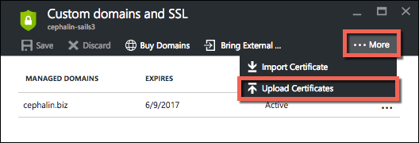
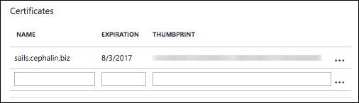
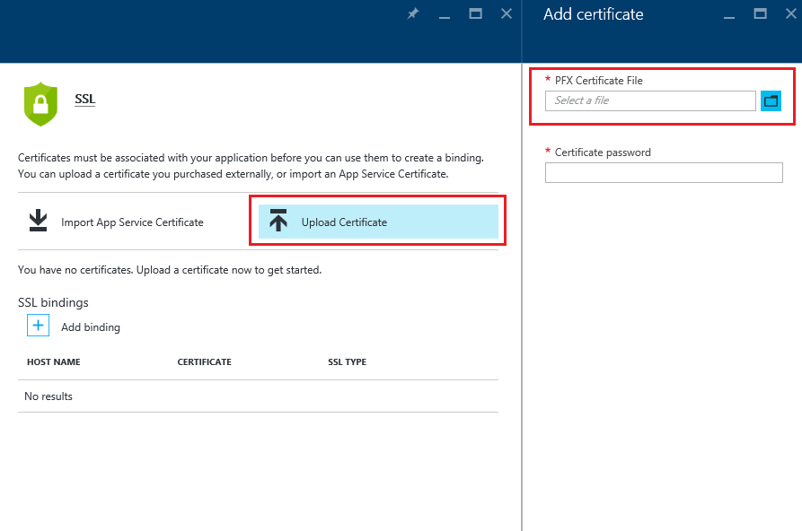

<properties
	pageTitle="Secure your custom-domain-enabled app with HTTPS | Microsoft Azure"
	description="Learn how to enable SSL with an Azure App Service."
	services="app-service"
	documentationCenter=".net"
	authors="cephalin"
	manager="wpickett"
	editor="jimbe"
	tags="top-support-issue"/>

<tags
	ms.service="app-service"
	ms.workload="na"
	ms.tgt_pltfrm="na"
	ms.devlang="na"
	ms.topic="article"
	ms.date="08/05/2016"
	ms.author="cephalin"/>

# Secure your custom-domain-enabled app with HTTPS

> [AZURE.SELECTOR]
- [Buy SSL Certificate for Web Apps](web-sites-purchase-ssl-web-site.md)
- [Enable SSL for your custom domain](web-sites-configure-ssl-certificate.md)

This article shows you how to enable HTTPS for a web app, a mobile app backend, or an API app in 
[Azure App Service](../app-service/app-service-value-prop-what-is.md) that uses a custom domain name. 
It covers server-only authentication. If you need mutual authentication (including client authentication), see 
[How To Configure TLS Mutual Authentication for App Service](app-service-web-configure-tls-mutual-auth.md).

To secure with HTTPS an app that has a custom domain name, you add a certificate for that domain
name. By default, Azure secures the **\*.azurewebsites.net** wildcard domain with a single SSL certificate, 
so your clients can alreay access your app at **https://*&lt;appname>*.azurewebsites.net**. But if you want to use 
a custom domain, like **contoso.com**, **www.contoso.com**, and **\*.contoso.com**, the default certificate 
can't secure that. Furthermore, like all
[wildcard certificates](https://casecurity.org/2014/02/26/pros-and-cons-of-single-domain-multi-domain-and-wildcard-certificates/), 
the default certificate is not as secure as using a custom domain an a certificate for that custom domain.   

>[AZURE.NOTE] You can get help from Azure experts anytime on the [Azure forums](https://azure.microsoft.com/support/forums/). 
For more personalized support, go to [Azure Support](https://azure.microsoft.com/support/options/) and 
click **Get Support**.

## What you need
To secure your custom domain name with HTTPS, you bind a custom SSL certificate to that custom domain in Azure. To do
this, you need the following:

- **Configure the custom domain** - App Service only allows adding a certificate for a domain name that's already 
configured in your app. For instructions, see [Map a custom domain name to an Azure app](web-sites-custom-domain-name.md). 
- **Scale up to Basic tier or higher** App Service plans in lower pricing tiers don't support custom SSL 
certificates. For instructions, see [Scale up an app in Azure](web-sites-scale.md). 
- **Get an SSL certificate** - If you do not already have one, you will need to obtain one from a trusted 
[certificate authority](http://en.wikipedia.org/wiki/Certificate_authority) (CA). The certificate must meet all of the
following requirements:

	- It is signed by a CA (private CA servers are not supported).
	- It contains a private key.
	- It is created for key exchange, and exported to a .PFX file.
	- It uses a minimum of 2048-bit encryption.
	- Its subject name matches the custom domain it needs to secure. To secure multiple domains with one 
	certificate, you need to use a wildcard name (e.g. **\*.contoso.com**) or specify subjectAltName 
	values.
	- It is merged with all **[intermediate certificates](http://en.wikipedia.org/wiki/Intermediate_certificate_authorities)** 
	used by your CA. Otherwise, you may run into irreproducible interoperability problems on some clients.

		>[AZURE.NOTE] The easiest way to get an SSL certificate that meets all the requirements is to 
		[buy one in the Azure portal directly](web-sites-purchase-ssl-web-site.md). This article shows you 
		how to do it manually and then bind it to your custom domain in App Service.
		>	
		> **Elliptic Curve Cryptography (ECC) certificates** are supported by App Service, but outside the scope
		of this article. Work with your CA on the exact steps to create ECC certificates.

## Step 1. Get an SSL certificate

To get an SSL certificate for use with App Service, you start by deciding what type of SSL certificate to buy,
because CAs provide the various types at different price points. To secure a single domain name (**www.contoso.com**), 
you just need a basic certificate. To secure multiple domain names (**contoso.com** *and* **www.contoso.com** 
*and* **mail.contoso.com**), you need either a [wildcard certificate](http://en.wikipedia.org/wiki/Wildcard_certificate) 
or a certificate with [Subject Alternate Name](http://en.wikipedia.org/wiki/SubjectAltName) (`subjectAltName`).

Once you know which SSL certificate to buy, you submit a Certificate Signing Request (CSR) to a CA, then get the
certificate back from the CA, and then generate a .pfx file from the certificate. You can do this using the tool 
of your choice. Here are instructions for the common tools:

- [Certreq.exe](#bkmk_certreq) - the Windows utility for creating certificate requests. 
It has been part of Windows since Windows XP/Windows Server 2000.
- [IIS Manager](#bkmk_iismgr) - The tool of choice if you're already familiar with it.
- [OpenSSL](#bkmk_openssl) - an [open-source, cross-platform tool](https://www.openssl.org). Use it 
to help you get an SSL certificate from any platform.
- [subjectAltName using OpenSSL](#bkmk_subjectaltname) - use these steps if you need `subjectAltName` certificates.

If you want to test the setup in App Service before buying a certificate, you can generate a 
[self-signed certificate](https://en.wikipedia.org/wiki/Self-signed_certificate). This tutorial gives you two ways 
of doing this:

- [Self-signed certificate with Certreq.exe](#bkmk_sscertreq)
- [Self-signed certificate with OpenSSL](#bkmk_ssopenssl)

### Get a certificate using Certreq.exe

1. Create a new file (e.g. **myrequest.txt**), and copy into it the following text, and save it in a working directory. 
Replace the `<your-domain>` placeholder with the custom domain name of your app.

		[NewRequest]
		Subject = "CN=<your-domain>"  ; E.g. "CN=www.contoso.com", or "CN=*.contoso.com" for a wildcard certificate
		Exportable = TRUE
		KeyLength = 2048              ; Required minimum is 2048
		KeySpec = 1
		KeyUsage = 0xA0
		MachineKeySet = True
		ProviderName = "Microsoft RSA SChannel Cryptographic Provider"
		ProviderType = 12
		HashAlgorithm = SHA256

		[EnhancedKeyUsageExtension]
		OID=1.3.6.1.5.5.7.3.1         ; Server Authentication

	For more information on the options specified above, as well as other available options, see the [Certreq reference documentation](https://technet.microsoft.com/library/dn296456.aspx).

4. In a command prompt, `CD` into your working directory and run the following command to create the CSR:

		certreq -new myrequest.txt myrequest.csr

	**myrequest.csr** is now created in your current working directory.

5. Submit **myrequest.csr** to a CA to obtain an SSL certificate. You either upload the file, or copy its 
content from a text editor into a web form.

	For a list of CAs, see [Windows and Windows Phone 8 SSL Root Certificate Program (Members CAs)][cas] on the Microsoft TechNet Wiki.

6. Once the CA has responded to you with a certificate (.CER) file, save this file to *the computer that generated the CSR*, 
and then run the following command to complete the pending CSR.

		certreq -accept -user <certificate-name>.cer

	This command doesn't create any new file, but stores the finished certificate in the Windows certificate 
	store.

6. If your CA uses intermediate certificates, install them before you proceed. They are usually
provided as a separate download from your CA, and in several formats for different web server 
types. Select the version for Microsoft IIS.

	Once you have downloaded the certificates, right click each of them in Windows Explorer and select 
	**Install certificate**. Use the default values in the **Certificate Import Wizard**, and continue 
	selecting **Next** until the import has completed.

7. To export your SSL certificate from the certificate store, press `Win`+`R` and run **certmgr.msc** to launch Certificate Manager. 
Select **Personal** > **Certificates**. In the **Issued To** column, you should see an entry with your custom domain name, and 
the CA you used to generate the certificate in the **Issued By** column.

	![insert image of cert manager here][certmgr]

9. Right click the certificate and select **All Tasks** > **Export**. In the **Certificate Export Wizard**, click **Next**, then 
select **Yes, export the private key**, and then click **Next** again.

	![Export the private key][certwiz1]

10. Select **Personal Information Exchange - PKCS #12**, **Include all certificates in the certificate path if possible**, and 
**Export all extended properties**. Then, click **Next**.

	![include all certs and extended properties][certwiz2]

11. Select **Password**, and then enter and confirm the password. Click **Next**.

	![specify a password][certwiz3]

12. Provide a path and filename for the exported certificate, with the extension **.pfx**. Click **Next** to finish.

	![provide a file path][certwiz4]

You are now ready to upload the exported PFX file to App Service. See [Step 2. Upload and bind the custom SSL certificate](#bkmk_configuressl).

### Get a certificate using the IIS Manager

1. Generate a CSR with IIS Manager to send to the CA. For more information on generating a CSR, see 
[Request an Internet Server Certificate (IIS 7)][iiscsr].

3. Submit your CSR to a CA to get an SSL certificate. For a list of CAs, see 
[Windows and Windows Phone 8 SSL Root Certificate Program (Members CAs)][cas] on the Microsoft TechNet Wiki.

3. Complete the CSR with the certificate that the CA sends back to you. For more information on completing the CSR, see 
[Install an Internet Server Certificate (IIS 7)][installcertiis].

4. If your CA uses intermediate certificates, install them before you proceed. They are usually provided as a 
separate download from your CA, and in several formats for different web server types. Select the 
version for Microsoft IIS.

	Once you have downloaded the certificates, right click each of them in Windows Explorer and select **Install certificate**. 
	Use the default values in the **Certificate Import Wizard**, and continue selecting **Next** until the import has completed.

4. Export the SSL certificate from IIS Manager. For more information on exporting the certificate, see 
[Export a Server Certificate (IIS 7)][exportcertiis]. 

	>[AZURE.IMPORTANT] In the **Certificate Export Wizard**, make sure you select **Yes, export the private key**  
	>
	>![Export the private key][certwiz1]  
	>
	> and also select **Personal Information Exchange - PKCS #12**, **Include all certificates in the certificate path if possible**, and 
	**Export all extended properties**.
	>
	>![include all certs and extended properties][certwiz2]

You are now ready to upload the exported PFX file to App Service. See [Step 2. Upload and bind the custom SSL certificate](#bkmk_configuressl).

### Get a certificate using OpenSSL

1. In a command-line terminal, `CD` into a working directory generate a private key and CSR by running the 
following command:

		openssl req -sha256 -new -nodes -keyout myserver.key -out server.csr -newkey rsa:2048

2. When prompted, enter the appropriate information. For example:

 		Country Name (2 letter code)
        State or Province Name (full name) []: Washington
        Locality Name (eg, city) []: Redmond
        Organization Name (eg, company) []: Microsoft
        Organizational Unit Name (eg, section) []: Azure
        Common Name (eg, YOUR name) []: www.microsoft.com
        Email Address []:

		Please enter the following 'extra' attributes to be sent with your certificate request

       	A challenge password []:

	When finished, you should have two files in your working directory: **myserver.key** and **server.csr**. 
	The **server.csr** contains the CSR, and you need **myserver.key** later.

3. Submit your CSR to a CA to get an SSL certificate. For a list of CAs, see 
[Windows and Windows Phone 8 SSL Root Certificate Program (Members CAs)][cas] on the Microsoft TechNet Wiki.

4. Once the CA sends you the requested certificate, save it to a file named **myserver.crt** in your working 
directory. If your CA provides it in a text format, simply copy the content into **myserver.crt** in a text 
editor and save it. Your file should look like below:

		-----BEGIN CERTIFICATE-----
		MIIDJDCCAgwCCQCpCY4o1LBQuzANBgkqhkiG9w0BAQUFADBUMQswCQYDVQQGEwJV
		UzELMAkGA1UECBMCV0ExEDAOBgNVBAcTB1JlZG1vbmQxEDAOBgNVBAsTB0NvbnRv
		c28xFDASBgNVBAMTC2NvbnRvc28uY29tMB4XDTE0MDExNjE1MzIyM1oXDTE1MDEx
		NjE1MzIyM1owVDELMAkGA1UEBhMCVVMxCzAJBgNVBAgTAldBMRAwDgYDVQQHEwdS
		ZWRtb25kMRAwDgYDVQQLEwdDb250b3NvMRQwEgYDVQQDEwtjb250b3NvLmNvbTCC
		ASIwDQYJKoZIhvcNAQEBBQADggEPADCCAQoCggEBAN96hBX5EDgULtWkCRK7DMM3
		enae1LT9fXqGlbA7ScFvFivGvOLEqEPD//eLGsf15OYHFOQHK1hwgyfXa9sEDPMT
		3AsF3iWyF7FiEoR/qV6LdKjeQicJ2cXjGwf3G5vPoIaYifI5r0lhgOUqBxzaBDZ4
		xMgCh2yv7NavI17BHlWyQo90gS2X5glYGRhzY/fGp10BeUEgIs3Se0kQfBQOFUYb
		ktA6802lod5K0OxlQy4Oc8kfxTDf8AF2SPQ6BL7xxWrNl/Q2DuEEemjuMnLNxmeA
		Ik2+6Z6+WdvJoRxqHhleoL8ftOpWR20ToiZXCPo+fcmLod4ejsG5qjBlztVY4qsC
		AwEAATANBgkqhkiG9w0BAQUFAAOCAQEAVcM9AeeNFv2li69qBZLGDuK0NDHD3zhK
		Y0nDkqucgjE2QKUuvVSPodz8qwHnKoPwnSrTn8CRjW1gFq5qWEO50dGWgyLR8Wy1
		F69DYsEzodG+shv/G+vHJZg9QzutsJTB/Q8OoUCSnQS1PSPZP7RbvDV9b7Gx+gtg
		7kQ55j3A5vOrpI8N9CwdPuimtu6X8Ylw9ejWZsnyy0FMeOPpK3WTkDMxwwGxkU3Y
		lCRTzkv6vnHrlYQxyBLOSafCB1RWinN/slcWSLHADB6R+HeMiVKkFpooT+ghtii1
		A9PdUQIhK9bdaFicXPBYZ6AgNVuGtfwyuS5V6ucm7RE6+qf+QjXNFg==
		-----END CERTIFICATE-----

5. In the command-line terminal, run the following command to export **myserver.pfx** from **myserver.key** and **myserver.crt**:

		openssl pkcs12 -export -out myserver.pfx -inkey myserver.key -in myserver.crt

	When prompted, define a password to secure the .pfx file.

	> [AZURE.NOTE] If your CA uses intermediate certificates, you must include them with the `-certfile` parameter. They are 
	usually provided as a separate download from your CA, and in several formats for different 
	web server types. Select the version with the `.pem` extension.
	>
	> Your `openssl -export` command should look like the following example, which creates a .pfx file that includes the 
	intermediate certificates from the **intermediate-cets.pem** file:
	>  
	> `openssl pkcs12 -chain -export -out myserver.pfx -inkey myserver.key -in myserver.crt -certfile intermediate-cets.pem`

You are now ready to upload the exported PFX file to App Service. See [Step 2. Upload and bind the custom SSL certificate](#bkmk_configuressl).

### Get a SubjectAltName certificate using OpenSSL

1. Create a new file named **sancert.cnf**, copy the following text into it, and save it in a working directory:

		# -------------- BEGIN custom sancert.cnf -----
		HOME = .
		oid_section = new_oids
		[ new_oids ]
		[ req ]
		default_days = 730
		distinguished_name = req_distinguished_name
		encrypt_key = no
		string_mask = nombstr
		req_extensions = v3_req # Extensions to add to certificate request
		[ req_distinguished_name ]
		countryName = Country Name (2 letter code)
		countryName_default =
		stateOrProvinceName = State or Province Name (full name)
		stateOrProvinceName_default =
		localityName = Locality Name (eg, city)
		localityName_default =
		organizationalUnitName  = Organizational Unit Name (eg, section)
		organizationalUnitName_default  =
		commonName              = Your common name (eg, domain name)
		commonName_default      = www.mydomain.com
		commonName_max = 64
		[ v3_req ]
		subjectAltName=DNS:ftp.mydomain.com,DNS:blog.mydomain.com,DNS:*.mydomain.com
		# -------------- END custom sancert.cnf -----

	In the line that begins with `subjectAltName`, replace the value with all domain names you want to secure (in addition to 
	`commonName`). For example:

		subjectAltName=DNS:sales.contoso.com,DNS:support.contoso.com,DNS:fabrikam.com

	You do not need to change any other field, including `commonName`. You will be prompted to specify them in the next few steps.

1. In a command-line terminal, `CD` into your working directory and run the following command:

		openssl req -sha256 -new -nodes -keyout myserver.key -out server.csr -newkey rsa:2048 -config sancert.cnf

2. When prompted, enter the appropriate information. For example:

 		Country Name (2 letter code) []: US
        State or Province Name (full name) []: Washington
        Locality Name (eg, city) []: Redmond
        Organizational Unit Name (eg, section) []: Azure
        Your common name (eg, domain name) []: www.microsoft.com

	Once finished, you should have two files in your working directory: **myserver.key** and **server.csr**. 
	The **server.csr** contains the CSR, and you need **myserver.key** later.

3. Submit your CSR to a CA to get an SSL certificate. For a list of CAs, see 
[Windows and Windows Phone 8 SSL Root Certificate Program (Members CAs)][cas] on the Microsoft TechNet Wiki.

4. Once the CA sends you the requested certificate, save it to a file named **myserver.crt**. If your CA provides it
in a text format, simply copy the content into **myserver.crt** in a text editor and save it. The file 
should look like below:

		-----BEGIN CERTIFICATE-----
		MIIDJDCCAgwCCQCpCY4o1LBQuzANBgkqhkiG9w0BAQUFADBUMQswCQYDVQQGEwJV
		UzELMAkGA1UECBMCV0ExEDAOBgNVBAcTB1JlZG1vbmQxEDAOBgNVBAsTB0NvbnRv
		c28xFDASBgNVBAMTC2NvbnRvc28uY29tMB4XDTE0MDExNjE1MzIyM1oXDTE1MDEx
		NjE1MzIyM1owVDELMAkGA1UEBhMCVVMxCzAJBgNVBAgTAldBMRAwDgYDVQQHEwdS
		ZWRtb25kMRAwDgYDVQQLEwdDb250b3NvMRQwEgYDVQQDEwtjb250b3NvLmNvbTCC
		ASIwDQYJKoZIhvcNAQEBBQADggEPADCCAQoCggEBAN96hBX5EDgULtWkCRK7DMM3
		enae1LT9fXqGlbA7ScFvFivGvOLEqEPD//eLGsf15OYHFOQHK1hwgyfXa9sEDPMT
		3AsF3iWyF7FiEoR/qV6LdKjeQicJ2cXjGwf3G5vPoIaYifI5r0lhgOUqBxzaBDZ4
		xMgCh2yv7NavI17BHlWyQo90gS2X5glYGRhzY/fGp10BeUEgIs3Se0kQfBQOFUYb
		ktA6802lod5K0OxlQy4Oc8kfxTDf8AF2SPQ6BL7xxWrNl/Q2DuEEemjuMnLNxmeA
		Ik2+6Z6+WdvJoRxqHhleoL8ftOpWR20ToiZXCPo+fcmLod4ejsG5qjBlztVY4qsC
		AwEAATANBgkqhkiG9w0BAQUFAAOCAQEAVcM9AeeNFv2li69qBZLGDuK0NDHD3zhK
		Y0nDkqucgjE2QKUuvVSPodz8qwHnKoPwnSrTn8CRjW1gFq5qWEO50dGWgyLR8Wy1
		F69DYsEzodG+shv/G+vHJZg9QzutsJTB/Q8OoUCSnQS1PSPZP7RbvDV9b7Gx+gtg
		7kQ55j3A5vOrpI8N9CwdPuimtu6X8Ylw9ejWZsnyy0FMeOPpK3WTkDMxwwGxkU3Y
		lCRTzkv6vnHrlYQxyBLOSafCB1RWinN/slcWSLHADB6R+HeMiVKkFpooT+ghtii1
		A9PdUQIhK9bdaFicXPBYZ6AgNVuGtfwyuS5V6ucm7RE6+qf+QjXNFg==
		-----END CERTIFICATE-----

5. In the command-line terminal, run the following command to export **myserver.pfx** from **myserver.key** and **myserver.crt**:

		openssl pkcs12 -export -out myserver.pfx -inkey myserver.key -in myserver.crt

	When prompted, define a password to secure the .pfx file.

	> [AZURE.NOTE] If your CA uses intermediate certificates, you must include them with the `-certfile` parameter. They 
	are usually provided as a separate download from your CA, and in several formats for different 
	web server types. Select the version with the `.pem` extension).
	>
	> Your `openssl -export` command should look like the following example, which creates a .pfx file that includes the 
	intermediate certificates from the **intermediate-cets.pem** file:
	>  
	> `openssl pkcs12 -chain -export -out myserver.pfx -inkey myserver.key -in myserver.crt -certfile intermediate-cets.pem`

You are now ready to upload the exported PFX file to App Service. See [Step 2. Upload and bind the custom SSL certificate](#bkmk_configuressl).

### Generate a self-signed certificate using Certreq.exe ###

>[AZURE.IMPORTANT] Self-signed certificates should be used for testing only. Most browsers will return errors when 
visiting a website that's secured by a self-signed certificate. Some browsers may even refuse to navigate to the site. 

1. Create a text file (e.g. **mycert.txt**), copy into it the following text, and save the file in a working directory. 
Replace the `<your-domain>` placeholder with the custom domain name of your app.

		[NewRequest]
		Subject = "CN=<your-domain>"  ; E.g. "CN=www.contoso.com", or "CN=*.contoso.com" for a wildcard certificate
		Exportable = TRUE
		KeyLength = 2048              ; KeyLength can be 2048, 4096, 8192, or 16384 (required minimum is 2048)
		KeySpec = 1
		KeyUsage = 0xA0
		MachineKeySet = True
		ProviderName = "Microsoft RSA SChannel Cryptographic Provider"
		ProviderType = 12
		HashAlgorithm = SHA256
		RequestType = Cert            ; Self-signed certificate
		ValidityPeriod = Years
		ValidityPeriodUnits = 1

		[EnhancedKeyUsageExtension]
		OID=1.3.6.1.5.5.7.3.1         ; Server Authentication

	The important parameter is `RequestType = Cert`, which specifies a self-signed certificate. For more information on the 
	options specified above, as well as other available options, see the [Certreq reference documentation](https://technet.microsoft.com/library/dn296456.aspx).

4. In the command prompt, `CD` to your working directory and run the following command:

		certreq -new mycert.txt mycert.crt
	
	Your new self-signed certificate is now installed in the certificate store.

7. To export the certificate from the certificate store, press `Win`+`R` and run **certmgr.msc** to launch Certificate Manager. 
Select **Personal** > **Certificates**. In the **Issued To** column, you should see an entry with your custom domain name, and 
the CA you used to generate the certificate in the **Issued By** column.

	![insert image of cert manager here][certmgr]

9. Right click the certificate and select **All Tasks** > **Export**. In the **Certificate Export Wizard**, click **Next**, then 
select **Yes, export the private key**, and then click **Next** again.

	![Export the private key][certwiz1]

10. Select **Personal Information Exchange - PKCS #12**, **Include all certificates in the certificate path if possible**, and 
**Export all extended properties**. Then, click **Next**.

	![include all certs and extended properties][certwiz2]

11. Select **Password**, and then enter and confirm the password. Click **Next**.

	![specify a password][certwiz3]

12. Provide a path and filename for the exported certificate, with the extension **.pfx**. Click **Next** to finish.

	![provide a file path][certwiz4]

You are now ready to upload the exported PFX file to App Service. See [Step 2. Upload and bind the custom SSL certificate](#bkmk_configuressl).

###Generate a self-signed certificate using OpenSSL ###

>[AZURE.IMPORTANT] Self-signed certificates should be used for testing only. Most browsers will return errors when 
visiting a website that's secured by a self-signed certificate. Some browsers may even refuse to navigate to the site. 

1. Create a text file named **serverauth.cnf**, then copy the following content into it, and then save it 
in a working directory:

        [ req ]
        default_bits           = 2048
        default_keyfile        = privkey.pem
        distinguished_name     = req_distinguished_name
        attributes             = req_attributes
        x509_extensions        = v3_ca

        [ req_distinguished_name ]
        countryName			= Country Name (2 letter code)
        countryName_min			= 2
        countryName_max			= 2
        stateOrProvinceName		= State or Province Name (full name)
        localityName			= Locality Name (eg, city)
        0.organizationName		= Organization Name (eg, company)
        organizationalUnitName		= Organizational Unit Name (eg, section)
        commonName			= Common Name (eg, your app's domain name)
        commonName_max			= 64
        emailAddress			= Email Address
        emailAddress_max		= 40

        [ req_attributes ]
        challengePassword		= A challenge password
        challengePassword_min		= 4
        challengePassword_max		= 20

        [ v3_ca ]
         subjectKeyIdentifier=hash
         authorityKeyIdentifier=keyid:always,issuer:always
         basicConstraints = CA:false
         keyUsage=nonRepudiation, digitalSignature, keyEncipherment
         extendedKeyUsage = serverAuth

2. In a command-line terminal, `CD` into your working directory and run the following command:

		openssl req -sha256 -x509 -nodes -days 365 -newkey rsa:2048 -keyout myserver.key -out myserver.crt -config serverauth.cnf

	This creates a new certificate using the configuration settings specified in the **serverauth.cnf** file.

3. Export the certificate to a .pfx file by running the following command:

		openssl pkcs12 -export -out myserver.pfx -inkey myserver.key -in myserver.crt

	When prompted, define a password to secure the .pfx file.

You are now ready to upload the exported PFX file to App Service. See [Step 2. Upload and bind the custom SSL certificate](#bkmk_configuressl).

## Step 2. Upload and bind the custom SSL certificate

Before you move on, review the [What you need](#bkmk_domainname) section and verify that:

- you have a custom domain that maps to your Azure app,
- your app is running in **Basic** tier or higher, and
- you have an SSL certificate for the custom domain from a CA.
 
1.	In the [Azure portal](https://portal.azure.com), go to the **Custom domains and SSL** blade for your app.

7.	Click **More** > **Upload Certificates**.

	

8.	Select the .pfx file that you exported in [Step 1](#bkmk_getcert) and specify the password that you create before. 
Then, click **Save** to upload the certificate. You should now see your uploaded certificate back in the 
**Custom domains and SSL** blade.

	

9. In the **SSL bindings** section, select the domain name and the SSL certificate bind together. 
You may also select whether to use SNI SSL or IP based SSL.

	

	* **IP based SSL** binds a certificate with a domain name a dedicated public IP address of the 
	app to the domain name. This is the traditional method of SSL bindings, and App Service will create
	a dedicated IP address for the binding.

	* [**SNI SSL**](https://en.wikipedia.org/wiki/Server_Name_Indication) allows bindings of 
	multiple certificates to multiple domains. Most modern browsers (including Internet Explorer, Chrome, 
	Firefox, and Safari) support it, but older browsers may not support it.
 
10. Click **Save** to finish.

## Step 3. Change your domain name mapping (IP based SSL only)

If you use **SNI SSL** bindings only, skip this section. Multiple **SNI SSL** 
bindings can work together on the existing shared IP address assigned to your app. However, if you create an 
**IP based SSL** binding, App Service creates a dedicated IP address for the binding because the 
**IP based SSL** requires one. This can affect you if:

- You [used an A record to map your custom domain](web-sites-custom-domain-name.md#a) to your Azure app, and
you just added an **IP based SSL** binding. In this scenario, follow the steps below:

	1. After you have configured an IP based SSL binding, find the new IP address in the **Settings** > 
	**Properties** blade of your app (the virtual IP address shown in the **Bring External Domains** blade
	may not be updated immediately):
    
	    

	2. [Remap the A record for your custom domain name to this new IP address](web-sites-custom-domain-name.md#a).

- You already have one or more **SNI SSL** bindings in your app, and you just added an **IP based SSL** binding. 
As soon as the binding is made, your *&lt;appname>*.azurewebsites.net domain name is remapped to the new IP address. 
This means that any existing [CNAME mapping from the custom domain](web-sites-custom-domain-name.md#cname) to
*&lt;appname>*.azurewebsites.net, including the ones that the **SNI SSL** secure, will also receive traffic
on the new address, which is created for the **IP based SSL** only. In this scenario, you need to send the
**SNI SSL** traffic to the original shared IP address by following the below steps:

	1. Identify all [CNAME mappings of custom domains](web-sites-custom-domain-name.md#cname) to your app that 
	has an **SNI SSL** binding.

	2. Remap each CNAME record to **sni.**&lt;appname>.azurewebsites.net instead of 
	&lt;appname>.azurewebsites.net.

## Step 4. Test HTTPS for your custom domain

All that's left to do now is to make sure that HTTPS works for your custom domain. In various browsers, browse
to `https://<your.custom.domain>` to see that it serves up your app.

- If your app gives you certificate validation errors, this usually means that you're using a self-signed certificate.

- If that's not the case, you may have left out intermediate certificates when you export your .pfx certificate. Go back
to [What you need](#bkmk_domainname) to verify that your CSR meets all the requirements by App Service.

## Enforce HTTPS on your app

This step is not required if you still want people to access your app through HTTP. App Service does *not* 
enforce HTTPS, so visitors can still access your app using HTTP. If you want to enforce HTTPS for your app, 
you can define a rewrite rule in the `Web.config` file for your app. Every App Service app has this file,
regardless of the language framework of your app.

> [AZURE.NOTE] There are language-specific redirection of requests. For example, it's much easier for .NET MVC 
applications to use the [RequireHttps](http://msdn.microsoft.com/library/system.web.mvc.requirehttpsattribute.aspx)
filter instead of the rewrite rule in `Web.config` (see 
[Deploy a secure ASP.NET MVC 5 app to a web app](../articles/app-service-web/web-sites-dotnet-deploy-aspnet-mvc-app-membership-oauth-sql-database.md)).

Follow these steps:

1. Navigate to the Kudu debug console for your app. It's address is `https://<appname>.scm.azurewebsites.net/DebugConsole`.

2. In the debug console, CD to `D:\home\site\wwwroot`.

3. Open `web.config` by clicking the pencil button.

	

	If you deploy your app with Visual Studio or Git, App Service automatically generates the 
	appropriate web.config file for your .NET, PHP, Node.js, or Python app in the application root. 
	If `web.config` doesn't exist, run `touch web.config` in the web-based comand prompt to create it. Or,
	you can create it in your local project and redeploy your code.

4. If you had to create a new `web.config` file, copy the code below into it and save it. If you opened an
existing web.config, then you just need to copy the entire `<rule>` tag below into your `web.config`'s 
`configuration/system.webServer/rewrite/rules` element.

		<?xml version="1.0" encoding="UTF-8"?>
		<configuration>
		  <system.webServer>
		    <rewrite>
		      <rules>
		        <rule name="Force HTTPS" enabled="true">
		          <match url="(.*)" ignoreCase="false" />
		          <conditions>
		            <add input="{HTTPS}" pattern="off" />
		          </conditions>
		          <action type="Redirect" url="https://{HTTP_HOST}/{R:1}" appendQueryString="true" redirectType="Permanent" />
		        </rule>
		      </rules>
		    </rewrite>
          </system.webServer>
		</configuration>

	This rule returns an HTTP 301 (permanent redirect) to the HTTPS protocol whenever the user requests a page 
	using HTTP. For example, http://contoso.com would be redirected to https://contoso.com.

	>[AZURE.IMPORTANT] If there are already other rewrite rools (`<rule>` tags) in your `web.config`, then place
	the `<rule>` tag above at the beginning of the `<rules>` tag.

4. Save the file in the Kudu debug console. It should take effect immediately redirect all requests to HTTPS.

For more information on the IIS URL Rewrite module, see the [URL Rewrite](http://www.iis.net/downloads/microsoft/url-rewrite) documentation.

## More Resources ##
- [Microsoft Azure Trust Center](/support/trust-center/security/)
- [Configuration options unlocked in Azure Web Sites](/blog/2014/01/28/more-to-explore-configuration-options-unlocked-in-windows-azure-web-sites/)
- [Enable diagnostic logging](web-sites-enable-diagnostic-log.md)
- [Configure web apps in Azure App Service](web-sites-configure.md)
- [Azure Management Portal](https://manage.windowsazure.com)

>[AZURE.NOTE] If you want to get started with Azure App Service before signing up for an Azure account, go to [Try App Service](http://go.microsoft.com/fwlink/?LinkId=523751), where you can immediately create a short-lived starter app in App Service. No credit cards required; no commitments.

[customdomain]: web-sites-custom-domain-name.md
[iiscsr]: http://technet.microsoft.com/library/cc732906(WS.10).aspx
[cas]: http://go.microsoft.com/fwlink/?LinkID=269988
[installcertiis]: http://technet.microsoft.com/library/cc771816(WS.10).aspx
[exportcertiis]: http://technet.microsoft.com/library/cc731386(WS.10).aspx
[openssl]: http://www.openssl.org/
[portal]: https://manage.windowsazure.com/
[tls]: http://en.wikipedia.org/wiki/Transport_Layer_Security
[staticip]: ./media/web-sites-configure-ssl-certificate/staticip.png
[website]: ./media/web-sites-configure-ssl-certificate/sslwebsite.png
[scale]: ./media/web-sites-configure-ssl-certificate/sslscale.png
[standard]: ./media/web-sites-configure-ssl-certificate/sslreserved.png
[pricing]: /pricing/details/
[configure]: ./media/web-sites-configure-ssl-certificate/sslconfig.png
[uploadcert]: ./media/web-sites-configure-ssl-certificate/ssluploadcert.png
[uploadcertdlg]: ./media/web-sites-configure-ssl-certificate/ssluploaddlg.png
[sslbindings]: ./media/web-sites-configure-ssl-certificate/sslbindings.png
[sni]: http://en.wikipedia.org/wiki/Server_Name_Indication
[certmgr]: ./media/web-sites-configure-ssl-certificate/waws-certmgr.png
[certwiz1]: ./media/web-sites-configure-ssl-certificate/waws-certwiz1.png
[certwiz2]: ./media/web-sites-configure-ssl-certificate/waws-certwiz2.png
[certwiz3]: ./media/web-sites-configure-ssl-certificate/waws-certwiz3.png
[certwiz4]: ./media/web-sites-configure-ssl-certificate/waws-certwiz4.png

