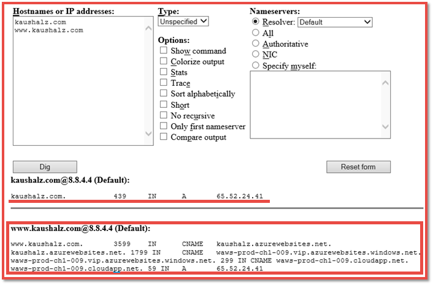

<properties
	pageTitle="Map a custom domain name to an Azure app"
	description="Learn how to map a your custom domain name (vanity domain) to your app in Azure App Service."
	services="app-service"
	documentationCenter=""
	authors="cephalin"
	manager="wpickett"
	editor="jimbe"
	tags="top-support-issue"/>

<tags
	ms.service="app-service"
	ms.workload="na"
	ms.tgt_pltfrm="na"
	ms.devlang="na"
	ms.topic="article"
	ms.date="07/25/2016"
	ms.author="cephalin"/>

# Map a custom domain name to an Azure app

[AZURE.INCLUDE [web-selector](../../includes/websites-custom-domain-selector.md)]

This article shows you how to manually map a custom domain name to your web app, mobile app backend, or API app in [Azure App Service](../app-service/app-service-value-prop-what-is.md). 

Your app already comes with a unique subdomain of azurewebsites.net. For example, if your app is named **contoso**, the then its domain name is 
**contoso.azurewebsites.net**. However, you can map a custom domain name to app so that its URL, such
as `www.contoso.com`, reflects your brand.

>[AZURE.NOTE] Get help from Azure experts on the [Azure forums](https://azure.microsoft.com/support/forums/). 
For even higher level of support, go to the [Azure Support site](https://azure.microsoft.com/support/options/) and click on **Get Support**.

[AZURE.INCLUDE [introfooter](../../includes/custom-dns-web-site-intro-notes.md)]

## Buy a new custom domain in Azure portal

If you haven't already purchased a custom domain name, you can buy one and manage it directly in your app's settings in the 
[Azure portal](https://portal.azure.com). This option makes it easy to map a custom domain to your app, whether your app 
uses [Azure Traffic Manager](web-sites-traffic-manager-custom-domain-name.md) or not. 

For instructions, see [Buy a custom domain name for App Service](custom-dns-web-site-buydomains-web-app.md).

## Map a custom domain you purchased externally

If you have already purchased a custom domain from [Azure DNS](https://azure.microsoft.com/services/dns/) or from a third-party provider, 
there are three main steps to map the custom domain to your app:

1. [Enable the custom domain name for your Azure app](#enable).
    - **Where**: the [Azure portal](https://portal.azure.com).
    - **Why**: so your app knows to respond to requests made to the custom domain name.
2. [Create the DNS records that map your domain to your app](#dns). 
    - **Where**: your domain registrar's own management tool (e.g. Azure DNS, www.godaddy.com, etc.).
    - **Why**: so your domain registrar knows to resolves the desired custom domain to your Azure app.
3. [Verify DNS propagation](#verify).

### Types of domains you can map

Azure App Service lets you map the following categories of custom domains to your app.

- **Root domain** - the domain name that you reserved with the domain registrar (represented by the `@` host record, typically). 
For example, **contoso.com**.
- **Subdomain** - any domain that's under your root domain. For example, **www.contoso.com** (represented by the `www` host record).  You can 
map different subdomains of the same root domain to different apps in Azure.
- **Wildcard domain** - [any subdomain whose leftmost DNS label is `*`](https://en.wikipedia.org/wiki/Wildcard_DNS_record) 
(e.g. host records `*` and `*.blogs`). For example, **\*.contoso.com**.

### Types of DNS records you can use

Depending on your need, you can use two different types of standard DNS records to map your custom domain: 

- [A](https://en.wikipedia.org/wiki/List_of_DNS_record_types#A) - maps your custom domain name to the Azure app's virtual 
IP address directly. 
- [CNAME](https://en.wikipedia.org/wiki/CNAME_record) - maps your custom domain name to your app's Azure domain name, 
**&lt;*appname*>.azurewebsites.net**. 

The advantage of CNAME is that it persists across IP address changes. Your app's virtual IP address may change 
if you delete and recreate your app, or change from a higher pricing tier back to the **Shared** tier. Through such a change,
a CNAME record is still valid, whereas an A record must be updated. 

The tutorial shows you steps for using the A record and also for using the CNAME record.

## Step 1. Enable the custom domain name for your app

1.	Log in to the [Azure portal](https://portal.azure.com).
2.	Click **App Services** on the left menu.
4.	Click your app, then click **Settings** > **Custom domains and SSL** > **Bring External Domains**.
5.	In **Domain Names**, type your custom domain name.
6.  *(A record only)* Take note of the IP address to use later.

## Step 2. Create the DNS record(s)

Log in to your domain registrar and use their tool to add an A record or CNAME record. Every registrar’s UI is slightly 
different, so you should consult your provider's documentation. However, here are some general guidelines.

1.	Find the page for managing DNS records. Look for links or areas of the site labeled **Domain Name**, **DNS**, or 
**Name Server Management**. Often the link can be found be viewing your account information, and then looking for a link 
such as **My domains**.
2.	Look for a link that lets you add or edit DNS records. This might be listed as **Zone file** or **DNS Records**, or 
an **Advanced** configuration link.
3.  Create the record and save the your changes.
    - [Instructions for an A record are here](#a).
    - [Instructions for a CNAME record are here](#cname).

### Create an A record

To use an A record to map to your Azure app's IP address, you actually need to create both an A record and a CNAME record. 
The A record is for the DNS resolution itself, and the CNAME record is for Azure to verify that you own the custom domain 
name. 

Your A record should be configured as follows (@ typically represents the root domain):
 
<table cellspacing="0" border="1">
  <tr>
    <th>FQDN example</th>
    <th>Host/Name/Hostname</th>
    <th>Value</th>
  </tr>
  <tr>
    <td>contoso.com (root)</td>
    <td>@</td>
    <td>IP address from [Step 1]()</td>
  </tr>
  <tr>
    <td>www.contoso.com (sub)</td>
    <td>www</td>
    <td>IP address from [Step 1]()</td>
  </tr>
  <tr>
    <td>*.contoso.com (wildcard)</td>
    <td>*</td>
    <td>IP address from [Step 1]()</td>
  </tr>
</table>

Your additional CNAME record takes on the convention that maps from awverify.&lt;*subdomain*>.&lt;*rootdomain*> to awverify.&lt;*subdomain*>.azurewebsites.net. 
See examples below:

<table cellspacing="0" border="1">
  <tr>
    <th>FQDN example</th>
    <th>Host/Name/Hostname</th>
    <th>Value</th>
  </tr>
  <tr>
    <td>contoso.com (root)</td>
    <td>awverify</td>
    <td>awverify.&lt;<i>appname</i>>.azurewebsites.net</td>
  </tr>
  <tr>
    <td>www.contoso.com (sub)</td>
    <td>awverify.www</td>
    <td>awverify.www.&lt;<i>appname</i>>.azurewebsites.net</td>
  </tr>
  <tr>
    <td>*.contoso.com (wildcard)</td>
    <td>awverify</td>
    <td>awverify.&lt;<i>appname</i>>.azurewebsites.net</td>
  </tr>
</table>

### Create a CNAME record

If you use a CNAME record to map to your Azure app's default domain name, you don't need an additional CNAME record
like you do with an A record. 

Your CNAME record should be configured as follows (@ typically represents the root domain):

<table cellspacing="0" border="1">
  <tr>
    <th>FQDN example</th>
    <th>Host/Name/Hostname</th>
    <th>Value</th>
  </tr>
  <tr>
    <td>contoso.com (root)</td>
    <td>@</td>
    <td>&lt;<i>appname</i>>.azurewebsites.net</td>
  </tr>
  <tr>
    <td>www.contoso.com (sub)</td>
    <td>www</td>
    <td>&lt;<i>appname</i>>.azurewebsites.net</td>
  </tr>
  <tr>
    <td>*.contoso.com (wildcard)</td>
    <td>*</td>
    <td>&lt;<i>appname</i>>.azurewebsites.net</td>
  </tr>
</table>

>[AZURE.NOTE] You can use Azure DNS to host the necessary domain records for your web app. To configure your custom domain, and create your records, in Azure DNS, see [Create custom DNS records for a web app](../dns/dns-web-sites-custom-domain.md).

## Step 3. Verify DNS propagation

After you finish the configuration steps, it can take some time for the changes to propagate, depending on your DNS provider. You can verify that the DNS propagation is working as expected by using [http://digwebinterface.com/](http://digwebinterface.com/). After you browse to the site, specify the hostnames in the textbox and click **Dig**. Verify the results to confirm if the recent changes have taken effect.  

> [AZURE.NOTE] The propagation of the DNS entries takes up to 48 hours (sometimes longer). If you have configured everything correctly, you still need to wait for the propagation to succeed.

## Next steps

For more information please see: [Get started with Azure DNS](../dns/dns-getstarted-create-dnszone.md) and [Delegate Domain to Azure DNS](../dns/dns-domain-delegation.md)

>[AZURE.NOTE] If you want to get started with Azure App Service before signing up for an Azure account, go to [Try App Service](http://go.microsoft.com/fwlink/?LinkId=523751), where you can immediately create a short-lived starter web app in App Service. No credit cards required; no commitments.

<!-- Anchors. -->
[Overview]: #overview
[DNS record types]: #dns-record-types
[Find the virtual IP address]: #find-the-virtual-ip-address
[Create the DNS records]: #create-the-dns-records
[Enable the domain name on your web app]: #enable-the-domain-name-on-your-web-app

<!-- Images -->
[subdomain]: media/web-sites-custom-domain-name/azurewebsites-subdomain.png
