<properties 
	pageTitle="Create an ASP.NET MVC app with auth and SQL DB and deploy to Azure App Service" 
	description="Learn how to develop an ASP.NET MVC 5 app with a SQL Database back-end, add authentication and authorization, and deploy it to Azure." 
	services="app-service\web" 
	documentationCenter=".net" 
	authors="Rick-Anderson" 
	writer="Rick-Anderson" 
	manager="wpickett" 
	editor=""/>

<tags 
	ms.service="app-service-web" 
	ms.workload="web" 
	ms.tgt_pltfrm="na" 
	ms.devlang="dotnet" 
	ms.topic="article" 
	ms.date="03/21/2016" 
	ms.author="riande"/> 

# Create an ASP.NET MVC app with auth and SQL DB and deploy to Azure App Service

This tutorial shows how to build a secure ASP.NET MVC 5 web app that lets users log in with credentials from Facebook or Google. The app is a simple contact list that uses the ADO.NET Entity Framework for database access. You'll deploy the app to [Azure App Service](http://go.microsoft.com/fwlink/?LinkId=529714). 

On completing the tutorial, you'll have a secure data-driven web application up and running in the cloud and using a cloud database. The following illustration shows the login page for the completed application.

![login page][rxb]

You'll learn:

* How to create a secure ASP.NET MVC 5 web project in Visual Studio.
* How to authenticate and authorize users who log on with credentials from their Google or Facebook accounts (social provider authentication using [OAuth 2.0](http://oauth.net/2 "http://oauth.net/2")).
* How to authenticate and authorize users who register in a database managed by the application (local authentication using [ASP.NET Identity](http://asp.net/identity/)).
* How to use the ADO.NET Entity Framework 6 Code First to read and write data in a SQL database.
* How to use Entity Framework Code First Migrations to deploy a database.
* How to store relational data in the cloud by using Azure SQL Database.
* How to deploy a web project that uses a database to a [web app](http://go.microsoft.com/fwlink/?LinkId=529714) in Azure App Service.

>[AZURE.NOTE] This is a long tutorial. If you want a quick introduction to Azure App Service and Visual Studio web projects, see [Create an ASP.NET web app in Azure App Service](web-sites-dotnet-get-started.md). For troubleshooting info, see the [Troubleshooting](#troubleshooting) section.
>
>Or if you want to get started with Azure App Service before signing up for an Azure account, go to [Try App Service](http://go.microsoft.com/fwlink/?LinkId=523751), where you can immediately create a short-lived starter web app in App Service. No credit cards required; no commitments.

## Prerequisites

To complete this tutorial, you need a Microsoft Azure account. If you don't have an account, you can [activate your Visual Studio subscriber benefits](/pricing/member-offers/msdn-benefits-details/?WT.mc_id=A261C142F) or [sign up for a free trial](/pricing/free-trial/?WT.mc_id=A261C142F).

To set up your development environment, you must install [Visual Studio 2013 Update 5](http://go.microsoft.com/fwlink/?LinkId=390521) or higher, and the latest version of the [Azure SDK for .NET](http://go.microsoft.com/fwlink/?linkid=324322&clcid=0x409). This article was written for Visual Studio Update 4 and SDK 2.8.1. The same instructions work for Visual Studio 2015 with the latest [Azure SDK for .NET](http://go.microsoft.com/fwlink/?linkid=518003&clcid=0x409) installed, but some screens will look different from the illustrations.

## Create an ASP.NET MVC 5 application

### Create the project

1. From the **File** menu, click **New Project**.

	

1. In the **New Project** dialog box, expand **C#** and select **Web** under **Installed Templates**, and then select **ASP.NET Web Application**. Name the application **ContactManager**, and then click **OK**.

	
 
	**Note:** Make sure you enter "ContactManager". Code blocks that you'll be copying later assume that the project name is ContactManager. 

1. In the **New ASP.NET Project** dialog box, select the **MVC** template. Verify **Authentication** is set to **Individual User Accounts**, **Host in the cloud** is checked, and **App Service** is selected.

	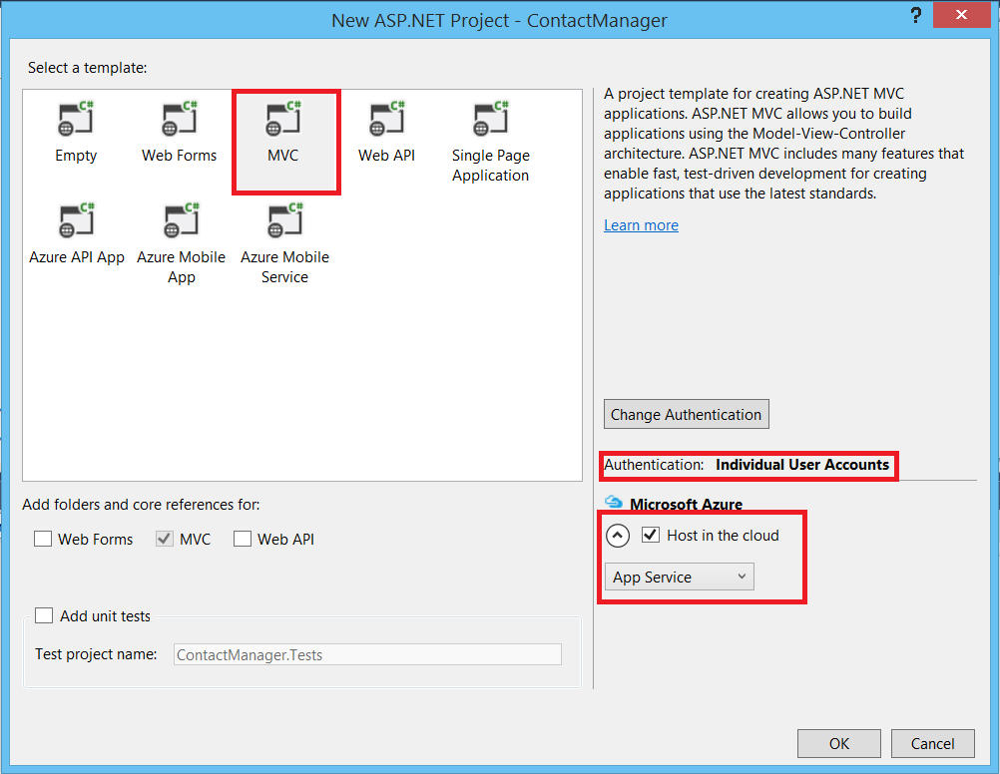

1. Click **OK**.

1. The **Configure Microsoft Azure Web App Settings** dialog appears. You may need to sign in if you have not already done so, or reenter your credentials if your login is expired.

1. Optional - change the value in the **Web App name** box (see image below).

	The URL of the web app will be {name}.azurewebsites.net, so the name has to be unique in the azurewebsites.net domain. The configuration wizard suggests a unique name by appending a number to the project name "ContactManager", and that's fine for this tutorial.

5. In the **Resource group** drop-down select an existing group or **Create new resource group**(see image below). 

	If you prefer, you can select a resource group that you already have. But if you create a new resource group and only use it for this tutorial, it will be easy to delete all Azure resources you created for the tutorial when you're done with them. For information about resource groups, see [Azure Resource Manager overview](../resource-group-overview.md). 

5. In the **App Service plan** drop-down select select an existing plan or **Create new App Service plan**(see image below).

	If you prefer, you can select an App Service plan that you already have. For information about App Service plans, see [Azure App Service plans in-depth overview](../app-service/azure-web-sites-web-hosting-plans-in-depth-overview.md). 

1. Tap **Explore additional Azure services** to add a SQL database.

	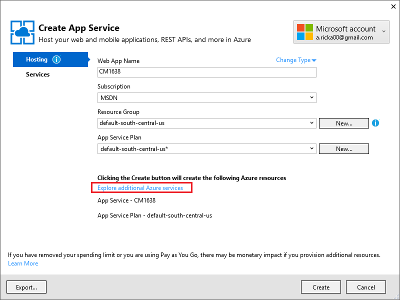

1. Tap the **+** icon to add a SQL database.

	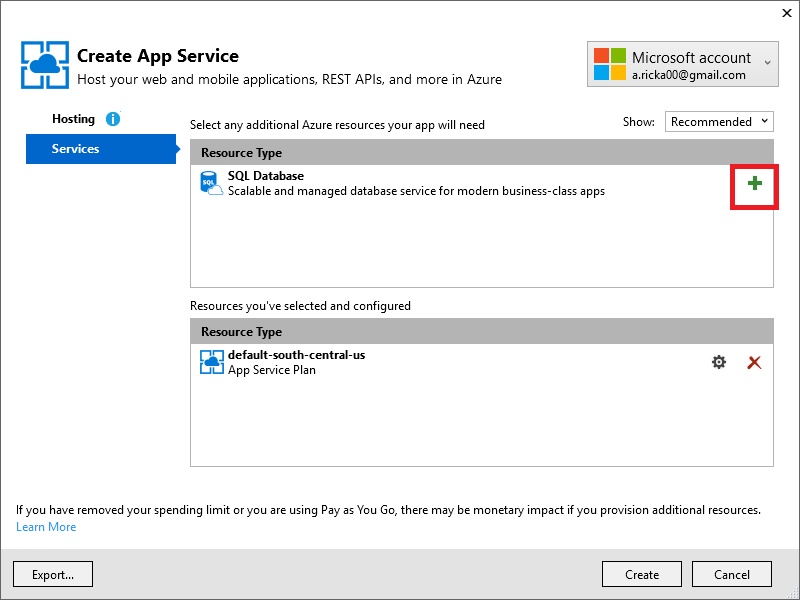

1. Tap **New** on the  **Configure SQL Database** dialog:

	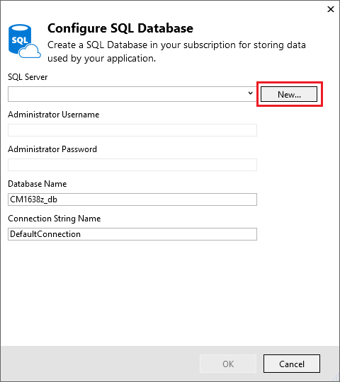

1. Enter a name for the administrator and a strong password.

	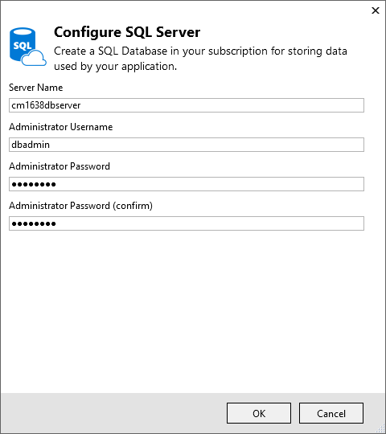

	The server name must be unique. It can contain lower-case letters, numeric digits, and hyphens. It cannot contain a trailing hyphen. The user name and password are new credentials you're creating for the new server. 

	If you already have a database server, you can select that instead of creating one. Database servers are a precious resource, and you generally want to create multiple databases on the same server for testing and development rather than creating a database server per database. However, for this tutorial you only need the server temporarily, and by creating the server in the same resource group as the web site you make it easy to delete both web app and database resources by deleting the resource group when you're done with the tutorial. 

	If you select an existing database server, make sure your web app and database are in the same region.

	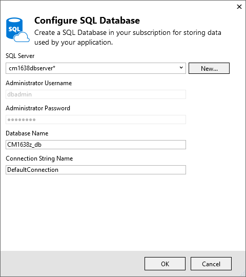

4. Tap **Create**.

	Visual Studio creates the ContactManager web project, creates the resource group and App Service plan that you specified, and creates a web app in Azure App Service with the name you specified.

### Set the page header and footer

1. In **Solution Explorer** open the *Layout.cshtml* file in the *Views\Shared* folder.

	![_Layout.cshtml in Solution Explorer][newapp004]

1. Replace the ActionLink in the *Layout.cshtml* file with the following code.

	@Html.ActionLink("CM Demo", "Index", "Contacts", new { area = "" }, new { @class = "navbar-brand" })
		           

	Make sure you change the third parameter from "Home" to "Contacts". The markup above will create a "Contacts" link on each page to the Index method of the Contacts controller. Change the application name in the header and the footer from "My ASP.NET Application" and "Application name" to "Contact Manager" and "CM Demo". 
 
### Run the application locally

1. Press CTRL+F5 to run the app.

	The application home page appears in the default browser.

	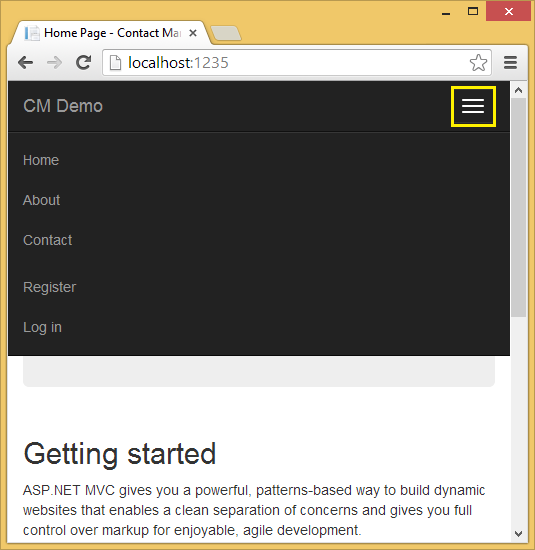

This is all you need to do for now to create the application that you'll deploy to Azure. 

## Deploy the application to Azure

1. In Visual Studio, right-click the project in **Solution Explorer** and select **Publish** from the context menu.

	
	
	The **Publish Web** wizard opens.

1. In the **Publish Web** dialog box, click **Publish**.

	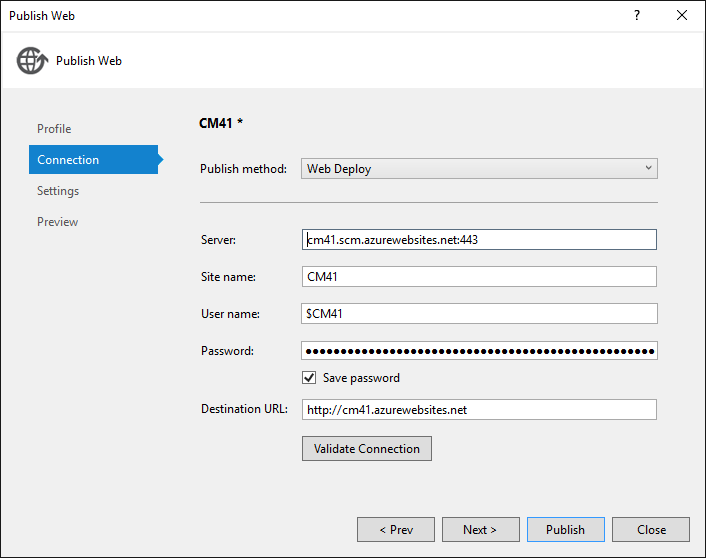

	The application you created is now running in the cloud. The next time you deploy the application, only the changed (or new) files will be deployed.

	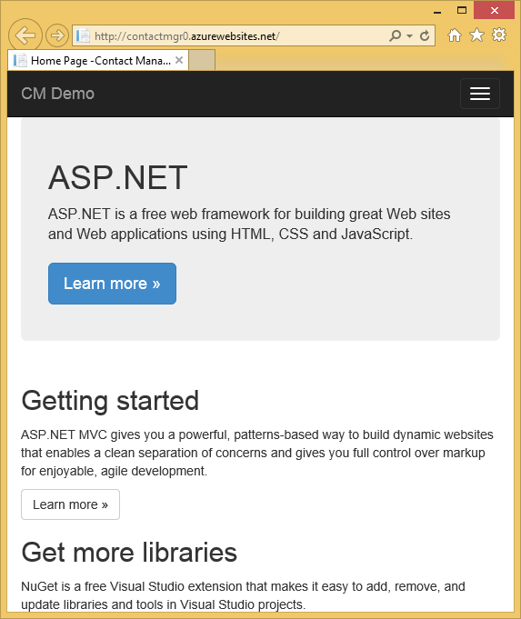

## Enable SSL for the Project ##

1. In **Solution Explorer**, click the **ContactManager** project, then click F4 to open the **Properties** window.

3. Change **SSL Enabled** to **True**. 

4. Copy the **SSL URL**.

	The SSL URL will be https://localhost:44300/ unless you've previously created SSL web apps.

	![enable SSL][rxSSL]
 
1. In **Solution Explorer**, right click the **Contact Manager** project and click **Properties**.

1. Click the **Web** tab.

1. Change the **Project Url** to use the **SSL URL** and save the page (Control S).

	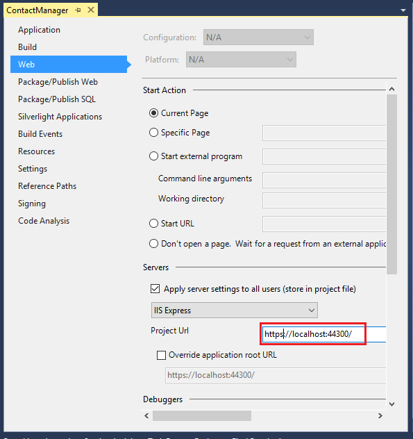
 
1. Verify that Internet Explorer is the browser that Visual Studio launches, as shown in the image below:

	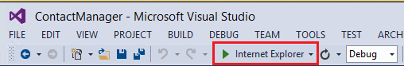

	The browser selector lets you specify the browser Visual Studio launches. You can select multiple browsers and have Visual Studio update each browser when you make changes. For more information see [Using Browser Link in Visual Studio 2013](http://www.asp.net/visual-studio/overview/2013/using-browser-link).

 	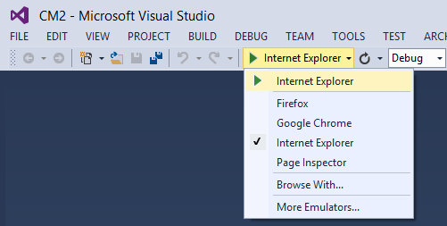

1. Press CTRL+F5 to run the application. Click **Yes** to start the process of trusting the self-signed certificate that IIS Express has generated.

	 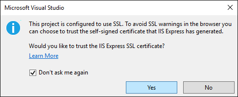

1. Read the **Security Warning** dialog and then click **Yes** if you want to install the certificate representing  **localhost**.

 	

1. IE shows the *Home* page and there are no SSL warnings.

	 

	 Internet Explorer is a good choice when you're using SSL because it accepts the certificate and shows HTTPS content without a warning. Microsoft Edge and Google Chrome also accept the certificate. Firefox uses its own certificate store, so it displays a warning.

	 

## Add a database to the application

Next, you'll update the app to add the ability to display and update contacts and store the data in a database. The app will use the Entity Framework (EF) to create the database and to read and update data.

### Add data model classes for the contacts

You begin by creating a simple data model in code.

1. In **Solution Explorer**, right-click the Models folder, click **Add**, and then **Class**.

	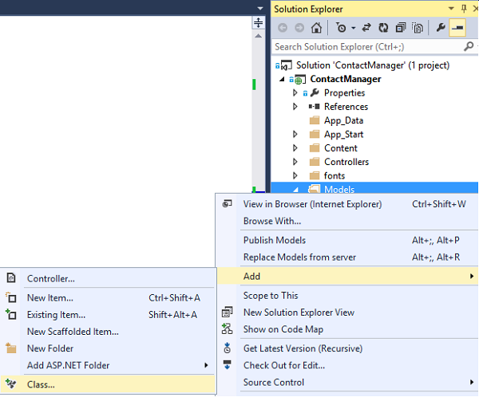

2. In the **Add New Item** dialog box, name the new class file *Contact.cs*, and then click **Add**.

	![Add New Item dialog box][adddb002]

3. Replace the contents of the Contact.cs file with the following code.

        using System.ComponentModel.DataAnnotations;
        using System.Globalization;
        namespace ContactManager.Models
        {
            public class Contact
            {
                public int ContactId { get; set; }
                public string Name { get; set; }
                public string Address { get; set; }
                public string City { get; set; }
                public string State { get; set; }
                public string Zip { get; set; }
                [DataType(DataType.EmailAddress)]
                public string Email { get; set; }
            }
        }
The **Contact** class defines the data that you will store for each contact, plus a primary key, *ContactID*, that is needed by the database.

### Create web pages that enable app users to work with the contacts

The ASP.NET MVC scaffolding feature can automatically generate code that performs create, read, update, and delete (CRUD) actions. 

1. Build the project **(Ctrl+Shift+B)**. (You must build the project before using the scaffolding mechanism.)
 
1. In **Solution Explorer**, right-click the Controllers folder and click **Add**, and then click **Controller**.

	![Add Controller in Controllers folder context menu][addcode001]

5. In the **Add Scaffold** dialog box, select **MVC 5 Controller with views, using EF** and then click **Add**.
	
	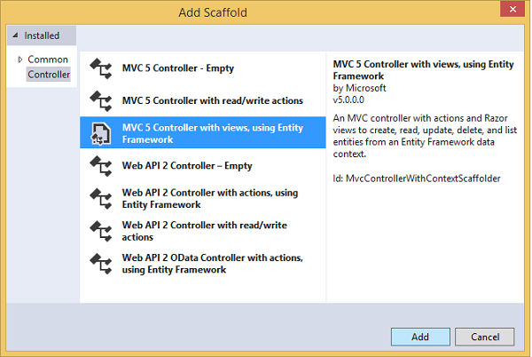

1. In the **Model class** dropdown box, select **Contact (ContactManager.Models)**. (See the image below.)

1. In the **Data context class**, select **ApplicationDbContext (ContactManager.Models)**. The **ApplicationDbContext** will be used for both the membership DB and our contact data.

	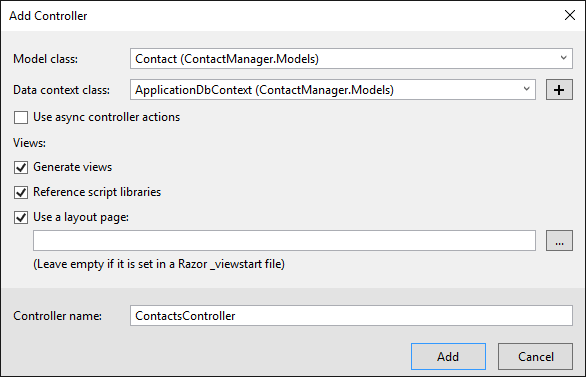

1. Click **Add**.

   Visual Studio creates a controller with methods and views for CRUD database operations for **Contact** objects.

## Enable Migrations, create the database, add sample data and a data initializer ##

The next task is to enable the [Code First Migrations](http://msdn.microsoft.com/library/hh770484.aspx) feature in order to create database tables based on the data model that you created.

1. In the **Tools** menu, select **NuGet Package Manager** and then **Package Manager Console**.

	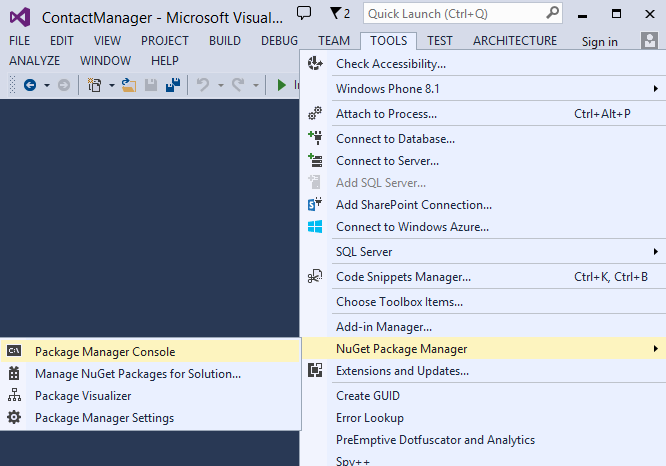

2. In the **Package Manager Console** window, enter the following command:

		enable-migrations

	The **enable-migrations** command creates a *Migrations* folder, and it puts in that folder a *Configuration.cs* file that you can edit to seed the database and configure Migrations. 

2. In the **Package Manager Console** window, enter the following command:

		add-migration Initial

	The **add-migration Initial** command generates a file named **&lt;date_stamp&gt;Initial** in the *Migrations* folder. The code in this file creates the database tables. The first parameter ( **Initial** ) is used to create the name of the file. You can see the new class files in **Solution Explorer**.

	In the **Initial** class, the **Up** method creates the Contacts table, and the **Down** method (used when you want to return to the previous state) drops it.

3. Open the *Migrations\Configuration.cs* file. 

4. Add the following `using` statement. 

    	 using ContactManager.Models;

5. Replace the *Seed* method with the following code:

        protected override void Seed(ContactManager.Models.ApplicationDbContext context)
        {
            context.Contacts.AddOrUpdate(p => p.Name,
               new Contact
               {
                   Name = "Debra Garcia",
                   Address = "1234 Main St",
                   City = "Redmond",
                   State = "WA",
                   Zip = "10999",
                   Email = "debra@example.com",
               },
                new Contact
                {
                    Name = "Thorsten Weinrich",
                    Address = "5678 1st Ave W",
                    City = "Redmond",
                    State = "WA",
                    Zip = "10999",
                    Email = "thorsten@example.com",
                },
                new Contact
                {
                    Name = "Yuhong Li",
                    Address = "9012 State st",
                    City = "Redmond",
                    State = "WA",
                    Zip = "10999",
                    Email = "yuhong@example.com",
                },
                new Contact
                {
                    Name = "Jon Orton",
                    Address = "3456 Maple St",
                    City = "Redmond",
                    State = "WA",
                    Zip = "10999",
                    Email = "jon@example.com",
                },
                new Contact
                {
                    Name = "Diliana Alexieva-Bosseva",
                    Address = "7890 2nd Ave E",
                    City = "Redmond",
                    State = "WA",
                    Zip = "10999",
                    Email = "diliana@example.com",
                }
                );
        }

	This code initializes (seeds) the database with contact information. For more information on seeding the database, see [Seeding and Debugging Entity Framework (EF) DBs](http://blogs.msdn.com/b/rickandy/archive/2013/02/12/seeding-and-debugging-entity-framework-ef-dbs.aspx). Build the project to verify there are no compile errors.

6. In the **Package Manager Console** enter the command:

		update-database

	![Package Manager Console commands][addcode009]

	The **update-database** runs the first migration which creates the database. By default, the database is created as a SQL Server Express LocalDB database. 

7. Press CTRL+F5 to run the application, and then click the **CM Demo** link; or navigate to https://localhost:(port#)/Cm. 

	The application shows the seed data and provides edit, details and delete links. You can create, edit, delete and view data.

	![MVC view of data][rx2]

## Add an OAuth2 Provider

>[AZURE.NOTE] For detailed instructions on how to use the Google and Facebook developer portal sites, this tutorial links to tutorials on the ASP.NET site. However, Google and Facebook change their sites more frequently than those tutorials are updated, and they are now out of date. If you have trouble following the directions, see the featured Disqus comment at the end of this tutorial for a list of what has changed. 

[OAuth](http://oauth.net/ "http://oauth.net/") is an open protocol that allows secure authorization in a simple and standard method from web, mobile, and desktop applications. The ASP.NET MVC internet template uses OAuth to expose Facebook, Twitter, Google and Microsoft as authentication providers. Although this tutorial uses only Google as the authentication provider, you can easily modify the code to use any of these providers. The steps to implement other providers are very similar to the steps you see in this tutorial. To use Facebook as an authentication provider, see [MVC 5 App with Facebook, Twitter, LinkedIn and Google OAuth2 Sign-on ](http://www.asp.net/mvc/tutorials/mvc-5/create-an-aspnet-mvc-5-app-with-facebook-and-google-oauth2-and-openid-sign-on).

In addition to authentication, this tutorial uses roles to implement authorization. Only those users that you add to the *canEdit* role are able to change data (that is, create, edit, or delete contacts).

1. Follow the instructions in [MVC 5 App with Facebook, Twitter, LinkedIn and Google OAuth2 Sign-on ](http://www.asp.net/mvc/tutorials/mvc-5/create-an-aspnet-mvc-5-app-with-facebook-and-google-oauth2-and-openid-sign-on#goog)  under **Creating a Google app for OAuth 2 to set up a Google app for OAuth2**.

3. Run and test the app to verify that you can log on using Google authentication.

2. If you want to create social login buttons with provider-specific icons, see [Pretty social login buttons for ASP.NET MVC 5](http://www.jerriepelser.com/blog/pretty-social-login-buttons-for-asp-net-mvc-5)

## Using the Membership API

In this section you will add a local user and the *canEdit* role to the membership database. Only those users in the *canEdit* role will be able to edit data. A best practice is to name roles by the actions they can perform, so *canEdit* is preferred over a role called *admin*. When your application evolves, you can add new roles such as *canDeleteMembers* rather than the less descriptive *superAdmin*.

1. Open the *migrations\configuration.cs* file and add the following `using` statements:

        using Microsoft.AspNet.Identity;
        using Microsoft.AspNet.Identity.EntityFramework;

1. Add the following **AddUserAndRole** method to the class:

		bool AddUserAndRole(ContactManager.Models.ApplicationDbContext context)
		{
		    IdentityResult ir;
		    var rm = new RoleManager<IdentityRole>
		        (new RoleStore<IdentityRole>(context));
		    ir = rm.Create(new IdentityRole("canEdit"));
		    var um = new UserManager<ApplicationUser>(
		        new UserStore<ApplicationUser>(context));
		    var user = new ApplicationUser()
		    {
		        UserName = "user1@contoso.com",
		    };
		    ir = um.Create(user, "P_assw0rd1");
		    if (ir.Succeeded == false)
		        return ir.Succeeded;
		    ir = um.AddToRole(user.Id, "canEdit");
		    return ir.Succeeded;
		}

1. Call the new method from the **Seed** method:

		protected override void Seed(ContactManager.Models.ApplicationDbContext context)
		{
		    AddUserAndRole(context);
		    context.Contacts.AddOrUpdate(p => p.Name,
		        // Code removed for brevity
		}

	The following images shows the changes to *Seed* method:

	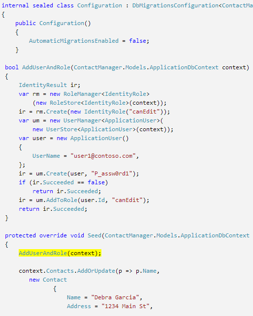

	This code creates a new role called *canEdit*, creates a new local user *user1@contoso.com*, and adds *user1@contoso.com* to the *canEdit* role. For more information, see the [ASP.NET Identity tutorials](http://www.asp.net/identity/overview/features-api) on the ASP.NET site.

## Use Temporary Code to Add New Social Login Users to the canEdit Role  ##

In this section you will temporarily modify the **ExternalLoginConfirmation** method in the Account controller to add new users registering with an OAuth provider to the *canEdit* role. We hope to provide a tool similar to [WSAT](http://msdn.microsoft.com/library/ms228053.aspx) in the future which will allow you to create and edit user accounts and roles. Until then, you can accomplish the same function by using temporary code.

1. Open the **Controllers\AccountController.cs** file and navigate to the **ExternalLoginConfirmation** method.

1. Add the following call to **AddToRoleAsync** just before the **SignInAsync** call.

		await UserManager.AddToRoleAsync(user.Id, "canEdit");

   The code above adds the newly registered user to the "canEdit" role, which gives them access to action methods that change (edit) data. The following snippet shows the new line of code in context.

		  // POST: /Account/ExternalLoginConfirmation
		  [HttpPost]
		  [AllowAnonymous]
		  [ValidateAntiForgeryToken]
		  public async Task ExternalLoginConfirmation(ExternalLoginConfirmationViewModel model, string returnUrl)
		  {
		     if (User.Identity.IsAuthenticated)
		     {
		        return RedirectToAction("Index", "Manage");
		     }
		     if (ModelState.IsValid)
		     {
		        // Get the information about the user from the external login provider
		        var info = await AuthenticationManager.GetExternalLoginInfoAsync();
		        if (info == null)
		        {
		           return View("ExternalLoginFailure");
		        }
		        var user = new ApplicationUser { UserName = model.Email, Email = model.Email };
		        var result = await UserManager.CreateAsync(user);
		        if (result.Succeeded)
		        {
		           result = await UserManager.AddLoginAsync(user.Id, info.Login);
		           if (result.Succeeded)
		           {
		              await UserManager.AddToRoleAsync(user.Id, "canEdit");
		              await SignInManager.SignInAsync(user, isPersistent: false, rememberBrowser: false);
		              return RedirectToLocal(returnUrl);
		           }
		        }
		        AddErrors(result);
		     }
		     ViewBag.ReturnUrl = returnUrl;
		     return View(model);
		  }

Later in the tutorial you will deploy the application to Azure, where you will log-on with Google or another third party authentication provider. This will add your newly registered account to the *canEdit* role. Anyone who finds your web app's URL and has a Google ID can then register and update your database. To prevent other people from doing that, you can stop the site. You'll be able to verify who is in the *canEdit* role by examining the database.

In the **Package Manager Console** hit the up arrow key to bring up the following command:

		Update-Database

The **Update-Database** command runs the **Seed** method, and that runs the **AddUserAndRole** method you added earlier. The **AddUserAndRole** method creates the user *user1@contoso.com* and adds her to the *canEdit* role.

## Protect the Application with SSL and the Authorize Attribute ##

In this section you apply the [Authorize](http://msdn.microsoft.com/library/system.web.mvc.authorizeattribute.aspx) attribute to restrict access to the action methods. Anonymous users will be able to view only the **Index** action method of the home controller. Registered users will be able to see contact data (The **Index** and **Details** pages of the Cm controller), the About page, and the Contact page. Only users in the *canEdit* role will be able to access action methods that change data.

1. Open the *App_Start\FilterConfig.cs* file and replace the *RegisterGlobalFilters* method with the following (which adds the two filters):

		public static void RegisterGlobalFilters(GlobalFilterCollection filters)
		{
		    filters.Add(new HandleErrorAttribute());
		    filters.Add(new System.Web.Mvc.AuthorizeAttribute());
		    filters.Add(new RequireHttpsAttribute());
		}
		
	This code adds the [Authorize](http://msdn.microsoft.com/library/system.web.mvc.authorizeattribute.aspx) filter and the [RequireHttps](http://msdn.microsoft.com/library/system.web.mvc.requirehttpsattribute.aspx) filter to the application. The [Authorize](http://msdn.microsoft.com/library/system.web.mvc.authorizeattribute.aspx) filter prevents anonymous users from accessing any methods in the application. You will use the [AllowAnonymous](http://blogs.msdn.com/b/rickandy/archive/2012/03/23/securing-your-asp-net-mvc-4-app-and-the-new-allowanonymous-attribute.aspx) attribute to opt out of the authorization requirement in a couple methods, so anonymous users can log in and can view the home page. The  [RequireHttps](http://msdn.microsoft.com/library/system.web.mvc.requirehttpsattribute.aspx) requires that all access to the web app be through HTTPS.

	An alternative approach is to add the [Authorize](http://msdn.microsoft.com/library/system.web.mvc.authorizeattribute.aspx) attribute and the [RequireHttps](http://msdn.microsoft.com/library/system.web.mvc.requirehttpsattribute.aspx) attribute to each controller, but it's considered a security best practice to apply them to the entire application. By adding them globally, every new controller and action method you add is automatically protected -- you don't need to remember to apply them. For more information see [Securing your ASP.NET MVC  App and the new AllowAnonymous Attribute](http://blogs.msdn.com/b/rickandy/archive/2012/03/23/securing-your-asp-net-mvc-4-app-and-the-new-allowanonymous-attribute.aspx). 

1. Add the [AllowAnonymous](http://blogs.msdn.com/b/rickandy/archive/2012/03/23/securing-your-asp-net-mvc-4-app-and-the-new-allowanonymous-attribute.aspx) attribute to the **Index** method of the Home controller. The [AllowAnonymous](http://blogs.msdn.com/b/rickandy/archive/2012/03/23/securing-your-asp-net-mvc-4-app-and-the-new-allowanonymous-attribute.aspx) attribute enables you to white-list the methods you want to opt out of authorization. 

		public class HomeController : Controller
		{
		  [AllowAnonymous]
		  public ActionResult Index()
		  {
		     return View();
		  }

	If you do a global search for *AllowAnonymous*, you'll see that it is used in the login and registration methods of the Account controller.

1. In *CmController.cs*, add `[Authorize(Roles = "canEdit")]` to the HttpGet and HttpPost methods that change data (Create, Edit, Delete, every action method except Index and Details) in the *Cm* controller. A portion of the completed code is shown below: 

		// GET: Cm/Create
		[Authorize(Roles = "canEdit")]
		public ActionResult Create()
		{
		   return View(new Contact { Address = "123 N 456 W",
		    City="Great Falls", Email = "ab@cd.com", Name="Joe Smith", State="MT",
		   Zip = "59405"});
		}
		// POST: Cm/Create
		// To protect from overposting attacks, please enable the specific properties you want to bind to, for 
		// more details see http://go.microsoft.com/fwlink/?LinkId=317598.
		[HttpPost]
		[ValidateAntiForgeryToken]
		 [Authorize(Roles = "canEdit")]
		public ActionResult Create([Bind(Include = "ContactId,Name,Address,City,State,Zip,Email")] Contact contact)
		{
		    if (ModelState.IsValid)
		    {
		        db.Contacts.Add(contact);
		        db.SaveChanges();
		        return RedirectToAction("Index");
		    }
		    return View(contact);
		}
		// GET: Cm/Edit/5
		[Authorize(Roles = "canEdit")]
		public ActionResult Edit(int? id)
		{
		    if (id == null)
		    {
		        return new HttpStatusCodeResult(HttpStatusCode.BadRequest);
		    }
		    Contact contact = db.Contacts.Find(id);
		    if (contact == null)
		    {
		        return HttpNotFound();
		    }
		    return View(contact);
		}
		
1. Press CTRL+F5 to run the application.

1. If you are still logged in from a previous session, hit the **Log out** link.

1. Click on the **About** or **Contact** links. You are redirected to the login page because anonymous users cannot view those pages.

1. Click the **Register as a new user** link and add a local user with email *joe@contoso.com*. Verify *Joe* can view the Home, About and Contact pages. 

	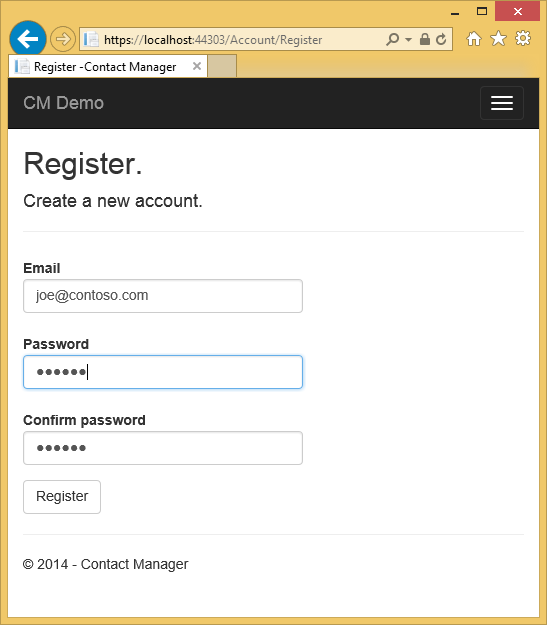

1. Click the *CM Demo* link and verify that you see the data.

1. Click an edit link on the page, you will be redirected to the login page (because a new local user is not added to the *canEdit* role).

1. Log in as *user1@contoso.com* with password of "P_assw0rd1" (the "0" in "word" is a zero). You are redirected to the edit page you previously selected. 
2. 

	If you can't log in with that account and password, try copying the password from the source code and pasting it. If you still can't log in, check the **UserName** column of the **AspNetUsers** table to verify *user1@contoso.com* was added. 

1. Verify you can make data changes.

## Deploy the app to Azure

1. In Visual Studio, right-click the project in **Solution Explorer** and select **Publish** from the context menu.

	![Publish in project context menu][firsdeploy003]

	The **Publish Web** wizard opens.

1. Click the **Settings** tab on the left side of the **Publish Web** dialog box. 

2. Under **ApplicationDbContext**  select the database that you created when you created the project.
   

1. Under **ContactManagerContext**, select **Execute Code First Migrations**.

	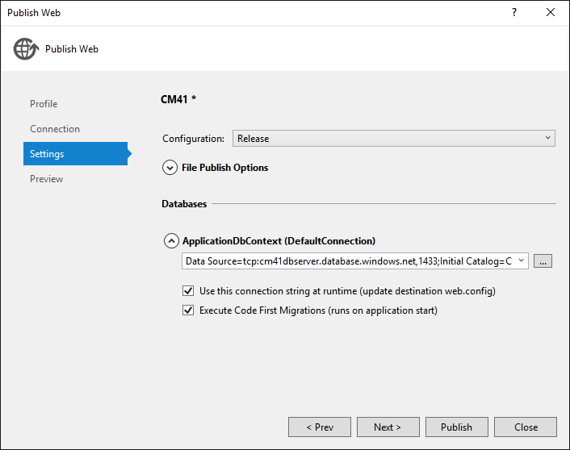

1. Click **Publish**.

1. Log in as *user1@contoso.com* (with password of "P_assw0rd1") and verify you can edit data.

1. Log out.

1. Go to the [Google Developers Console](https://console.developers.google.com/) and on the **Credentials** tab update the redirect URIS and JavaScript Orgins to use the Azure URL.

1. Log in using Google or Facebook. That will add the Google or Facebook account to the **canEdit** role. If you get an HTTP 400 error with the message *The redirect URI in the request: https://contactmanager{my version}.azurewebsites.net/signin-google did not match a registered redirect URI.*, you'll have to wait until the changes you made are propagated. If you get this error after more than a few minutes, verify the URIs are correct.

### Stop the web app to prevent other people from registering  

1. In **Server Explorer**, navigate to **Azure > App Service > {your resource group} > {your web app}**.

4. Right-click the web app and select **Stop**. 

	Alternatively, from the [Azure Portal](https://portal.azure.com/), you can go to the web app's blade, then click the **Stop** icon at the top of the blade.

	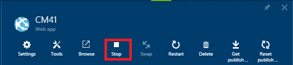

### Remove AddToRoleAsync, Publish, and Test

1. Comment out or remove the following code from the **ExternalLoginConfirmation** method in the Account controller:

		await UserManager.AddToRoleAsync(user.Id, "canEdit");

1. Build the project (which saves the file changes and verifies you don't have any compile errors).

5. Right-click the project in **Solution Explorer** and select **Publish**.

	   
	
4. Click the **Start Preview** button. Only the files that need to be updated are deployed.

5. Start the web app from Visual Studio or from the Portal. **You won't be able to publish while the web app is stopped**.

	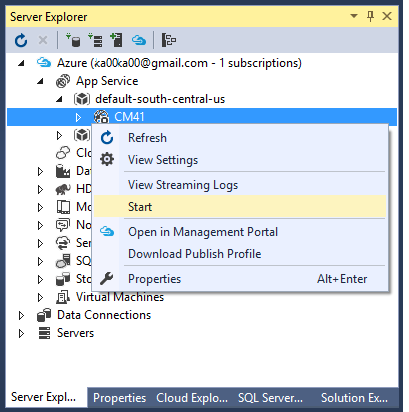

5. Go back to Visual Studio and click **Publish**.

3. Your Azure App opens up in your default browser. If you are logged in, log out so you can view the home page as an anonymous user.  

4. Click the **About** link. You'll be redirected to the Log in page.

5. Click the **Register** link on the Log in page and create local account. We will use this local account to verify you can access the read only pages but you cannot access pages that change data (which are protected by the *canEdit* role). Later on in the tutorial you will remove local account access. 

	

1. Verify that you can navigate to the *About* and *Contact* pages.

	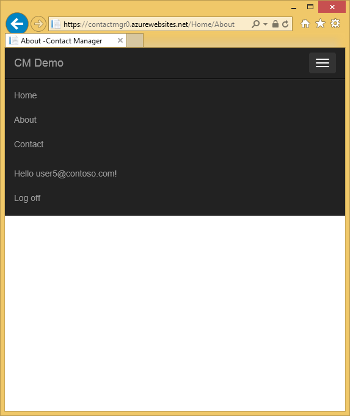

1. Click the **CM Demo** link to navigate to the **Cm** controller. Alternatively, you can append *Cm* to the URL. 

	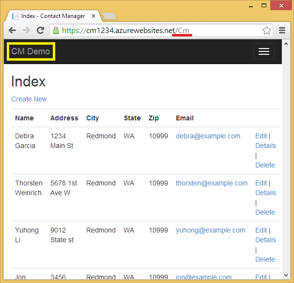
 
1. Click an Edit link. 

	You are redirected to the login page. 

2. Under **Use another service to log in**, Click Google or Facebook and log in with the account you previously registered. (If you're working quickly and your session cookie has not timed out, you will be automatically logged in with the Google or Facebook account you previously used.)

2. Verify that you can edit data while logged into that account.

	**Note:** You cannot log out of Google from this app and log into a different google account with the same browser. If you are using one browser, you will have to navigate to Google and log out. You can log on with another account from the same third party authenticator (such as Google) by using a different browser.

	If you have not filled out the first and last name of your Google account information, a NullReferenceException will occur.

## Examine the SQL Azure DB ##

1. In **Server Explorer**, navigate to **Azure > SQL Databases > {your database}**

2. Right click your database, and then select **Open in SQL Server Object Explorer**.
 
	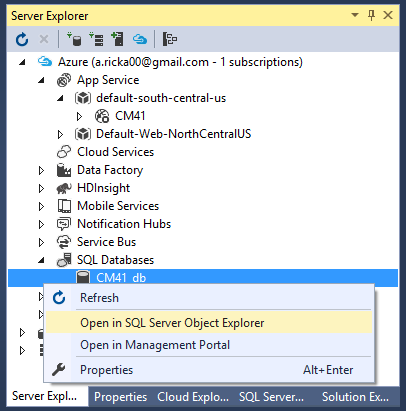
 
3. If you haven't connected to this database previously, you may be prompted to add a firewall rule to enable access for your current IP address. The IP address will be pre-filled. Simply click **Add Firewall Rule** to enable access.

	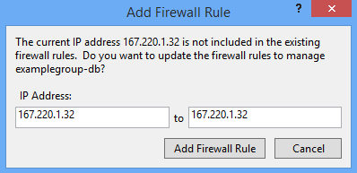

3. Log in to the database with the user name and password that you specified when you created the database server. 
 
1. Right click the **AspNetUsers** table and select **View Data**.

	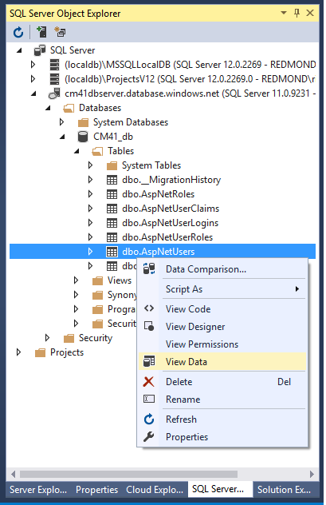
 
1. Note the Id from the Google account you registered with to be in the **canEdit** role, and the Id of *user1@contoso.com*. These should be the only users in the **canEdit** role. (You'll verify that in the next step.)

	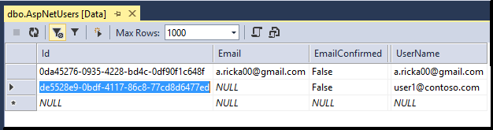
 
2. In **SQL Server Object Explorer**, right click on **AspNetUserRoles** and select **View Data**.

	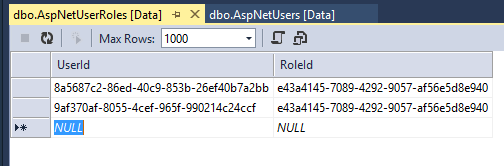
 
3. Verify that the **UserId** is from *user1@contoso.com* and the Google account you registered. 

## Troubleshooting

If you run into problems, here are some suggestions for what to try.

* Errors provisioning SQL Database - Make sure you have the current SDK installed. Versions before 2.8.1 have a bug that in some scenarios causes errors when VS tries to create the database server or the database.
* Error message "operation is not supported for your subscription offer type" when creating Azure resources - Same as above.
* Errors when deploying - Consider going through the [basic ASP.NET deployment](web-sites-dotnet-get-started.md) article. That deployment scenario is simpler and if you have the same problem there it may be easier to isolate. For example, in some enterprise environments a corporate firewall may prevent Web Deploy from making the kinds of connections to Azure that it requires.
* No option to select connection string in the Publish Web wizard when you deploy - If you used a different method to create your Azure resources (for example, you are trying to deploy to  a web app and a SQL database created in the Portal), the SQL database may not be associated with the web app. The easiest solution is to create a new web app and database by using VS as shown in the tutorial. You don't have to start the tutorial over -- in the Publish Web wizard you can opt to create a new web app and you get the same Azure resource creation dialog that you get when you create the project.
* Directions for Google or Facebook developer portal are out of date - See the featured Disqus comment at the end of this tutorial.

## Next steps

You've created a basic ASP.NET MVC web application that authenticates users. For more information about common authentication tasks and how to keep sensitive data secure, see the following tutorials.

- [Create a secure ASP.NET MVC 5 web app with log in, email confirmation and password reset](http://www.asp.net/mvc/overview/getting-started/create-an-aspnet-mvc-5-web-app-with-email-confirmation-and-password-reset)
- [ASP.NET MVC 5 app with SMS and email Two-Factor Authentication](http://www.asp.net/mvc/overview/getting-started/aspnet-mvc-5-app-with-sms-and-email-two-factor-authentication)
- [Best practices for deploying passwords and other sensitive data to ASP.NET and Azure](http://www.asp.net/identity/overview/features-api/best-practices-for-deploying-passwords-and-other-sensitive-data-to-aspnet-and-azure) 
- [Create an ASP.NET MVC 5 App with Facebook and Google OAuth2](http://www.asp.net/mvc/tutorials/mvc-5/create-an-aspnet-mvc-5-app-with-facebook-and-google-oauth2-and-openid-sign-on ) This includes instructions on how to add profile data to the user registration DB and for detailed instructions on using Facebook as an authentication provider.
- [Getting Started with ASP.NET MVC 5](http://www.asp.net/mvc/tutorials/mvc-5/introduction/getting-started)

For a  more advanced tutorial about how to use the Entity Framework, see [Getting Started with EF and MVC](http://www.asp.net/mvc/tutorials/getting-started-with-ef-using-mvc/creating-an-entity-framework-data-model-for-an-asp-net-mvc-application).

This tutorial was written by [Rick Anderson](http://blogs.msdn.com/b/rickandy/) (Twitter [@RickAndMSFT](https://twitter.com/RickAndMSFT)) with assistance from Tom Dykstra and Barry Dorrans (Twitter [@blowdart](https://twitter.com/blowdart)). 

***Please leave feedback*** on what you liked or what you would like to see improved, not only about the tutorial itself but also about the products that it demonstrates. Your feedback will help us prioritize improvements. You can also request and vote on new topics at [Show Me How With Code](http://aspnet.uservoice.com/forums/228522-show-me-how-with-code).

## What's changed

* For a guide to the change from Websites to App Service see: [Azure App Service and Its Impact on Existing Azure Services](http://go.microsoft.com/fwlink/?LinkId=529714)

<!-- bookmarks -->
[Add an OAuth Provider]: #addOauth
[Using the Membership API]:#mbrDB
[Create a Data Deployment Script]:#ppd
[Update the Membership Database]:#ppd2

[setupwindowsazureenv]: #bkmk_setupwindowsazure
[createapplication]: #bkmk_createmvc4app
[deployapp1]: #bkmk_deploytowindowsazure1
[deployapp11]: #bkmk_deploytowindowsazure11
[adddb]: #bkmk_addadatabase

<!-- images-->
[rx2]: ./media/web-sites-dotnet-deploy-aspnet-mvc-app-membership-oauth-sql-database/rx2.png

[rx5]: ./media/web-sites-dotnet-deploy-aspnet-mvc-app-membership-oauth-sql-database-vs2013/rx5.png
[rx6]: ./media/web-sites-dotnet-deploy-aspnet-mvc-app-membership-oauth-sql-database-vs2013/rx6.png
[rx7]: ./media/web-sites-dotnet-deploy-aspnet-mvc-app-membership-oauth-sql-database-vs2013/rx7.png
[rx8]: ./media/web-sites-dotnet-deploy-aspnet-mvc-app-membership-oauth-sql-database-vs2013/rx8.png
[rx9]: ./media/web-sites-dotnet-deploy-aspnet-mvc-app-membership-oauth-sql-database-vs2013/rx9.png

[rxb]: ./media/web-sites-dotnet-deploy-aspnet-mvc-app-membership-oauth-sql-database/rxb.png

[rxSSL]: ./media/web-sites-dotnet-deploy-aspnet-mvc-app-membership-oauth-sql-database/rxSSL.png

[rxNOT]: ./media/web-sites-dotnet-deploy-aspnet-mvc-app-membership-oauth-sql-database-vs2013/rxNOT.png
[rxNOT2]: ./media/web-sites-dotnet-deploy-aspnet-mvc-app-membership-oauth-sql-database-vs2013/rxNOT2.png

[rxNOT]: ./media/web-sites-dotnet-deploy-aspnet-mvc-app-membership-oauth-sql-database-vs2013/rxNOT.png
[rxNOT]: ./media/web-sites-dotnet-deploy-aspnet-mvc-app-membership-oauth-sql-database-vs2013/rxNOT.png
[rxNOT]: ./media/web-sites-dotnet-deploy-aspnet-mvc-app-membership-oauth-sql-database-vs2013/rxNOT.png
[rr1]: ./media/web-sites-dotnet-deploy-aspnet-mvc-app-membership-oauth-sql-database-vs2013/rr1.png

[rxPrevDB]: ./media/web-sites-dotnet-deploy-aspnet-mvc-app-membership-oauth-sql-database-vs2013/rxPrevDB.png

[rxWSnew]: ./media/web-sites-dotnet-deploy-aspnet-mvc-app-membership-oauth-sql-database-vs2013/rxWSnew2.png
[rxCreateWSwithDB]: ./media/web-sites-dotnet-deploy-aspnet-mvc-app-membership-oauth-sql-database-vs2013/rxCreateWSwithDB.png

[setup007]: ./media/web-sites-dotnet-deploy-aspnet-mvc-app-membership-oauth-sql-database-vs2013/dntutmobile-setup-azure-site-004.png

[newapp004]: ./media/web-sites-dotnet-deploy-aspnet-mvc-app-membership-oauth-sql-database/dntutmobile-createapp-004.png

[firsdeploy003]: ./media/web-sites-dotnet-deploy-aspnet-mvc-app-membership-oauth-sql-database/dntutmobile-deploy1-publish-001.png

[adddb002]: ./media/web-sites-dotnet-deploy-aspnet-mvc-app-membership-oauth-sql-database/dntutmobile-adddatabase-002.png
[addcode001]: ./media/web-sites-dotnet-deploy-aspnet-mvc-app-membership-oauth-sql-database/dntutmobile-controller-add-context-menu.png

[addcode008]: ./media/web-sites-dotnet-deploy-aspnet-mvc-app-membership-oauth-sql-database-vs2013/dntutmobile-migrations-package-manager-menu.png
[addcode009]: ./media/web-sites-dotnet-deploy-aspnet-mvc-app-membership-oauth-sql-database/dntutmobile-migrations-package-manager-console.png

[Important information about ASP.NET in Azure web apps]: #aspnetwindowsazureinfo
[Next steps]: #nextsteps

[ImportPublishSettings]: ./media/web-sites-dotnet-deploy-aspnet-mvc-app-membership-oauth-sql-database-vs2013/ImportPublishSettings.png
 
