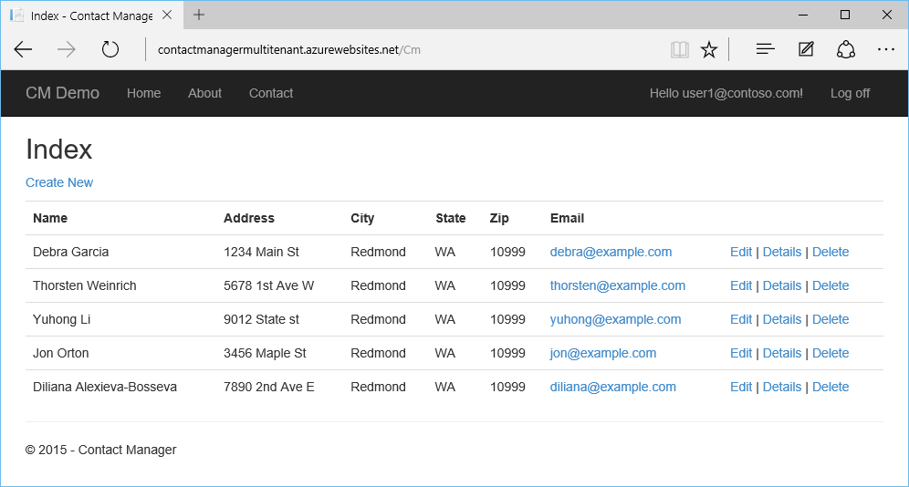
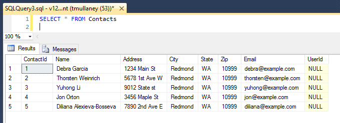
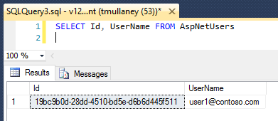
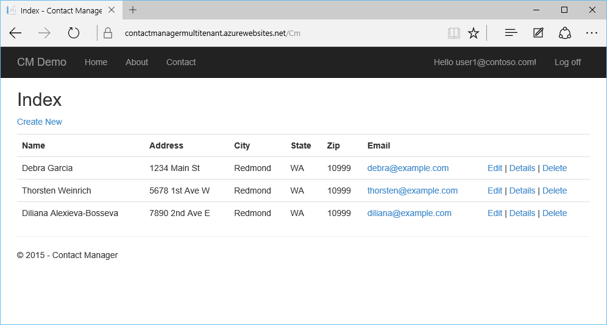

<properties
	pageTitle="Tutorial: Web app with a multi-tenant database using Entity Framework and Row-Level Security"
	description="Learn how to develop an ASP.NET MVC 5 web app with a multi-tenant SQL Database backent, using Entity Framework and Row-Level Security."
  metaKeywords="azure asp.net mvc entity framework multi tenant row level security rls sql database"
	services="app-service\web"
	documentationCenter=".net"
	manager="jeffreyg"
  authors="tmullaney"/>

<tags
	ms.service="app-service-web"
	ms.workload="web"
	ms.tgt_pltfrm="na"
	ms.devlang="dotnet"
	ms.topic="article"
	ms.date="10/30/2015"
	ms.author="thmullan"/>

# Tutorial: Web app with a multi-tenant database using Entity Framework and Row-Level Security

This tutorial shows how to build a multi-tenant web app with a "[shared database, shared schema](https://msdn.microsoft.com/library/aa479086.aspx)" tenancy model, using Entity Framework and [Row-Level Security](https://msdn.microsoft.com/library/dn765131.aspx). In this model, a single database contains data for many tenants, and each row in each table is associated with a "Tenant ID." Row-Level Security (RLS), a new feature for Azure SQL Database, is used to prevent tenants from accessing each other's data. This requires just a single, small change to the application. By centralizing the tenant access logic within the database itself, RLS simplifies the application code and reduces the risk of accidental data leakage between tenants.

Let's start with the simple Contact Manager application from [Create an ASP.NET MVP app with auth and SQL DB and deploy to Azure App Service](web-sites-dotnet-deploy-aspnet-mvc-app-membership-oauth-sql-database.md). Right now, the application allows all users (tenants) to see all contacts:



With just a few small changes, we will add support for multi-tenancy, so that users are able to see only the contacts that belong to them.

## Step 1: Add an Interceptor class in the application to set the SESSION_CONTEXT

There is one application change we need to make. Because all application users connect to the database using the same connection string (i.e. same SQL login), there is currently no way for an RLS policy to know which user it should filter for. This approach is very common in web applications because it enables efficient connection pooling, but it means we need another way to identify the current application user within the database. The solution is to have the application set a key-value pair for the current UserId in the [SESSION_CONTEXT](https://msdn.microsoft.com/library/mt590806) before it executes a query. SESSION_CONTEXT is a session-scoped key-value store, and our RLS policy will use the UserId stored in it to identify the current user. *Note: SESSION_CONTEXT is currently a preview feature on Azure SQL Database.*

We will add an [interceptor](https://msdn.microsoft.com/data/dn469464.aspx), a new feature in Entity Framework (EF) 6, to automatically set the current UserId in the SESSION_CONTEXT by prepending a T-SQL statement before EF executes each query.

1.	Open the ContactManager project in Visual Studio.
2.	Right-click on the Models folder in the Solution Explorer, and choose Add > Class.
3.	Name the new class "SessionContextInterceptor.cs" and click Add.
4.	Replace the contents of SessionContextInterceptor.cs with the following code.

```
using System;
using System.Collections.Generic;
using System.Linq;
using System.Web;
using System.Data.Common;
using System.Data.SqlClient;
using System.Data.Entity;
using System.Data.Entity.Infrastructure.Interception;
using Microsoft.AspNet.Identity;

namespace ContactManager.Models
{
    public class SessionContextInterceptor : IDbCommandInterceptor
    {
        private void SetSessionContext(DbCommand command)
        {
            try
            {
                var userId = System.Web.HttpContext.Current.User.Identity.GetUserId();
                if (userId != null)
                {
                    // Set SESSION_CONTEXT to current UserId before executing queries
                    var sql = "EXEC sp_set_session_context @key=N'UserId', @value=@UserId;";

                    command.CommandText = sql + command.CommandText;
                    command.Parameters.Insert(0, new SqlParameter("@UserId", userId));
                }
            }
            catch (System.NullReferenceException)
            {
                // If no user is logged in, leave SESSION_CONTEXT null (all rows will be filtered)
            }
        }
        public void NonQueryExecuting(DbCommand command, DbCommandInterceptionContext<int> interceptionContext)
        {
            this.SetSessionContext(command);
        }
        public void NonQueryExecuted(DbCommand command, DbCommandInterceptionContext<int> interceptionContext)
        {

        }
        public void ReaderExecuting(DbCommand command, DbCommandInterceptionContext<DbDataReader> interceptionContext)
        {
            this.SetSessionContext(command);
        }
        public void ReaderExecuted(DbCommand command, DbCommandInterceptionContext<DbDataReader> interceptionContext)
        {

        }
        public void ScalarExecuting(DbCommand command, DbCommandInterceptionContext<object> interceptionContext)
        {
            this.SetSessionContext(command);
        }
        public void ScalarExecuted(DbCommand command, DbCommandInterceptionContext<object> interceptionContext)
        {

        }
    }

    public class SessionContextConfiguration : DbConfiguration
    {
        public SessionContextConfiguration()
        {
            AddInterceptor(new SessionContextInterceptor());
        }
    }
}
```

That's the only application change required. Go ahead and build and publish the application.

## Step 2: Add a UserId column to the database schema

Next, we need to add a UserId column to the Contacts table to associate each row with a user (tenant). We will alter the schema directly in the database, so that we don't have to include this field in our EF data model.

Connect to the database directly, using either SQL Server Management Studio or Visual Studio, and then execute the following T-SQL:

```
ALTER TABLE Contacts ADD UserId nvarchar(128)
    DEFAULT CAST(SESSION_CONTEXT(N'UserId') AS nvarchar(128))
```

This adds a UserId column to the Contacts table. We use the nvarchar(128) data type to match the UserIds stored in the AspNetUsers table, and we create a DEFAULT constraint that will automatically set the UserId for newly inserted rows to be the UserId currently stored in SESSION_CONTEXT.

Now the table looks like this:



When new contacts are created, they'll automatically be assigned the correct UserId. For demo purposes, however, let's assign a few of these existing contacts to an existing user.

If you've created a few users in the application already (e.g., using local, Google, or Facebook accounts), you'll see them in the AspNetUsers table. In the screenshot below, there is only one user so far.



Copy the Id for user1@contoso.com, and paste it into the T-SQL statement below. Execute this statement to associate three of the Contacts with this UserId.

```
UPDATE Contacts SET UserId = '19bc9b0d-28dd-4510-bd5e-d6b6d445f511'
WHERE ContactId IN (1, 2, 5)
```

## Step 3: Create a Row-Level Security policy in the database

The final step is to create a security policy that uses the UserId in SESSION_CONTEXT to automatically filter the results returned by queries.

While still connected to the database, execute the following T-SQL:

```
CREATE SCHEMA Security
go

CREATE FUNCTION Security.userAccessPredicate(@UserId nvarchar(128))
	RETURNS TABLE
	WITH SCHEMABINDING
AS
	RETURN SELECT 1 AS accessResult
	WHERE @UserId = CAST(SESSION_CONTEXT(N'UserId') AS nvarchar(128))
go

CREATE SECURITY POLICY Security.userSecurityPolicy
	ADD FILTER PREDICATE Security.userAccessPredicate(UserId) ON dbo.Contacts,
	ADD BLOCK PREDICATE Security.userAccessPredicate(UserId) ON dbo.Contacts
go

```

This code does three things. First, it creates a new schema as a best practice for centralizing and limiting access to the RLS objects. Next, it creates a predicate function that will return '1' when the UserId of a row matches the UserId in SESSION_CONTEXT. Finally, it creates a security policy that adds this function as both a filter and block predicate on the Contacts table. The filter predicate causes queries to return only rows that belong to the current user, and the block predicate acts as a safeguard to prevent the application from ever accidentally inserting a row for the wrong user. *Note: Block predicates are currently a preview feature on Azure SQL Database.*

Now run the application, and sign in as user1@contoso.com. This user now sees only the Contacts we assigned to this UserId earlier:



To validate this further, try registering a new user. They will see no contacts, because none have been assigned to them. If they create a new contact, it will be assigned to them, and only they will be able to see it.

## Next steps

That's it! The simple Contact Manager web app has been converted into a multi-tenant one where each user has its own contact list. By using Row-Level Security, we've avoided the complexity of enforcing tenant access logic in our application code. This transparency allows the application to focus on the real business problem at hand, and it also reduces the risk of accidentally leaking data as the application's codebase grows.

This tutorial has only scratched the surface of what's possible with RLS. For instance, it's possible to have more sophisticated or granular access logic, and it's possible to store more than just the current UserId in the SESSION_CONTEXT. It's also possible to [integrate RLS with the elastic database tools client libraries](../sql-database/sql-database-elastic-tools-multi-tenant-row-level-security.md) to support multi-tenant shards in a scale-out data tier.

Beyond these possibilities, we're also working to make RLS even better. If you have any questions, ideas, or things you'd like to see, please let us know in the comments. We appreciate your feedback!
