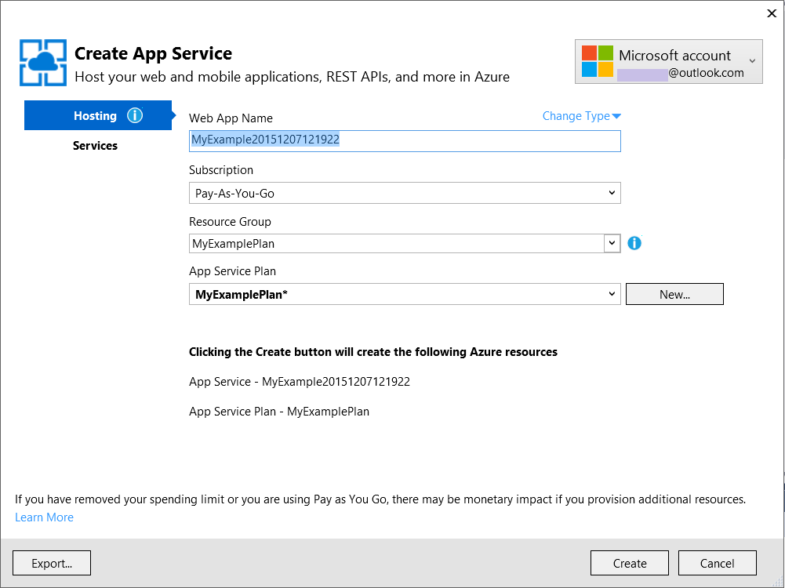
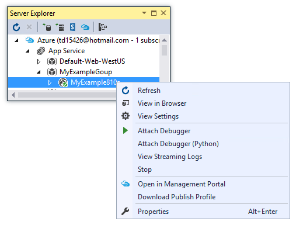
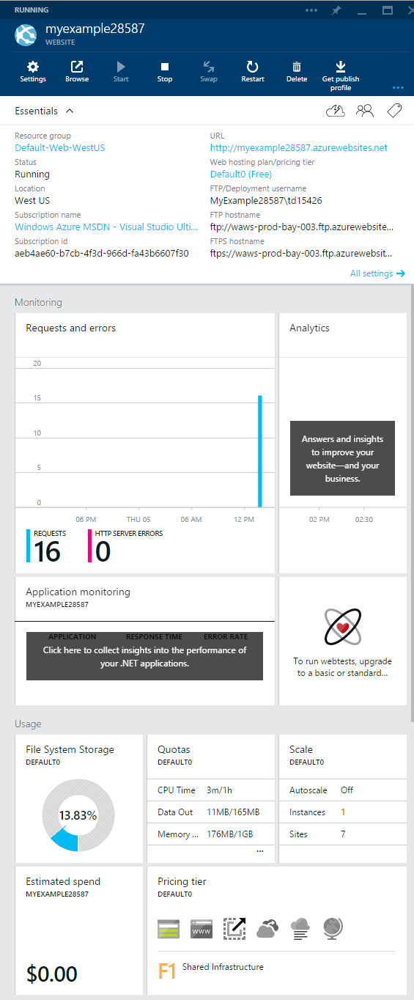
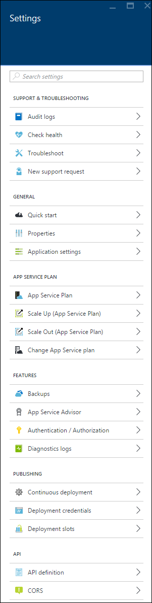
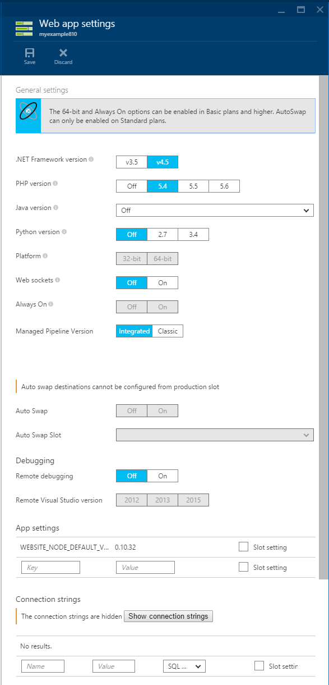

<properties
	pageTitle="Create an ASP.NET web app in Azure App Service | Microsoft Azure"
	description="This tutorial shows you how to create an ASP.NET web project in Visual Studio 2013 and deploy it to a web app in Azure App Service."
	services="app-service\web"
	documentationCenter=".net"
	authors="tdykstra"
	manager="wpickett"
	editor="jimbe"/>

<tags
	ms.service="app-service-web"
	ms.workload="web"
	ms.tgt_pltfrm="na"
	ms.devlang="dotnet"
	ms.topic="hero-article"
	ms.date="08/10/2015"
	ms.author="tdykstra"/>

# Create an ASP.NET web app in Azure App Service

> [AZURE.SELECTOR]
- [.Net](web-sites-dotnet-get-started.md)
- [Node.js](web-sites-nodejs-develop-deploy-mac.md)
- [Java](web-sites-java-get-started.md)
- [PHP - Git](web-sites-php-mysql-deploy-use-git.md)
- [PHP - FTP](web-sites-php-mysql-deploy-use-ftp.md)
- [Python](web-sites-python-ptvs-django-mysql.md)

## Overview

This tutorial shows how to deploy an ASP.NET web application to a [web app in Azure App Service](app-service-web-overview.md) by using Visual Studio 2015 or Visual Studio 2013. The tutorial assumes that you are an ASP.NET developer who has no prior experience with using Azure. On completing the tutorial, you'll have a simple web application up and running in the cloud.

The following illustration shows the completed application:

You'll learn:

* How to prepare your machine for Azure development by installing the [Azure SDK for .NET](../dotnet-sdk/).
* How to set up Visual Studio to create a new App Service web app while it creates an ASP.NET MVC 5 web project.
* How to deploy a web project to an App Service web app by using Visual Studio.
* How to use Visual Studio **Server Explorer** to open remote files and start a remote debug session. 
* How to use the [Azure portal](/overview/preview-portal/) to monitor and manage your web app.

> [AZURE.NOTE] This tutorial is about using ASP.NET with Azure App Service; it doesn't teach how to develop an ASP.NET web application. For an introduction to ASP.NET MVC 5, see [Getting Started with ASP.NET MVC 5](http://www.asp.net/mvc/overview/getting-started/introduction/getting-started) on the [ASP.NET](http://asp.net/) site. For links to other articles that go into more depth about how to use Azure App Service, see the [Next steps](#next-steps) section.
> 
> Help us shape the scope and approach of this tutorial -- if there are other topics you'd like to see covered here in a getting-started tutorial leave feedback in a [Disqus comment](#comments) at the end of the tutorial.

##Sign up for Microsoft Azure

You need an Azure account to complete this tutorial. You can:

* [Open an Azure account for free](/pricing/free-trial/?WT.mc_id=A261C142F). You get credits you that can use to try out paid Azure services. Even after the credits are used up, you can keep the account and use free Azure services and features, such as the Web Apps feature in Azure App Service.
* [Activate MSDN subscriber benefits](/pricing/member-offers/msdn-benefits-details/?WT.mc_id=A261C142F). Your MSDN subscription gives you credits every month that you can use for paid Azure services.

If you want to get started with Azure App Service before you sign up for an Azure account, go to [Try App Service](http://go.microsoft.com/fwlink/?LinkId=523751). There, you can immediately create a short-lived starter web app in App Service—no credit card required, and no commitments.

In the following video, Scott Hanselman shows how easy it is to sign up for a free trial of Microsoft Azure. (Duration: 1:58)

> [AZURE.VIDEO sign-up-for-microsoft-azure]

[AZURE.INCLUDE [install-sdk-2015-2013](../../includes/install-sdk-2015-2013.md)]

## Create a project and a web app

Your first step is to create a web project in Visual Studio and a web app in Azure App Service. When that's done, you'll deploy the project to the web app to make it available on the Internet. 

The diagram illustrates what you're doing in the create and deploy steps.

1. Open Visual Studio 2015 or Visual Studio 2013.

	If you use Visual Studio 2013, the screens will be slightly different from the screenshots, but the procedures are essentially the same.

2. From the **File** menu, click **New > Project**.

3. In the **New Project** dialog box, click **C# > Web > ASP.NET Web Application**. If you prefer, you can choose **Visual Basic**.

3. Make sure that **.NET Framework 4.5.2** is selected as the target framework.

4.  [Azure Application Insights](app-insights-overview.md) monitors your web app for availability, performance, and usage. Clear the **Add Application Insights to Project** check box if you don't want to try it.

4. Name the application **MyExample**.

5. Click **OK**.

	

5. In the **New ASP.NET Project** dialog box, select the **MVC** template.

	[MVC](http://www.asp.net/mvc) is an ASP.NET framework for developing web apps.

7. Click **Change Authentication**.

	

6. In the **Change Authentication** dialog box, click **No Authentication**, and then click **OK**.

	

	The sample application that you're creating won't enable users to log in. The [Next steps](#next-steps) section links to a tutorial that implements authentication and authorization.

5. In the **New ASP.NET Project** dialog box, leave the settings under **Microsoft Azure** unchanged, and then click **OK**.

	

	The default settings specify that Visual Studio will create an Azure web app for your web project. In the next section of the tutorial, you'll deploy the web project to the newly created web app.

5. If you haven't already signed in to Azure, Visual Studio prompts you to do so. Sign in with the ID and password of the account that you use to manage your Azure subscription.

	When you're signed in, the **Configure Microsoft Azure Web App Settings** dialog box asks you what resources you want to create.

	

3. In the **Configure Microsoft Azure Web App Settings** dialog box, enter a **Web App name** that is unique in the *azurewebsites.net* domain. For example, you can name it MyExample with numbers to the right to make it unique, such as MyExample810. If a default web name is created for you, it will be unique and you can use that.

	If someone else has already used the name that you enter, you'll see a red exclamation mark to the right instead of a green check mark, and you'll need to enter a different name.

	Azure will use this name as the prefix for your application's URL. The complete URL will consist of this name plus *.azurewebsites.net* (as shown next to the **Web App name** text box). For example, if the name is `MyExample810`, the URL will be `MyExample810.azurewebsites.net`. The URL has to be unique.

4. In the **App Service plan** drop-down, select **Create new App Service plan**.

	The [Next steps](#next-steps) section has links to information about App Service plans.

5. Enter **MyExamplePlan**, or another name if you prefer, for the plan name.

6. In the **Resource group** drop-down, select **Create new resource group**.

	The [Next steps](#next-steps) section has links to information about resource groups.

5. Enter **MyExampleGroup**, or another name if you prefer, for the resource group name.

5. In the **Region** drop-down list, choose the location that is closest to you.

	This setting specifies which Azure datacenter your web app will run in. For this tutorial, you can select any region and it won't make a noticeable difference. But for a production web app, you want your web server to be as close as possible to the browsers that are accessing your site in order to minimize [latency](http://www.bing.com/search?q=web%20latency%20introduction&qs=n&form=QBRE&pq=web%20latency%20introduction&sc=1-24&sp=-1&sk=&cvid=eefff99dfc864d25a75a83740f1e0090).

5. Leave the database field unchanged.

	For this tutorial, you aren't using a database. The [Next steps](#next-steps) section links to a tutorial that shows how to use a database.

6. Click **OK**.

	

	In a few seconds, Visual Studio creates the web project in the folder that you specified, and it creates the web app in the Azure region that you specified.  

	The **Solution Explorer** window shows the files and folders in the new project.

	

	The **Azure App Service Activity** window shows that the web app has been created.

	

	And you can see the web app in **Server Explorer**.

	

## Deploy the project to the web app

In this section you deploy web project to the web app, as illustrated in step 2 of the diagram.

1. In **Solution Explorer**, right-click the project, and choose **Publish**.

	

	In a few seconds, the **Publish Web** wizard appears. The wizard opens to a *publish profile* that has settings for deploying the web project to the new web app. If you wanted to deploy to a different web app, you could click the **Profile** tab to create a different profile. For this tutorial, you'll accept the settings that deploy to the web app that you created earlier.

8. On the **Connection** tab of the **Publish Web** wizard, click **Next**.

	

10. On the **Settings** tab, click **Next**.

	You can accept the default values for **Configuration** and **File Publish Options**.

	You can use the **Configuration** drop-down to deploy a Debug build for remote debugging. The [Next steps](#next-steps) section links to a tutorial that shows how to run Visual Studio in debug mode remotely.

	

11. On the **Preview** tab, click **Publish**.

	If you want to see what files will be copied to Azure, you can click **Start Preview** before clicking **Publish**.

	

	When you click **Publish** Visual Studio begins the process of copying the files to the Azure server.

	The **Output** and **Azure App Service Activity** windows show what deployment actions were taken and report successful completion of the deployment.

	

	Upon successful deployment, the default browser automatically opens to the URL of the deployed web app, and the application that you created is now running in the cloud. The URL in the browser address bar shows that the web app is loaded from the Internet.

	

13. Keep this browser window open for use in the next section.

**Tip:** You can enable the **Web One Click Publish** toolbar for quick deployment. Click **View > Toolbars**, and then select **Web One Click Publish**. You can use the toolbar to select a profile, click a button to publish, or click a button to open the **Publish Web** wizard.

## Open remote files in Server Explorer

When you're testing and debugging a web app, you can do quick temporary changes on the remote site by opening and editing files in **Server Explorer**.

1.  In **Server Explorer**, navigate to **Azure > App Service > MyExampleGroup**, and then expand the node for your web app.

2. Expand **Files > Views > Home**, and then double-click the *Index.cshtml* file.

	

3. Change `<h1>ASP.NET</h1>` to `<h1>Azure App Service</h1>`.

4. Save the file.

5. Refresh the browser window that has the site running in Azure. 

	

This change is now in the deployed site but not the local project. If you redeploy the project, the site will revert to the way it was before you made this change.

This feature is handy for [temporarily turning off customErrors in the Web.config file in order to get a detailed error message](web-sites-dotnet-troubleshoot-visual-studio.md).

In **Server Explorer** you can also right-click the web app node and get access to web app settings in a Visual Studio window, start a remote debugging session, and view application logs in real time as the application writes them.

For more information, see [Troubleshooting Azure web apps in Visual Studio](web-sites-dotnet-troubleshoot-visual-studio.md).

## Monitor and manage the web app in the Azure portal

The [Azure portal](/services/management-portal/) is a web interface that you can use to manage and monitor your Azure services, such as the web app that you just created. In this section of the tutorial, you look at some of what you can do in the portal.

1. In your browser, go to [https://portal.azure.com](https://portal.azure.com), and sign in with your Azure credentials.

2. Click **Web Apps**, and then click the name of your web app.

	The **Web app** blade displays an overview of settings and usage statistics for your web app.

	

	At this point, your web app hasn't had much traffic and may not show anything in the graph. If you browse to your application, refresh the page a few times, and then refresh the portal page, you'll see some statistics show up.

3. Click **Settings** to see more options for configuring your web app.

	

	You see a list of types of settings.

	

4. Click **Application settings** to see an example of the kinds of settings that you can configure in the portal.

	For example, you can control the .NET version that's used for the web app, enable features such as [WebSockets](/blog/2013/11/14/introduction-to-websockets-on-windows-azure-web-sites/), and set [connection string values](/blog/2013/07/17/windows-azure-web-sites-how-application-strings-and-connection-strings-work/).

	

These are just a few of the portal's features. You can create new web apps, delete existing web apps, stop and restart web apps, and manage other kinds of Azure services, such as databases and virtual machines.  

## Next steps

In this tutorial, you've seen how to create a simple web application and deploy it to an Azure web app. Here are some related topics and resources for learning more about web apps in Azure App Service:

* How to add database and authorization functionality

	For a tutorial that shows how to access a database and restrict some application functions to authorized users, see [Deploy a secure ASP.NET MVC app with membership, OAuth, and SQL Database to an Azure web app](/develop/net/tutorials/web-site-with-sql-database/). That tutorial assumes some knowledge of MVC 5; if you are new to MVC 5, see [Getting Started with ASP.NET MVC 5](http://www.asp.net/mvc/overview/getting-started/introduction/getting-started).

* Other ways to deploy a web project

	For information about other ways to deploy web projects to web apps, by using Visual Studio or by [automating deployment](http://www.asp.net/aspnet/overview/developing-apps-with-windows-azure/building-real-world-cloud-apps-with-windows-azure/continuous-integration-and-continuous-delivery) from a [source control system](http://www.asp.net/aspnet/overview/developing-apps-with-windows-azure/building-real-world-cloud-apps-with-windows-azure/source-control), see [How to deploy an Azure web app](web-sites-deploy.md).

	Visual Studio can also generate Windows PowerShell scripts that you can use to automate deployment. For more information, see [Automate Everything (Building Real-World Cloud Apps with Azure)](http://www.asp.net/aspnet/overview/developing-apps-with-windows-azure/building-real-world-cloud-apps-with-windows-azure/automate-everything).

* How to troubleshoot a web app

	Visual Studio provides features that make it easy to view Azure logs as they are generated in real time. You can also run in debug mode remotely in Azure. For more information, see [Troubleshooting Azure web apps in Visual Studio](web-sites-dotnet-troubleshoot-visual-studio.md).

* How to add a custom domain name and SSL

	For information about how to use SSL and your own domain (for example, www.contoso.com instead of contoso.azurewebsites.net), see the following resources:

	* [Configure a custom domain name in Azure App Service](web-sites-custom-domain-name.md)
	* [Enable HTTPS for an Azure website](web-sites-configure-ssl-certificate.md)

* How to add real-time features such as chat

	If your web app will include real-time features (such as a chat service, a game, or a stock ticker), you can get the best performance by using [ASP.NET SignalR](http://www.asp.net/signalr) with the [WebSockets](/blog/2013/11/14/introduction-to-websockets-on-windows-azure-web-sites/) transport method. For more information, see [Using SignalR with Azure web apps](http://www.asp.net/signalr/overview/signalr-20/getting-started-with-signalr-20/using-signalr-with-windows-azure-web-sites).

* How to choose between App Service, Azure Cloud Services, and Azure Virtual Machines for web applications

	In Azure, you can run web applications in App Service Web Apps as shown in this tutorial, or in Cloud Services or in Virtual Machines. For more information, see [Azure web apps, cloud services, and VMs: When to use which?](/manage/services/web-sites/choose-web-app-service/).

* [How to choose or create an App Service plan](../app-service/azure-web-sites-web-hosting-plans-in-depth-overview.md)

* [How to choose or create a resource group](../azure-preview-portal-using-resource-groups.md)

## What's changed
* For a guide to the change from Websites to App Service, see [Azure App Service and existing Azure services](http://go.microsoft.com/fwlink/?LinkId=529714).
* For a guide to the change from the Azure portal to the preview portal, see [Reference for navigating the Azure portal](http://go.microsoft.com/fwlink/?LinkId=529715).
