<properties
	pageTitle="Deploy an ASP.NET app to Azure App Service using Visual Studio | Microsoft Azure"
	description="Learn how to deploy an ASP.NET web project to a new web app in Azure App Service, using Visual Studio."
	services="app-service\web"
	documentationCenter=".net"
	authors="tdykstra"
	manager="wpickett"
	editor=""/>

<tags
	ms.service="app-service-web"
	ms.workload="web"
	ms.tgt_pltfrm="na"
	ms.devlang="dotnet"
	ms.topic="get-started-article"
	ms.date="07/22/2016"
	ms.author="rachelap"/>

# Deploy an ASP.NET web app to Azure App Service, using Visual Studio

[AZURE.INCLUDE [tabs](../../includes/app-service-web-get-started-nav-tabs.md)]

## Overview

This tutorial shows how to deploy an ASP.NET web application to a [web app in Azure App Service](app-service-web-overview.md) by using Visual Studio 2015.

The tutorial assumes that you are an ASP.NET developer who has no previous experience with using Azure. When you're finished, you'll have a simple web application up and running in the cloud.

You'll learn:

* How to create a new App Service web app while you create a new web project in Visual Studio.
* How to deploy a web project to an App Service web app by using Visual Studio.

The diagram illustrates what you do in the tutorial.

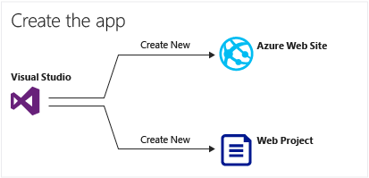

At the end of the tutorial, a [Troubleshooting](#troubleshooting) section gives ideas on what to do if something doesn't work, and a [Next steps](#next-steps) section provides links to other tutorials that go into more depth about how to use Azure App Service.

As this is a getting-started tutorial, the web project it shows how to deploy is a simple one that doesn't use a database and doesn't do authentication or authorization. For links to more advanced deployment topics, see [How to deploy an Azure web app](web-sites-deploy.md).

Apart from the time required to install the Azure SDK for .NET, this tutorial will take about 10-15 minutes to complete.

## Prerequisites

* The tutorial assumes you have worked with ASP.NET MVC and Visual Studio. If you need an introduction, see [Getting Started with ASP.NET MVC 5](http://www.asp.net/mvc/overview/getting-started/introduction/getting-started).

* You need an Azure account. You can [open a free Azure account](/pricing/free-trial/?WT.mc_id=A261C142F) or [Activate Visual Studio subscriber benefits](/pricing/member-offers/msdn-benefits-details/?WT.mc_id=A261C142F). 

	If you want to get started with Azure App Service before you sign up for an Azure account, go to [Try App Service](http://go.microsoft.com/fwlink/?LinkId=523751). There you can create a short-lived starter app in App Service — no credit card required, and no commitments.

## Set up the development environment

The tutorial is written for Visual Studio 2015 with the [Azure SDK for .NET](../dotnet-sdk.md) 2.9 or later. 

* [Download the latest Azure SDK for Visual Studio 2015](http://go.microsoft.com/fwlink/?linkid=518003). The SDK installs Visual Studio 2015 if you don't already have it.

	>[AZURE.NOTE] Depending on how many of the SDK dependencies you already have on your machine, installing the SDK could take a long time, from several minutes to a half hour or more.

If you have Visual Studio 2013 and prefer to use that, you can [download the latest Azure SDK for Visual Studio 2013](http://go.microsoft.com/fwlink/?LinkID=324322). Some screens may look different from the illustrations.

## Configure a new web project

Your next step is to create a web project in Visual Studio and a web app in Azure App Service. In this section of the tutorial you configure the new web project. 

1. Open Visual Studio 2015.

2. Click **File > New > Project**.

3. In the **New Project** dialog box, click **Visual C# > Web > ASP.NET Web Application**.

3. Make sure that **.NET Framework 4.5.2** is selected as the target framework.

4.  [Azure Application Insights](../application-insights/app-insights-overview.md) monitors your web app for availability, performance, and usage. The **Add Application Insights to Project** check box is selected by default the first time you create a web project after installing Visual Studio. Clear the check box if it's selected but you don't want to try Application Insights.

4. Name the application **MyExample**, and then click **OK**.

	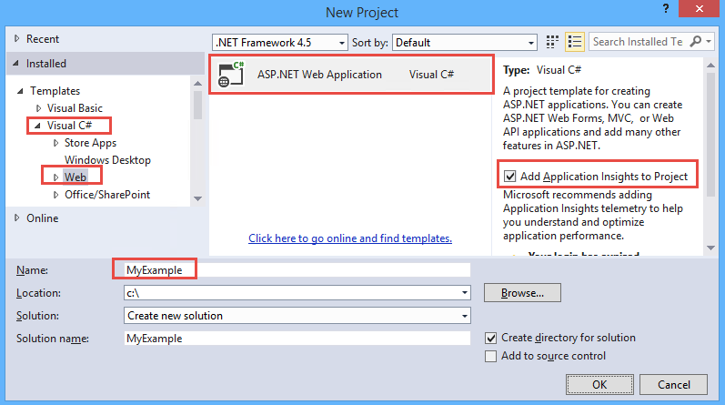

5. In the **New ASP.NET Project** dialog box, select the **MVC** template, and then click **Change Authentication**.

	For this tutorial, you deploy an ASP.NET MVC web project. If you want to learn how to deploy an ASP.NET Web API project, see the [Next steps](#next-steps) section. 

	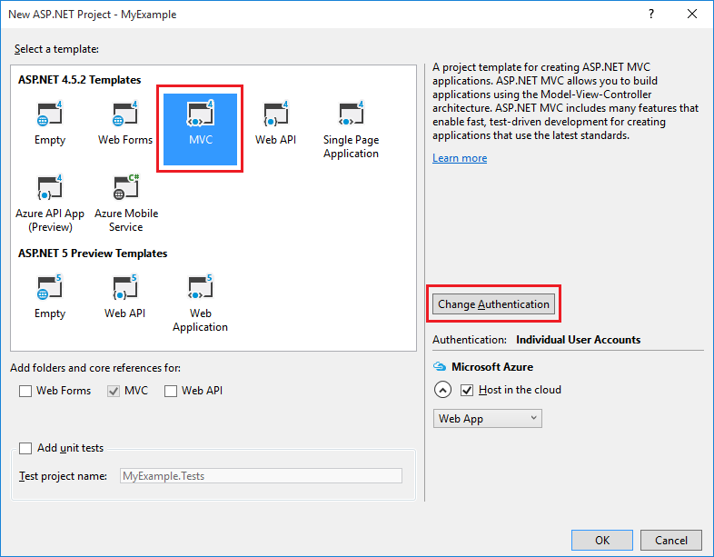

6. In the **Change Authentication** dialog box, click **No Authentication**, and then click **OK**.

	

	For this getting-started tutorial you're deploying a simple app that doesn't do user log-in.

5. In the **Microsoft Azure** section of the **New ASP.NET Project** dialog box, make sure that **Host in the cloud** is selected and that **App Service** is selected in the drop-down list.

	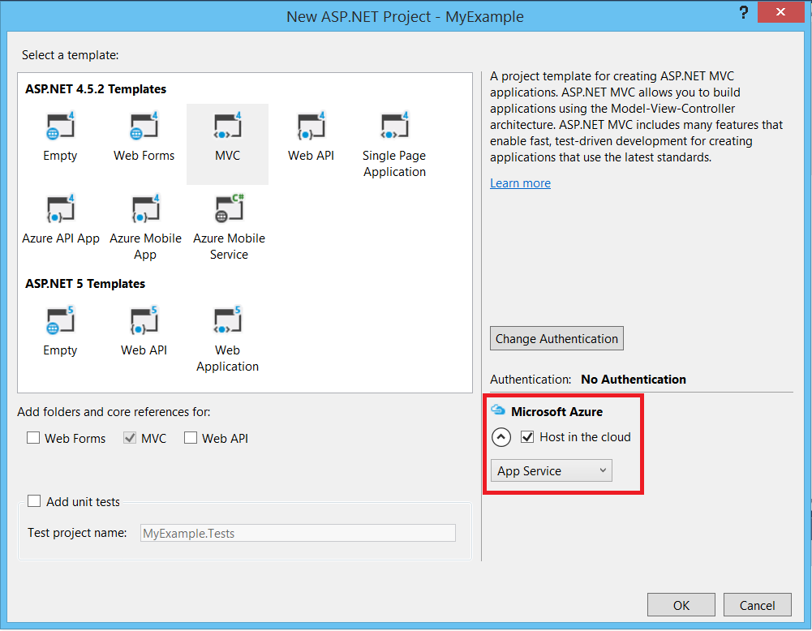

	These settings direct Visual Studio to create an Azure web app for your web project.

6. Click **OK**

## Configure Azure resources for a new web app

Now you tell Visual Studio about the Azure resources that you want it to create.

5. In the **Create App Service** dialog, click **Add an account**, and then sign in to Azure with the ID and password of the account that you use to manage your Azure subscription.

	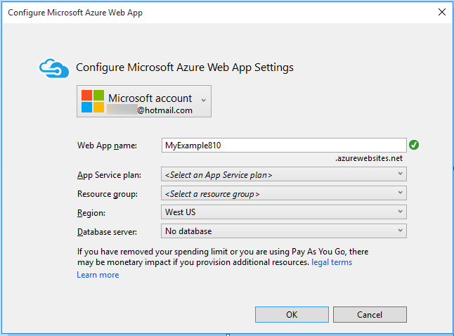

	If you already signed in earlier on the same computer, you might not see the **Add an account** button. In that case, you can skip this step or you might need to reenter your credentials.
 
3. Enter a **Web App Name** that is unique in the *azurewebsites.net* domain. For example, you can name it MyExample with numbers to the right to make it unique, such as MyExample810. If a default web name is created for you, it will be unique and you can use that.

	If someone else has already used the name that you enter, you see a red exclamation mark to the right instead of a green check mark, and you have to enter a different name.

	The URL for your application is this name plus *.azurewebsites.net*. For example, if the name is `MyExample810`, the URL is `myexample810.azurewebsites.net`.

	You can also use a custom domain with an Azure web app. For more information, see [Configure a custom domain name in Azure App Service](web-sites-custom-domain-name.md).

6. Click the **New** button next to the **Resource Group** box, and then enter "MyExample" or another name if you prefer. 

	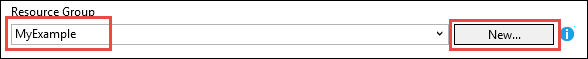

	A resource group is a collection of Azure resources such as web apps, databases, and VMs. For a tutorial, it's generally best to create a new resource group because that makes it easy to delete in one step any Azure resources that you create for the tutorial. For more information, see [Azure Resource Manager overview](../resource-group-overview.md).

4. Click the **New** button next to the **App Service Plan** drop-down.

	

	The **Configure App Service Plan** dialog appears.

	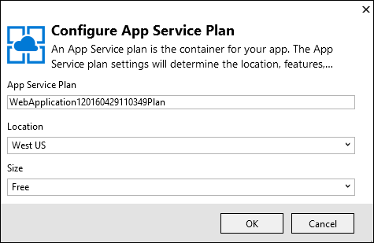

	In the following steps, you configure an App Service plan for the new resource group. An App Service plan specifies the compute resources that your web app runs on. For example, if you choose the free tier, your API app runs on shared VMs, while for some paid tiers it runs on dedicated VMs. For more information, see [App Service plans overview](../app-service/azure-web-sites-web-hosting-plans-in-depth-overview.md).

5. In the **Configure App Service Plan** dialog, enter "MyExamplePlan" or another name if you prefer.

5. In the **Location** drop-down list, choose the location that is closest to you.

	This setting specifies which Azure datacenter your app will run in. For this tutorial, you can select any region and it won't make a noticeable difference. But for a production app, you want your server to be as close as possible to the clients that are accessing it, to minimize [latency](http://www.bing.com/search?q=web%20latency%20introduction&qs=n&form=QBRE&pq=web%20latency%20introduction&sc=1-24&sp=-1&sk=&cvid=eefff99dfc864d25a75a83740f1e0090).

5. In the **Size** drop-down, click **Free**.

	For this tutorial, The free pricing tier will provide good enough performance.

6. In the **Configure App Service Plan** dialog, click **OK**.

7. In the **Create App Service** dialog box, click **Create**.

## Visual Studio creates the project and web app

In a short time, usually less than a minute, Visual Studio creates the web project and the web app.  

The **Solution Explorer** window shows the files and folders in the new project.

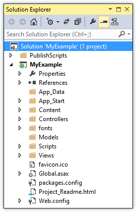

The **Azure App Service Activity** window shows that the web app has been created.

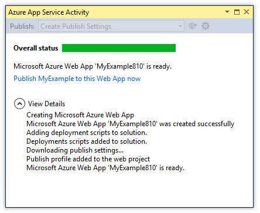

The **Cloud Explorer** window lets you view and manage Azure resources, including the new web app that you just created.

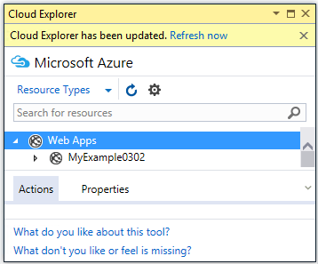
	
## Deploy the web project to the Azure web app

In this section, you deploy the web project to the web app.

1. In **Solution Explorer**, right-click the project, and choose **Publish**.

	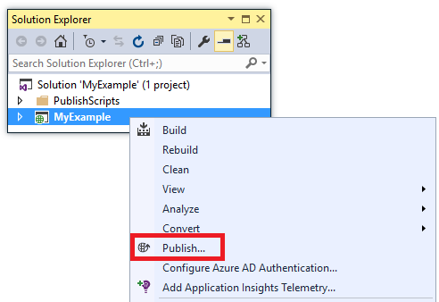

	In a few seconds, the **Publish Web** wizard appears. The wizard opens to a *publish profile* that has settings for deploying the web project to the new web app.

	The publish profile includes a user name and password for deployment.  These credentials have been generated for you, and you don't have to enter them. The password is encrypted in a hidden user-specific file in the `Properties\PublishProfiles` folder.
 
8. On the **Connection** tab of the **Publish Web** wizard, click **Next**.

	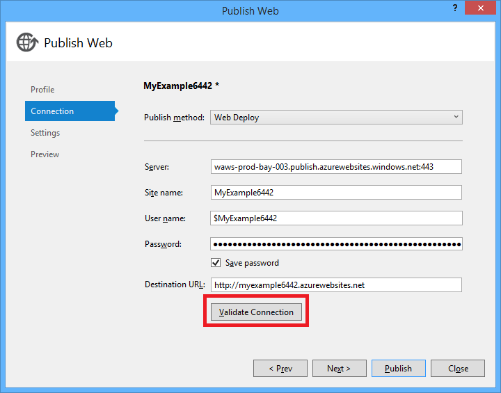

	Next is the **Settings** tab. Here you can change the build configuration to deploy a debug build for [remote debugging](../app-service-web/web-sites-dotnet-troubleshoot-visual-studio.md#remotedebug). The tab also offers several [File Publish Options](https://msdn.microsoft.com/library/dd465337.aspx#Anchor_2).

10. On the **Settings** tab, click **Next**.

	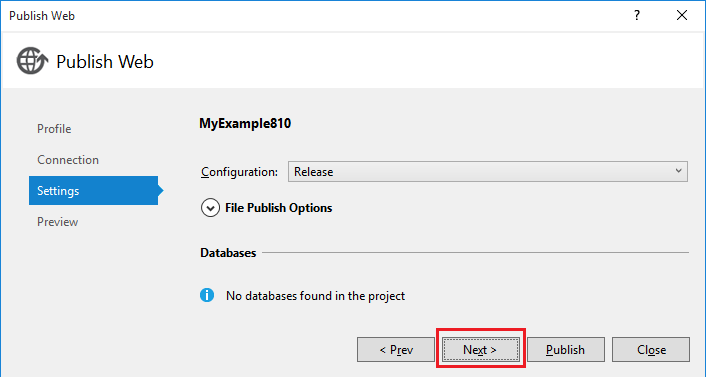

	The **Preview** tab is next. Here you have an opportunity to see what files are going to be copied from your project to the API app. When you're deploying a project to an API app that you already deployed to earlier, only changed files are copied. If you want to see a list of what will be copied, you can click the **Start Preview** button.

11. On the **Preview** tab, click **Publish**.

	

	When you click **Publish**, Visual Studio begins the process of copying the files to the Azure server. This may take a minute or two.

	The **Output** and **Azure App Service Activity** windows show what deployment actions were taken and report successful completion of the deployment.

	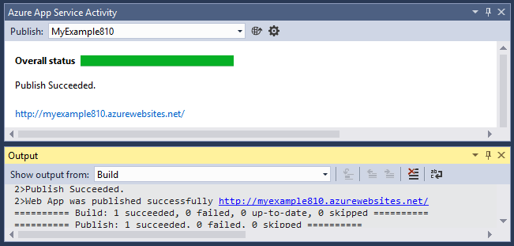

	Upon successful deployment, the default browser automatically opens to the URL of the deployed web app, and the application that you created is now running in the cloud. The URL in the browser address bar shows that the web app is loaded from the Internet.

	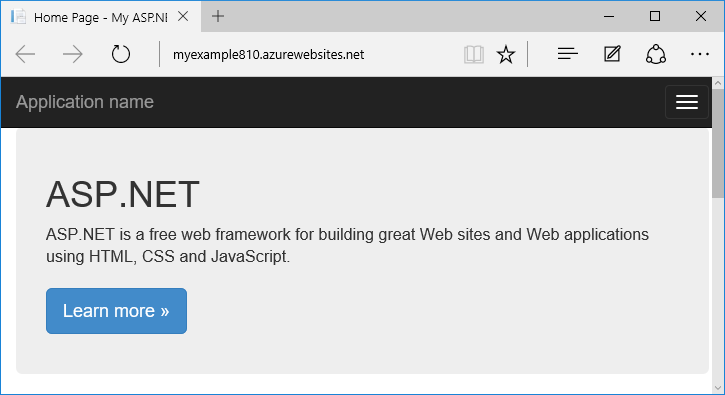

	> [AZURE.TIP] You can enable the **Web One Click Publish** toolbar for quick deployment. Click **View > Toolbars**, and then select **Web One Click Publish**. You can use the toolbar to select a profile, click a button to publish, or click a button to open the **Publish Web** wizard.
	> 

## Troubleshooting

If you run into a problem as you go through this tutorial, make sure that you're using the latest version of the Azure SDK for .NET. The easiest way to do that is to [download the Azure SDK for Visual Studio 2015](http://go.microsoft.com/fwlink/?linkid=518003). If you have the current version installed, the Web Platform Installer lets you know that no installation is needed.

If you're on a corporate network and are trying to deploy to Azure App Service through a firewall, make sure that ports 443 and 8172 are open for Web Deploy. If you can't open those ports, see the following Next steps section for other deployment options.

After you have your ASP.NET web app running in Azure App Service, you might want to learn more about Visual Studio features that simplify troubleshooting. For information about logging, remote debugging, and more, see  [Troubleshooting Azure web apps in Visual Studio](web-sites-dotnet-troubleshoot-visual-studio.md).

## Next steps

In this tutorial, you've seen how to create a simple web application and deploy it to an Azure web app. Here are some related topics and resources for learning more about Azure App Service:

* Monitor and manage your web app in the [Azure portal](https://portal.azure.com/). 

	For more information, see [an overview of the Azure portal](/services/management-portal/) and [Configure web apps in Azure App Service](web-sites-configure.md).

* Deploy an existing web project to a new web app, using Visual Studio

	Right-click the project in **Solution Explorer**, and then click **Publish**. Choose **Microsoft Azure App Service** as the publish target, and then click **New**. The dialogs are then the same as what you've seen in this tutorial.

* Deploy a web project from source control

	For information about [automating deployment](http://www.asp.net/aspnet/overview/developing-apps-with-windows-azure/building-real-world-cloud-apps-with-windows-azure/continuous-integration-and-continuous-delivery) from a [source control system](http://www.asp.net/aspnet/overview/developing-apps-with-windows-azure/building-real-world-cloud-apps-with-windows-azure/source-control), see [Get started with web apps in Azure App Service](app-service-web-get-started.md) and [How to deploy an Azure web app](web-sites-deploy.md).

* Deploy an ASP.NET Web API to an API app in Azure App Service

	You've seen how to create an instance of Azure App Service that is mainly intended to host a website. App Service also offers features for hosting Web APIs, such as CORS support and API metadata support for client code generation. You can use API features in a web app, but if you mainly want to host an API in an instance of App Service, an **API app** would be a better choice. For more information, see [Get started with API Apps and ASP.NET in Azure App Service](../app-service-api/app-service-api-dotnet-get-started.md). 

* Add a custom domain name and SSL

	For information about how to use SSL and your own domain (for example, www.contoso.com instead of contoso.azurewebsites.net), see the following resources:

	* [Configure a custom domain name in Azure App Service](web-sites-custom-domain-name.md)
	* [Enable HTTPS for an Azure website](web-sites-configure-ssl-certificate.md)

* Delete the resource group that contains your web app and any related Azure resources when you're done with them.

	For information about how to work with resource groups in the Azure portal, see [Deploy resources with Resource Manager templates and Azure portal](../resource-group-template-deploy-portal.md).   

*	For more examples of creating an ASP.NET Web App in App Service, see [Create and deploy an ASP.NET web app in Azure App Service](https://github.com/Microsoft/HealthClinic.biz/wiki/Create-and-deploy-an-ASP.NET-web-app-in-Azure-App-Service) and [Create and deploy a mobile app in Azure App Service](https://github.com/Microsoft/HealthClinic.biz/wiki/Create-and-deploy-a-mobile-app-in-Azure-App-Service) from the [HealthClinic.biz](https://github.com/Microsoft/HealthClinic.biz) 2015 Connect [demo](https://blogs.msdn.microsoft.com/visualstudio/2015/12/08/connectdemos-2015-healthclinic-biz/). For more quickstarts from the HealthClinic.biz demo, see [Azure Developer Tools Quickstarts](https://github.com/Microsoft/HealthClinic.biz/wiki/Azure-Developer-Tools-Quickstarts).
