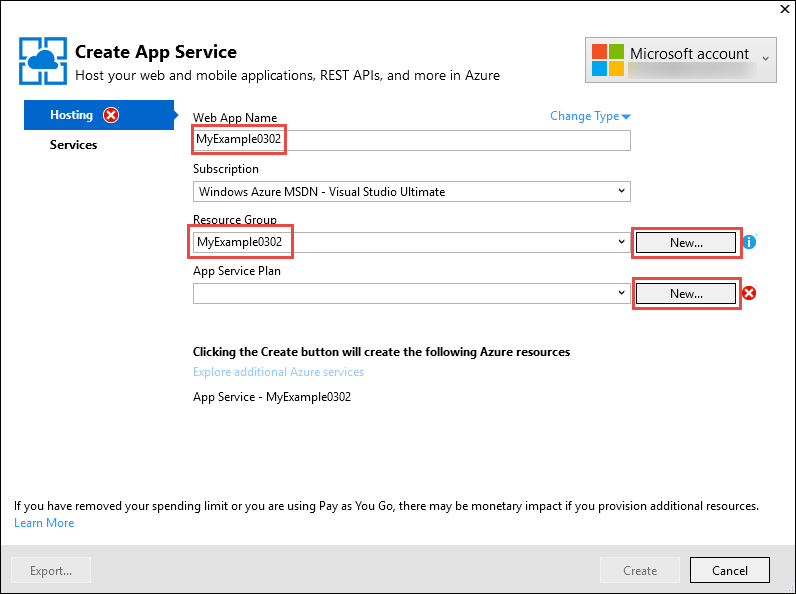
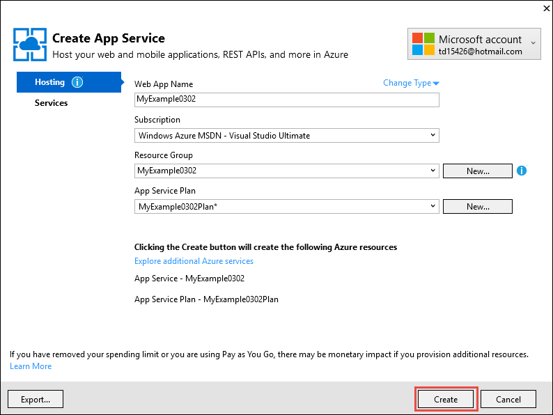
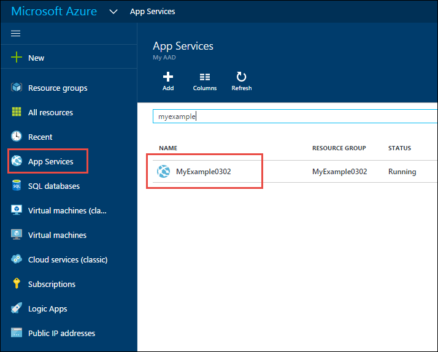
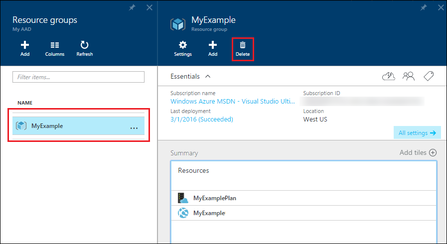

<properties
	pageTitle="Create a web app using Visual Studio | Microsoft Azure"
	description="Learn how to create an ASP.NET web project in Visual Studio and deploy it to a new web app in Azure App Service."
	services="app-service\web"
	documentationCenter=".net"
	authors="tdykstra"
	manager="wpickett"
	editor=""/>

<tags
	ms.service="app-service-web"
	ms.workload="web"
	ms.tgt_pltfrm="na"
	ms.devlang="dotnet"
	ms.topic="hero-article"
	ms.date="03/02/2016"
	ms.author="tdykstra"/>

# Create an ASP.NET web app in Azure App Service using Visual Studio

> [AZURE.SELECTOR]
- [.Net](web-sites-dotnet-get-started.md)
- [Node.js](web-sites-nodejs-develop-deploy-mac.md)
- [Java](web-sites-java-get-started.md)
- [PHP - Git](web-sites-php-mysql-deploy-use-git.md)
- [PHP - FTP](web-sites-php-mysql-deploy-use-ftp.md)
- [Python](web-sites-python-ptvs-django-mysql.md)

## Overview

This tutorial shows how to deploy an ASP.NET web application to a [web app in Azure App Service](app-service-web-overview.md) by using Visual Studio 2015. The tutorial assumes that you are an ASP.NET developer who has no prior experience with using Azure. On completing the tutorial, you'll have a simple web application up and running in the cloud.

The following illustration shows the completed application:

You'll learn:

* How to create a new App Service web app while you create a new web project in Visual Studio.
* How to deploy a web project to an App Service web app by using Visual Studio.
* How to use the [Azure Portal](/features/azure-portal/) to monitor and manage your web app.

At the end of the tutorial, a [Troubleshooting](#troubleshooting) section gives ideas on what to do if something doesn't work, and a [Next steps](#next-steps) section provides links to other tutorials that go into more depth about how to use Azure App Service.

> [AZURE.NOTE] Help us shape the scope and approach of this tutorial -- if there are other topics you'd like to see covered here in a getting-started tutorial, leave feedback in a [Disqus comment](#comments) at the end of the tutorial.

[AZURE.INCLUDE [prereqs](../../includes/app-service-web-dotnet-get-started-prereqs.md)]

## Create a web project and a web app in Azure App Service

Your first step is to create a web project in Visual Studio and a web app in Azure App Service. When that's done, you deploy the project to the web app to make it available on the Internet. 

The diagram illustrates what you're doing in the create and deploy steps.

1. Open Visual Studio 2015.

2. Click **File > New > Project**.

3. In the **New Project** dialog box, click **Visual C# > Web > ASP.NET Web Application**. (If you prefer, you can choose **Visual Basic**.)

3. Make sure that **.NET Framework 4.5.2** is selected as the target framework.

4.  [Azure Application Insights](../application-insights/app-insights-overview.md) monitors your web app for availability, performance, and usage. The **Add Application Insights to Project** check box is selected by default the first time you create a web project after installing Visual Studio. Clear the check box if it's selected but you don't want to try Application Insights.

4. Name the application **MyExample**.

5. Click **OK**.

	

5. In the **New ASP.NET Project** dialog box, select the **MVC** template.

7. Click **Change Authentication**.

	

6. In the **Change Authentication** dialog box, click **No Authentication**, and then click **OK**.

	

	The application that you're creating for this tutorial is a simple one that doesn't support user log-in.

5. In the **Microsoft Azure** section of the **New ASP.NET Project** dialog box, make sure that **Host in the cloud** is selected and that **App Service** is selected in the drop-down list.

	

	These settings direct Visual Studio to create an Azure web app for your web project.

6. Click **OK**.

5. If you haven't already signed in to Azure, Visual Studio prompts you to do so. Sign in with the ID and password of the account that you use to manage your Azure subscription.

	When you're signed in, the **Create App Service** dialog box asks you what resources you want to create.

	

3. In the **Create App Service** dialog box, enter a **Web App Name** that is unique in the *azurewebsites.net* domain. For example, you can name it MyExample with numbers to the right to make it unique, such as MyExample810. If a default web name is created for you, it will be unique and you can use that.

	If someone else has already used the name that you enter, you see a red exclamation mark to the right instead of a green check mark, and you have to enter a different name.

	The URL for your application is this name plus *.azurewebsites.net* (as shown next to the **Web App Name** text box). For example, if the name is `MyExample810`, the URL is `myexample810.azurewebsites.net`.

	The [Next steps](#next-steps) section links to a tutorial that explains how to use your own custom domain with an Azure web app.

6. Next to the **Resource Group** box, click **New**, and then enter "MyExample" or another name if you prefer. 

	This combo box lets you select an existing resource group or create a new one by typing in a name that is different from any existing resource group in your subscription.

	A resource group is a collection of Azure resources such as web apps, databases, and VMs. For a tutorial, it's generally best to create a new resource group because that makes it easy to delete in one step any Azure resources that you create for the tutorial. For more information, see [Azure Resource Manager overview](../resource-group-overview.md).

4. Click the **New** button next to the **App Service Plan** drop-down.

	

	The screen shot shows sample values for **Web App Name**, **Subscription**, and **Resource Group** -- your values will be different.

	In the following steps, you create an App Service plan for the new resource group. An App Service plan specifies the compute resources that your web app runs on. For example, if you choose the free tier, your API app runs on shared VMs, while for some paid tiers it runs on dedicated VMs. For more information, see [App Service plans overview](../app-service/azure-web-sites-web-hosting-plans-in-depth-overview.md).

5. In the **Configure App Service Plan** dialog, enter "MyExamplePlan" or another name if you prefer.

5. In the **Location** drop-down list, choose the location that is closest to you.

	This setting specifies which Azure datacenter your app will run in. For this tutorial, you can select any region and it won't make a noticeable difference. But for a production app, you want your server to be as close as possible to the clients that are accessing it, to minimize [latency](http://www.bing.com/search?q=web%20latency%20introduction&qs=n&form=QBRE&pq=web%20latency%20introduction&sc=1-24&sp=-1&sk=&cvid=eefff99dfc864d25a75a83740f1e0090).

5. In the **Size** drop-down, click **Free**.

	For this tutorial, The free pricing tier will provide sufficient performance.

6. In the **Configure App Service Plan** dialog, click **OK**.

	

7. In the **Create App Service** dialog box, click **Create**.

	

	In a short time, usually less than a minute, Visual Studio creates the web project and the web app.  

	The **Solution Explorer** window shows the files and folders in the new project.

	

	The **Azure App Service Activity** window shows that the web app has been created.

	

	And you can see the web app in the Visual Studio **Cloud Explorer** window.

	
	
	This window lets you view and manage a wide range of Azure resources. The screen shot only shows web apps, but you'll see more resource types in your **Cloud Explorer** window. Right-click a resource such as your web app to see the options you have for managing it.

## Deploy the web project to the Azure web app

In this section, you deploy web project to the web app, as illustrated in step 2 of the diagram.

1. In **Solution Explorer**, right-click the project, and choose **Publish**.

	

	In a few seconds, the **Publish Web** wizard appears. The wizard opens to a *publish profile* that has settings for deploying the web project to the new web app. If you wanted to deploy to a different web app, you could click the **Profile** tab to create a different profile. For this tutorial, you accept the settings that deploy to the web app that you created earlier.

	The publish profile includes a user name and password for deployment. These credentials have been generated for you, and you don't have to enter or change them. The password is encrypted in a hidden user-specific file in the `Properties\PublishProfiles` folder.  

8. On the **Connection** tab of the **Publish Web** wizard, click **Next**.

	

	The next tab is the **Settings** tab. Here you can change the build configuration tab to deploy a debug build for [remote debugging](../app-service-web/web-sites-dotnet-troubleshoot-visual-studio.md#remotedebug). The tab also offers several **File Publish Options**:

	* Remove additional files at destination
	* Precompile during publishing
	* Exclude files from the App_Data folder

	For this tutorial you don't need any of these. For detailed explanations of what they do, see [How to: Deploy a Web Project Using One-Click Publish in Visual Studio](https://msdn.microsoft.com/library/dd465337.aspx).

10. On the **Settings** tab, click **Next**.

	

	The **Preview** tab is next. Here you have an opportunity to see what files are going to be copied from your project to the API app. When you're deploying a project to an API app that you already deployed to earlier, only changed files are copied. If you want to see a list of what will be copied, you can click the **Start Preview** button.

11. On the **Preview** tab, click **Publish**.

	

	When you click **Publish**, Visual Studio begins the process of copying the files to the Azure server. This may take a minute or two.

	The **Output** and **Azure App Service Activity** windows show what deployment actions were taken and report successful completion of the deployment.

	

	Upon successful deployment, the default browser automatically opens to the URL of the deployed web app, and the application that you created is now running in the cloud. The URL in the browser address bar shows that the web app is loaded from the Internet.

	

> [AZURE.TIP] You can enable the **Web One Click Publish** toolbar for quick deployment. Click **View > Toolbars**, and then select **Web One Click Publish**. You can use the toolbar to select a profile, click a button to publish, or click a button to open the **Publish Web** wizard.
> 

##  Monitor and manage the web app in the Azure Portal

The [Azure portal](/services/management-portal/) is a web interface that you can use to manage and monitor your Azure services, such as the web app that you just created. In this section of the tutorial, you look at some of what you can do in the portal.

1. In your browser, go to [https://portal.azure.com](https://portal.azure.com), and sign in with the credentials you use for managing your Azure account.

2. Click **App Services**, and then click the name of your web app.

	

	The **Web app** blade displays an overview of settings and usage statistics for your web app. (Windows that open to the right in the portal are called *blades*.)

	

	Your web app hasn't had much traffic yet and may not show anything in the graph. If you browse to your application, refresh the page a few times, and then refresh the Portal page, you'll see some statistics show up.

3. The **Settings** blade shows more options for configuring your web app.

	

	Notice the **Deployment credentials** link in the **Publishing** section. That's where you can create a custom user name and password for deployment. Click the **Save** button at the top of the blade to submit your change. If you create a new user name and password, you have to enter the same values on the **Connection** tab of the **Publish Web** wizard in your web project.
	
	The screen shot is only a partial view of the **Settings** blade. There are more sections to this blade than are shown.

4. Click **Application settings** from the **General** section of the **Settings** blade to see an example of the kinds of settings that you can configure in the Portal.

	For example, you can control the .NET version that's used for the web app, enable features such as [WebSockets](/blog/2013/11/14/introduction-to-websockets-on-windows-azure-web-sites/), and set [connection string values](/blog/2013/07/17/windows-azure-web-sites-how-application-strings-and-connection-strings-work/).

	

These are just a few of the Portal's features. You can create new web apps, delete existing web apps, stop and restart web apps, and manage other kinds of Azure services, such as databases and virtual machines.

## Delete the Azure web app

When you no longer need the web app that you created for this tutorial, you can delete it. 

An easy way to delete your web app is to click the **Delete** button at the top of its **Web App** blade in the Azure portal. A better way is to delete the resource group that you created to contain the web app. For this tutorial, the resource group contains only the web app, but typically a resource group contains a collection of related resources. For instance, your web app might use a database or Azure storage account that is no longer needed when you delete the web app. When you delete a resource group, everything it contains is deleted. To delete a resource group by using the Azure portal, perform the following steps.

1. Go to the home page of [the Azure portal](https://portal.azure.com).

2. Click **Resource Groups**.

3. In the list of resource groups, click the resource group that you want to delete.

	When the **Resource Group** blade appears, it includes a list of the resources that it contains.

4. On the **Resource Group** blade, click **Delete**.

	

## Troubleshooting

If you run into a problem as you go through this tutorial, make sure that you're using the latest version of the Azure SDK for .NET. The easiest way to do that is to [download the Azure SDK for Visual Studio 2015](http://go.microsoft.com/fwlink/?linkid=518003) -- if you have the current version installed, the Web Platform Installer lets you know that no installation is needed.

If you're on a corporate network and are trying to deploy to Azure App Service through a firewall, make sure that ports 443 and 8172 are open for Web Deploy. If you can't open those ports, see the following Next steps section for other deployment options.

After you have your ASP.NET web app running in Azure App Service, you may want to learn more about Visual Studio features that simplify troubleshooting. For information about logging, remote debugging, and more, see  [Troubleshooting Azure web apps in Visual Studio](web-sites-dotnet-troubleshoot-visual-studio.md).

## Next steps

In this tutorial, you've seen how to create a simple web application and deploy it to an Azure web app. Here are some related topics and resources for learning more about Azure App Service:

* How to deploy an existing web project to a new web app

	To start the deployment process for an existing web project, right-click the project in **Solution Explorer**, and then click **Publish**. Choose **Microsoft Azure App Service** as the publish target. Then choose an existing Azure web app as the target or click **New** to create a new one. If you click **New** to create a new one, the process is the same as what you see here in this tutorial.

* Other ways to create web apps

	You can also create web apps by using the [Azure portal](https://portal.azure.com/), [Azure cmdlets for Windows PowerShell](../powershell-install-configure.md), or the [cross-platform command-line interface](../xplat-cli.md).

* How to create API apps

	You've seen how to create an instance of Azure App Service that is mainly intended to host a website.  Such instances are called web apps. App Service also has features designed to make it easier to develop, test, and host APIs. Instances of App Service intended mainly to host APIs are called API apps. For more information, see [Get started with API Apps and ASP.NET in Azure App Service](../app-service-api/app-service-api-dotnet-get-started.md). 

* Other ways to deploy a web project

	For information about other ways to deploy web projects to web apps, by using Visual Studio or by [automating deployment](http://www.asp.net/aspnet/overview/developing-apps-with-windows-azure/building-real-world-cloud-apps-with-windows-azure/continuous-integration-and-continuous-delivery) from a [source control system](http://www.asp.net/aspnet/overview/developing-apps-with-windows-azure/building-real-world-cloud-apps-with-windows-azure/source-control), see [How to deploy an Azure web app](web-sites-deploy.md).

* How to add a custom domain name and SSL

	For information about how to use SSL and your own domain (for example, www.contoso.com instead of contoso.azurewebsites.net), see the following resources:

	* [Configure a custom domain name in Azure App Service](web-sites-custom-domain-name.md)
	* [Enable HTTPS for an Azure website](web-sites-configure-ssl-certificate.md)

* How to add real-time features such as chat

	For real-time features such as a chat service, a game, or a stock ticker, you can get the best performance by using [ASP.NET SignalR](http://www.asp.net/signalr) with the [WebSockets](/blog/2013/11/14/introduction-to-websockets-on-windows-azure-web-sites/) transport method. For more information, see [Using SignalR with Azure web apps](http://www.asp.net/signalr/overview/signalr-20/getting-started-with-signalr-20/using-signalr-with-windows-azure-web-sites).

* How to choose between App Service, Azure Cloud Services, and Azure Virtual Machines for web applications

	In Azure, you can run web applications in App Service Web Apps as shown in this tutorial, or in Cloud Services or in Virtual Machines. For more information, see [Azure web apps, cloud services, and VMs: When to use which](/manage/services/web-sites/choose-web-app-service/).
