# Create a line-of-business Azure app with Azure Active Directory authentication
This article shows you how to create a .NET line-of-business app in 
[Azure App Service Web Apps](http://go.microsoft.com/fwlink/?LinkId=529714) using the 
[Authentication / Authorization](../app-service/app-service-authentication-overview.md) feature. It also shows how 
to use the [Azure Active Directory Graph API](https://msdn.microsoft.com/Library/Azure/Ad/Graph/api/api-catalog) 
to query directory data in the application.

The Azure Active Directory tenant that you use can be an Azure-only directory. Or, it can be 
[synced with your on-premises Active Directory](../active-directory/active-directory-aadconnect.md) to create a single sign-on experience for 
workers that are on-premises and remote. This article uses the default directory for your Azure account.

## What you will build
You will build a simple line-of-business Create-Read-Update-Delete (CRUD) application in App Service Web Apps that tracks 
work items with the following features:

* Authenticates users against Azure Active Directory
* Queries directory users and groups using [Azure Active Directory Graph API](http://msdn.microsoft.com/library/azure/hh974476.aspx)
* Use the ASP.NET MVC *No Authentication* template

If you need role-based access control (RBAC) for your line-of-business app in Azure, see [Next Step](#next).

## What you need
[!INCLUDE [free-trial-note](../../includes/free-trial-note.md)]

You need the following to complete this tutorial:

* An Azure Active Directory tenant with users in various groups
* Permissions to create applications on the Azure Active Directory tenant
* Visual Studio 2013 Update 4 or later
* [Azure SDK 2.8.1 or later](https://azure.microsoft.com/downloads/)

## Create and deploy a web app to Azure
1. From Visual Studio, click **File** > **New** > **Project**.
2. Select **ASP.NET Web Application**, name your project, and click **OK**.
3. Select the **MVC** template, then change the authentication to **No Authentication**. Make sure **Host in the Cloud** is selected and click **OK**.
   
    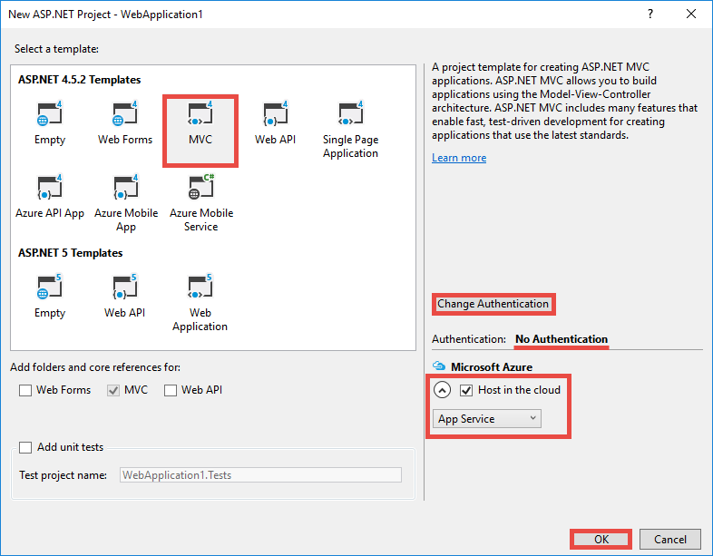
4. In the **Create App Service** dialog, click **Add an account** (and then **Add an account** in the dropdown) to log in to your Azure account.
5. Once logged in configure your web app. Create a resource group and a new App Service plan by clicking the respective **New** button. Click 
   **Explore additional Azure services** to continue.
   
    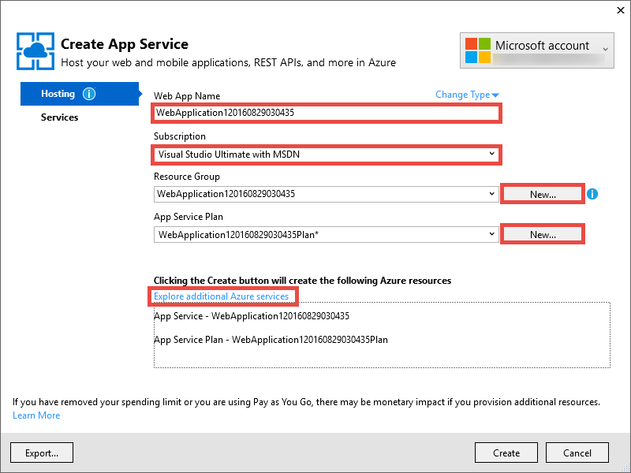
6. In the **Services** tab, click **+** to add a SQL Database for your app. 
   
    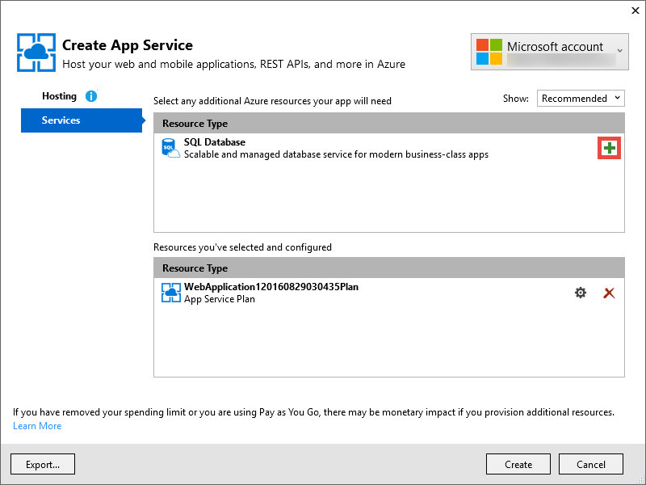
7. In **Configure SQL Database**, click **New** to create a SQL Server instance.
8. In **Configure SQL Server**, configure your SQL Server instance. Then, click **OK**, **OK**, and **Create** to kick off the app creation in Azure.
9. In **Azure App Service Activity**, you can see when the app creation is finished. Click **Publish &lt;*appname*> to this Web App now**, then click **Publish**. 
   
    Once Visual Studio finishes, it opens the publish app in the browser. 
   
    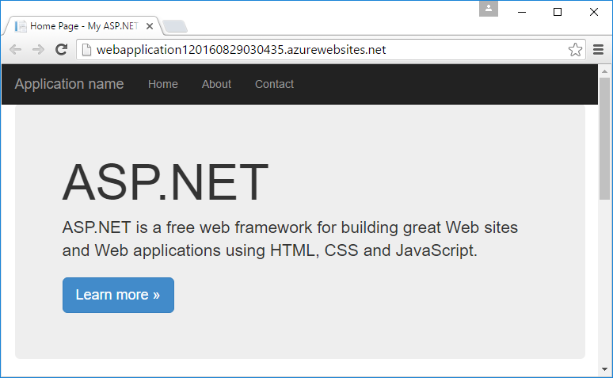

## Configure authentication and directory access
1. Log in to the [Azure portal](https://portal.azure.com).
2. From the left menu, click **App Services** > **&lt;*appname*>** > **Authentication / Authorization**.
   
    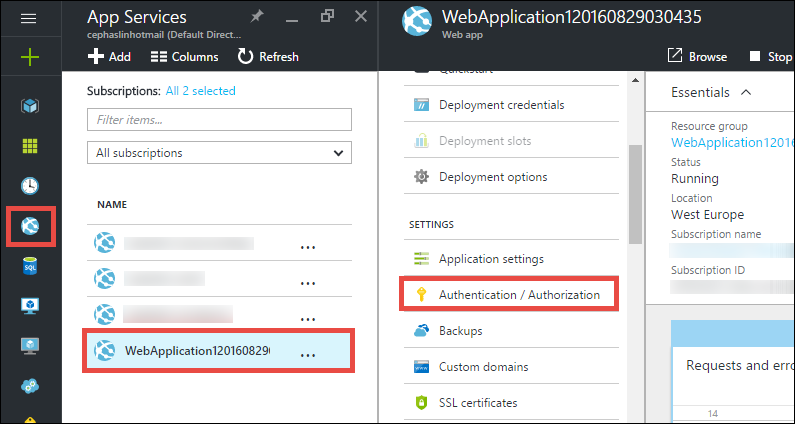
3. Turn on Azure Active Directory authentication by clicking **On** > **Azure Active Directory** > **Express** > **OK**.
   
    
4. Click **Save** in the command bar.
   
    
   
    Once the authentication settings are saved successfully, try navigating to your app again in the browser. Your default settings enforce authentication
    on the whole app. If you aren't already logged in, you are redirected to a login screen. Once logged in, you see your app secured by HTTPS. Next,
    you need to enable access to directory data. 
5. Navigate to the [classic portal](https://manage.windowsazure.com).
6. From the left menu, click **Active Directory** > **Default Directory** > **Applications** > **&lt;*appname*>**.
   
    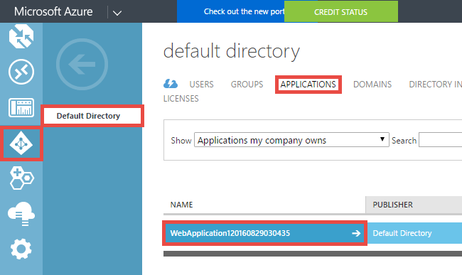
   
    This is the Azure Active Directory application that App Service created for you to enable the Authorization / Authentication feature.
7. Click **Users** and **Groups** to make sure that you have some users and groups in the directory. If not, create a few test users and groups.
   
    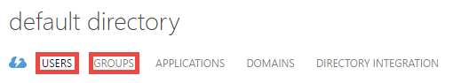
8. Click **Configure** to configure this application.
9. Scroll down to the **Keys** section and add a key by selecting a duration. Then, click **Delegated Permissions** and select **Read directory data**. 
   Click **Save**.
   
    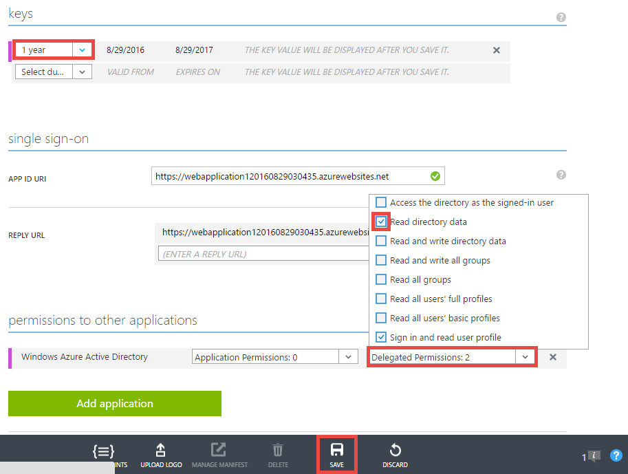
10. Once your settings are saved, scroll back up to the **Keys** section and click the **Copy** button to copy the client key. 
    
     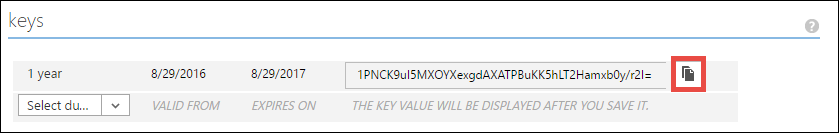
    
    > [!IMPORTANT]
    > If you navigate away from this page now, you won't be able to access this client key ever again.
    > 
    > 
11. Next, you need to configure your web app with this key. Log in to the [Azure Resource Explorer](https://resources.azure.com) with your 
    Azure account.
12. At the top of the page, click **Read/Write** to make changes in the Azure Resource Explorer.
    
    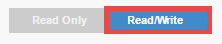
13. Find the authentication settings for your app, located at subscriptions > **&lt;*subscriptionname*>** > **resourceGroups** > **&lt;*resourcegroupname*>** > **providers** > **Microsoft.Web** > **sites** > **&lt;*appname*>** > **config** > **authsettings**.
14. Click **Edit**.
    
    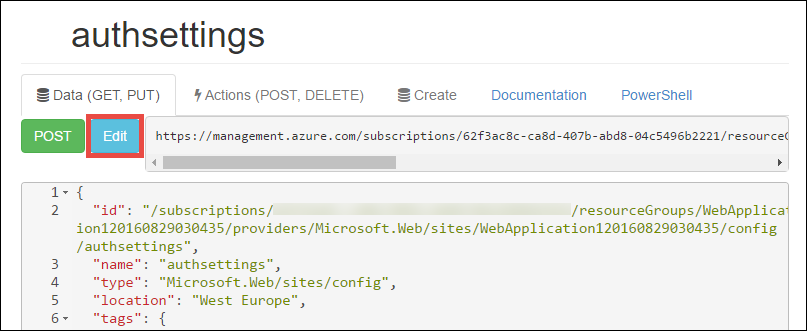
15. In the editing pane, set the `clientSecret` and `additionalLoginParams` properties as follows.
    
        ...
        "clientSecret": "<client key from the Azure Active Directory application>",
        ...
        "additionalLoginParams": ["response_type=code id_token", "resource=https://graph.windows.net"],
        ...
16. Click **Put** at the top to submit your changes.
    
    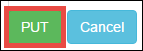
17. Now, to test if you have the authorization token to access the Azure Active Directory Graph API, just navigate to
    **https://&lt;*appname*>.azurewebsites.net/.auth/me** in your browser. If you configured everything correctly, you
    should see the `access_token` property in the JSON response.
    
    The `~/.auth/me` URL path is managed by App Service Authentication / Authorization to give you all the information
    related to your authenticated session. For more information, see 
    [Authentication and authorization in Azure App Service](../app-service/app-service-authentication-overview.md).
    
    > [!NOTE]
    > The `access_token` has an expiration period. However, App Service Authentication / Authorization provides
    > token refresh functionality with `~/.auth/refresh`. For more information on how to use it, see 
    > [App Service Token Store](https://cgillum.tech/2016/03/07/app-service-token-store/).
    > 
    > 

Next, you will do something useful with directory data.

## Add line-of-business functionality to your app
Now, you create a simple CRUD work items tracker.  

1. In the ~\Models folder, create a class file called WorkItem.cs, and replace `public class WorkItem {...}` with the following code:
   
     using System.ComponentModel.DataAnnotations;
   
     public class WorkItem
     {
   
         [Key]
         public int ItemID { get; set; }
         public string AssignedToID { get; set; }
         public string AssignedToName { get; set; }
         public string Description { get; set; }
         public WorkItemStatus Status { get; set; }
     }
   
     public enum WorkItemStatus
     {
   
         Open,
         Investigating,
         Resolved,
         Closed
     }
2. Build the project to make your new model accessible to the scaffolding logic in Visual Studio.
3. Add a new scaffolded item `WorkItemsController` to the ~\Controllers folder (right-click **Controllers**, 
   point to **Add**, and select **New scaffolded item**). 
4. Select **MVC 5 Controller with views, using Entity Framework** and click **Add**.
5. Select the model that you created, then click **+** and then **Add** to add a data context, and then click **Add**.
   
   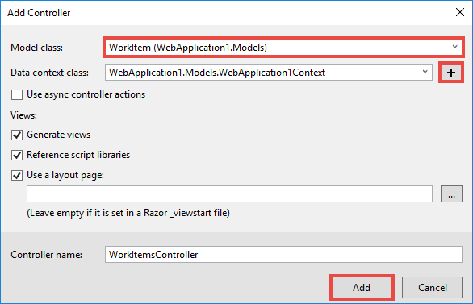
6. In ~\Views\WorkItems\Create.cshtml (an automatically scaffolded item), find the `Html.BeginForm` helper method and make the following
   highlighted changes:  
   
   <pre class="prettyprint">
   @model WebApplication1.Models.WorkItem
   
   @{
    ViewBag.Title = &quot;Create&quot;;
   }
   
   &lt;h2&gt;Create&lt;/h2&gt;
   
   @using (Html.BeginForm(<mark>&quot;Create&quot;, &quot;WorkItems&quot;, FormMethod.Post, new { id = &quot;main-form&quot; }</mark>)) 
   {
    @Html.AntiForgeryToken()
   
    &lt;div class=&quot;form-horizontal&quot;&gt;
        &lt;h4&gt;WorkItem&lt;/h4&gt;
        &lt;hr /&gt;
        @Html.ValidationSummary(true, &quot;&quot;, new { @class = &quot;text-danger&quot; })
        &lt;div class=&quot;form-group&quot;&gt;
            @Html.LabelFor(model =&gt; model.AssignedToID, htmlAttributes: new { @class = &quot;control-label col-md-2&quot; })
            &lt;div class=&quot;col-md-10&quot;&gt;
                @Html.EditorFor(model =&gt; model.AssignedToID, new { htmlAttributes = new { @class = &quot;form-control&quot;<mark>, @type = &quot;hidden&quot;</mark> } })
                @Html.ValidationMessageFor(model =&gt; model.AssignedToID, &quot;&quot;, new { @class = &quot;text-danger&quot; })
            &lt;/div&gt;
        &lt;/div&gt;
   
        &lt;div class=&quot;form-group&quot;&gt;
            @Html.LabelFor(model =&gt; model.AssignedToName, htmlAttributes: new { @class = &quot;control-label col-md-2&quot; })
            &lt;div class=&quot;col-md-10&quot;&gt;
                @Html.EditorFor(model =&gt; model.AssignedToName, new { htmlAttributes = new { @class = &quot;form-control&quot; } })
                @Html.ValidationMessageFor(model =&gt; model.AssignedToName, &quot;&quot;, new { @class = &quot;text-danger&quot; })
            &lt;/div&gt;
        &lt;/div&gt;
   
        &lt;div class=&quot;form-group&quot;&gt;
            @Html.LabelFor(model =&gt; model.Description, htmlAttributes: new { @class = &quot;control-label col-md-2&quot; })
            &lt;div class=&quot;col-md-10&quot;&gt;
                @Html.EditorFor(model =&gt; model.Description, new { htmlAttributes = new { @class = &quot;form-control&quot; } })
                @Html.ValidationMessageFor(model =&gt; model.Description, &quot;&quot;, new { @class = &quot;text-danger&quot; })
            &lt;/div&gt;
        &lt;/div&gt;
   
        &lt;div class=&quot;form-group&quot;&gt;
            @Html.LabelFor(model =&gt; model.Status, htmlAttributes: new { @class = &quot;control-label col-md-2&quot; })
            &lt;div class=&quot;col-md-10&quot;&gt;
                @Html.EnumDropDownListFor(model =&gt; model.Status, htmlAttributes: new { @class = &quot;form-control&quot; })
                @Html.ValidationMessageFor(model =&gt; model.Status, &quot;&quot;, new { @class = &quot;text-danger&quot; })
            &lt;/div&gt;
        &lt;/div&gt;
   
        &lt;div class=&quot;form-group&quot;&gt;
            &lt;div class=&quot;col-md-offset-2 col-md-10&quot;&gt;
                &lt;input type=&quot;submit&quot; value=&quot;Create&quot; class=&quot;btn btn-default&quot;<mark> id=&quot;submit-button&quot;</mark> /&gt;
            &lt;/div&gt;
        &lt;/div&gt;
    &lt;/div&gt;
   }
   
   &lt;div&gt;
    @Html.ActionLink(&quot;Back to List&quot;, &quot;Index&quot;)
   &lt;/div&gt;
   
   @section Scripts {
    @Scripts.Render(&quot;~/bundles/jqueryval&quot;)
    <mark>&lt;script&gt;
        // People/Group Picker Code
        var maxResultsPerPage = 14;
        var input = document.getElementById(&quot;AssignedToName&quot;);
   
        // Access token from request header, and tenantID from claims identity
        var token = &quot;@Request.Headers[&quot;X-MS-TOKEN-AAD-ACCESS-TOKEN&quot;]&quot;;
        var tenant =&quot;@(System.Security.Claims.ClaimsPrincipal.Current.Claims
                        .Where(c => c.Type == &quot;http://schemas.microsoft.com/identity/claims/tenantid&quot;)
                        .Select(c => c.Value).SingleOrDefault())&quot;;
   
        var picker = new AadPicker(maxResultsPerPage, input, token, tenant);
   
        // Submit the selected user/group to be asssigned.
        $(&quot;#submit-button&quot;).click({ picker: picker }, function () {
            if (!picker.Selected())
                return;
            $(&quot;#main-form&quot;).get()[0].elements[&quot;AssignedToID&quot;].value = picker.Selected().objectId;
        });
    &lt;/script&gt;</mark>
   }
   </pre>
   
   Note that `token` and `tenant` are used by the `AadPicker` object to make Azure Active Directory Graph API calls. You'll 
   add `AadPicker` later.     
   
   > [!NOTE]
   > You can just as well get `token` and `tenant` from the client side with `~/.auth/me`, but that would be an 
   > additional server call. For example:
   > 
   > $.ajax({
   > dataType: "json",
   > url: "/.auth/me",
   > success: function (data) {
   > var token = data[0].access_token;
   > var tenant = data[0].user_claims
   > .find(c => c.typ === 'http://schemas.microsoft.com/identity/claims/tenantid')
   > .val;
   > }
   > });
   > 
   > 
7. Make the same changes with ~\Views\WorkItems\Edit.cshtml.
8. The `AadPicker` object is defined in a script that you need to add to your project. Right-click the ~\Scripts folder, point 
   to **Add**, and click **JavaScript file**. Type `AadPickerLibrary` for the filename and click **OK**.
9. Copy the content from 
   [here](https://raw.githubusercontent.com/cephalin/active-directory-dotnet-webapp-roleclaims/master/WebApp-RoleClaims-DotNet/Scripts/AadPickerLibrary.js) 
   into ~\Scripts\AadPickerLibrary.js.
   
   In the script, the `AadPicker` object calls 
   [Azure Active Directory Graph API](https://msdn.microsoft.com/Library/Azure/Ad/Graph/api/api-catalog) to search for users and 
   groups that match the input.  
10. ~\Scripts\AadPickerLibrary.js also uses the [jQuery UI Autocomplete widget](https://jqueryui.com/autocomplete/). So you need to add jQuery 
    UI to your project. Right-click your project in and click **Manage NuGet Packages**.
11. In the NuGet Package Manager, click Browse, type **jquery-ui** in the search bar, and click **jQuery.UI.Combined**.
    
    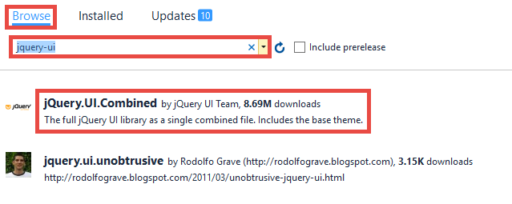
12. In the right pane, click **Install**, then click **OK** to proceed.
13. Open ~\App_Start\BundleConfig.cs and make the following highlighted changes:  
    
    <pre class="prettyprint">
    public static void RegisterBundles(BundleCollection bundles)
    {
        bundles.Add(new ScriptBundle(&quot;~/bundles/jquery&quot;).Include(
                    &quot;~/Scripts/jquery-{version}.js&quot;<mark>,
                    &quot;~/Scripts/jquery-ui-{version}.js&quot;,
                    &quot;~/Scripts/AadPickerLibrary.js&quot;</mark>));
    
        bundles.Add(new ScriptBundle(&quot;~/bundles/jqueryval&quot;).Include(
                    &quot;~/Scripts/jquery.validate*&quot;));
    
        // Use the development version of Modernizr to develop with and learn from. Then, when you&#39;re
        // ready for production, use the build tool at http://modernizr.com to pick only the tests you need.
        bundles.Add(new ScriptBundle(&quot;~/bundles/modernizr&quot;).Include(
                    &quot;~/Scripts/modernizr-*&quot;));
    
        bundles.Add(new ScriptBundle(&quot;~/bundles/bootstrap&quot;).Include(
                    &quot;~/Scripts/bootstrap.js&quot;,
                    &quot;~/Scripts/respond.js&quot;));
    
        bundles.Add(new StyleBundle(&quot;~/Content/css&quot;).Include(
                    &quot;~/Content/bootstrap.css&quot;,
                    &quot;~/Content/site.css&quot;<mark>,
                    &quot;~/Content/themes/base/jquery-ui.css&quot;</mark>));
    }
    </pre>
    
    There are more performant ways to manage JavaScript and CSS files in your app. However, for simplicity you're just going to piggyback on the 
    bundles that are loaded with every view.
14. Finally, in ~\Global.asax, add the following line of code in the `Application_Start()` method. `Ctrl`+`.` on each naming resolution error to 
    fix it.
    
        AntiForgeryConfig.UniqueClaimTypeIdentifier = ClaimTypes.NameIdentifier;
    
    > [!NOTE]
    > You need this line of code because the default MVC template uses <code>[ValidateAntiForgeryToken]</code> decoration 
    > on some of the actions. Due to the behavior described by [Brock Allen](https://twitter.com/BrockLAllen) at 
    > [MVC 4, AntiForgeryToken and Claims](http://brockallen.com/2012/07/08/mvc-4-antiforgerytoken-and-claims/) your HTTP POST may fail 
    > anti-forgery token validation because:
    > 
    > * Azure Active Directory does not send the http://schemas.microsoft.com/accesscontrolservice/2010/07/claims/identityprovider, 
    >   which is required by default by the anti-forgery token.
    > * If Azure Active Directory is directory synced with AD FS, the AD FS trust by default does not send the 
    >   http://schemas.microsoft.com/accesscontrolservice/2010/07/claims/identityprovider claim either, although you can manually 
    >   configure AD FS to send this claim.
    > 
    > `ClaimTypes.NameIdentifies` specifies the claim `http://schemas.xmlsoap.org/ws/2005/05/identity/claims/nameidentifier`, which Azure 
    > Active Directory does supply.  
    > 
    > 
15. Now, publish your changes. Right-click your project and click **Publish**.
16. Click **Settings**, make sure there is a connection string to your SQL Database, select **Update Database** to make the schema changes 
    for your model, and click **Publish**.
    
    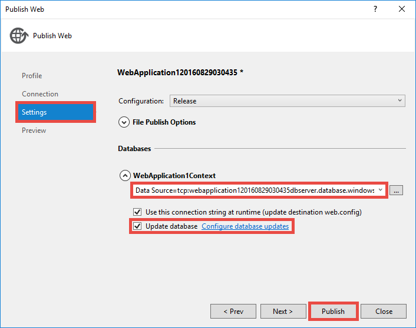
17. In the browser, navigate to https://&lt;*appname*>.azurewebsites.net/workitems and click **Create New**.
18. Click in the **AssignedToName** box. You should now see users and groups from your Azure Active Directory tenant in a dropdown. You can 
    type to filter, or use the `Up` or `Down` key or click to select the user or group. 
    
    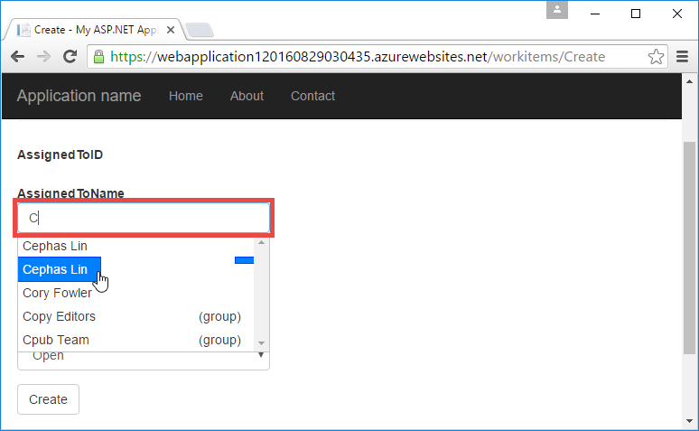
19. Click **Create** to save the changes. Then, click **Edit** on the created work item to observe the same behavior.

Congrats, you are now running a line-of-business app in Azure with directory access! There's a lot more you can do with the Graph API. See 
[Azure AD Graph API reference](https://msdn.microsoft.com/library/azure/ad/graph/api/api-catalog).

## Next Step
If you need role-based access control (RBAC) for your line-of-business app in azure, see 
[WebApp-RoleClaims-DotNet](https://github.com/Azure-Samples/active-directory-dotnet-webapp-roleclaims) for a sample from
the Azure Active Directory team. It shows you how to enable roles for your Azure Active Directory application, and then 
authorize users with the `[Authorize]` decoration.

<!-- If your line-of-business app needs access to on-premises data, see 
[Access on-premises resources using hybrid connections in Azure App Service](web-sites-hybrid-connection-get-started.md). -->

## Further resources
* [Authentication and authorization in Azure App Service](../app-service/app-service-authentication-overview.md)
* [Authenticate with on-premises Active Directory in your Azure app](web-sites-authentication-authorization.md)
* [Create a line-of-business app in Azure with AD FS authentication](web-sites-dotnet-lob-application-adfs.md)
* [App Service Auth and the Azure AD Graph API](https://cgillum.tech/2016/03/25/app-service-auth-aad-graph-api/)
* [Microsoft Azure Active Directory Samples and Documentation](https://github.com/AzureADSamples)
* [Azure Active Directory Supported Token and Claim Types](http://msdn.microsoft.com/library/azure/dn195587.aspx)
