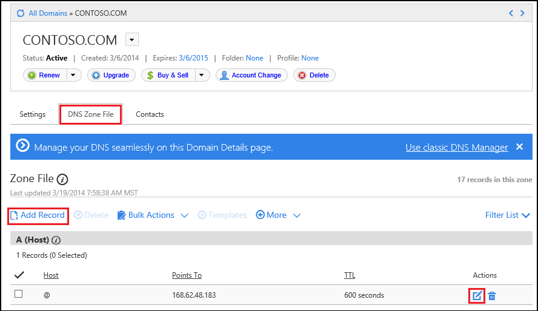
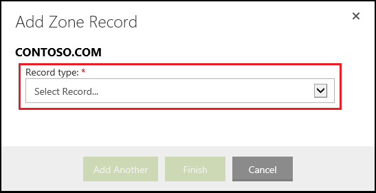

<properties
	pageTitle="Configure a custom domain name in Azure App Service (GoDaddy)"
	description="Learn how to use a domain name from GoDaddy with Azure Web Apps"
	services="app-service"
	documentationCenter=""
	authors="erikre"
	manager="wpickett"
	editor="jimbe"/>

<tags
	ms.service="app-service"
	ms.workload="na"
	ms.tgt_pltfrm="na"
	ms.devlang="na"
	ms.topic="article"
	ms.date="01/12/2016"
	ms.author="cephalin"/>

# Configure a custom domain name in Azure App Service (Purchased directly from GoDaddy)

[AZURE.INCLUDE [web-selector](../../includes/websites-custom-domain-selector.md)]

[AZURE.INCLUDE [intro](../../includes/custom-dns-web-site-intro.md)]

If you have purchased domain through Azure App Service Web Apps then refer to the final step of [Buy Domain for Web Apps](custom-dns-web-site-buydomains-web-app.md).

This article provides instructions on using a custom domain name that was purchased directly from [GoDaddy](https://godaddy.com) with [App Service Web Apps](http://go.microsoft.com/fwlink/?LinkId=529714).

[AZURE.INCLUDE [introfooter](../../includes/custom-dns-web-site-intro-notes.md)]

##Understanding DNS records

[AZURE.INCLUDE [understandingdns](../../includes/custom-dns-web-site-understanding-dns-raw.md)]

## Add a DNS record for your custom domain

To associate your custom domain with a web app in App Service, you must add a new entry in the DNS table for your custom domain by using tools provided by GoDaddy. Use the following steps to locate the DNS tools for GoDaddy.com

1. Log on to your account with GoDaddy.com, and select **My Account** and then **Manage my domains**. Finally, select the drop-down menu for the domain name that you wish to use with your Azure web app and select **Manage DNS**.

	

2. From the **Domain details** page, scroll to the **DNS Zone File** tab. This is the section used for adding and modifying DNS records for your domain name.

	

	Select **Add Record** to add an existing record.

	To **edit** an existing record, select the pen & paper icon beside the record.

	> [AZURE.NOTE] Before adding new records, note that GoDaddy has already created DNS records for popular sub-domains (called **Host** in editor,) such as **email**, **files**, **mail**, and others. If the name you wish to use already exists, modify the existing record instead of creating a new one.

4. When adding a record, you must first select the record type.

	

	Next, you must provide the **Host** (the custom domain or sub-domain) and what it **Points to**.

	

	* When adding an **A (host) record** - you must set the **Host** field to either **@** (this represents root domain name, such as **contoso.com**,) * (a wildcard for matching multiple sub-domains,) or the sub-domain you wish to use (for example, **www**.) You must set the **Points to** field to the IP address of your Azure web app.

	* When adding a **CNAME (alias) record** - you must set the **Host** field to the sub-domain you wish to use. For example, **www**. You must set the **Points to** field to the **.azurewebsites.net** domain name of your Azure web app. For example, **contoso.azurwebsites.net**.

5. Click **Add Another**.
6. Select **CNAME** as the record type, then specify a **Host** value of **awverify** and a **Points to** value of **awverify.&lt;yourwebappname&gt;.azurewebsites.net**.

	> [AZURE.NOTE] This CNAME record is used by Azure to validate that you own the domain described by the A record or the first CNAME record. Once the domain has been mapped to the web app in the Azure Portal, the **awverify** entry can be removed.

5. When you have finished adding or modifying records, click **Finish** to save changes.

## Enable the domain name on your web app

[AZURE.INCLUDE [modes](../../includes/custom-dns-web-site-enable-on-web-site.md)]

>[AZURE.NOTE] If you want to get started with Azure App Service before signing up for an Azure account, go to [Try App Service](http://go.microsoft.com/fwlink/?LinkId=523751), where you can immediately create a short-lived starter web app in App Service. No credit cards required; no commitments.

## What's changed
* For a guide to the change from Websites to App Service see: [Azure App Service and Its Impact on Existing Azure Services](http://go.microsoft.com/fwlink/?LinkId=529714)
