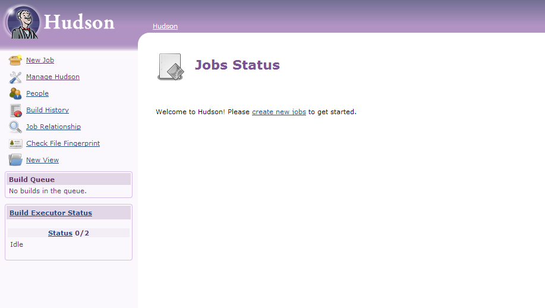
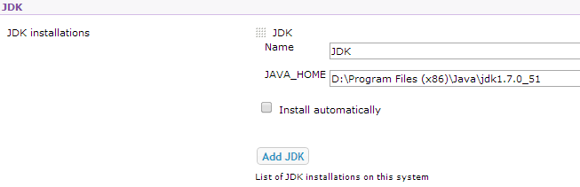

<properties 
	pageTitle="Upload a custom Java web app to Azure" 
	description="This tutorial shows you how to upload a custom Java web app to Azure App Service Web Apps." 
	services="app-service\web" 
	documentationCenter="java" 
	authors="rmcmurray" 
	manager="wpickett" 
	editor=""/>

<tags 
	ms.service="app-service-web" 
	ms.workload="web" 
	ms.tgt_pltfrm="na" 
	ms.devlang="Java" 
	ms.topic="article" 
	ms.date="08/11/2016" 
	ms.author="robmcm"/>

# Upload a custom Java web app to Azure

This topic explains how to upload a custom Java web app to [Azure App Service] Web Apps. Included is information that applies to any Java website or web app, and also some examples for specific applications.

Note that Azure provides a means for creating Java web apps using the Azure Portal's configuration UI, and the Azure Marketplace, as documented at [Create a Java web app in Azure App Service](web-sites-java-get-started.md). This tutorial is for scenarios in which you do not want to use the Azure Portal configuration UI or the Azure Marketplace.  

## Configuration guidelines

The following describes the settings expected for custom Java web apps on Azure.

- The HTTP port used by the Java process is dynamically assigned.  The process must use the port from the environment variable `HTTP_PLATFORM_PORT`.
- All listen ports other than the single HTTP listener should be disabled.  In Tomcat, that includes the shutdown, HTTPS, and AJP ports.
- The container needs to be configured for IPv4 traffic only.
- The **startup** command for the application needs to be set in the configuration.
- Applications that require directories with write permission need to be located in the Azure web app's content directory,  which is **D:\home**.  The environmental variable `HOME` refers to D:\home.  

You can set environment variables as required in the web.config file.

## web.config httpPlatform configuration

The following information describes the **httpPlatform** format within web.config.
                                 
**arguments** (Default=""). Arguments to the executable or script specified in the **processPath** setting.

Examples (shown with **processPath** included):

    processPath="%HOME%\site\wwwroot\bin\tomcat\bin\catalina.bat"
    arguments="start"
    
    processPath="%JAVA_HOME\bin\java.exe"
    arguments="-Djava.net.preferIPv4Stack=true -Djetty.port=%HTTP\_PLATFORM\_PORT% -Djetty.base=&quot;%HOME%\site\wwwroot\bin\jetty-distribution-9.1.0.v20131115&quot; -jar &quot;%HOME%\site\wwwroot\bin\jetty-distribution-9.1.0.v20131115\start.jar&quot;"

**processPath** - Path to the executable or script that will launch a process listening for HTTP requests.

Examples:

    processPath="%JAVA_HOME%\bin\java.exe"

    processPath="%HOME%\site\wwwroot\bin\tomcat\bin\startup.bat"

    processPath="%HOME%\site\wwwroot\bin\tomcat\bin\catalina.bat"
                                                                                       
**rapidFailsPerMinute** (Default=10.) Number of times the process specified in **processPath** is allowed to crash per minute. If this limit is exceeded, **HttpPlatformHandler** will stop launching the process for the remainder of the minute.
                                    
**requestTimeout** (Default="00:02:00".) Duration for which **HttpPlatformHandler** will wait for a response from the process listening on `%HTTP_PLATFORM_PORT%`.

**startupRetryCount** (Default=10.) Number of times **HttpPlatformHandler** will try to launch the process specified in **processPath**. See **startupTimeLimit** for more details.

**startupTimeLimit** (Default=10 seconds.) Duration for which **HttpPlatformHandler** will wait for the executable/script to start a process listening on the port.  If this time limit is exceeded, **HttpPlatformHandler** will kill the process and try to launch it again **startupRetryCount** times.
                                                                                      
**stdoutLogEnabled** (Default="true".) If true, **stdout** and **stderr** for the process specified in the **processPath** setting will be redirected to the file specified in **stdoutLogFile** (see **stdoutLogFile** section).
                                    
**stdoutLogFile** (Default="d:\home\LogFiles\httpPlatformStdout.log".) Absolute file path for which **stdout** and **stderr** from the process specified in **processPath** will be logged.
                                    
> [AZURE.NOTE] `%HTTP_PLATFORM_PORT%` is a special placeholder which needs to specified either as part of **arguments** or as part of the **httpPlatform** **environmentVariables** list. This will be replaced by an internally generated port by **HttpPlatformHandler** so that the process specified by **processPath** can listen on this port.

## Deployment

Java based web apps can be deployed easily through most of the same means that are used with the Internet Information Services (IIS) based web applications.  FTP, Git and Kudu are all supported as deployment mechanisms, as is the integrated SCM capability for web apps. WebDeploy works as a protocol, however, as Java is not developed in Visual Studio, WebDeploy does not fit with Java web app deployment use cases.

## Application configuration Examples

For the following applications, a web.config file and the application configuration is provided as examples to show how to enable your Java application on App Service Web Apps.

### Tomcat
While there are two variations on Tomcat that are supplied with App Service Web Apps, it is still quite possible to upload customer specific instances. Below is an example of an install of Tomcat with a different Java Virtual Machine (JVM).

	<?xml version="1.0" encoding="UTF-8"?>
	<configuration>
	  <system.webServer>
	    <handlers>
	      <add name="httpPlatformHandler" path="*" verb="*" modules="httpPlatformHandler" resourceType="Unspecified" />
	    </handlers>
	    <httpPlatform processPath="%HOME%\site\wwwroot\bin\tomcat\bin\startup.bat" 
	        arguments="">
	      <environmentVariables>
	        <environmentVariable name="CATALINA_OPTS" value="-Dport.http=%HTTP_PLATFORM_PORT%" />
	        <environmentVariable name="CATALINA_HOME" value="%HOME%\site\wwwroot\bin\tomcat" />
	        <environmentVariable name="JRE_HOME" value="%HOME%\site\wwwroot\bin\java" /> <!-- optional, if not specified, this will default to %programfiles%\Java -->
	        <environmentVariable name="JAVA_OPTS" value="-Djava.net.preferIPv4Stack=true" />
	      </environmentVariables>
	    </httpPlatform>
	  </system.webServer>
	</configuration>

On the Tomcat side, there are a few configuration changes that need to be made. The server.xml needs to be edited to set:

-	Shutdown port = -1
-	HTTP connector port = ${port.http}
-	HTTP connector address = "127.0.0.1"
-	Comment out HTTPS and AJP connectors
-	The IPv4 setting can also be set in the catalina.properties file where you can add     `java.net.preferIPv4Stack=true`
    
Direct3d calls are not supported on App Service Web Apps. To disable those, add the following Java option should your application make such calls: `-Dsun.java2d.d3d=false`

### Jetty

As is the case for Tomcat, customers can upload their own instances for Jetty. In the case of running the full install of Jetty, the configuration would look like this:

	<?xml version="1.0" encoding="UTF-8"?>
	<configuration>
	  <system.webServer>
	    <handlers>
	      <add name="httppPlatformHandler" path="*" verb="*" modules="httpPlatformHandler" resourceType="Unspecified" />
	    </handlers>
	    <httpPlatform processPath="%JAVA_HOME%\bin\java.exe" 
	         arguments="-Djava.net.preferIPv4Stack=true -Djetty.port=%HTTP_PLATFORM_PORT% -Djetty.base=&quot;%HOME%\site\wwwroot\bin\jetty-distribution-9.1.0.v20131115&quot; -jar &quot;%HOME%\site\wwwroot\bin\jetty-distribution-9.1.0.v20131115\start.jar&quot;"
	        startupTimeLimit="20"
		  startupRetryCount="10"
		  stdoutLogEnabled="true">
	    </httpPlatform>
	  </system.webServer>
	</configuration>

The Jetty configuration needs to be changed in the start.ini to set `java.net.preferIPv4Stack=true`.

### Springboot
In order to get a Springboot application running you need to upload your JAR or WAR file and add the following web.config file. The web.config file goes into the wwwroot folder. In the web.config adjust the arguments to point to your JAR file, in the following example the JAR file is located in the wwwroot folder as well.  

	<?xml version="1.0" encoding="UTF-8"?>
	<configuration>
	  <system.webServer>
	    <handlers>
	      <add name="httpPlatformHandler" path="*" verb="*" modules="httpPlatformHandler" resourceType="Unspecified" />
	    </handlers>
	    <httpPlatform processPath="%JAVA_HOME%\bin\java.exe"
	        arguments="-Djava.net.preferIPv4Stack=true -Dserver.port=%HTTP_PLATFORM_PORT% -jar &quot;%HOME%\site\wwwroot\my-web-project.jar&quot;">
	    </httpPlatform>
	  </system.webServer>
	</configuration>

### Hudson

Our test used the Hudson 3.1.2 war and the default Tomcat 7.0.50 instance but without using the UI to set things up.  Because Hudson is a software build tool, it is advised to install it on dedicated instances where the **AlwaysOn** flag can be set on the web app.

1. In your web app’s root directory, i.e., **d:\home\site\wwwroot**, create a **webapps** directory (if not already present), and place Hudson.war in **d:\home\site\wwwroot\webapps**.
2. Download apache maven 3.0.5 (compatible with Hudson) and place it in **d:\home\site\wwwroot**.
3. Create web.config in **d:\home\site\wwwroot** and paste the following contents in it:
	
		<?xml version="1.0" encoding="UTF-8"?>
		<configuration>
		  <system.webServer>
		    <handlers>
		      <add name="httppPlatformHandler" path="*" verb="*" 
		modules="httpPlatformHandler" resourceType="Unspecified" />
		    </handlers>
		    <httpPlatform processPath="%AZURE_TOMCAT7_HOME%\bin\startup.bat"
		startupTimeLimit="20"
		startupRetryCount="10">
		<environmentVariables>
		  <environmentVariable name="HUDSON_HOME" 
		value="%HOME%\site\wwwroot\hudson_home" />
		  <environmentVariable name="JAVA_OPTS" 
		value="-Djava.net.preferIPv4Stack=true -Duser.home=%HOME%/site/wwwroot/user_home -Dhudson.DNSMultiCast.disabled=true" />
		</environmentVariables>            
		    </httpPlatform>
		  </system.webServer>
		</configuration>

    At this point the web app can be restarted to take the changes.  Connect to http://yourwebapp/hudson to start Hudson.

4. After Hudson configures itself, you should see the following screen:

    
    
5. Access the Hudson configuration page: Click **Manage Hudson**, and then click **Configure System**.
6. Configure the JDK as shown below:

	

7. Configure Maven as shown below:

	

8. Save the settings. Hudson should now be configured and ready for use.

For additional information on Hudson, see [http://hudson-ci.org](http://hudson-ci.org).

### Liferay

Liferay is supported on App Service Web Apps. Since Liferay can require significant memory, the web app needs to run on a medium or large dedicated worker, which can provide enough memory. Liferay also takes several minutes to start up. For that reason, it is recommended that you set the web app to **Always On**.  

Using Liferay 6.1.2 Community Edition GA3 bundled with Tomcat, the following files were edited after downloading Liferay:

**Server.xml**

- Change Shutdown port to -1.
- Change HTTP connector to 
		`<Connector port="${port.http}" protocol="HTTP/1.1" connectionTimeout="600000" address="127.0.0.1" URIEncoding="UTF-8" />`
- Comment out the AJP connector.

In the **liferay\tomcat-7.0.40\webapps\ROOT\WEB-INF\classes** folder, create a file named **portal-ext.properties**. This file needs to contain one line, as shown here:

    liferay.home=%HOME%/site/wwwroot/liferay

At the same directory level as the tomcat-7.0.40 folder, create a file named **web.config** with the following content:

	<?xml version="1.0" encoding="UTF-8"?>
	<configuration>
	  <system.webServer>
	    <handlers>
	<add name="httpPlatformHandler" path="*" verb="*"
	     modules="httpPlatformHandler" resourceType="Unspecified" />
	    </handlers>
	    <httpPlatform processPath="%HOME%\site\wwwroot\tomcat-7.0.40\bin\catalina.bat" 
	                  arguments="run" 
	                  startupTimeLimit="10" 
	                  requestTimeout="00:10:00" 
	                  stdoutLogEnabled="true">
	      <environmentVariables>
	  <environmentVariable name="CATALINA_OPTS" value="-Dport.http=%HTTP_PLATFORM_PORT%" />
	  <environmentVariable name="CATALINA_HOME" value="%HOME%\site\wwwroot\tomcat-7.0.40" />
	        <environmentVariable name="JRE_HOME" value="D:\Program Files\Java\jdk1.7.0_51" /> 
	        <environmentVariable name="JAVA_OPTS" value="-Djava.net.preferIPv4Stack=true" />
	      </environmentVariables>
	    </httpPlatform>
	  </system.webServer>
	</configuration>

Under the **httpPlatform** block, the **requestTimeout** is set to “00:10:00”.  It can be reduced but then you are likely to see some timeout errors while Liferay is bootstrapping.  If this value is changed, then the **connectionTimeout** in the tomcat server.xml should also be modified.  

It is worth noting that the JRE_HOME environnment varariable is specified in the above web.config to point to the 64-bit JDK. The default is 32-bit, but since Liferay may require high levels of memory, it is recommended to use the 64-bit JDK.

Once you make these changes, restart your web app running Liferay, Then, open http://yourwebapp. The Liferay portal is available from the web app root. 

## Next steps

For more information about Liferay, see [http://www.liferay.com](http://www.liferay.com).

For more information about Java, see the [Java Developer Center](/develop/java/).

[AZURE.INCLUDE [app-service-web-whats-changed](../../includes/app-service-web-whats-changed.md)]

[AZURE.INCLUDE [app-service-web-try-app-service](../../includes/app-service-web-try-app-service.md)]
 
 
<!-- External Links -->
[Azure App Service]: http://go.microsoft.com/fwlink/?LinkId=529714
