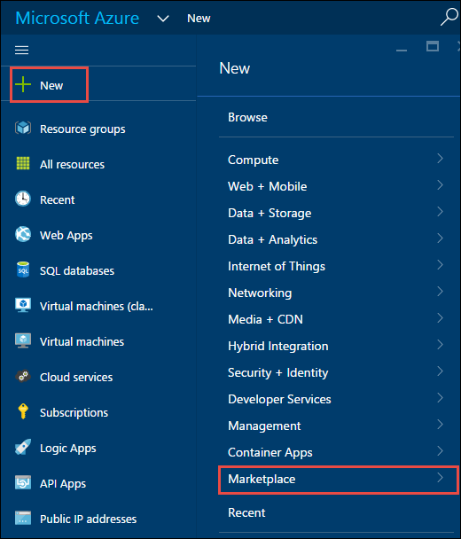
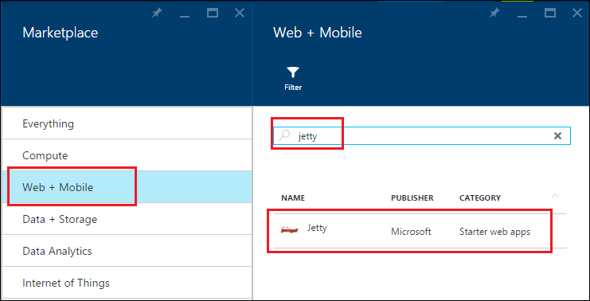
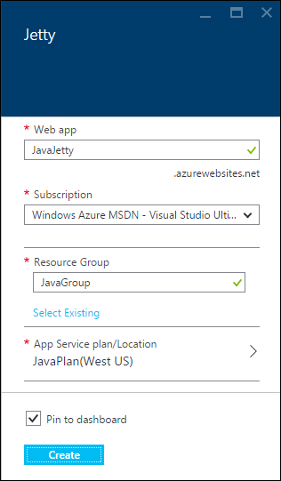
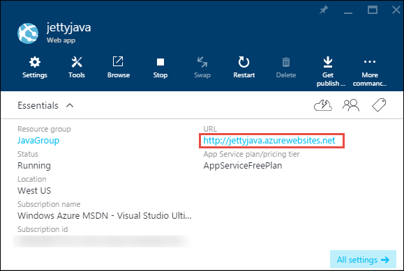
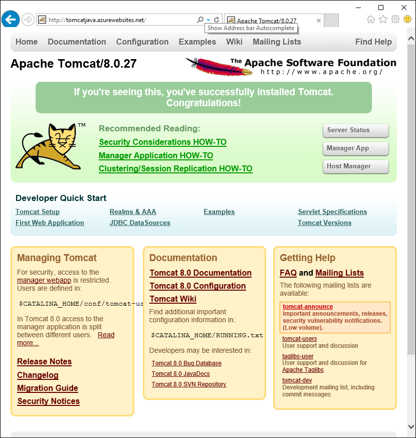
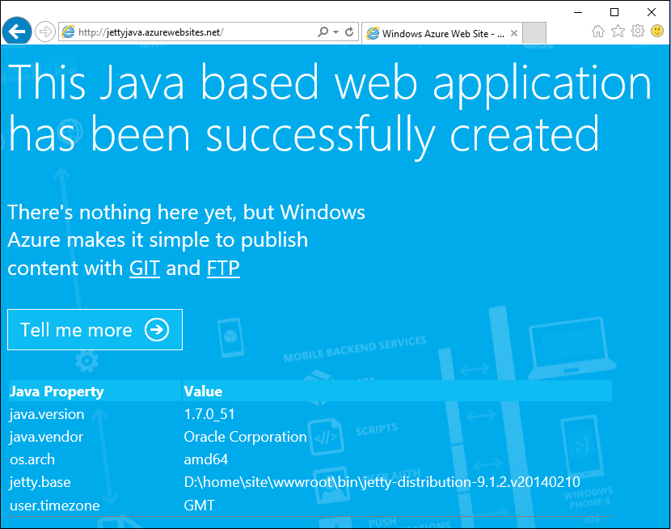

<properties
	pageTitle="Create a Java web app in Azure App Service | Microsoft Azure"
	description="This tutorial shows you how to deploy a Java web app to Azure App Service."
	services="app-service\web"
	documentationCenter="java"
	authors="rmcmurray"
	manager="wpickett"
	editor="jimbe"/>
<tags
	ms.service="app-service-web"
	ms.workload="web"
	ms.tgt_pltfrm="na"
	ms.devlang="Java"
	ms.topic="hero-article"
	ms.date="08/31/2015"
	ms.author="robmcm"/>

# Create a Java web app in Azure App Service

> [AZURE.SELECTOR]
- [.Net](web-sites-dotnet-get-started.md)
- [Node.js](web-sites-nodejs-develop-deploy-mac.md)
- [Java](web-sites-java-get-started.md)
- [PHP - Git](web-sites-php-mysql-deploy-use-git.md)
- [PHP - FTP](web-sites-php-mysql-deploy-use-ftp.md)
- [Python](web-sites-python-ptvs-django-mysql.md)

This tutorial shows how to create a Java [web app in Azure App Service](http://go.microsoft.com/fwlink/?LinkId=529714) by using the Azure preview portal. You can choose a web app template from the Azure Marketplace or create a generic web app and configure it manually for Java.

If you don't want to use either of those techniques—for example, if you want to customize your application container—see [Upload a custom Java web app to Azure](web-sites-java-custom-upload.md).

> [AZURE.NOTE] To complete this tutorial, you need a Microsoft Azure account. If you don't have an account, you can [activate your MSDN subscriber benefits][] or [sign up for a free trial][].
>
> If you want to get started with Azure App Service before you sign up for an Azure account, go to [Try App Service][]. There, you can immediately create a short-lived starter web app in App Service—no credit card required, and no commitments.

## Choose a web app template from the Azure Marketplace

This section shows how to use the Azure Marketplace to create a Java web app.

1. Sign in to the [Azure preview portal](https://portal.azure.com/).

2. Click **New > Marketplace**.

	

5. Click **Web + Mobile**.

	You might have to scroll left to see the **Marketplace** blade where you can select **Web + Mobile**.

6. In the search text box, enter the name of a Java application server, such as **Apache Tomcat** or **Jetty**, and then press Enter.

4. In the search results, click the Java application server.

	

5. In the first **Apache Tomcat** or **Jetty** blade, click **Create**.

	

4. In the next **Apache Tomcat** or **Jetty** blade, enter a name for the web app in the **Web app** box.

	This name must be unique in the azurewebsites.net domain because the URL of the web app will be {name}.azurewebsites.net. If the name you enter isn't unique, a red exclamation mark appears in the text box.

5. Select a **Resource Group** or create a new one.

	For more information about resource groups, see [Using the Azure Preview Portal to manage your Azure resources](../resource-group-portal.md).

5. Select an **App Service plan/Location** or create a new one.

	For more information about App Service plans, see [Azure App Service plans overview](../azure-web-sites-web-hosting-plans-in-depth-overview.md)

6. Click **Create**.

	

	In a short time, typically less than a minute, Azure finishes creating the new web app.

7. Click **Web apps > {your new web app}**.

8. Click the **URL** to browse to the new site.

	

	IF you chose Tomcat, you see a page similar to the following example.

	

	If you chose Jetty, you see a page similar to the following example.

	

Now that you've created the web app with an app container, see the [Next steps](#next-steps) section for information about how to  upload your application to the web app.

## Create a web app and configure it manually for Java

This section shows how to create a web app and configure it manually for Java.

1. Sign in to the [Azure preview portal](https://portal.azure.com/).

2. Click **New > Web + Mobile**.

6. Click **Web App**.

4. Enter a name for the web app in the **Web app** box.

	This name must be unique in the azurewebsites.net domain because the URL of the web app will be {name}.azurewebsites.net. If the name you enter isn't unique, a red exclamation mark appears in the text box.

5. Select a **Resource Group** or create a new one.

	For more information about resource groups, see [Using the Azure Preview Portal to manage your Azure resources](../resource-group-portal.md).

5. Select an **App Service plan/Location** or create a new one.

	For more information about App Service plans, see [Azure App Service plans overview](../azure-web-sites-web-hosting-plans-in-depth-overview.md)

6. Click **Create**.
 
11. When the web app has been created, click **Web Apps > {your web app}**.
 
13. In the **Web app** blade, click **Settings**.

12. Click **Application settings**.

13. Choose the desired **Java version**.

14. Choose the desired **Web container**.

15. Click **Save**.

	Within a few moments, your web app will become Java-based.

7. Click **Web apps > {your new web app}**.

8. Click the **URL** to browse to the new site.

	The web page confirms that you have created a Java-based web app.

## Next steps

At this point, you have a Java application server running in your web app in Azure App Service. To deploy your own code to the web app, see [Add an application or webpage to your Java web app](web-sites-java-add-app.md).

For more information about developing Java applications in Azure, see the [Java Developer Center](/develop/java/).

<!-- External Links -->
[activate your MSDN subscriber benefits]: http://go.microsoft.com/fwlink/?LinkId=623901
[sign up for a free trial]: http://go.microsoft.com/fwlink/?LinkId=623901

[Try App Service]: http://go.microsoft.com/fwlink/?LinkId=523751
