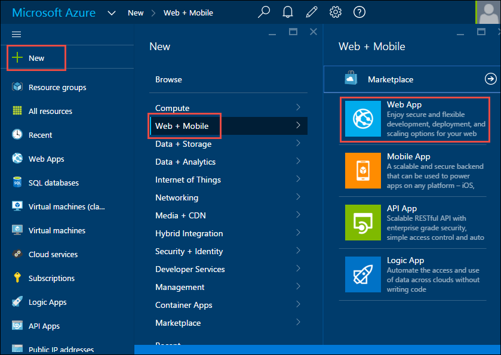
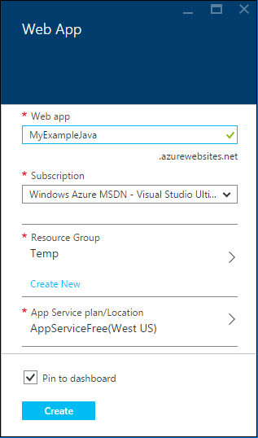
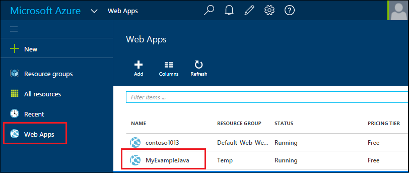
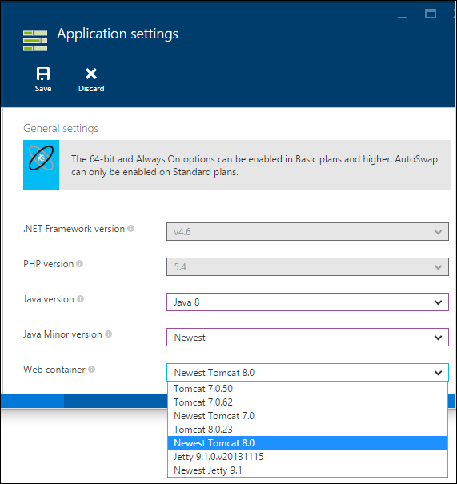

<properties
	pageTitle="Create a Java web app in Azure App Service | Microsoft Azure"
	description="This tutorial shows you how to deploy a Java web app to Azure App Service."
	services="app-service\web"
	documentationCenter="java"
	authors="rmcmurray"
	manager="wpickett"
	editor="jimbe"/>
<tags
	ms.service="app-service-web"
	ms.workload="web"
	ms.tgt_pltfrm="na"
	ms.devlang="Java"
	ms.topic="hero-article"
	ms.date="10/20/2015"
	ms.author="robmcm"/>

# Create a Java web app in Azure App Service

> [AZURE.SELECTOR]
- [.Net](web-sites-dotnet-get-started.md)
- [Node.js](web-sites-nodejs-develop-deploy-mac.md)
- [Java](web-sites-java-get-started.md)
- [PHP - Git](web-sites-php-mysql-deploy-use-git.md)
- [PHP - FTP](web-sites-php-mysql-deploy-use-ftp.md)
- [Python](web-sites-python-ptvs-django-mysql.md)

This tutorial shows how to create a Java [web app in Azure App Service](http://go.microsoft.com/fwlink/?LinkId=529714) by using the [Azure preview portal](https://portal.azure.com/). The Azure preview portal is a web interface that you can use to manage Azure resources.

> [AZURE.NOTE] To complete this tutorial, you need a Microsoft Azure account. If you don't have an account, you can [activate your MSDN subscriber benefits][] or [sign up for a free trial][].
>
> If you want to get started with Azure App Service before you sign up for an Azure account, go to [Try App Service][]. There, you can immediately create a short-lived starter web app in App Service—no credit card required, and no commitments.

## Web container options

There are several ways you can set up a Java web container in an App Service web app. 

1. Use a template from the Azure Marketplace.

	The Azure Marketplace includes templates that automatically create and configure Java web apps with Tomcat or Jetty web containers. The web containers that the templates set up are configurable. For more information, see the [Use a Java template from the Azure Marketplace](#marketplace) section of this tutorial.
 
1. Create a web app and then configure **Application Settings**.

	App Service provides several Tomcat and Jetty versions, with default configuration. If the application that you will be hosting will work with one of the built-in versions, this method of setting up a web container offers the best performance. For this method, you create a web app in the portal, and then go to the web app's **Application Settings** blade to choose your Java web container. When you use this method the web container runs from the local hard drive of the Virtual Machine host for a web app, which is very fast. However, you don't have access to edit files in this part of the file system, which means you can't configure *server.xml*.  For more information, see the [Create and configure a Java web app](#appsettings) section later in this tutorial.  
  
3. Create a web app and then manually copy and edit configuration files 

	You might want to host a Java application that requires a version of Tomcat or Jetty that isn't directly supported by App Service or provided by a template. Or you might want to configure the web container from scratch yourself. In this case, you can create a web app using the portal, and then provide the appropriate runtime files manually. In this case the files will reside in a part of the VM's file system that you do have access to, but this part of the VM's file system resides in Azure storage, which is slightly slower than a local hard drive. For more information, see [Upload a custom Java web app to Azure](https://acom-sandbox.azurewebsites.net/en-us/documentation/articles/web-sites-java-custom-upload/).

##  Choose a template from the Azure Marketplace

This section shows how to use the Azure Marketplace to create a Java web app.

1. Sign in to the [Azure preview portal](https://portal.azure.com/).

2. Click **New > Marketplace**.

	

3. Click **Web + Mobile**.

	You might have to scroll left to see the **Marketplace** blade where you can select **Web + Mobile**.

4. In the search text box, enter the name of a Java application server, such as **Apache Tomcat** or **Jetty**, and then press Enter.

5. In the search results, click the Java application server.

	

6. In the first **Apache Tomcat** or **Jetty** blade, click **Create**.

	

7. In the next **Apache Tomcat** or **Jetty** blade, enter a name for the web app in the **Web app** box.

	This name must be unique in the azurewebsites.net domain because the URL of the web app will be {name}.azurewebsites.net. If the name you enter isn't unique, a red exclamation mark appears in the text box.

8. Select a **Resource Group** or create a new one.

	For more information about resource groups, see [Using the Azure Preview Portal to manage your Azure resources](../resource-group-portal.md).

9. Select an **App Service plan/Location** or create a new one.

	For more information about App Service plans, see [Azure App Service plans overview](../azure-web-sites-web-hosting-plans-in-depth-overview.md)

10. Click **Create**.

	

	In a short time, typically less than a minute, Azure finishes creating the new web app.

11. Click **Web apps > {your new web app}**.

12. Click the **URL** to browse to the new site.

	

	If you chose Tomcat, you see a page similar to the following example.

	

	If you chose Jetty, you see a page similar to the following example.

	

Now that you've created the web app with an app container, see the [Next steps](#next-steps) section for information about how to  upload your application to the web app.

##  Create a web app and then configure Application Settings

This section shows how to create a web app and configure it manually for Java.

1. Sign in to the [Azure preview portal](https://portal.azure.com/).

2. Click **New > Web + Mobile > Web App**.

	

4. Enter a name for the web app in the **Web app** box.

	This name must be unique in the azurewebsites.net domain because the URL of the web app will be {name}.azurewebsites.net. If the name you enter isn't unique, a red exclamation mark appears in the text box.

5. Select a **Resource Group** or create a new one.

	For more information about resource groups, see [Using the Azure Preview Portal to manage your Azure resources](../resource-group-portal.md).

6. Select an **App Service plan/Location** or create a new one.

	For more information about App Service plans, see [Azure App Service plans overview](../azure-web-sites-web-hosting-plans-in-depth-overview.md)

7. Click **Create**.

	
 
8. When the web app has been created, click **Web Apps > {your web app}**.
 
	

9. In the **Web app** blade, click **Settings**.

10. Click **Application settings**.

11. Choose the desired **Java version**.

12. Choose the desired **Web container**.

	

13. Click **Save**.

	Within a few moments, your web app will become Java-based.

14. Click **Web apps > {your new web app}**.

15. Click the **URL** to browse to the new site.

	The web page confirms that you have created a Java-based web app.

## Next steps

At this point, you have a Java application server running in your web app in Azure App Service. To deploy your own code to the web app, see [Add an application or webpage to your Java web app](web-sites-java-add-app.md).

For more information about developing Java applications in Azure, see the [Java Developer Center](/develop/java/).

<!-- External Links -->
[activate your MSDN subscriber benefits]: http://go.microsoft.com/fwlink/?LinkId=623901
[sign up for a free trial]: http://go.microsoft.com/fwlink/?LinkId=623901

[Try App Service]: http://go.microsoft.com/fwlink/?LinkId=523751
