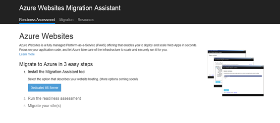
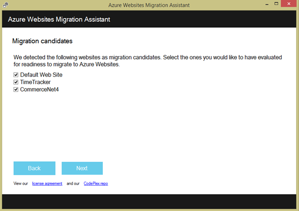
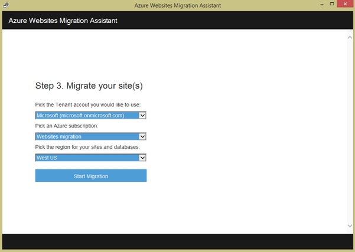
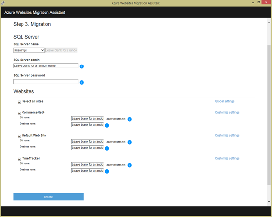
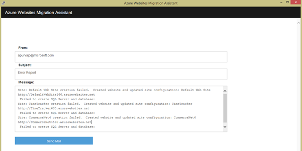
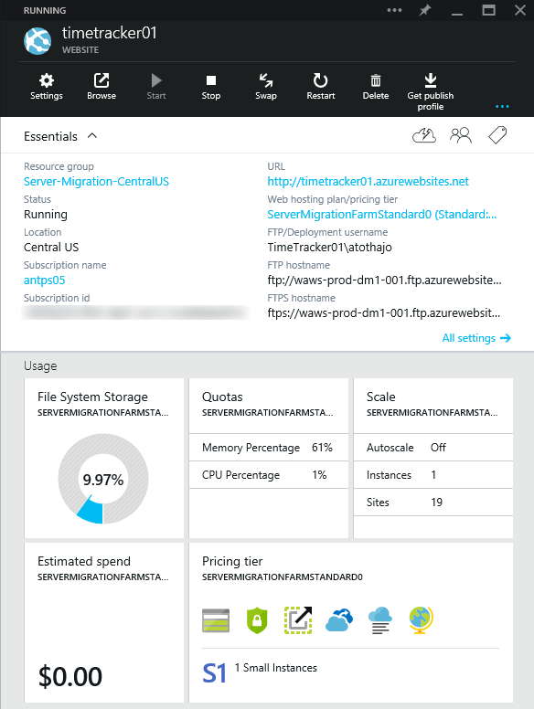

<properties 
	pageTitle="Migrate an enterprise web app to Azure App Service" 
	description="Shows how to use Web Apps Migration Assistant to quickly migrate existing IIS websites to Azure App Service Web Apps" 
	services="app-service" 
	documentationCenter="" 
	authors="cephalin" 
	writer="cephalin" 
	manager="wpickett" 
	editor=""/>

<tags 
	ms.service="app-service" 
	ms.workload="na" 
	ms.tgt_pltfrm="na" 
	ms.devlang="na" 
	ms.topic="article" 
	ms.date="07/01/2016" 
	ms.author="cephalin"/>

# Migrate an enterprise web app to Azure App Service

You can easily migrate your existing websites that run on Internet Information Service (IIS) 6 or later to [App Service Web Apps](http://go.microsoft.com/fwlink/?LinkId=529714). 

>[AZURE.IMPORTANT] Windows Server 2003 reached end of support on July 14th 2015. If you are currently hosting your websites on an IIS server that is Windows Server 2003, Web Apps is a low-risk, low-cost, and low-friction way to keep your websites online, and Web Apps Migration Assistant can help automate the migration process for you. 

[Web Apps Migration Assistant](https://www.movemetothecloud.net/) can analyze your IIS server installation, identify which sites can be migrated to App Service, highlight any elements that cannot be migrated or are unsupported on the platform, and then migrate your websites and associated databases to Azure.

[AZURE.INCLUDE [app-service-web-to-api-and-mobile](../../includes/app-service-web-to-api-and-mobile.md)]

## Elements Verified During Compatibility Analysis ##
The Migration Assistant creates a readiness report to identify any potential causes for concern or blocking issues which may prevent a successful migration from on-premises IIS to Azure App Service Web Apps. Some of the key items to be aware of are:

-	Port Bindings – Web Apps only supports Port 80 for HTTP and Port 443 for HTTPS traffic. Different port configurations will be ignored and traffic will be routed to 80 or 443. 
-	Authentication – Web Apps supports Anonymous Authentication by default and Forms Authentication where specified by an application. Windows Authentication can be used by integrating with Azure Active Directory and ADFS only. All other forms of authentication - for example, Basic Authentication - are not currently supported. 
-	Global Assembly Cache (GAC) – The GAC is not supported in Web Apps. If your application references assemblies which you usually deploy to the GAC, you will need to deploy to the application bin folder in Web Apps. 
-	IIS5 Compatibility Mode – This is not supported in Web Apps. 
-	Application Pools – In Web Apps, each site and its child applications run in the same application pool. If your site has multiple child applications utilizing multiple application pools, consolidate them to a single application pool with common settings or migrate each application to a separate web app.
-	COM Components – Web Apps does not allow the registration of COM Components on the platform. If your websites or applications make use of any COM Components, you must rewrite them in managed code and deploy them with the website or application.
-	ISAPI Filters – Web Apps can support the use of ISAPI Filters. You need to do the following:
	-	deploy the DLLs with your web app 
	-	register the DLLs using [Web.config](http://www.iis.net/configreference/system.webserver/isapifilters)
	-	place an applicationHost.xdt file in the site root with the content below:

			<?xml version="1.0"?>
			<configuration xmlns:xdt="http://schemas.microsoft.com/XML-Document-Transform">
			<configSections>
			    <sectionGroup name="system.webServer">
			      <section name="isapiFilters" xdt:Transform="SetAttributes(overrideModeDefault)" overrideModeDefault="Allow" />
			    </sectionGroup>
			  </configSections>
			</configuration>

		For more examples of how to use XML Document Transformations with your website, see [Transform your Microsoft Azure Web Site](http://blogs.msdn.com/b/waws/archive/2014/06/17/transform-your-microsoft-azure-web-site.aspx).

-	Other components like SharePoint, front page server extensions (FPSE), FTP, SSL certificates will not be migrated.

## How to use the Web Apps Migration Assistant ##
This section steps through an example to to migrate a few websites that use a SQL Server database and running on an on-premise Windows Server 2003 R2 (IIS 6.0) machine:

1.	On the IIS server or your client machine navigate to [https://www.movemetothecloud.net/](https://www.movemetothecloud.net/) 

	

2.	Install Web Apps Migration Assistant by clicking on the **Dedicated IIS Server** button. More options will be options in the near future. 
4.	Click the **Install Tool** button to install Web Apps Migration Assistant on your machine.

	

	>[AZURE.NOTE] You can also click **Download for offline install** to download a ZIP file for installing on servers not connected to the interent. Or, you can click **Upload an existing migration readiness report**, which is an advanced option to work with an existing migration readiness report that you previously generated (explained later).

5.	In the **Application Install** screen, click **Install** to install on your machine. It will also install corresponding dependencies like Web Deploy, DacFX, and IIS, if needed. 

	

	Once installed, Web Apps Migration Assistant automatically starts.
  
6.	Choose **Migrate sites and databases from a remote server to Azure**. Enter the administrative credentials for the remote server and click **Continue**. 

	

	You can of course choose to migrate from the local server. The remote option is useful when you want to migrate websites from a production IIS server.
 
	At this point the migration tool will inspect the your IIS server's configuration, such as Sites, Applications, Application Pools, and dependencies to identify candidate websites for migration. 

8.	The screenshot below shows three websites – **Default Web Site**, **TimeTracker**, and **CommerceNet4**. All of them have an associated database that we want to migrate. Select all of the sites you would like to assess and then click **Next**.

	
 
9.	Click **Upload** to upload the readiness report. If you click **save file locally**, you can run the migration tool again later and upload the saved readiness report as noted earlier.

	
 
	Once you upload the readiness report, Azure performs readiness analysis and shows you the results. Read the assessment details for each website and make sure that you understand or have addressed all issues before you proceed. 
 
	

12.	Click **Begin Migration** to start the migration.You will now be redirected to Azure to log into your account. It is important that you log in with an account that has an active Azure Subscription. If you do not have an Azure account then you can sign up for a free trial [here](https://azure.microsoft.com/pricing/free-trial/?WT.srch=1&WT.mc_ID=SEM_). 

13.	Select the tenant account, Azure subscription and region to use for your migrated Azure web apps and databases, and then click **Start Migration**. You can select the websites to migrate later.

	

14.	On the next screen you can make changes to the default migration settings, such as:

	- use an existing Azure SQL Database or create a new Azure SQL Database, and configure its credentials
	- select the websites to migrate
	- define names for the Azure web apps and their linked SQL databases
	- customize the global settings and site-level settings

	The screenshot below shows all the websites selected for migration with the default settings.

	

	>[AZURE.NOTE] the **Enable Azure Active Directory** checkbox in custom settings integrates the Azure web app with [Azure Active Directory](active-directory-whatis.md) (the **Default Directory**). For more information on syncing Azure Active Directory with your on-premise Active Directory, see [Directory integration](http://msdn.microsoft.com/library/jj573653).

16.	 Once you make all the desired changes, click **Create** to start the migration process. The migration tool will create the Azure SQL Database and Azure web app, and then publish the website content and databases. The migration progress is clearly shown in the migration tool, and you will see a summary screen at the end, which details the sites migrated, whether they were successful, links to the newly-created Azure web apps. 

	If any error occurs during migration, the migration tool will clearly indicate the failure and rollback the changes. You will also be able to send the error report directly to the engineering team by clicking the **Send Error Report** button, with the captured failure call stack and build message body. 

	

	If migrate succeeds without errors, you can also click the **Give Feedback** button to provide any feedback directly. 
 
20.	Click the links to the Azure web apps and verify that the migration has succeeded.

21. You can now manage the migrated web apps in Azure App Service. To do this, log into the [Azure Portal](https://portal.azure.com).

22. In the Azure Portal, open the Web Apps blade to see your migrated websites (shown as web apps), then click on any one of them to start managing the web app, such as configuring continuous publishing, creating backups, autoscaling, and monitoring usage or performance.

	

>[AZURE.NOTE] If you want to get started with Azure App Service before signing up for an Azure account, go to [Try App Service](http://go.microsoft.com/fwlink/?LinkId=523751), where you can immediately create a short-lived starter web app in App Service. No credit cards required; no commitments.

## What's changed
* For a guide to the change from Websites to App Service see: [Azure App Service and Its Impact on Existing Azure Services](http://go.microsoft.com/fwlink/?LinkId=529714)
 
