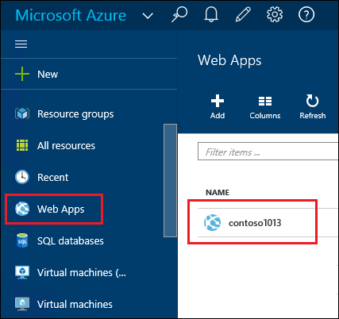
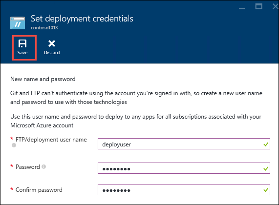
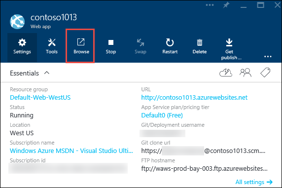

<properties
	pageTitle="Create a Node.js web app in Azure App Service | Microsoft Azure"
	description="Learn how to deploy a Node.js application to a web app in Azure App Service."
	services="app-service\web"
	documentationCenter="nodejs"
	authors="rmcmurray"
	manager="wpickett"
	editor=""/>

<tags
	ms.service="app-service-web"
	ms.workload="web"
	ms.tgt_pltfrm="na"
	ms.devlang="nodejs"
	ms.topic="hero-article"
	ms.date="08/11/2016"
	ms.author="robmcm"/>

# Create a Node.js web app in Azure App Service

> [AZURE.SELECTOR]
- [.Net](web-sites-dotnet-get-started.md)
- [Node.js](web-sites-nodejs-develop-deploy-mac.md)
- [Java](web-sites-java-get-started.md)
- [PHP - Git](web-sites-php-mysql-deploy-use-git.md)
- [PHP - FTP](web-sites-php-mysql-deploy-use-ftp.md)
- [Python](web-sites-python-ptvs-django-mysql.md)

This tutorial shows how to create a simple [Node.js](http://nodejs.org) application and deploy it to a [web app](app-service-web-overview.md) in [Azure App Service](../app-service/app-service-value-prop-what-is.md) by using [Git](http://git-scm.com). The instructions in this tutorial can be followed on any operating system that is capable of running Node.js.

You'll learn:

* How to create a web app in Azure App Service by using the Azure Portal.
* How to deploy a Node.js application to the web app by pushing to the web app's Git repository.

The completed application writes a short "hello world" string to the browser.

![A browser displaying the 'Hello World' message.][helloworld-completed]

For tutorials and sample code with more complex Node.js applications, or for other topics about how to use Node.js in Azure, see the [Node.js Developer Center](/develop/nodejs/).

> [AZURE.NOTE]
> To complete this tutorial, you need a Microsoft Azure account. If you don't have an account, you can [activate your Visual Studio subscriber benefits](/en-us/pricing/member-offers/msdn-benefits-details/?WT.mc_id=A261C142F) or [sign up for a free trial](/en-us/pricing/free-trial/?WT.mc_id=A261C142F).
>
> If you want to get started with Azure App Service before you sign up for an Azure account, go to [Try App Service](http://go.microsoft.com/fwlink/?LinkId=523751). There, you can immediately create a short-lived starter web app in App Service—no credit card required, and no commitments.

## Create a web app and enable Git publishing

Follow these steps to create a web app in Azure App Service and enable Git publishing. 

[Git](http://git-scm.com/) is a distributed version control system that you can use to deploy your Azure Website. You'll store the code you write for your web app in a local Git repository, and you'll deploy your code to Azure by pushing to a remote repository. This method of deployment is a feature of App Service web apps.  

1. Sign in to the [Azure Portal](https://portal.azure.com).

2. Click the **+ NEW** icon on the top left of the Azure Portal.

3. Click **Web + Mobile**, and then click **Web app**.

    ![][portal-quick-create]

4. Enter a name for the web app in the **Web app** box.

	This name must be unique in the azurewebsites.net domain because the URL of the web app will be {name}.azurewebsites.net. If the name you enter isn't unique, a red exclamation mark appears in the text box.

5. Select a **Subscription**.

6. Select a **Resource Group** or create a new one.

	For more information about resource groups, see [Azure Resource Manager overview](../resource-group-overview.md).

7. Select an **App Service plan/Location** or create a new one.

	For more information about App Service plans, see [Azure App Service plans overview](../azure-web-sites-web-hosting-plans-in-depth-overview.md)

8. Click **Create**.
   
	![][portal-quick-create2]

	In a short time, typically less than a minute, Azure finishes creating the new web app.

9. Click **Web apps > {your new web app}**.

	

10. In the **Web app** blade, click the **Deployment** part.

	![][deployment-part]

11. In the **Continuous Deployment** blade, click **Choose Source**

12. Click **Local Git Repository**, and then click **OK**.

	![][setup-git-publishing]

13. Set up deployment credentials if you haven't already done so.

	a. In the Web app blade, click **Settings > Deployment credentials**.

	![][deployment-credentials]
 
	b. Create a user name and password. 
	
	

14. In the Web app blade, click **Settings**, and then click **Properties**.
 
	To publish, you'll push to a remote Git repository. The URL for the repository is listed under **GIT URL**. You'll use this URL later in the tutorial.

	![][git-url]

## Build and test your application locally

In this section, you'll create a **server.js** file that contains a slightly modified version of the 'Hello World' example from [nodejs.org]. The code adds process.env.PORT as the port to listen on when running in an Azure web app.

1. Create a directory named *helloworld*.

2. Use a text editor to create a new file named **server.js** in the *helloworld* directory.

2. Copy the following code into the **server.js** file, and then save the file:

        var http = require('http')
        var port = process.env.PORT || 1337;
        http.createServer(function(req, res) {
          res.writeHead(200, { 'Content-Type': 'text/plain' });
          res.end('Hello World\n');
        }).listen(port);

3. Open the command line, and use the following command to start the web app locally.

        node server.js

4. Open your web browser and navigate to http://localhost:1337. 

	A webpage that displays "Hello World" appears, as shown in the following screenshot.

    ![A browser displaying the 'Hello World' message.][helloworld-localhost]

## Publish your application

1. Install Git if you haven't already done so.

	For installation instructions for your platform, see the [Git download page](http://git-scm.com/download).

1. From the command line, change directories to the **helloworld** directory and enter the following command to initialize a local Git repository.

		git init

2. Use the following commands to add files to the repository:

		git add .
		git commit -m "initial commit"

3. Add a Git remote for pushing updates to the web app that you created previously, by using the following command:

		git remote add azure [URL for remote repository]

4. Push your changes to Azure by using the following command:

		git push azure master

	You are prompted for the password that you created earlier. The output is similar to the following example.

		Counting objects: 3, done.
		Delta compression using up to 8 threads.
		Compressing objects: 100% (2/2), done.
		Writing objects: 100% (3/3), 374 bytes, done.
		Total 3 (delta 0), reused 0 (delta 0)
		remote: New deployment received.
		remote: Updating branch 'master'.
		remote: Preparing deployment for commit id '5ebbe250c9'.
		remote: Preparing files for deployment.
		remote: Deploying Web.config to enable Node.js activation.
		remote: Deployment successful.
		To https://user@testsite.scm.azurewebsites.net/testsite.git
		 * [new branch]      master -> master

5. To view your app, click the **Browse** button on the **Web App** part in the Azure portal.

	

	

## Publish changes to your application

1. Open the **server.js** file in a text editor, and change 'Hello World\n' to 'Hello Azure\n'. 

2. Save the file.

2. From the command line, change directories to the **helloworld** directory and run the following commands:

		git add .
		git commit -m "changing to hello azure"
		git push azure master

	You are prompted for your password again.

3. Refresh the browser window that you navigated to the web app's URL.

	![A web page displaying 'Hello Azure'][helloworld-completed]

## Roll back a deployment

From the **Web app** blade you can click **Settings > Continuous Deployment** to see the deployment history in the **Deployments** blade. If you need to roll back to an earlier deployment, you can select it and then click **Redeploy** in the **Deployment Details** blade.

## Next steps

You've deployed a Node.js application to a web app in Azure App Service. To learn more about how App Service web apps run Node.js applications, see [Azure App Service Web Apps: Node.js](http://blogs.msdn.com/b/silverlining/archive/2012/06/14/windows-azure-websites-node-js.aspx) and [Specifying a Node.js version in an Azure application](../nodejs-specify-node-version-azure-apps.md).

Node.js provides a rich ecosystem of modules that can be used by your applications. To learn how Web Apps works with modules, see [Using Node.js modules with Azure applications](../nodejs-use-node-modules-azure-apps.md).

If you encounter problems with your application after it has been deployed to Azure, see [How to debug a Node.js application in Azure App Service](web-sites-nodejs-debug.md) for information on diagnosing the problem.

This article uses the Azure Portal to create a web app. You can also use the [Azure Command-Line Interface](../xplat-cli-install.md) or [Azure PowerShell](../powershell-install-configure.md) to perform the same operations.

For more information about how to develop Node.js applications on Azure, see the [Node.js Developer Center](/develop/nodejs/).

[helloworld-completed]: ./media/web-sites-nodejs-develop-deploy-mac/helloazure.png
[helloworld-localhost]: ./media/web-sites-nodejs-develop-deploy-mac/helloworldlocal.png
[portal-quick-create]: ./media/web-sites-nodejs-develop-deploy-mac/create-quick-website.png
[portal-quick-create2]: ./media/web-sites-nodejs-develop-deploy-mac/create-quick-website2.png
[setup-git-publishing]: ./media/web-sites-nodejs-develop-deploy-mac/setup_git_publishing.png
[go-to-dashboard]: ./media/web-sites-nodejs-develop-deploy-mac/go_to_dashboard.png
[deployment-part]: ./media/web-sites-nodejs-develop-deploy-mac/deployment-part.png
[deployment-credentials]: ./media/web-sites-nodejs-develop-deploy-mac/deployment-credentials.png
[git-url]: ./media/web-sites-nodejs-develop-deploy-mac/git-url.png
