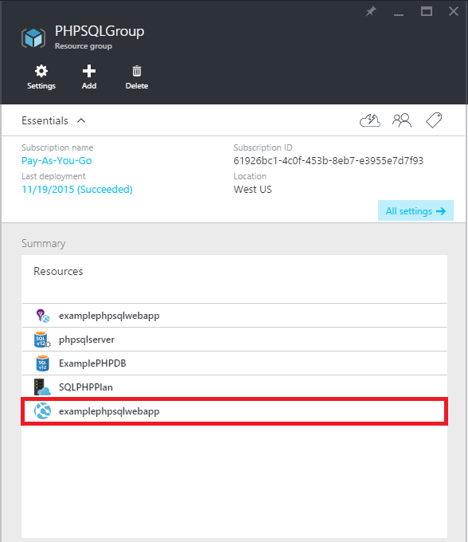
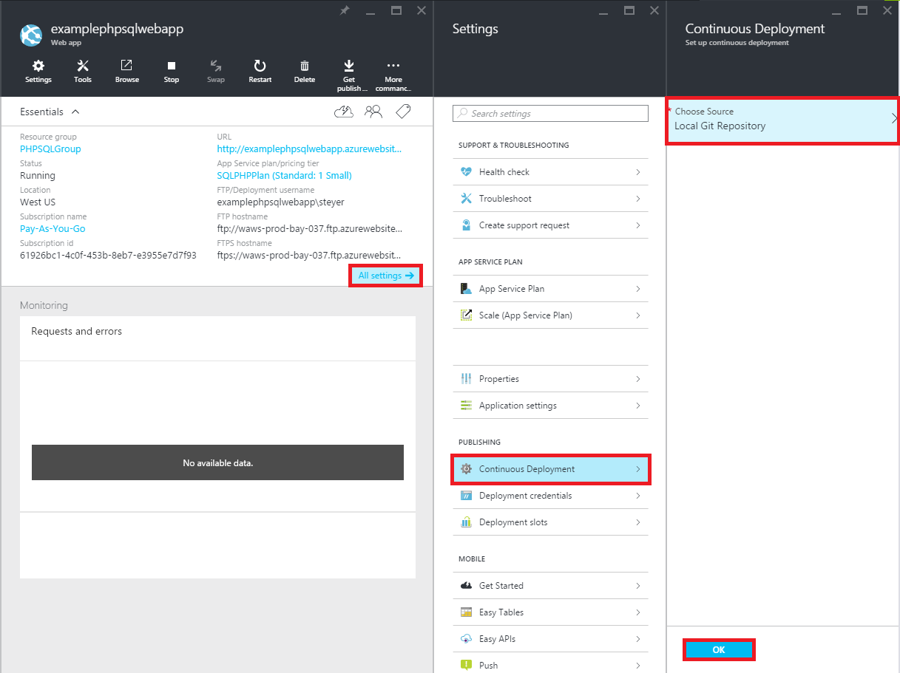
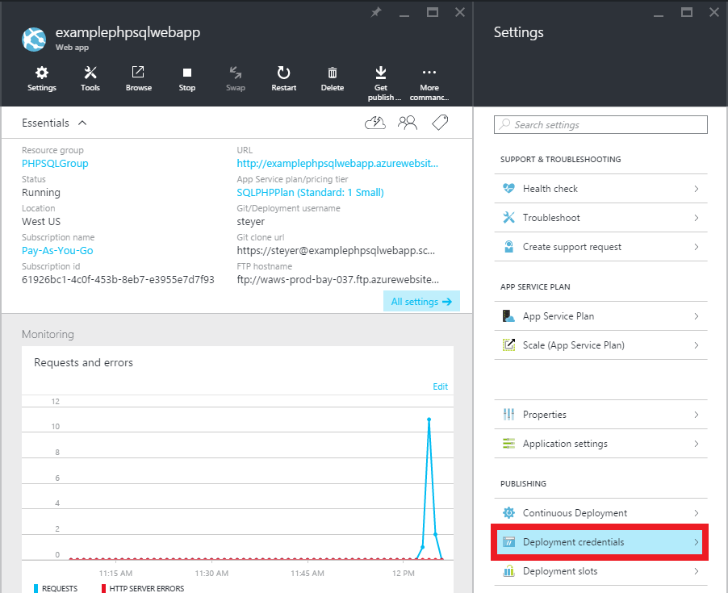
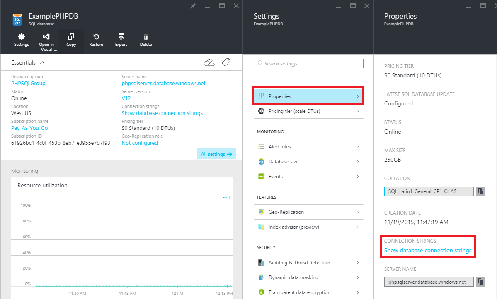

<properties 
	pageTitle="Create a PHP-SQL web app and deploy to Azure App Service using Git" 
	description="A tutorial that demonstrates how to create a PHP web app that stores data in Azure SQL Database and use Git deployment to Azure App Service." 
	services="app-service\web, sql-database" 
	documentationCenter="php" 
	authors="rmcmurray" 
	manager="wpickett" 
	editor=""/>

<tags 
	ms.service="app-service-web" 
	ms.workload="web" 
	ms.tgt_pltfrm="na" 
	ms.devlang="PHP" 
	ms.topic="article" 
	ms.date="08/11/2016" 
	ms.author="robmcm"/>

# Create a PHP-SQL web app and deploy to Azure App Service using Git

This tutorial shows you how to create a PHP web app in [Azure App Service](http://go.microsoft.com/fwlink/?LinkId=529714) that connects to Azure SQL Database and how to deploy it using Git. This tutorial assumes you have [PHP][install-php], [SQL Server Express][install-SQLExpress], the [Microsoft Drivers for SQL Server for PHP](http://www.microsoft.com/download/en/details.aspx?id=20098), and [Git][install-git] installed on your computer. Upon completing this guide, you will have a PHP-SQL web app running in Azure.

> [AZURE.NOTE]
> You can install and configure PHP, SQL Server Express, and the Microsoft Drivers for SQL Server for PHP using the [Microsoft Web Platform Installer](http://www.microsoft.com/web/downloads/platform.aspx).

You will learn:

* How to create an Azure web app and a SQL Database using the [Azure Portal](http://go.microsoft.com/fwlink/?LinkId=529715). Because PHP is enabled in App Service Web Apps by default, nothing special is required to run your PHP code.
* How to publish and re-publish your application to Azure using Git.
 
By following this tutorial, you will build a simple registration web application in PHP. The application will be hosted in an Azure Website. A screenshot of the completed application is below:

[AZURE.INCLUDE [create-account-and-websites-note](../../includes/create-account-and-websites-note.md)]

>[AZURE.NOTE] If you want to get started with Azure App Service before signing up for an Azure account, go to [Try App Service](http://go.microsoft.com/fwlink/?LinkId=523751), where you can immediately create a short-lived starter web app in App Service. No credit cards required; no commitments.

##Create an Azure web app and set up Git publishing

Follow these steps to create an Azure web app and a SQL Database:

1. Log in to the [Azure Portal](https://portal.azure.com/).

2. Open the Azure Marketplace by clicking the **New** icon on the top left of the dashboard, click on **Select All** next to Marketplace and selecting **Web + Mobile**.
	
3. In the Marketplace, select **Web + Mobile**.

4. Click the **Web app + SQL** icon.

5. After reading the description of the Web app + SQL app, select **Create**.

6. Click on each part (**Resource Group**, **Web App**, **Database**, and **Subscription**) and enter or select values for the required fields:
	
	- Enter a URL name of your choice	
	- Configure database server credentials
	- Select the region closest to you

	

7. When finished defining the web app, click **Create**.

	When the web app has been created, the **Notifications** button will flash a green **SUCCESS** and the resource group blade open to show both the web app and the SQL database in the group.

4. Click the web app's icon in the resource group blade to open the web app's blade.

	

5. In **Settings** click **Continuous deployment** > **Configure required settings**. Select **Local Git Repository** and click **OK**.

	

	If you have not set up a Git repository before, you must provide a user name and password. To do this, click **Settings** > **Deployment credentials** in the web app's blade.

	

6. In **Settings** click on **Properties** to see the Git remote URL you need to use to deploy your PHP app later.

##Get SQL Database connection information

To connect to the SQL Database instance that is linked to your web app, your will need the connection information, which you specified when you created the database. To get the SQL Database connection information, follow these steps:

1. Back in the resource group's blade, click the SQL database's icon.

2. In the SQL database's blade, click **Settings** > **Properties**, then click **Show database connection strings**. 

	
	
3. From the **PHP** section of the resulting dialog, make note of the values for `Server`, `SQL Database`, and `User Name`. You will use these values later when publishing your PHP web app to Azure App Service.

##Build and test your application locally

The Registration application is a simple PHP application that allows you to register for an event by providing your name and email address. Information about previous registrants is displayed in a table. Registration information is stored in a SQL Database instance. The application consists of two files (copy/paste code available below):

* **index.php**: Displays a form for registration and a table containing registrant information.
* **createtable.php**: Creates the SQL Database table for the application. This file will only be used once.

To run the application locally, follow the steps below. Note that these steps assume you have PHP and SQL Server Express set up on your local machine, and that you have enabled the [PDO extension for SQL Server][pdo-sqlsrv].

1. Create a SQL Server database called `registration`. You can do this from the `sqlcmd` command prompt with these commands:

		>sqlcmd -S localhost\sqlexpress -U <local user name> -P <local password>
		1> create database registration
		2> GO	

2. In your application root directory, create two files in it - one called `createtable.php` and one called `index.php`.

3. Open the `createtable.php` file in a text editor or IDE and add the code below. This code will be used to create the `registration_tbl` table in the `registration` database.

		<?php
		// DB connection info
		$host = "localhost\sqlexpress";
		$user = "user name";
		$pwd = "password";
		$db = "registration";
		try{
			$conn = new PDO( "sqlsrv:Server= $host ; Database = $db ", $user, $pwd);
			$conn->setAttribute( PDO::ATTR_ERRMODE, PDO::ERRMODE_EXCEPTION );
			$sql = "CREATE TABLE registration_tbl(
			id INT NOT NULL IDENTITY(1,1) 
			PRIMARY KEY(id),
			name VARCHAR(30),
			email VARCHAR(30),
			date DATE)";
			$conn->query($sql);
		}
		catch(Exception $e){
			die(print_r($e));
		}
		echo "<h3>Table created.</h3>";
		?>

	Note that you will need to update the values for <code>$user</code> and <code>$pwd</code> with your local SQL Server user name and password.

4. In a terminal at the root directory of the application type the following command:

		php -S localhost:8000

4. Open a web browser and browse to **http://localhost:8000/createtable.php**. This will create the `registration_tbl` table in the database.

5. Open the **index.php** file in a text editor or IDE and add the basic HTML and CSS code for the page (the PHP code will be added in later steps).

		<html>
		<head>
		<Title>Registration Form</Title>
		
		</head>
		<body>
		<h1>Register here!</h1>
		
Fill in your name and email address, then click <strong>Submit</strong> to register.

		<form method="post" action="index.php" enctype="multipart/form-data" >
		      Name  <input type="text" name="name" id="name"/> 
		      Email <input type="text" name="email" id="email"/> 
		      <input type="submit" name="submit" value="Submit" />
		</form>
		<?php

		?>
		</body>
		</html>

6. Within the PHP tags, add PHP code for connecting to the database.

		// DB connection info
		$host = "localhost\sqlexpress";
		$user = "user name";
		$pwd = "password";
		$db = "registration";
		// Connect to database.
		try {
			$conn = new PDO( "sqlsrv:Server= $host ; Database = $db ", $user, $pwd);
			$conn->setAttribute( PDO::ATTR_ERRMODE, PDO::ERRMODE_EXCEPTION );
		}
		catch(Exception $e){
			die(var_dump($e));
		}

    Again, you will need to update the values for <code>$user</code> and <code>$pwd</code> with your local MySQL user name and password.

7. Following the database connection code, add code for inserting registration information into the database.

		if(!empty($_POST)) {
		try {
			$name = $_POST['name'];
			$email = $_POST['email'];
			$date = date("Y-m-d");
			// Insert data
			$sql_insert = "INSERT INTO registration_tbl (name, email, date) 
						   VALUES (?,?,?)";
			$stmt = $conn->prepare($sql_insert);
			$stmt->bindValue(1, $name);
			$stmt->bindValue(2, $email);
			$stmt->bindValue(3, $date);
			$stmt->execute();
		}
		catch(Exception $e) {
			die(var_dump($e));
		}
		echo "<h3>Your're registered!</h3>";
		}

8. Finally, following the code above, add code for retrieving data from the database.

		$sql_select = "SELECT * FROM registration_tbl";
		$stmt = $conn->query($sql_select);
		$registrants = $stmt->fetchAll(); 
		if(count($registrants) > 0) {
			echo "<h2>People who are registered:</h2>";
			echo "<table>";
			echo "<tr><th>Name</th>";
			echo "<th>Email</th>";
			echo "<th>Date</th></tr>";
			foreach($registrants as $registrant) {
				echo "<tr><td>".$registrant['name']."</td>";
				echo "<td>".$registrant['email']."</td>";
				echo "<td>".$registrant['date']."</td></tr>";
		    }
		 	echo "</table>";
		} else {
			echo "<h3>No one is currently registered.</h3>";
		}

You can now browse to **http://localhost:8000/index.php** to test the application.

##Publish your application

After you have tested your application locally, you can publish it to App Service Web Apps using Git. However, you first need to update the database connection information in the application. Using the database connection information you obtained earlier (in the **Get SQL Database connection information** section), update the following information in **both** the `createdatabase.php` and `index.php` files with the appropriate values:

	// DB connection info
	$host = "tcp:<value of Server>";
	$user = "<value of User Name>";
	$pwd = "<your password>";
	$db = "<value of SQL Database>";

> [AZURE.NOTE]
> In the <code>$host</code>, the value of Server must be prepended with <code>tcp:</code>.

Now, you are ready to set up Git publishing and publish the application.

> [AZURE.NOTE]
> These are the same steps noted at the end of the **Create an Azure web app and set up Git publishing** section above.

1. Open GitBash (or a terminal, if Git is in your `PATH`), change directories to the root directory of your application (the **registration** directory), and run the following commands:

		git init
		git add .
		git commit -m "initial commit"
		git remote add azure [URL for remote repository]
		git push azure master

	You will be prompted for the password you created earlier.

2. Browse to **http://[web app name].azurewebsites.net/createtable.php** to create the SQL database table for the application.
3. Browse to **http://[web app name].azurewebsites.net/index.php** to begin using the application.

After you have published your application, you can begin making changes to it and use Git to publish them. 

##Publish changes to your application

To publish changes to application, follow these steps:

1. Make changes to your application locally.
2. Open GitBash (or a terminal, it Git is in your `PATH`), change directories to the root directory of your application, and run the following commands:

		git add .
		git commit -m "comment describing changes"
		git push azure master

	You will be prompted for the password you created earlier.

3. Browse to **http://[web app name].azurewebsites.net/index.php** to see your changes.

## What's changed
* For a guide to the change from Websites to App Service see: [Azure App Service and Its Impact on Existing Azure Services](http://go.microsoft.com/fwlink/?LinkId=529714)

[install-php]: http://www.php.net/manual/en/install.php
[install-SQLExpress]: http://www.microsoft.com/download/details.aspx?id=29062
[install-Drivers]: http://www.microsoft.com/download/details.aspx?id=20098
[install-git]: http://git-scm.com/
[pdo-sqlsrv]: http://php.net/pdo_sqlsrv
 
