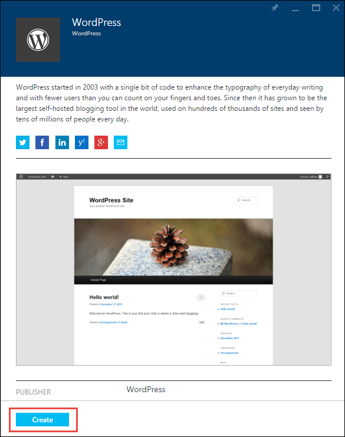
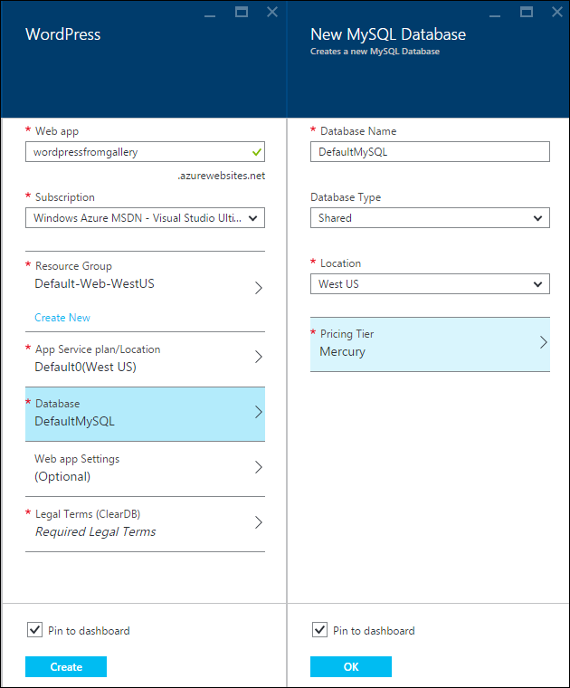
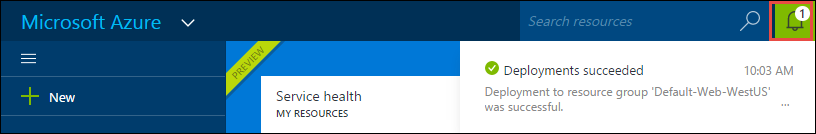
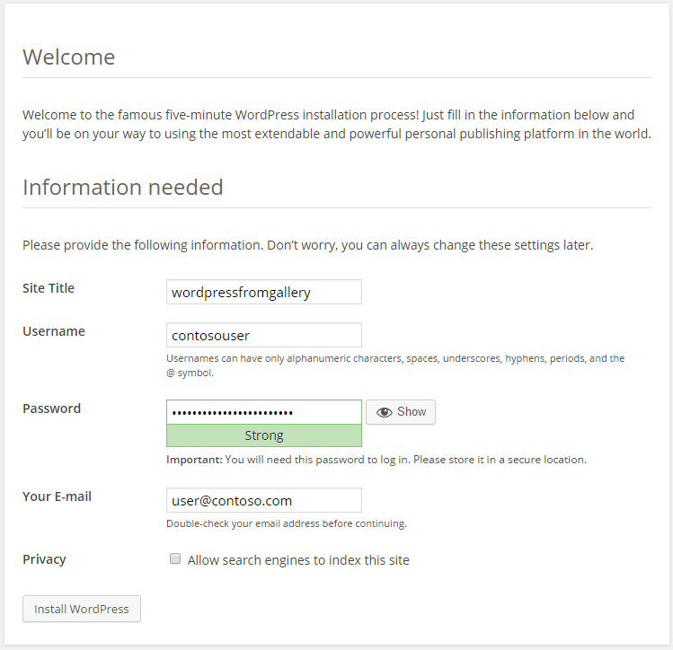

<properties
	pageTitle="Create a WordPress web app in Azure App Service | Microsoft Azure"
	description="Learn how to create a new Azure web app for a WordPress blog using the Azure preview portal."
	services="app-service\web"
	documentationCenter="php"
	authors="tfitzmac"
	manager="wpickett"
	editor=""/>

<tags
	ms.service="app-service-web"
	ms.workload="na"
	ms.tgt_pltfrm="na"
	ms.devlang="PHP"
	ms.topic="hero-article"
	ms.date="10/13/2015"
	ms.author="tomfitz"/>

# Create a WordPress web app in Azure App Service

This tutorial shows how to find an application in the Azure Marketplace and install it in an App Service web app. The tutorial uses a WordPress blog site as an example, but the process is similar for many other Marketplace applications.

When you're done with the tutorial you'll have your own WordPress blog site up and running in the cloud.

You'll learn:

* How to find an application template in the Azure Marketplace.
* How to create a web app in Azure App Service that is based on the template.
* How to configure Azure App Service settings for the new web app and MySQL database.

The Azure Marketplace makes available a wide range of popular web apps developed by Microsoft, third party companies, and open source software initiatives. The web apps are built on a wide range of popular frameworks, such as [PHP](/develop/nodejs/) in this WordPress example, [.NET](/develop/net/), [Node.js](/develop/nodejs/), [Java](/develop/java/), and [Python](/develop/python/), to name a few. To create a web app from the Azure Marketplace the only software you need is the browser that you use for the [Azure preview portal](https://portal.azure.com/). 

> [AZURE.NOTE]
> To complete this tutorial, you need a Microsoft Azure account. If you don't have an account, you can [activate your MSDN subscriber benefits](/en-us/pricing/member-offers/msdn-benefits-details/?WT.mc_id=A261C142F) or [sign up for a free trial](/en-us/pricing/free-trial/?WT.mc_id=A261C142F).
>
> If you want to get started with Azure App Service before you sign up for an Azure account, go to [Try App Service](http://go.microsoft.com/fwlink/?LinkId=523751). There, you can immediately create a short-lived starter web app in App Service—no credit card required, and no commitments.

## Select WordPress and configure for Azure App Service

1. Log in to the [Azure Preview Portal](https://portal.azure.com/).

2. Click **New > Marketplace**.
	
    ![Create New][5]
	
3. Search for **WordPress**, and then click **WordPress**.

	![WordPress from list][7]
	
5. After reading the description of the WordPress app, click **Create**.

	

4. Enter a name for the web app in the **Web app** box.

	This name must be unique in the azurewebsites.net domain because the URL of the web app will be {name}.azurewebsites.net. If the name you enter isn't unique, a red exclamation mark appears in the text box.

8. If you have more than one subscription, choose the one you want to use. 

5. Select a **Resource Group** or create a new one.

	For more information about resource groups, see [Using the Azure Preview Portal to manage your Azure resources](../resource-group-portal.md).

5. Select an **App Service plan/Location** or create a new one.

	For more information about App Service plans, see [Azure App Service plans overview](../azure-web-sites-web-hosting-plans-in-depth-overview.md)	

7. Click **Database**, and then in the **New MySQL Database** blade provide the required values for configuring your MySQL database.

	a. Enter a new name or leave the default name.

	b. Leave the **Database Type** set to **Shared**.

	c. Choose the same location as the one you chose for the web app.

	d. Choose a pricing tier. Mercury (free with minimal allowed connections and disk space) is fine for this tutorial.

8. In the **New MySQL Database** blade, click **OK**. 

8. In the **WordPress** blade, accept the legal terms, and then click **Create**. 

	

	Azure App Service creates the web app, typically in less than a minute. You can watch the progress by clicking the bell icon at the top of the portal page.

	

## Launch and manage your WordPress web app
	
7. When the web app creation is finished, navigate in the portal to the resource group in which you created the application, and you can see the web app and the database.

	The extra resource with the light bulb icon is [Application Insights](/services/application-insights/), which provides monitoring services for your web app.

1. In the **Resource group** blade, click the web app line.

	

2. In the Web app blade, click **Browse**.

    ![site URL][browse]

3. In the WordPress **Welcome** page, enter the configuration information required by WordPress, and then click **Install WordPress**.

	

4. Log in using the credentials you created on the **Welcome** page.  

5. Your site Dashboard page opens.    

	

## Next steps

You've seen how to create and deploy a PHP web app from the gallery. For more information about using PHP in Azure, see the [PHP Developer Center](/develop/php/).

For more information about how to work with App Service Web Apps, see the links on the left side of the page (for wide browser windows) or at the top of the page (for narrow browser windows). 

## What's changed
* For a guide to the change from Websites to App Service, see [Azure App Service and its impact on existing Azure Services](http://go.microsoft.com/fwlink/?LinkId=529714).
* For a guide to the change of the old portal to the new portal, see [Reference for navigating the preview portal](http://go.microsoft.com/fwlink/?LinkId=529715).

[5]: ./media/web-sites-php-web-site-gallery/startmarketplace.png
[7]: ./media/web-sites-php-web-site-gallery/search-web-app.png
[browse]: ./media/web-sites-php-web-site-gallery/browse-web.png
