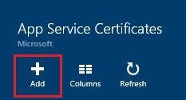
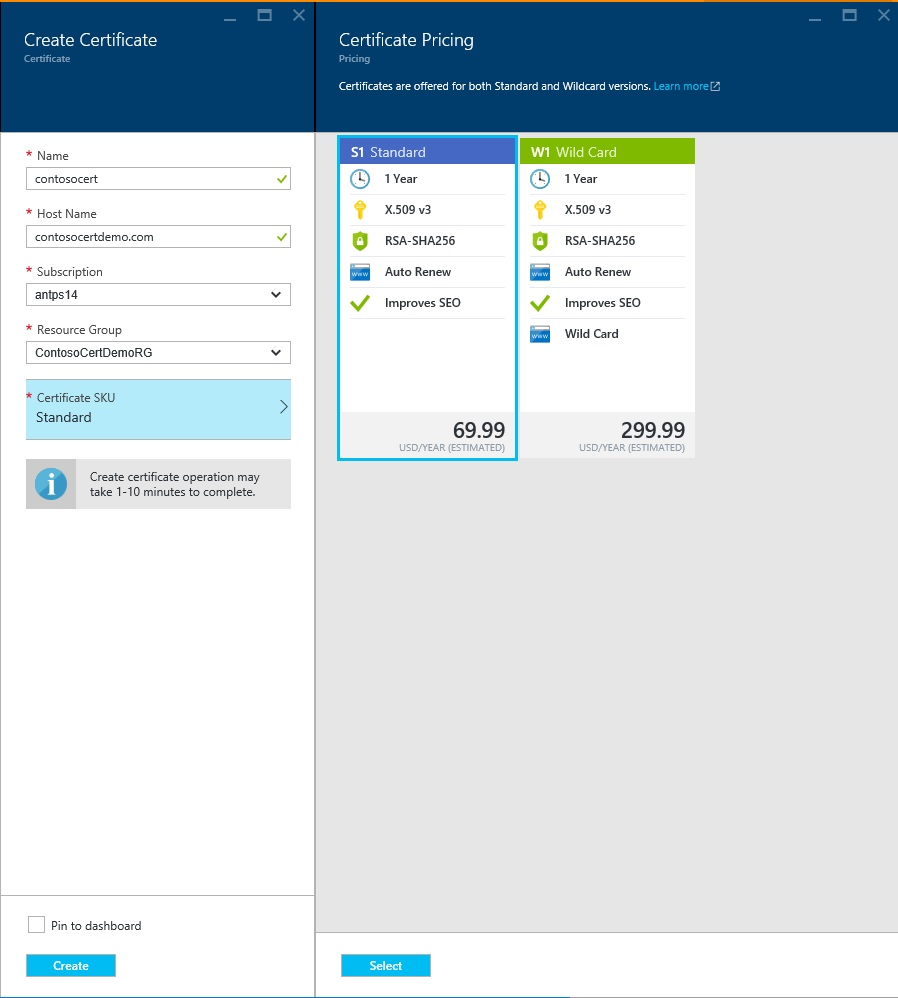
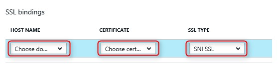
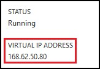

<properties
	pageTitle="Buy and Configure an SSL Certificate for your Azure App Service"
	description="Learn how to Buy and Configure an SSL Certificate for your Azure App Service."
	services="app-service"
	documentationCenter=".net"
	authors="apurvajo"
	manager="stefsch"
	editor="cephalin"
	tags="buy-ssl-certificates"/>

<tags
	ms.service="app-service"
	ms.workload="na"
	ms.tgt_pltfrm="na"
	ms.devlang="na"
	ms.topic="article"
	ms.date="07/01/2016"
	ms.author="apurvajo"/>

#Buy and Configure an SSL Certificate for your Azure App Service

> [AZURE.SELECTOR]
- [Buy SSL cert in Azure](web-sites-purchase-ssl-web-site.md)
- [Add SSL cert purchased elsewhere](web-sites-configure-ssl-certificate.md)

By default, **[Azure App Service](http://go.microsoft.com/fwlink/?LinkId=529714)** already enables HTTPS for your web app with a wildcard certificate for the *.azurewebsites.net domain. If you don't plan to configure a custom domain, then you can benefit from the default HTTPS certificate. However, like all *[wildcard domains](https://casecurity.org/2014/02/26/pros-and-cons-of-single-domain-multi-domain-and-wildcard-certificates), it is not as secure as using a custom domain with your own certificate. 
Azure App Service now provides you a really simplified way to purchase and manage an SSL certificate right from Azure Portal without ever leaving the portal.  
This article explains how to buy and configure an SSL Certificate for your **[Azure App Service](http://go.microsoft.com/fwlink/?LinkId=529714)** in 3 simple steps. 

> [AZURE.NOTE]
> SSL Certificates for Custom domain names cannot be used with Free and Shared web app. You must configure your web app for Basic, Standard or Premium mode, which may change how much you are billed for your subscription. See **[Web Apps Pricing Details](https://azure.microsoft.com/pricing/details/web-sites/)** for more information.

##Overview
> [AZURE.NOTE]
> Please do not attempt to purchase an SSL Certificate using a subscription that does not have an Active Credit Card associated with it. This could result in your subscription being disabled. 

##<a> Purchase, Store and Assign an SSL Certificate for your custom domain </a>
To enable HTTPS for a custom domain, such as contoso.com, you must first **[configure a custom domain name in Azure App Service.](web-sites-custom-domain-name.md)**

Before requesting an SSL certificate, you must first determine which domain names will be secured by the certificate. This will determine what type of certificate you must obtain. If you just need to secure a single domain name such as contoso.com or www.contoso.com a Standard (basic) certificate is sufficient. If you need to secure multiple domain names, such as contoso.com, www.contoso.com, and mail.contoso.com, then you can get a **[wildcard certificate](http://en.wikipedia.org/wiki/Wildcard_certificate)**

##Step 0: Place an SSL certificate order

In this Step, you will learn how to place an Order for an SSL Certificate of your choice.

1.	In the **[Azure Portal](https://portal.azure.com/)**, click Browse and Type “App Service Certificates” in search bar and select “App Service Certificates” from the result and Click Add. 

    

    

2.	Enter **friendly name** for your SSL Certificate.

3.	Enter **Host Name**
> [AZURE.NOTE]
    This is one of the most critical parts of the purchase process. Make sure to enter correct host name (custom domain) that you want to protect with this certificate. **DO NOT** append the Host name with WWW. For example, if your custom domain name is www.contoso.com then just enter contoso.com in the Host Name field, the certificate in question will protect both www and root domains. 
    
4.	Select your **subscription**. 

    If you have multiple subscriptions, then make sure to create an SSL Certificate in the same subscription that you have used for your custom domain or Web App in question.
       
5.	Select or create a **resource group**.

    Resource groups enable you to manage related Azure resources as a unit and are useful when establishing role-based access control (RBAC) rules for your apps. For more information, see Managing your Azure resources.
     
6.	Select the **Certificate SKU** 

    Finally, select the certificate SKU that fits your need and click Create. Today, Azure App Service allows you to purchase two different SKUs
           •	S1 – Standard Certificate with 1-year validity and auto renewal  
           •	W1 – Wild card Certificate with 1-year validity and auto renewal      
    See **[Web Apps Pricing Details](https://azure.microsoft.com/pricing/details/web-sites/)** for more information.

> [AZURE.NOTE]
> SSL Certificate creation will take anywhere from 1 – 10 minutes. This process performs multiple steps in background that are otherwise very cumbersome to perform manually.  

##Step 1: Store the certificate in Azure Key Vault

In this Step, you will learn how to place an Store an SSL Certificate that you purchased to Azure Key Vault of your choice.

1.	Once the SSL Certificate purchase is complete You will need to manually open **App Service Certificates** Resource blade by browsing to it again (See Step 1 above)   

    

    You will notice that Certificate status is **“Pending Issuance”** as there are few more steps you need to complete before you can start using this certificates.
 
2. Click on **“Certificate Configuration”** inside Certificate Properties blade and Click on **“Step 1: Store”** to store this certificate in Azure Key Vault.

3.	From **“Key Vault Status”** Blade click on **“Key Vault Repository”** to choose an existing Key Vault to store this certificate **OR “Create New Key Vault”** to create new Key Vault inside same subscription and resource group.
 
    
 
    > [AZURE.NOTE]
    Azure Key Vault has very minimal charges for storing this certificate. 
    See **[Azure Key Vault Pricing Details](https://azure.microsoft.com/pricing/details/key-vault/)** for more information.

4. Once you have selected the Key Vault Repository to store this certificate in, go ahead and store it by clicking on **“Store”** button at the top of **“Key Vault Status”** blade.  

    This should complete step to storing the Certificate you purchased with Azure Key Vault of your choice. Upon refreshing the Blade, you should see Green Check mark against this step as well.
    
##Step 2: Verify the Domain Ownership

In this Step, you will learn how to perform Domain Ownership Verification for an SSL Certificate that you just placed an order for. 

1.	Click on **“Step 2: Verify”** Step from the **“Certificate Configuration”** Blade. There are 4 types of domain Verification supported by App Service Certificates.

    * **App Service Verification** 
    
        * This is the most convenient process if you already have **your custom domain assigned to the App Service Apps.** This method will list out all the App Service Apps that meet this criteria. 
           For example, in this case, **contosocertdemo.com** is a custom domain assigned to App Service App called **“ContosoCertDemo”** and hence that’s the only App Service App listed here. If there were multi-region deployment, then it would list them all across the regions.
        
           The verification method is ONLY available for Standard (Basic) certificate purchases. For Wild Card Certificates, please skip and move to option B, C or D below.
        * Click on **“Verify”** button to complete this step.
        * Click on **“Refresh”** to update the Certificate status after verification is completed. It might take few minutes for verification to complete.
        
             

    * **Domain Verification** 

        * This is the most convenient process **ONLY IF** you have **[purchased your custom domain from Azure App Service.](custom-dns-web-site-buydomains-web-app.md)**
        
        * Click on **“Verify”** button to complete this step.
        
        * Click on **“Refresh”** to update the Certificate status after verification is completed. It might take few minutes for verification to complete.

    * **Mail Verification**
        
        * Verification email has already been sent to the Email Address(es) associated with this custom domain.
         
        * Open the email and Click on the verification link to complete the Email Verification step. 
        
        * If you need to resend the verification email, Click on the **"Resend Email"** button.
         
    * **Manual Verification**    
                 
        1. **HTML Web Page Verification**
        
            * Create an HTML file named **{Domain Verification Token}**.html (You can copy the token from he Domain Verification Status Blade)
            
            * Content of this file should be the exact same name of **Domain Verification Token**.
            
            * Upload this file at the root of the web server hosting your domain.
            
            * Click on **“Refresh”** to update the Certificate status after verification is completed. It might take few minutes for verification to complete.
            
            For example, if you are buying a standard certificate for contosocertdemo.com with Domain Verification Token **‘cAGgQrKc’** then a web request made to **‘http://contosocertdemo.com/cAGgQrKc.html’** should return **cAGgQrKc.**
        2. **DNS TXT Record Verification**

            * Using your DNS manager, Create a TXT record on the **‘DZC’** subdomain with value equal to the **Domain Verification Token.**
            
            * Click on **“Refresh”** to update the Certificate status after verification is completed. It might take few minutes for verification to complete.
                              
            For example, in order to perform validation for a wildcard certificate with hostname **\*.contosocertdemo.com** or **\*.subdomain.contosocertdemo.com** and Domain Verification Token **cAGgQrKc**, you need to create a TXT record on dzc.contosocertdemo.com with value **cAGgQrKc.**     

##Step 3: Assign Certificate to App Service App

In this Step, you will learn how to assign this newly purchased certificate to your App Service Apps. 

> [AZURE.NOTE]
> Before performing the steps in this section, you must have associated a custom domain name with your app. For more information, see **[Configuring a custom domain name for a web app.](web-sites-custom-domain-name.md)**

1.	In your browser, open the **[Azure Portal.](https://portal.azure.com/)**
2.	Click the **App Service** option on the left side of the page.
3.	Click the name of your app to which you want to assign this certificate. 
4.	In the **Settings**, Click **Custom domains and SSL.**
5.	In the **certificates section**, click **Import Certificate** and select the Certificate that you just purchased

    

6. In the **ssl bindings** section of the **SSL Settings** tab, use the dropdowns to select the domain name to secure with SSL, and the certificate to use. You may also select whether to use **[Server Name Indication (SNI)](http://en.wikipedia.org/wiki/Server_Name_Indication)** or IP based SSL.

    

       •    IP based SSL associates a certificate with a domain name by mapping the dedicated public IP address of the server to the domain name. This requires each domain name (contoso.com, fabricam.com, etc.) associated with your service to have a dedicated IP address. This is the traditional          method of associating SSL certificates with a web server.
       •	SNI based SSL is an extension to SSL and **[Transport Layer Security](http://en.wikipedia.org/wiki/Transport_Layer_Security)** (TLS) that allows multiple domains to share the same IP address, with separate security certificates for each domain. Most modern browsers (including Internet Explorer, Chrome, Firefox and Opera) support SNI, however older browsers may not support SNI. For more information on SNI, see the **[Server Name Indication](http://en.wikipedia.org/wiki/Server_Name_Indication)** article on Wikipedia.
       
7. Click *Save* to save the changes and enable SSL.

If you selected **IP based SSL** and your custom domain is configured using an A record, you must perform the following additional steps:

* After you have configured an IP based SSL binding, a dedicated IP address is assigned to your app. You can find this IP address on the **Dashboard** page of your app, in the **quick glance** section. It will be listed as **Virtual IP Address:**
    
    

    Note that this IP address will be different than the virtual IP address used previously to configure the A record for your domain. If you are configured to use SNI based SSL, or are not configured to use SSL, no address will be listed for this entry.
    
2. Using the tools provided by your domain name registrar, modify the A record for your custom domain name to point to the IP address from the previous step.
At this point, you should be able to visit your app using HTTPS:// instead of HTTP:// to verify that the certificate has been configured correctly.

##Rekey and Sync the Certificate

1. For security reasons, if you ever need to Rekey your certificate then simply select **"Rekey and Sync"** option from **"Certificate Properties"** Blade. 

2. Click on **"Rekey"** Button to initiate the process. This process can take 1-10 minutes to complete. 

    

3. Rekeying your certificate will roll the certificate with a new certificate issued from the certificate authority.
4. You will not be charged for the Rekeying for the lifetime of the certificate. 
5. Rekeying your certificate will go through Pending Issuance state. 
6. Once the certificate is ready make sure you sync your resources using this certificate to prevent disruption to the service.
7. Sync option is not available for Certificates that are not yet assigned to the Web App. 

## More Resources ##
- [Enable HTTPS for an app in Azure App Service](web-sites-configure-ssl-certificate.md)
- [Buy and Configure a custom domain name in Azure App Service](custom-dns-web-site-buydomains-web-app.md)
- [Microsoft Azure Trust Center](/support/trust-center/security/)
- [Configuration options unlocked in Azure Web Sites](http://azure.microsoft.com/blog/2014/01/28/more-to-explore-configuration-options-unlocked-in-windows-azure-web-sites/)
- [Azure Management Portal](https://manage.windowsazure.com)

>[AZURE.NOTE] If you want to get started with Azure App Service before signing up for an Azure account, go to [Try App Service](http://go.microsoft.com/fwlink/?LinkId=523751), where you can immediately create a short-lived starter web app in App Service. No credit cards required; no commitments.

