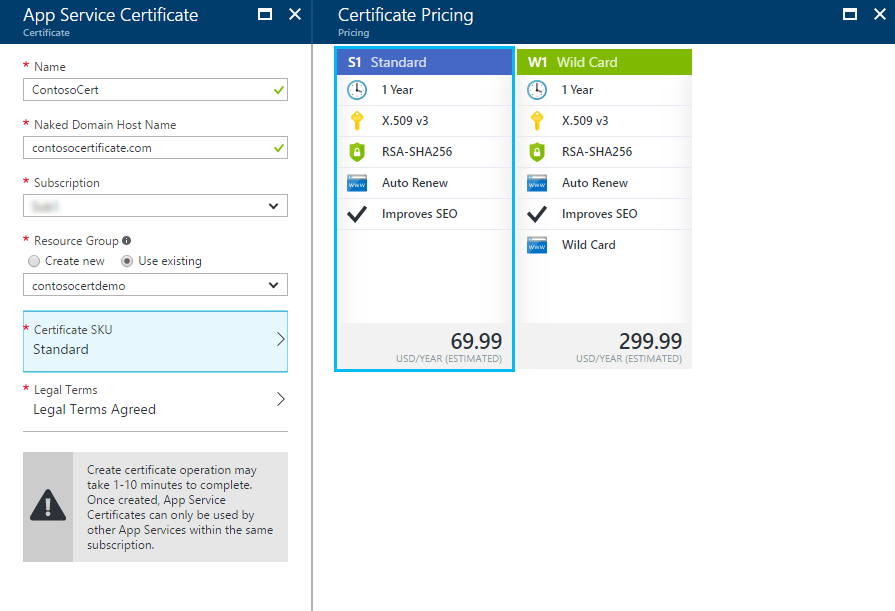
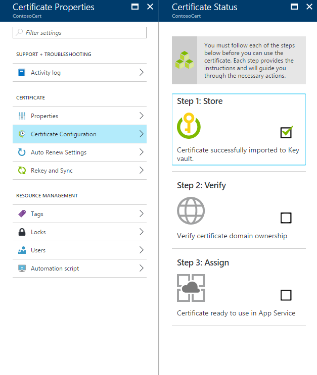
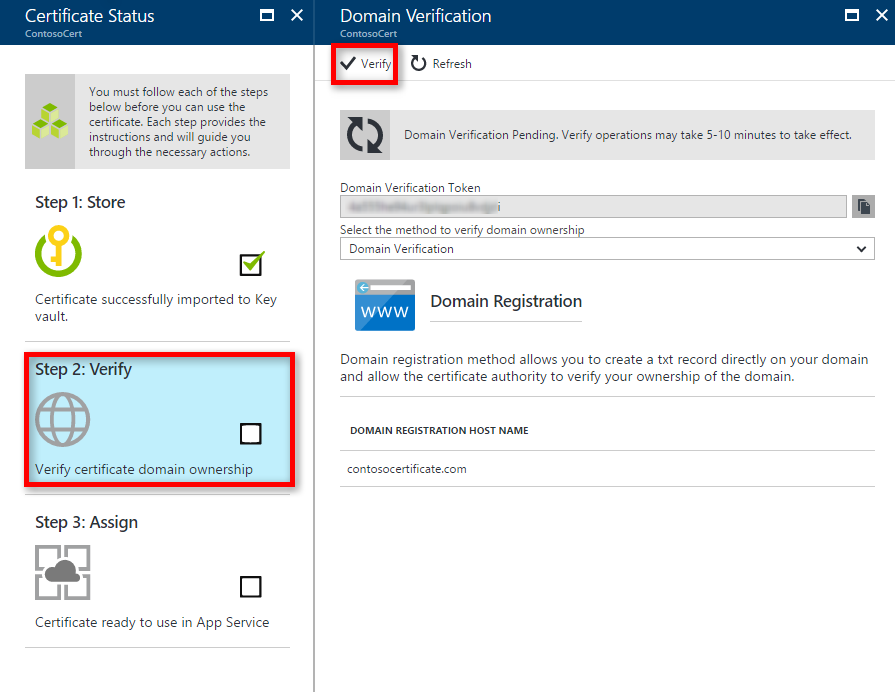
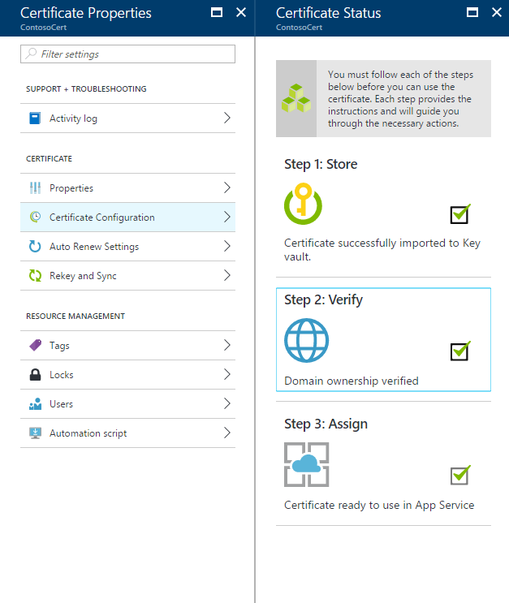
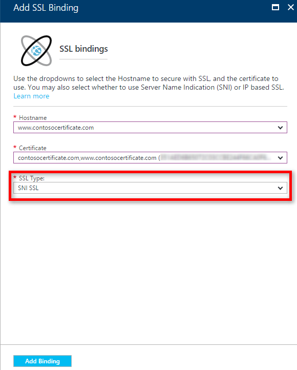
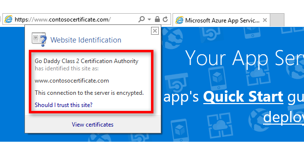

# Buy and Configure an SSL Certificate for your Azure App Service

In this tutorial, you will secure your web app by purchasing an SSL certificate for your **[Azure App Service](http://go.microsoft.com/fwlink/?LinkId=529714)**, securely storing it in [Azure Key Vault](https://docs.microsoft.com/en-us/azure/key-vault/key-vault-whatis), and associating it with a custom domain.

## Step 1 - Log in to Azure

Log in to the Azure portal at http://portal.azure.com

## Step 2 - Place an SSL Certificate order

You can place an SSL Certificate order by creating a new [App Service Certificate](https://portal.azure.com/#create/Microsoft.SSL) In the **Azure portal**.

Enter a friendly **Name** for your SSL certificate and enter the **Domain Name**

> [!NOTE]
> This is one of the most critical parts of the purchase process. Make sure to enter correct host name (custom domain) that you want to protect with this certificate. **DO NOT** append the Host name with WWW. 
>

Select your **Subscription**, **Resource Group**, and **Certificate SKU**

> [!WARNING]
> App Service Certificates can only be used by other App Services within the same subscription.  
>

## Step 3 - Store the certificate in Azure Key Vault

> [!NOTE]
> [Key Vault](https://docs.microsoft.com/en-us/azure/key-vault/key-vault-whatis) is an Azure service that helps safeguard cryptographic keys and secrets used by cloud applications and services.
>

Once the SSL Certificate purchase is complete, you need to open [App Service Certificates](https://portal.azure.com/#blade/HubsExtension/Resources/resourceType/Microsoft.CertificateRegistration%2FcertificateOrders) Resource blade.

You will notice that Certificate status is **“Pending Issuance”** as there are few more steps you need to complete before you can start using this certificate.

Click **Certificate Configuration** inside Certificate Properties blade and Click on **Step 1: Store** to store this certificate in Azure Key Vault.

From **Key Vault Status** Blade, click **Key Vault Repository** to choose an existing Key Vault to store this certificate **OR Create New Key Vault** to create new Key Vault inside same subscription and resource group.

> [!NOTE]
> Azure Key Vault has minimal charges for storing this certificate.
> For more information, see **[Azure Key Vault Pricing Details](https://azure.microsoft.com/pricing/details/key-vault/)**.
>

Once you have selected the Key Vault Repository to store this certificate in, the **Store** option should show success.

## Step 4 - Verify the Domain Ownership

> [!NOTE]
> There are three types of domain verification supported by App service Certificates: Domain, Mail, Manual Verification. These are explained in more details in the [Advanced section](#advanced).

From the same **Certificate Configuration** blade you used in Step 3, click **Step 2: Verify**.

**Domain Verification**
This is the most convenient process **ONLY IF** you have **[purchased your custom domain from Azure App Service.](custom-dns-web-site-buydomains-web-app.md)**
Click on **Verify** button to complete this step.

After clicking **Verify**, use the **Refresh** button until the **Verify** option should show success.

## Step 5 - Assign Certificate to App Service App

> [!NOTE]
> Before performing the steps in this section, you must have associated a custom domain name with your app. For more information, see **[Configuring a custom domain name for a web app.](app-service-web-tutorial-custom-domain.md)**
>

In the **[Azure portal](https://portal.azure.com/)**, click the **App Service** option on the left of the page.

Click the name of your app to which you want to assign this certificate.

In the **Settings**, click **SSL certificates**.

Click **Import App Service Certificate** and select the certificate that you just purchased.

In the **ssl bindings** section Click on **Add bindings**, and use the dropdowns to select the domain name to secure with SSL, and the certificate to use. You may also select whether to use **[Server Name Indication (SNI)](http://en.wikipedia.org/wiki/Server_Name_Indication)** or IP based SSL.

Click **Add Binding** to save the changes and enable SSL.

> [!NOTE]
> If you selected **IP based SSL** and your custom domain is configured using an A record, you must perform the following additional steps. These are explained in more details in the [Advanced section](#Advanced).

At this point, you should be able to visit your app using `HTTPS://` instead of `HTTP://` to verify that the certificate has been configured correctly.

<!---->

## Step 6 - Management tasks

### Azure CLI

[!code-azurecli[main](../../cli_scripts/app-service/configure-ssl-certificate/configure-ssl-certificate.sh?highlight=3-5 "Bind a custom SSL certificate to a web app")] 

### PowerShell

[!code-powershell[main](../../powershell_scripts/app-service/configure-ssl-certificate/configure-ssl-certificate.ps1?highlight=1-3 "Bind a custom SSL certificate to a web app")]

## Advanced

### Verifying Domain Ownership

There are two more types of domain verification supported by App service Certificates: Mail, and Manual Verification.

#### Mail Verification

Verification email has already been sent to the Email Address(es) associated with this custom domain.
To complete the Email verification step, open the email and click the verification link.

If you need to resend the verification email, click the **Resend Email** button.

#### Manual Verification

> [!IMPORTANT]
> HTML Web Page Verification (only works with Standard Certificate SKU)
>

1. Create an HTML file named **"starfield.html"**

1. Content of this file should be the exact name of the Domain Verification Token. (You can copy the token from the Domain Verification Status Blade)

1. Upload this file at the root of the web server hosting your domain `/.well-known/pki-validation/starfield.html`

1. Click **Refresh** to update the certificate status after verification is completed. It might take few minutes for verification to complete.

> [!TIP]
> Verify in a terminal using `curl -G http://<domain>/.well-known/pki-validation/starfield.html` the response should contain the `<verification-token>`.

#### DNS TXT Record Verification

1. Using your DNS manager, Create a TXT record on the `@` subdomain with value equal to the Domain Verification Token.
1. Click **“Refresh”** to update the Certificate status after verification is completed.

> [!TIP]
> You need to create a TXT record on `@.<domain>` with value `<verification-token>`.

### Assign Certificate to App Service App

If you selected **IP based SSL** and your custom domain is configured using an A record, you must perform the following additional steps:

After you have configured an IP based SSL binding, a dedicated IP address is assigned to your app. You can find this IP address on the **Custom domain** page under settings of your app, right above the **Hostnames** section. It is listed as **External IP Address**

Note that this IP address is different than the virtual IP address used previously to configure the A record for your domain. If you are configured to use SNI based SSL, or are not configured to use SSL, no address is listed for this entry.

Using the tools provided by your domain name registrar, modify the A record for your custom domain name to point to the IP address from the previous step.

## Rekey and Sync the Certificate

If you ever need to Rekey your certificate, select **Rekey and Sync** option from **Certificate Properties** Blade.

Click **Rekey** Button to initiate the process. This process can take 1-10 minutes to complete.

Rekeying your certificate rolls the certificate with a new certificate issued from the certificate authority.

## Next Steps

* [Add a Content Delivery Network](app-service-web-tutorial-content-delivery-network.md)