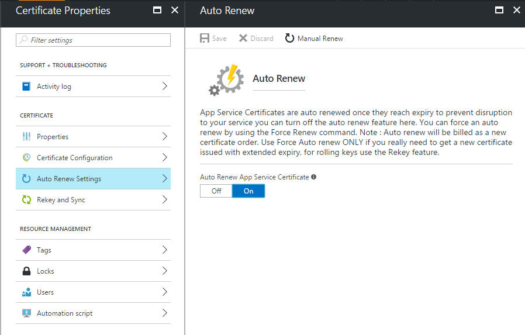

# Add an SSL certificate to your App Service app
> [!div class="op_single_selector"]
> * [Buy SSL certificate in Azure](web-sites-purchase-ssl-web-site.md)
> * [Use SSL certificate from elsewhere](web-sites-configure-ssl-certificate.md)
> 
> 

By default, [Azure App Service](http://go.microsoft.com/fwlink/?LinkId=529714) enables HTTPS for your web app with a wildcard certificate for the \*.azurewebsites.net domain. If you don't plan to set up a custom domain, you can benefit from the default HTTPS certificate. But, like all [wildcard domains](https://casecurity.org/2014/02/26/pros-and-cons-of-single-domain-multi-domain-and-wildcard-certificates), the Azure wildcard certificate is not as secure as using a custom domain with your own certificate.

App Service gives you a simplified way to purchase and manage an SSL certificate in the Azure portal. 

This article explains how to buy and set up an SSL certificate for your [App Service](http://go.microsoft.com/fwlink/?LinkId=529714) app. 

> [!NOTE]
> You can't use SSL certificates for custom domain names for apps that are hosted in a Free or Shared App Service plan. To use SSL certificates, your web app must be hosted in a Basic, Standard, or Premium App Service plan. Changing your subscription type might change how much you are billed for your subscription. For more information, see [App Service pricing](https://azure.microsoft.com/pricing/details/web-sites/).
> 
> 

> [!WARNING]
> Do not attempt to purchase an SSL certificate by using a subscription for which you have not attached a valid credit card. This might cause your subscription to be disabled. 
> 
> 

## Prerequisites
To enable HTTPS for a custom domain, start by [mapping a custom domain name to your Azure app](web-sites-custom-domain-name.md).

Before you request an SSL certificate, first determine which domain names you will secure with the certificate. This determines the type of certificate you need. If you want to secure a single domain name, like contoso.com *or* www.contoso.com, you can use a Standard (basic) certificate. If you need to secure multiple domain names, like contoso.com, www.contoso.com, *and* mail.contoso.com, you can get a [wildcard certificate](http://en.wikipedia.org/wiki/Wildcard_certificate).

## Purchase an SSL certificate

1. In the [Azure portal](https://portal.azure.com/), in the menu, select **Browse**. In the **Search** box, type **App Service Certificate**. In the search results, select **App Service Certificates**. 

   
   
2. On the **App Service Certificates** page, select **Add**. 

   

3. Enter a **name** for your SSL certificate.
4. Enter the **host name**.
   
   > [!WARNING]
   > This is one of the most critical parts of the purchase process. Be sure that you enter the correct host name (custom domain name) that you want this certificate to secure. *Do not* add "www" to the beginning of your host name. For example, if your custom domain name is www.contoso.com, enter **contoso.com** in the **Host Name** box. The certificate will protect www and root domains. 
   > 

5. Select your **subscription**. 
   
   If you have multiple subscriptions, create your SSL certificate in the same subscription that you use for your custom domain or web app.

6. Select or create a **resource group**.
   
   You can use resource groups to manage related Azure resources as a unit. Resource groups are useful when you want to establish role-based access control (RBAC) rules for your apps. For more information, see Managing your Azure resources.

7. Select the **certificate SKU**. 
   
   Select the certificate SKU that fits your need, and then select **Create**. 
   
   You can choose from two SKUS in App Service:
   * **S1**: Standard certificate with one-year validity and auto renewal  
   * **W1**: Wildcard certificate with one-year validity and auto renewal       
  
    

    For more information, see [App Service pricing](https://azure.microsoft.com/pricing/details/web-sites/).

> [!NOTE]
> Creating an SSL certificate can take up to 10 minutes. The process involves multiple steps that take place in the background.  
> 
> 

## Store the certificate in Azure Key Vault

1. When you've completed the SSL certificate purchase, in the Azure portal, go to the **App Service Certificates** blade.

   
   
   Note that the certificate status is **Pending Issuance**. You need to complete a few steps before you can start using this certificate.

2. On the **Certificate Properties** blade, select **Certificate Configuration**. To store this certificate in Key Vault, select **Step 1: Store**.
3. On the **Key Vault Status** blade, to select an existing key vault to store this certificate, select **Key Vault Repository**.  To create a new key vault in the same subscription and resource group, select **Create New Key Vault**.

   
   
   > [!NOTE]
   > Azure Key Vault offers minimal charges for storing the certificate. 
   > For more information, see [Azure Key Vault pricing](https://azure.microsoft.com/pricing/details/key-vault/).
   > 
   > 

4. After you have selected the Key Vault repository to store the certificate in, at the top of **Key Vault Status** blade, select the **Store** button.  
   
To verify your selection, you can click your browser's refresh button. A green check mark shows that this step is finished.

## Verify the domain ownership

1. On the **Certificate Configuration** blade, select **Step 2: Verify**.
2. Select verification options by using the following information. 

App Service certificates support three types of domain verification:

   * Domain verification
   * Mail verification
   * Manual verification

### Domain verification 
     
Domain verification is the most convenient process, but *only* if you have [purchased your custom domain from Azure App Service](custom-dns-web-site-buydomains-web-app.md).

1. To complete this step, select **Verify**.
2. To update the certificate status after verification is complete, select **Refresh**. It might take a few minutes for verification to complete.

### Mail verification
     
With a custom domain, a verification email is sent to the email address associated with the domain. 

1. To complete the email verification step, open the email and click the verification link. 
2. If you need to resend the verification email, click the **Resend Email** button.

### Manual verification    
     
**HTML web page verification (works only with a Standard certificate SKU)**

1. Create an HTML file named starfield.html. The contents of this file should be the precise name of the domain verification token. (You can copy the token from the **Domain Verification Status** blade.)
2. Upload this file to the root of the web server where you host your domain. For example, /.well-known/pki-validation/starfield.html.
3.  When verification is finished, to update the certificate status, select **Refresh**. It might take a few minutes for verification to finish.

    For example, if you are buying a standard certificate for **contosocertdemo.com**, with a domain verification token **tgjgthq8d11ttaeah97s3fr2sh**, a web request made to **http://contosocertdemo.com/.well-known/pki-validation/starfield.html** should return **tgjgthq8d11ttaeah97s3fr2sh**.

**DNS TXT record verification**
        
1. Using your DNS manager, create a TXT record on the **@** subdomain with a value equal to the **domain verification token.**
2. To update the certificate status when verification is finished, select **Refresh**. It might take few minutes for verification to finish.
 
   For example, to perform validation for a wildcard certificate with host name **\*.contosocertdemo.com** or **\*.subdomain.contosocertdemo.com**, and domain verification token **tgjgthq8d11ttaeah97s3fr2sh**, create a TXT record on **contosocertdemo.com** that has the value **tgjgthq8d11ttaeah97s3fr2sh**.     

## Assign the certificate to an App Service app

> [!NOTE]
> Before you complete the steps in this section, you must associate a custom domain name with your app. For more information, see [Configure a custom domain name for a web app](web-sites-custom-domain-name.md).
> 
> 

1. In the [Azure portal](https://portal.azure.com/), in the menu, select **App Service**.
2. Select the name of the app that you want to assign this certificate to. 
3. Go to **Settings** > **SSL certificates** > **Import App Service Certificate**, and then select the certificate.

   

4. In the **SSL bindings** section, select **Add bindings**.
5. On the **Add SSL Binding** blade, select the domain name that you want to secure with the SSL certificate. Select the certificate that you want to use. You might also want to select whether to use [Server Name Indication (SNI)](http://en.wikipedia.org/wiki/Server_Name_Indication) or IP-based SSL.

   
   
    * To associate a certificate with a domain name, IP-based SSL maps the dedicated public IP address of the server to the domain name. When you use IP-based SSL, each domain name (for example, contoso.com or fabricam.com) associated with your service must have a dedicated IP address. This is the traditional method for associating an SSL certificate with a web server.
    * SNI-based SSL is an extension to SSL and [Transport Layer Security](http://en.wikipedia.org/wiki/Transport_Layer_Security) (TLS). When you use SNI-based SSL, multiple domains can share the same IP address. Each domain has a separate security certificate. Most modern browsers, including Internet Explorer, Chrome, Firefox, and Opera, support SNI. Older browsers might not support SNI. For more information about SNI, see [Server Name Indication](http://en.wikipedia.org/wiki/Server_Name_Indication) in Wikipedia.

6. To save your changes and enable SSL, select **Add Binding**.

If you select **IP-based SSL** and your custom domain is configured using an A record, you must complete the following additional steps.

1.  After you set up an IP-based SSL binding, a dedicated IP address is assigned to your app. To find the IP address, go to **Settings** > **Custom domain**. Right above the **Hostnames** section, your IP address is listed as **External IP Address**.

   
    
  Note that this IP address is different from the virtual IP address you previously used to configure the A record for your domain. If your app is set up to use SNI-based SSL, or if it's not set up to use SSL, no IP address is listed here.

2.  Using the tools provided by your domain name registrar, modify the A record for your custom domain name so that it points to the IP address you used in the preceding step.

3.  To verify that the certificate has been configured correctly, go to your app by using HTTPS:// instead of HTTP://.

## Export your App Service certificate
You can create a local PFX copy of an App Service certificate. When you have a local copy, you can use the certificate with other Azure services. For more information, see our blog post [Create a local PFX copy of your App Service certificate](https://blogs.msdn.microsoft.com/appserviceteam/2017/02/24/creating-a-local-pfx-copy-of-app-service-certificate/).

## Auto renew your App Service certificate
To set auto renew settings for your certificate, or to manually renew your certificate, on the **Certificate Properties** blade, select **Auto Renew Settings**. 

To automatically renew your certificate before it expires, set **Auto Renew** to **On**. This is the default option. If auto renewal is turned on, we attempt to renew your certificate starting on the 90th day before the certificate expires. If you created SSL bindings on your App Service apps in the Azure portal, the bindings also are updated when the new certificate is ready (like in rekey and sync scenarios). 

If you want to handle renewals manually, set **Auto Renew** to **Off**. You can manually renew an App Service certificate only when its expiration date is within 90 days.

## Rekey and sync your certificate

1. If you ever need to rekey your certificate (for security reasons), on the **Certificate Properties** blade, select **Rekey and Sync**. 
2. Select **Rekey**. The process might take up to 10 minutes to finish. 

   

Here's some additional information about rekeying:

* Rekeying your certificate rolls the certificate with a new certificate. The new certificate is issued from the certificate authority.
* You are not charged for rekeying for the lifetime of the certificate. 
* Rekeying your certificate gives the certificate a **Pending Issuance** status. 
* When the certificate is ready, to prevent disruption to the service, be sure that you sync your resources by using the certificate.
* The sync option is not available for certificates that are not yet assigned to a web app. 

## Next steps

* [Secure your app's custom domain with HTTPS](web-sites-configure-ssl-certificate.md)
* [Buy and configure a custom domain name in Azure App Service](custom-dns-web-site-buydomains-web-app.md)
* [Microsoft Azure Trust Center](https://azure.microsoft.com/en-us/support/trust-center/)

> [!NOTE]
> To get started with Azure App Service before you sign up for an Azure account, go to [Try App Service](https://azure.microsoft.com/try/app-service/). You can create a short-lived, starter web app in App Service. A credit card is not required, and no commitments are required.
> 
> 
