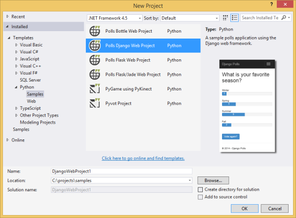
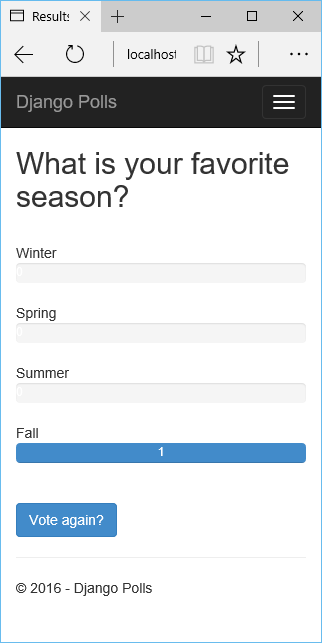
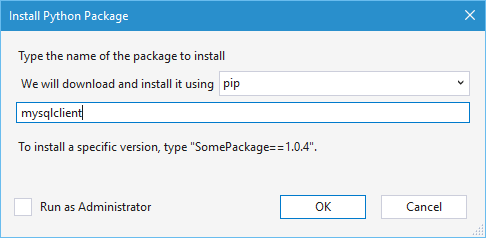
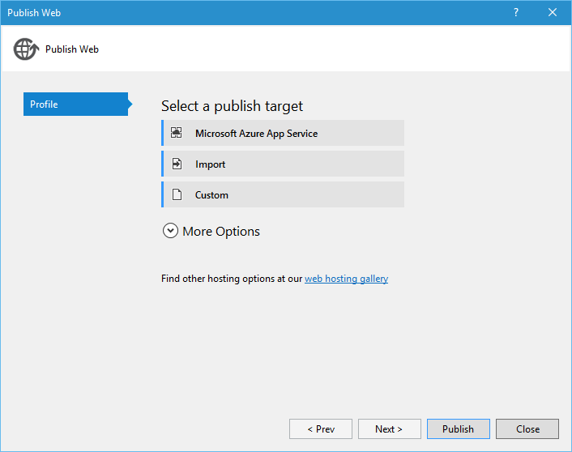
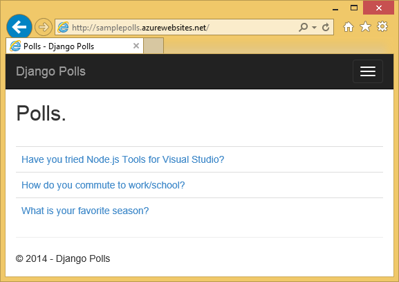

<properties 
	pageTitle="Django and MySQL on Azure with Python Tools 2.2 for Visual Studio" 
	description="Learn how to use the Python Tools for Visual Studio to create a Django web app that stores data in a MySQL database instance and deploy it to Azure App Service Web Apps." 
	services="app-service\web" 
	documentationCenter="python" 
	authors="huguesv" 
	manager="wpickett" 
	editor=""/>

<tags 
	ms.service="app-service-web" 
	ms.workload="web" 
	ms.tgt_pltfrm="na" 
	ms.devlang="python"
	ms.topic="get-started-article" 
	ms.date="07/07/2016"
	ms.author="huvalo"/>

# Django and MySQL on Azure with Python Tools 2.2 for Visual Studio 

[AZURE.INCLUDE [tabs](../../includes/app-service-web-get-started-nav-tabs.md)]

In this tutorial, you'll use [Python Tools for Visual Studio] (PTVS) to create a simple polls web app using one of the PTVS sample templates. You'll learn how to use a MySQL service hosted on Azure, how to configure the web app to use MySQL, and how to publish the web app to [Azure App Service Web Apps](http://go.microsoft.com/fwlink/?LinkId=529714).

> [AZURE.NOTE] The information contained in this tutorial is also available in the following video:
> 
> [PTVS 2.1: Django app with MySQL][video]

See the [Python Developer Center] for more articles that cover development of Azure App Service Web Apps with PTVS using Bottle, Flask and Django web frameworks, with Azure Table Storage, MySQL, and SQL Database services. While this article focuses on App Service, the steps are similar when developing [Azure Cloud Services].

## Prerequisites

 - Visual Studio 2015
 - [Python 2.7 32-bit] or [Python 3.4 32-bit]
 - [Python Tools 2.2 for Visual Studio]
 - [Python Tools 2.2 for Visual Studio Samples VSIX]
 - [Azure SDK Tools for VS 2015]
 - Django 1.9 or later

[AZURE.INCLUDE [create-account-and-websites-note](../../includes/create-account-and-websites-note.md)]

<!-- This note should not render as part of the the previous include. -->

> [AZURE.NOTE] If you want to get started with Azure App Service before signing up for an Azure account, go to [Try App Service](http://go.microsoft.com/fwlink/?LinkId=523751), where you can immediately create a short-lived starter web app in App Service. No credit card is required, and no commitments are necessary.

## Create the Project

In this section, you'll create a Visual Studio project using a sample template. You'll create a virtual environment and install required packages. You'll create a local database using sqlite. Then you'll run the application locally.

1. In Visual Studio, select **File**, **New Project**.

1. The project templates from the [Python Tools 2.2 for Visual Studio Samples VSIX] are available under **Python**, **Samples**. Select **Polls Django Web Project** and click OK to create the project.

    

1. You will be prompted to install external packages. Select **Install into a virtual environment**.

    

1. Select **Python 2.7** or **Python 3.4** as the base interpreter.

    

1. In **Solution Explorer**, right-click on the project node and select **Python**, and then select **Django Migrate**.  Then select **Django Create Superuser**.

1. This will open a Django Management Console and create a sqlite database in the project folder. Follow the prompts to create a user.

1. Confirm that the application works by pressing `F5`.

1. Click **Log in** from the navigation bar at the top.

    

1. Enter the credentials for the user you created when you synchronized the database.

    

1. Click **Create Sample Polls**.

    

1. Click on a poll and vote.

    

## Create a MySQL Database

For the database, you'll create a ClearDB MySQL hosted database on Azure.

As an alternative, you can create your own Virtual Machine running in Azure, then install and administer MySQL yourself.

You can create a database with a free plan by following these steps.

1. Log in to the [Azure Portal].

1. At the Top of the navigation pane, click **NEW**, then click **Data + Storage**, and then click **MySQL Database**. 

1. Configure the new MySQL database by creating a new resource group and select the appropriate location for it.

1. Once the MySQL database is created, click **Properties** in the database blade.

1. Use the copy button to put the value of **CONNECTION STRING** on the clipboard.

## Configure the Project

In this section, you'll configure our web app to use the MySQL database you just created. You'll also install additional Python packages required to use MySQL databases with Django. Then you'll run the web app locally.

1. In Visual Studio, open **settings.py**, from the *ProjectName* folder. Temporarily paste the connection string in the editor. The connection string is in this format:

        Database=<NAME>;Data Source=<HOST>;User Id=<USER>;Password=<PASSWORD>

    Change the default database **ENGINE** to use MySQL, and set the values for **NAME**, **USER**, **PASSWORD** and **HOST** from the **CONNECTIONSTRING**.

        DATABASES = {
            'default': {
                'ENGINE': 'django.db.backends.mysql',
                'NAME': '<Database>',
                'USER': '<User Id>',
                'PASSWORD': '<Password>',
                'HOST': '<Data Source>',
                'PORT': '',
            }
        }

1. In Solution Explorer, under **Python Environments**, right-click on the virtual environment and select **Install Python Package**.

1. Install the package `mysqlclient` using **pip**.

    

1. In **Solution Explorer**, right-click on the project node and select **Python**, and then select **Django Migrate**.  Then select **Django Create Superuser**.

    This will create the tables for the MySQL database you created in the previous section. Follow the prompts to create a user, which doesn't have to match the user in the sqlite database created in the first section of this article.

1. Run the application with `F5`. Polls that are created with **Create Sample Polls** and the data submitted by voting will be serialized in the MySQL database.

## Publish the web app to Azure App Service

The Azure .NET SDK provides an easy way to deploy your web app to Azure App Service.

1. In **Solution Explorer**, right-click on the project node and select **Publish**.

    

1. Click on **Microsoft Azure App Service**.

1. Click on **New** to create a new web app.

1. Fill in the following fields and click **Create**:
	- **Web App name**
	- **App Service plan**
	- **Resource group**
	- **Region**
	- Leave **Database server** set to **No database**

1. Accept all other defaults and click **Publish**.

1. Your web browser will open automatically to the published web app. You should see the web app working as expected, using the **MySQL** database hosted on Azure.

    

    Congratulations! You have successfully published your MySQL-based web app to Azure.

## Next steps

Follow these links to learn more about Python Tools for Visual Studio, Django and MySQL.

- [Python Tools for Visual Studio Documentation]
  - [Web Projects]
  - [Cloud Service Projects]
  - [Remote Debugging on Microsoft Azure]
- [Django Documentation]
- [MySQL]

For more information, see the [Python Developer Center](/develop/python/).

<!--Link references-->

[Python Developer Center]: /develop/python/
[Azure Cloud Services]: ../cloud-services-python-ptvs.md

<!--External Link references-->

[Azure Portal]: https://portal.azure.com
[Python Tools for Visual Studio]: http://aka.ms/ptvs
[Python Tools 2.2 for Visual Studio]: http://go.microsoft.com/fwlink/?LinkID=624025
[Python Tools 2.2 for Visual Studio Samples VSIX]: http://go.microsoft.com/fwlink/?LinkID=624025
[Azure SDK Tools for VS 2015]: http://go.microsoft.com/fwlink/?LinkId=518003
[Python 2.7 32-bit]: http://go.microsoft.com/fwlink/?LinkId=517190 
[Python 3.4 32-bit]: http://go.microsoft.com/fwlink/?LinkId=517191
[Python Tools for Visual Studio Documentation]: http://aka.ms/ptvsdocs
[Remote Debugging on Microsoft Azure]: http://go.microsoft.com/fwlink/?LinkId=624026
[Web Projects]: http://go.microsoft.com/fwlink/?LinkId=624027
[Cloud Service Projects]: http://go.microsoft.com/fwlink/?LinkId=624028
[Django Documentation]: https://www.djangoproject.com/
[MySQL]: http://www.mysql.com/
[video]: http://youtu.be/oKCApIrS0Lo
