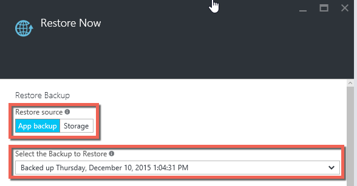
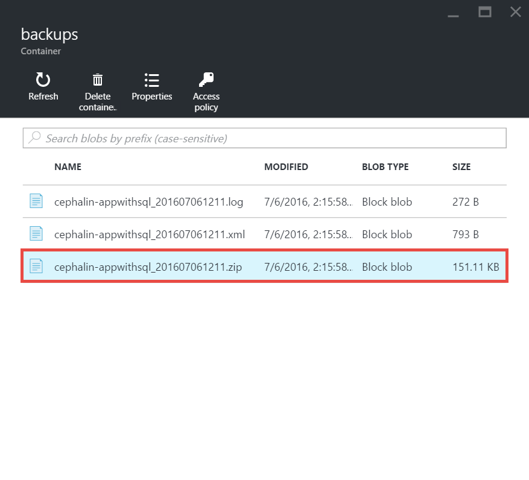

<properties 
	pageTitle="Restore an app in Azure" 
	description="Learn how to restore your app from a backup." 
	services="app-service" 
	documentationCenter="" 
	authors="cephalin" 
	manager="wpickett" 
	editor="jimbe"/>

<tags 
	ms.service="app-service" 
	ms.workload="na" 
	ms.tgt_pltfrm="na" 
	ms.devlang="na" 
	ms.topic="article" 
	ms.date="07/06/2016" 
	ms.author="cephalin"/>

# Restore an app in Azure

This article shows you how to restore an app in [Azure App Service](../app-service/app-service-value-prop-what-is.md) 
that you have previously backed up (see [Back up your app in Azure](web-sites-backup.md)). You can restore your app 
with its linked databases (SQL Database or MySQL) on-demand to a previous state, or create a new app based on one of 
your original app's backup. Creating a new app that runs in parallel to the latest version can be useful for A/B 
testing.

Restoring from backups is available to apps running in **Standard** and **Premium** tier. For information about scaling 
up your app, see [Scale up an app in Azure](web-sites-scale.md). **Premium** tier allows a greater number of daily 
backups to be performed than **Standard** tier.

## Restore an app from an existing backup

1. On the **Settings** blade of your app in the Azure Portal, click **Backups** to display the **Backups** blade. Then click **Restore Now** in the command bar. 
	
	![Choose restore now][ChooseRestoreNow]

3. In the **Restore** blade, first select the backup source. 

	
	
	The **App backup** option shows you all the existing backups of the current app, and you can easily select one. 
	The **Storage** option lets you select any backup ZIP file from any existing Azure Storage account and container in your subscription. 
	If you're trying to restore a backup of another app, use the **Storage** option.

4. Then, specify the destination for the app restore in **Restore destination**.

	
	
	>[AZURE.WARNING] If you choose **Overwrite**, all existing data in your current app will be erased. Before you click **OK**,
	make sure that it is exactly what you want to do.
	
	You can select **Existing App** to restore the app backup to another app in the same resoure group. Before you use this option, 
	you should have already created another app in your resource group with mirroring database configuration to the one defined
	in the app backup. 
	
5. Click **OK**.

## Download or delete a backup from a storage account
	
1. From the main **Browse** blade of the Azure Portal, select **Storage accounts**.
	
	A list of your existing storage accounts will be displayed. 
	
2. Select the storage account that contains the backup that you want to download or delete.
	
	The blade for the storage account will be displayed.

3. In the storage accountn blade, select the container you want
	
	![View Containers][ViewContainers]

4. Select backup file you want to download or delete.

	

5. Click **Download** or **Delete** depending on what you want to do.  

## Monitor a restore operation
	
1. To see details about the success or failure of the app restore operation, navigate to the **Audit Log** blade in the Azure portal. 
	
	The **Audit logs** blade displays all of your operations, along with level, status, resource, and time details.
	
2. Scroll down to find the desired restore operation and click to select it.

The details blade will display the available information related to the restore operation.
	
## Next Steps

You can also backup and restore App Service apps using REST API (see [Use REST to back up and restore App Service apps](websites-csm-backup.md)).

>[AZURE.NOTE] If you want to get started with Azure App Service before signing up for an Azure account, go to [Try App Service](http://go.microsoft.com/fwlink/?LinkId=523751), where you can immediately create a short-lived starter web app in App Service. No credit cards required; no commitments.

<!-- IMAGES -->
[ChooseRestoreNow]: ./media/web-sites-restore/02ChooseRestoreNow.png
[ViewContainers]: ./media/web-sites-restore/03ViewContainers.png
[StorageAccountFile]: ./media/web-sites-restore/02StorageAccountFile.png
[BrowseCloudStorage]: ./media/web-sites-restore/03BrowseCloudStorage.png
[StorageAccountFileSelected]: ./media/web-sites-restore/04StorageAccountFileSelected.png
[ChooseRestoreSettings]: ./media/web-sites-restore/05ChooseRestoreSettings.png
[ChooseDBServer]: ./media/web-sites-restore/06ChooseDBServer.png
[RestoreToNewSQLDB]: ./media/web-sites-restore/07RestoreToNewSQLDB.png
[NewSQLDBConfig]: ./media/web-sites-restore/08NewSQLDBConfig.png
[RestoredContosoWebSite]: ./media/web-sites-restore/09RestoredContosoWebSite.png
[DashboardOperationLogsLink]: ./media/web-sites-restore/10DashboardOperationLogsLink.png
[ManagementServicesOperationLogsList]: ./media/web-sites-restore/11ManagementServicesOperationLogsList.png
[DetailsButton]: ./media/web-sites-restore/12DetailsButton.png
[OperationDetails]: ./media/web-sites-restore/13OperationDetails.png
 
