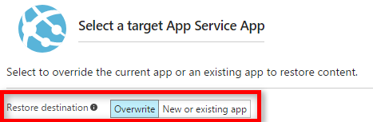

# Restore an app in Azure
This article shows you how to restore an app in [Azure App Service](../app-service/app-service-value-prop-what-is.md)
that you have previously backed up (see [Back up your app in Azure](web-sites-backup.md)). You can restore your app
with its linked databases on-demand to a previous state, or create a new app based on one of
your original app's backup. Azure App Service supports the following databases for backup and restore:
- [SQL Database](https://azure.microsoft.com/en-us/services/sql-database/)
- [Azure Database for MySQL (Preview)](https://azure.microsoft.com/en-us/services/mysql)
- [Azure Database for PostgreSQL (Preview)](https://azure.microsoft.com/en-us/services/postgres)
- [ClearDB MySQL](https://azuremarketplace.microsoft.com/en-us/marketplace/apps/SuccessBricksInc.ClearDBMySQLDatabase?tab=Overview)
- [MySQL in-app](https://blogs.msdn.microsoft.com/appserviceteam/2017/03/06/announcing-general-availability-for-mysql-in-app)

Restoring from backups is available to apps running in **Standard** and **Premium** tier. For information about scaling
up your app, see [Scale up an app in Azure](web-sites-scale.md). **Premium** tier allows a greater number of daily
backups to be performed than **Standard** tier.

## Restore an app from an existing backup
1. On the **Settings** blade of your app in the Azure Portal, click **Backups** to display the **Backups** blade. Then click **Restore**.
   
    ![Choose restore now][ChooseRestoreNow]
2. In the **Restore** blade, first select the backup source.
   
    
   
    The **App backup** option shows you all the existing backups of the current app, and you can easily select one.
    The **Storage** option lets you select any backup ZIP file from any existing Azure Storage account and container in your subscription.
    If you're trying to restore a backup of another app, use the **Storage** option.
3. Then, specify the destination for the app restore in **Restore destination**.
   
    
   
   > [!WARNING]
   > If you choose **Overwrite**, all existing data in your current app is erased and overwritten. Before you click **OK**,
   > make sure that it is exactly what you want to do.
   > 
   > 
   
    You can select **Existing App** to restore the app backup to another app in the same resoure group. Before you use this option, you should have already created another app in your resource group with mirroring database configuration to the one defined in the app backup. You can also Create a **New** app to restore your content to.

4. Click **OK**.

## Download or delete a backup from a storage account
1. From the main **Browse** blade of the Azure portal, select **Storage accounts**. A list of your existing storage accounts is displayed.
2. Select the storage account that contains the backup that you want to download or delete.The blade for the storage account is displayed.
3. In the storage account blade, select the container you want
   
    ![View Containers][ViewContainers]
4. Select backup file you want to download or delete.
   
    
5. Click **Download** or **Delete** depending on what you want to do.  

## Monitor a restore operation
To see details about the success or failure of the app restore operation, navigate to the **Activity Log** blade in the Azure portal.  
 

Scroll down to find the desired restore operation and click to select it.

The details blade displays the available information related to the restore operation.

## Next Steps
You can backup and restore App Service apps using REST API (see [Use REST to back up and restore App Service apps](websites-csm-backup.md)).

<!-- IMAGES -->
[ChooseRestoreNow]: ./media/web-sites-restore/02ChooseRestoreNow1.png
[ViewContainers]: ./media/web-sites-restore/03ViewContainers.png
[StorageAccountFile]: ./media/web-sites-restore/02StorageAccountFile.png
[BrowseCloudStorage]: ./media/web-sites-restore/03BrowseCloudStorage.png
[StorageAccountFileSelected]: ./media/web-sites-restore/04StorageAccountFileSelected.png
[ChooseRestoreSettings]: ./media/web-sites-restore/05ChooseRestoreSettings.png
[ChooseDBServer]: ./media/web-sites-restore/06ChooseDBServer.png
[RestoreToNewSQLDB]: ./media/web-sites-restore/07RestoreToNewSQLDB.png
[NewSQLDBConfig]: ./media/web-sites-restore/08NewSQLDBConfig.png
[RestoredContosoWebSite]: ./media/web-sites-restore/09RestoredContosoWebSite.png
[DashboardOperationLogsLink]: ./media/web-sites-restore/10DashboardOperationLogsLink.png
[ManagementServicesOperationLogsList]: ./media/web-sites-restore/11ManagementServicesOperationLogsList.png
[DetailsButton]: ./media/web-sites-restore/12DetailsButton.png
[OperationDetails]: ./media/web-sites-restore/13OperationDetails.png
