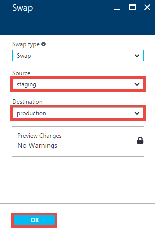

---
title: Set up staging environments for web apps in Azure App Service | Microsoft Docs 
description: Learn how to use staged publishing for web apps in Azure App Service.
services: app-service
documentationcenter: ''
author: cephalin
writer: cephalin
manager: erikre
editor: mollybos

ms.assetid: e224fc4f-800d-469a-8d6a-72bcde612450
ms.service: app-service
ms.workload: na
ms.tgt_pltfrm: na
ms.devlang: na
ms.topic: article
ms.date: 12/16/2016
ms.author: cephalin

---
# Set up staging environments in Azure App Service
<a name="Overview"></a>

When you deploy your web app, mobile back end, and API app to [App Service](http://go.microsoft.com/fwlink/?LinkId=529714), you can deploy to a separate deployment slot instead of the default production slot when running in the **Standard** or **Premium** App Service plan mode. Deployment slots are actually live apps with their own hostnames. App content and configurations elements can be swapped between two deployment slots, including the production slot. Deploying your application to a deployment slot has the following benefits:

* You can validate app changes in a staging deployment slot before swapping it with the production slot.
* Deploying an app to a slot first and swapping it into production ensures that all instances of the slot are warmed up before being swapped into production. This eliminates downtime when you deploy your app. The traffic redirection is seamless, and no requests are dropped as a result of swap operations. This entire workflow can be automated by configuring [Auto Swap](#Auto-Swap) when pre-swap validation is not needed.
* After a swap, the slot with previously staged app now has the previous production app. If the changes swapped into the production slot are not as you expected, you can perform the same swap immediately to get your "last known good site" back.

Each App Service plan mode supports a different number of deployment slots. To find out the number of slots your app's mode supports, see [App Service Pricing](https://azure.microsoft.com/pricing/details/app-service/).

* When your app has multiple slots, you cannot change the mode.
* Scaling is not available for non-production slots.
* Linked resource management is not supported for non-production slots. In the [Azure Portal](http://go.microsoft.com/fwlink/?LinkId=529715) only, you can avoid this potential impact on a production slot by temporarily moving the non-production slot to a different App Service plan mode. Note that the non-production slot must once again share the same mode with the production slot before you can swap the two slots.

<a name="Add"></a>

## Add a deployment slot
The app must be running in the **Standard** or **Premium** mode in order for you to enable multiple deployment slots.

1. In the [Azure Portal](https://portal.azure.com/), open your app's [resource blade](../azure-resource-manager/resource-group-portal.md#manage-resources).
2. Choose the **Deployment slots** option, then click **Add Slot**.
   
    ![Add a new deployment slot][QGAddNewDeploymentSlot]
   
   > [!NOTE]
   > If the app is not already in the **Standard** or **Premium** mode, you will receive a message indicating the supported modes for enabling staged publishing. At this point, you have the option to select **Upgrade** and navigate to the **Scale** tab of your app before continuing.
   > 
   > 
3. In the **Add a slot** blade, give the slot a name, and select whether to clone app configuration from another existing deployment slot. Click the check mark to continue.
   
    ![Configuration Source][ConfigurationSource1]
   
    The first time you add a slot, you will only have two choices: clone configuration from the default slot in production or not at all.
    After you have created several slots, you will be able to clone configuration from a slot other than the one in production:
   
    ![Configuration sources][MultipleConfigurationSources]
4. In your app's resource blade, click  **Deployment slots**, then click a deployment slot to open that slot's resource blade, with a set of metrics and configuration just like any other app. The name of the slot is shown at the top of the blade to remind you that you are viewing the deployment slot.
   
    ![Deployment Slot Title][StagingTitle]
5. Click the app URL in the slot's blade. Notice the deployment slot has its own hostname and is also a live app. To limit public access to the deployment slot, see [App Service Web App – block web access to non-production deployment slots](http://ruslany.net/2014/04/azure-web-sites-block-web-access-to-non-production-deployment-slots/).

There is no content after deployment slot creation. You can deploy to the slot from a different repository branch, or an altogether different repository. You can also change the slot's configuration. Use the publish profile or deployment credentials associated with the deployment slot for content updates.  For example, you can [publish to this slot with git](app-service-deploy-local-git.md).

<a name="AboutConfiguration"></a>

## Configuration for deployment slots
When you clone configuration from another deployment slot, the cloned configuration is editable. Furthermore, some configuration elements will follow the content across a swap (not slot specific) while other configuration elements will stay in the same slot after a swap (slot specific). The following lists show the configuration that will change when you swap slots.

**Settings that are swapped**:

* General settings - such as framework version, 32/64-bit, Web sockets
* App settings (can be configured to stick to a slot)
* Connection strings (can be configured to stick to a slot)
* Handler mappings
* Monitoring and diagnostic settings
* WebJobs content

**Settings that are not swapped**:

* Publishing endpoints
* Custom Domain Names
* SSL certificates and bindings
* Scale settings
* WebJobs schedulers

To configure an app setting or connection string to stick to a slot (not swapped), access the **Application Settings** blade for a specific slot, then select the **Slot Setting** box for the configuration elements that should stick the slot. Note that marking a configuration element as slot specific has the effect of establishing that element as not swappable across all the deployment slots associated with the app.

![Slot settings][SlotSettings]

<a name="Swap"></a>

## Swap deployment slots 
You can swap deployment slots in the **Overview** or **Deployment slots** view of your app's resource blade.

> [!IMPORTANT]
> Before you swap an app from a deployment slot into production, make sure that all non-slot specific settings are configured exactly as you want to have it in the swap target.
> 
> 

1. To swap deployment slots, click the **Swap** button in the command bar of the app or in the command bar of a deployment slot.
   
    ![Swap Button][SwapButtonBar]

2. Make sure that the swap source and swap target are set properly. Usually, the swap target is the production slot. Click **OK** to complete the operation. When the operation finishes, the deployment slots have been swapped.

    

    For the **Swap with preview** swap type, see [Swap with preview (multi-phase swap)](#Multi-Phase).  

<a name="Multi-Phase"></a>

## Swap with preview (multi-phase swap)

Swap with preview, or multi-phase swap, simplify validation of slot-specific configuration elements, such as connection strings.
For mission-critical workloads, you want to validate that the app behaves as expected when the production slot's configuration 
is applied, and you must perform such validation *before* the app is swapped into production. Swap with preview is what you need.

When you use the **Swap with preview** option (see [Swap deployment slots](#Swap)), App Service does the following:

- Keeps the destination slot unchanged so existing workload on that slot (e.g. production) is not impacted.
- Applies the configuration elements of the destination slot to the source slot, including the slot-specific connection
strings and app settings.
- Restarts the worker processes on the source slot using these aforementioned configuration elements.
- When you complete the swap: Moves the pre-warmed-up source slot into the destination slot. The destination slot is moved 
into the source slot as in a manual swap.
- When you cancel the swap: Reapplies the configuration elements of the source slot to the source slot.

You can preview exactly how the app will behave with the destination slot's configuration. Once you completes validation, you complete
the swap in a separate step. This step has the added advantage that the source slot is already warmed up with the desired configuration,
and clients will not experience any downtime.  

Samples for the Azure PowerShell cmdlets available for multi-phase swap are included in the Azure PowerShell cmdlets for deployment slots section.

<a name="Auto-Swap"></a>

## Configure Auto Swap
Auto Swap streamlines DevOps scenarios where you want to continuously deploy your app with zero cold start and zero downtime for end customers of the app. When a deployment slot is configured for Auto Swap into production, every time you push your code update to that slot, App Service will automatically swap the app into production after it has already warmed up in the slot.

> [!IMPORTANT]
> When you enable Auto Swap for a slot, make sure the slot configuration is exactly the configuration intended for the target slot (usually the production slot).
> 
> 

Configuring Auto Swap for a slot is easy. Follow the steps below:

1. In **Deployment Slots**, select a non-production slot, and choose **Application Settings** in that slot's resource blade.  
   
    ![][Autoswap1]
2. Select **On** for **Auto Swap**, select the desired target slot in **Auto Swap Slot**, and click **Save** in the command bar. 
Make sure configuration for the slot is exactly the configuration intended for the target slot.
   
    The **Notifications** tab will flash a green **SUCCESS** once the operation is complete.
   
    ![][Autoswap2]
   
   > [!NOTE]
   > To test Auto Swap for your app, you can first select a non-production target slot in **Auto Swap Slot** to become familiar with the feature.  
   > 
   > 
3. Execute a code push to that deployment slot. Auto Swap will happen after a short time and the update will be reflected at your target slot's URL.

<a name="Rollback"></a>

## To rollback a production app after swap
If any errors are identified in production after a slot swap, roll the slots back to their pre-swap states by swapping the same two slots immediately.

<a name="Warm-up"></a>

## Custom warm-up before swap
Some apps may require custom warm-up actions. The `applicationInitialization` configuration element in web.config allows you to specify custom initialization actions to be performed before a request is received. The swap operation will wait for this custom warm-up to complete. Here is a sample web.config fragment.

    <applicationInitialization>
        <add initializationPage="/" hostName="[app hostname]" />
        <add initializationPage="/Home/About" hostname="[app hostname]" />
    </applicationInitialization>

<a name="Delete"></a>

## To delete a deployment slot
In the blade for a deployment slot, open the deployment slot's blade, click **Overview** (the default page), 
and click **Delete** in the command bar.  

![Delete a Deployment Slot][DeleteStagingSiteButton]

<!-- ======== AZURE POWERSHELL CMDLETS =========== -->

<a name="PowerShell"></a>

## Azure PowerShell cmdlets for deployment slots
Azure PowerShell is a module that provides cmdlets to manage Azure through Windows PowerShell, including support for managing deployment slots in Azure App Service.

* For information on installing and configuring Azure PowerShell, and on authenticating Azure PowerShell with your Azure subscription, see [How to install and configure Microsoft Azure PowerShell](/powershell/azure/overview).  

- - -
### Create a web app
```
New-AzureRmWebApp -ResourceGroupName [resource group name] -Name [app name] -Location [location] -AppServicePlan [app service plan name]
```

- - -
### Create a deployment slot
```
New-AzureRmWebAppSlot -ResourceGroupName [resource group name] -Name [app name] -Slot [deployment slot name] -AppServicePlan [app service plan name]
```

- - -
### Initiate a swap with review (multi-phase swap) and apply destination slot configuration to source slot
```
$ParametersObject = @{targetSlot  = "[slot name – e.g. “production”]"}
Invoke-AzureRmResourceAction -ResourceGroupName [resource group name] -ResourceType Microsoft.Web/sites/slots -ResourceName [app name]/[slot name] -Action applySlotConfig -Parameters $ParametersObject -ApiVersion 2015-07-01
```

- - -
### Cancel a pending swap (swap with review) and restore source slot configuration
```
Invoke-AzureRmResourceAction -ResourceGroupName [resource group name] -ResourceType Microsoft.Web/sites/slots -ResourceName [app name]/[slot name] -Action resetSlotConfig -ApiVersion 2015-07-01
```

- - -
### Swap deployment slots
```
$ParametersObject = @{targetSlot  = "[slot name – e.g. “production”]"}
Invoke-AzureRmResourceAction -ResourceGroupName [resource group name] -ResourceType Microsoft.Web/sites/slots -ResourceName [app name]/[slot name] -Action slotsswap -Parameters $ParametersObject -ApiVersion 2015-07-01
```

- - -
### Delete deployment slot
```
Remove-AzureRmResource -ResourceGroupName [resource group name] -ResourceType Microsoft.Web/sites/slots –Name [app name]/[slot name] -ApiVersion 2015-07-01
```

- - -
<!-- ======== Azure CLI =========== -->

<a name="CLI"></a>

## Azure Command-Line Interface (Azure CLI) commands for Deployment Slots
The Azure CLI provides cross-platform commands for working with Azure, including support for managing App Service deployment slots.

* For instructions on installing and configuring the Azure CLI, including information on how to connect Azure CLI to your Azure subscription, see [Install and Configure the Azure CLI](../cli-install-nodejs.md).
* To list the commands available for Azure App Service in the Azure CLI, call `azure site -h`.

> [!NOTE] 
> For [Azure CLI 2.0](https://github.com/Azure/azure-cli) commands for deployment slots, see [az appservice web deployment slot](/cli/azure/appservice/web/deployment/slot).

- - -
### azure site list
For information about the apps in the current subscription, call **azure site list**, as in the following example.

`azure site list webappslotstest`

- - -
### azure site create
To create a deployment slot, call **azure site create** and specify the name of an existing app and the name of the slot to create, as in the following example.

`azure site create webappslotstest --slot staging`

To enable source control for the new slot, use the **--git** option, as in the following example.

`azure site create --git webappslotstest --slot staging`

- - -
### azure site swap
To make the updated deployment slot the production app, use the **azure site swap** command to perform a swap operation, as in the following example. The production app will not experience any down time, nor will it undergo a cold start.

`azure site swap webappslotstest`

- - -
### azure site delete
To delete a deployment slot that is no longer needed, use the **azure site delete** command, as in the following example.

`azure site delete webappslotstest --slot staging`

- - -
> [!NOTE]
> See a web app in action. [Try App Service](https://azure.microsoft.com/try/app-service/) immediately and create a short-lived starter app—no credit 
> card required, no commitments.
> 
> 

## Next Steps
[Azure App Service Web App – block web access to non-production deployment slots](http://ruslany.net/2014/04/azure-web-sites-block-web-access-to-non-production-deployment-slots/)

[Microsoft Azure Free Trial](https://azure.microsoft.com/pricing/free-trial/)

<!-- IMAGES -->
[QGAddNewDeploymentSlot]:  ./media/web-sites-staged-publishing/QGAddNewDeploymentSlot.png
[AddNewDeploymentSlotDialog]: ./media/web-sites-staged-publishing/AddNewDeploymentSlotDialog.png
[ConfigurationSource1]: ./media/web-sites-staged-publishing/ConfigurationSource1.png
[MultipleConfigurationSources]: ./media/web-sites-staged-publishing/MultipleConfigurationSources.png
[SiteListWithStagedSite]: ./media/web-sites-staged-publishing/SiteListWithStagedSite.png
[StagingTitle]: ./media/web-sites-staged-publishing/StagingTitle.png
[SwapButtonBar]: ./media/web-sites-staged-publishing/SwapButtonBar.png
[SwapConfirmationDialog]:  ./media/web-sites-staged-publishing/SwapConfirmationDialog.png
[DeleteStagingSiteButton]: ./media/web-sites-staged-publishing/DeleteStagingSiteButton.png
[SwapDeploymentsDialog]: ./media/web-sites-staged-publishing/SwapDeploymentsDialog.png
[Autoswap1]: ./media/web-sites-staged-publishing/AutoSwap01.png
[Autoswap2]: ./media/web-sites-staged-publishing/AutoSwap02.png
[SlotSettings]: ./media/web-sites-staged-publishing/SlotSetting.png

