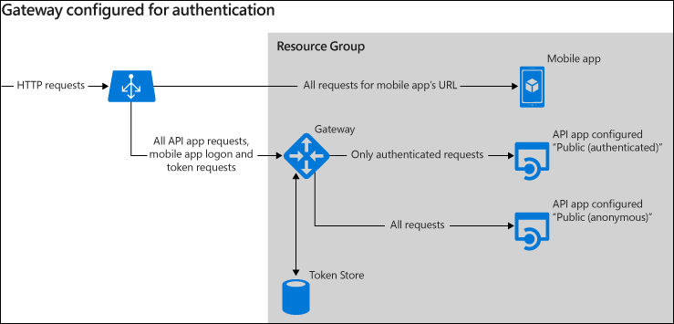
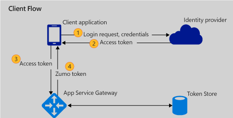
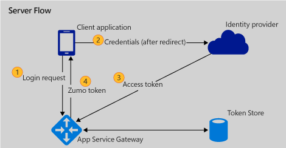
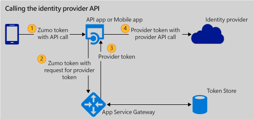
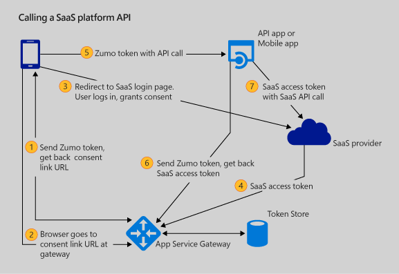

<properties 
	pageTitle="Authentication in Azure App Service API apps and mobile apps" 
	description="Learn how to configure and use authentication for API apps and mobile apps in Azure app service." 
	services="app-service" 
	documentationCenter="" 
	authors="tdykstra" 
	manager="wpickett" 
	editor="jimbe"/>

<tags 
	ms.service="app-service" 
	ms.workload="web" 
	ms.tgt_pltfrm="na" 
	ms.devlang="na" 
	ms.topic="article" 
	ms.date="09/22/2015" 
	ms.author="tdykstra"/>

# Authentication for API apps and mobile apps in Azure App Service

## Overview

This article explains the built-in authentication features for [API apps](../app-service-api/app-service-api-apps-why-best-platform.md) and [mobile apps](../app-service-mobile/app-service-mobile-value-prop-preview.md). 

The [Next steps](#next-steps) section at the end of the article provides links to related how-to documentation.

## Azure App Service gateway

Azure App Service offers built-in authentication services that implement [OAuth 2.0](#oauth) and [OpenID Connect](#oauth) and work with multiple *identity providers*. An identity provider is an external service, trusted by Azure App Service, that authenticates your app's users. App Service supports the most popular identity providers:

* Azure Active Directory
* Microsoft Account
* Google
* Twitter
* Facebook

### Gateway architecture

Any Azure resource group that contains API apps or mobile apps includes a *gateway*. The gateway is an Azure resource that runs in a web app and handles administrative tasks including authentication for API apps and mobile apps in the resource group.

The gateway handles login procedures, manages tokens, and prevents unauthenticated calls from reaching API apps that are [configured to require authenticated access](../app-service-api/app-service-api-dotnet-add-authentication.md#protect-the-api-app).  The gateway can control access to API apps because all incoming HTTP requests destined for API apps in the resource group are routed through the gateway.

The following diagram illustrates these gateway functions.

### Gateway features

The gateway authentication services offer several advantages over running your own implementation of OAuth 2.0:

* Microsoft provides SDKs that enable you to perform authentication and authorization tasks using a simplified syntax.

* Because App Service handles more authentication tasks, your development and testing time is minimized, and you avoid most or all of the impact of changes in provider implementations of OAuth. 

* If you have multiple applications to protect and you keep them in one resource group, you only need one client ID and client secret for each authentication provider, because there is only one redirect URL for the gateway.  

* Monitoring and troubleshooting are easier because you can monitor authentication-related traffic for an entire resource group by monitoring the gateway.

* Debugging is easier because you can configure a program to use the gateway while running in debug mode locally, and you don't have to change redirect URLs in your identity provider account.

## Server flow vs. client flow

The App Service gateway offers two ways to authenticate clients:  *client flow* and *server flow*. In both flows, the client application sends the user credentials (typically, user name and password) directly to the identity provider. Neither the gateway nor your application receives user credentials in either flow.

### Client flow

Client flow means the client application communicates directly with the identity provider to get the provider's access token. The client application sends the provider's access token to the gateway.  The gateway creates and sends to the client a user context token. This user context token is also known as a Zumo token, from the original code name for [Azure Mobile Services](/documentation/services/mobile-services/). (Authentication services for API Apps and Mobile Apps are built on the same architecture originally developed for Mobile Services.)

The following diagram illustrates this flow. 

The client then provides the Zumo token in HTTP requests when it calls protected API apps or mobile apps. The gateway stores the provider tokens and keeps track of which ones are associated with which Zumo tokens.

### Server flow

Server flow means the client application relies on the gateway to communicate with the identity provider to initiate login.  The client browser goes to a gateway URL, and the gateway redirects the request to the identity provider's login page.  After the user logs in, the gateway gets the identity provider's token, creates the Zumo token, and sends the Zumo token to the client.

Subsequent interaction between the client application and protected API apps or mobile apps is handled the same as for client flow:  the client provides the Zumo token in HTTP requests. 

### How to choose between client flow and server flow

The client flow is typically the best choice if the identity provider that you want to use has an SDK for the client platform that you want to support. Client flow provides the best user experience because it reduces the number of times the user has to enter credentials.  For example, if your user has an android device, they probably have a Google account associated with their device, so if they can use that account without having to re-enter their user name and password, that makes for a better user experience. Same thing with a Facebook account in an Android, iOS, or Windows Phone device, or a Microsoft account on a Windows desktop or Windows Phone.  

In other scenarios the server flow may be a better choice: 

- There is no native client SDK for the identity provider and client platform you want to support.

- You want to get something into production quickly and improve the user experience as time permits later. The server flow lets Azure App Service do more of the authentication work, which minimizes the amount of development and testing you have to do.

## On-behalf-of outgoing calls to SaaS platforms

You can write code to make outgoing calls to Software-as-a-Service (SaaS) platforms on behalf of a logged-in user or you can use a [connector API app](../app-service-mobile/app-service-logic-what-are-biztalk-api-apps.md). For example, to post a tweet from the user's Twitter account you can use [a Twitter SDK](https://dev.twitter.com/overview/api/twitter-libraries), or provision a [Twitter connector](../app-service-mobile/app-service-logic-connector-twitter.md) in your Azure subscription and call that. This section is about accessing a SaaS platform from code that runs in an API app or mobile app.   

###  Using the identity provider token 

The gateway maintains a *token store* in which it associates a Zumo token with one or more identity provider access tokens and refresh tokens. When an HTTP request with a valid Zumo token is received, the gateway knows which identity provider tokens pertain to that user.
  
When the code running in your API app or mobile app needs to make a call to a protected resource on behalf of the logged-on user, it can retrieve and use the identity provider's token from the gateway's token store, as shown in the following diagram. The diagram assumes that the client has already authenticated with the gateway and has the Zumo token.  

For example, suppose the identity provider is Azure Active Directory (AAD), and your API app wants to use the AAD access token to call the AAD Graph API or request access to a SharePoint site that the user has permissions for.  You can send a request to the gateway to retrieve the AAD token, then use the AAD token to call the Graph API or to get an access token for the SharePoint site. 

### Getting user consent to access other resources

The gateway also has built-in features for getting user consent when you want to access resources secured by a provider other than the original identity provider.  For example, for a user who signs in using Azure Active Directory, you might want to access files in the user's Dropbox account.

The app service gateway includes built-in support for getting the user's consent to such access from the following providers:

* Box
* DropBox
* Facebook
* Google
* Office365
* OneDrive
* QuickBooks
* Salesforce
* SharePointOnline
* Twitter
* Yammer
* Azure Active Directory
* Microsoft Account

For these providers, the gateway maintains access tokens and associates them with the Zumo token, as it does for the identity provider access token. The process of getting user consent and calling a SaaS platform is illustrated in the following diagram. The diagram assumes that the client has already authenticated with the gateway and has the Zumo token.

The App Service runtime support and SDKs make it relatively easy to write code that accesses resources secured by one of these providers. There is a preliminary step not shown in the diagram: you have to set up an account with the provider and configure the provider's client ID and client secret settings in Azure App Service.

For these and many other providers you can also access secured resources by using a prepackaged [connector API app](../app-service-mobile/app-service-logic-what-are-biztalk-api-apps.md).  

## SDK availability

For API apps, The SDK for .NET provides authentication functionality:

* [Microsoft.Azure.AppService](http://www.nuget.org/packages/Microsoft.Azure.AppService) - For use in an API app client.  
* [Microsoft.Azure.AppService.ApiApps.Service](http://www.nuget.org/packages/Microsoft.Azure.AppService.ApiApps.Service/) - For use in a Web API project that runs in an API app.
 
In addition, Visual Studio can automatically generate code that works with the SDK for .NET to further simplify the code you write to call your API app.  For more information, see [Consume an API app in Azure App Service from a .NET client](../app-service-api/app-service-api-dotnet-consume.md).

For Mobile Apps, SDKs are available for the following platforms:

- [.NET Server](https://www.nuget.org/packages/Microsoft.Azure.Mobile.Server/) 
- [iOS](../app-service-mobile/app-service-mobile-dotnet-backend-ios-get-started-preview.md)
- [Xamarin iOS](../app-service-mobile/app-service-mobile-dotnet-backend-xamarin-ios-get-started-preview.md)
- [Xamarin Android](../app-service-mobile/app-service-mobile-dotnet-backend-xamarin-android-get-started-preview.md)
- [Windows](../app-service-mobile/app-service-mobile-dotnet-backend-windows-store-dotnet-get-started-preview.md)
- JavaScript (tutorial in development)

## Alternative authentication methods

If the gateway authentication services don't meet the needs of your app, you can handle authentication yourself, or use the Azure API Management service.

### Do-it-yourself authentication

You can run an authentication framework such as [ASP.NET Identity](http://www.asp.net/identity) or [Thinktecture](http://www.thinktecture.com/identityAndAccessControl) on Azure. This gives you control over how everything works, but you also have to spend more time developing and testing authentication functionality. Also, if you have multiple apps to protect with multiple redirect URLs, you have to configure multiple client IDs and client secrets with third-party authentication providers such as Facebook, Google, and Twitter.

At present App Service does not support using a do-it-yourself solution alongside gateway authentication, as is possible in [Mobile Services](mobile-services-dotnet-backend-get-started-custom-authentication.md). 

### Azure API Management

If you have existing APIs that you want to protect with authentication, you can do that with the Azure API Management service. For information about using API Management with API apps, see this blog post by Panos Kefalidis: [Taking advantage of API Management for API Apps](http://www.kefalidis.me/2015/06/taking-advantage-of-api-management-for-api-apps/) 

## Next steps

This article has explained the authentication services provided by Azure App Service for API Apps and Mobile Apps. Here are some links to resources for learning about the underlying authentication protocols, and documentation about how to use the App Service authentication features.

* [OAuth 2.0, OpenID Connect, and JSON Web Tokens (JWT)](#oauth)
* API Apps resources
	* [API Apps client flow](#apiaclient)
	* [API Apps server flow](#apiaserver)
	* [API Apps on-behalf-of calls](#apiaobo)
* Mobile Apps resources
	* [Mobile Apps client flow](#maclient)
	* [Mobile Apps server flow](#maserver)
	* [Mobile Apps on-behalf-of calls](#maobo)

### OAuth 2.0, OpenID Connect, and JSON Web Tokens (JWT)

* [Getting started with OAuth 2.0](http://shop.oreilly.com/product/0636920021810.do "Getting Started with OAuth 2.0") 
* [Introduction to OAuth2, OpenID Connect and JSON Web Tokens (JWT) - PluralSight Course](http://www.pluralsight.com/courses/oauth2-json-web-tokens-openid-connect-introduction) 
* [Building and Securing a RESTful API for Multiple Clients in ASP.NET - PluralSight course](http://www.pluralsight.com/courses/building-securing-restful-api-aspdotnet)

### API Apps client flow

* [Protect an API app](../app-service-api/app-service-api-dotnet-add-authentication.md) - The API app configuration part applies to both client and server flow, but the test-in-browser part illustrates server flow.
* [Consume an API app in Azure App Service from a .NET client](../app-service-api/app-service-api-dotnet-consume.md) - The sample app for an authenticated call illustrates server flow, but it is followed by a [client flow](../app-service-api/app-service-api-dotnet-consume.md#client-flow) section with sample code.

### API Apps server flow

* [Protect an API app](../app-service-api/app-service-api-dotnet-add-authentication.md) - The API app configuration part applies to both client and server flow, and the test-in-browser part illustrates server flow.
* [Consume an API app in Azure App Service from a .NET client](../app-service-api/app-service-api-dotnet-consume.md) - The sample code for an authenticated call illustrates server flow. 

### API Apps on-behalf-of calls

* [Deploy and configure a SaaS connector API app in Azure App Service](../app-service-api/app-service-api-connnect-your-app-to-saas-connector.md) - Illustrates how to provision a prepackaged connector API app, configure it, and call it using browser tools.
* [Connect to a SaaS platform from an ASP.NET API app in Azure App Service](../app-service-api/app-service-api-dotnet-connect-to-saas.md) - Illustrates how to write your own connector -- that is, provision, configure, and write code for a custom API app that makes on-behalf-of calls to a SaaS provider.

### Mobile Apps client flow

* [Add Azure Active Directory single sign-on to your iOS app](../app-service-mobile/app-service-mobile-dotnet-backend-ios-aad-sso-preview.md)

### Mobile Apps server flow

* [Add authentication to your iOS app](../app-service-mobile/app-service-mobile-dotnet-backend-ios-get-started-users-preview.md)
* [Add authentication to your Xamarin.iOS app](../app-service-mobile/app-service-mobile-dotnet-backend-xamarin-ios-get-started-users-preview.md)
* [Add authentication to your Xamarin.Android app](../app-service-mobile/app-service-mobile-dotnet-backend-xamarin-android-get-started-users-preview.md)
* [Add authentication to your Windows app](../app-service-mobile/app-service-mobile-dotnet-backend-windows-store-dotnet-get-started-users-preview.md)

### Mobile Apps on-behalf-of calls to secured resources

* [Obtain an access token and call the SharePoint API in a mobile app](../app-service-mobile/app-service-mobile-dotnet-backend-get-started-connect-to-enterprise.md#obtain-token)
