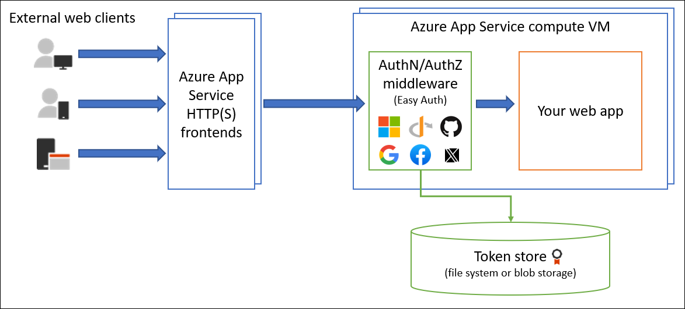

# Authentication and authorization in Azure App Service

Azure App Service provides built-in authentication and authorization support, so you can sign in users and access data by writing minimal or no code in your web app, API, and mobile back end, and also [Azure Functions](../azure-functions/functions-overview.md). This article describes how App Service helps simplify authentication and authorization for your app. 

Secure authentication and authorization requires deep understanding of security, including federation, encryption, [JSON web tokens (JWT)](https://wikipedia.org/wiki/JSON_Web_Token) management, [grant types](https://oauth.net/2/grant-types/), and so on. App Service provides these utilities so that you can spend more time and energy on providing business value to your customer.

> [!NOTE]
> You're not required to use App Service for authentication and authorization. Many web frameworks are bundled with security features, and you can use them if you like. If you need more flexibility than App Service provides, you can also write your own utilities.  
>

For information specific to native mobile apps, see [User authentication and authorization for mobile apps with Azure App Service](../app-service-mobile/app-service-mobile-auth.md).

## How it works

The authentication and authorization module runs in the same sandbox as your application code. When it's enabled, every incoming HTTP request passes through it before being handled by your application code.

This module handles several things for your app:

- Authenticates users with the specified provider
- Validates, stores, and refreshes tokens
- Manages the authenticated session
- Injects identity information into request headers

The module runs separately from your application code and is configured using app settings. No SDKs, specific languages, or changes to your application code are required. 

### User claims

For all language frameworks, App Service makes the user's claims available to your code by injecting them into the request headers. For ASP.NET 4.6 apps, App Service populates [ClaimsPrincipal.Current](/dotnet/api/system.security.claims.claimsprincipal.current) with the authenticated user's claims, so you can follow the standard .NET code pattern, including the `[Authorize]` attribute. Similarly, for PHP apps, App Service populates the `_SERVER['REMOTE_USER']` variable.

For [Azure Functions](../azure-functions/functions-overview.md), `ClaimsPrincipal.Current` is not hydrated for .NET code, but you can still find the user claims in the request headers.

For more information, see [Access user claims](app-service-authentication-how-to.md#access-user-claims).

### Token store

App Service provides a built-in token store, which is a repository of tokens that are associated with the users of your web apps, APIs, or native mobile apps. When you enable authentication with any provider, this token store is immediately available to your app. If your application code needs to access data from these providers on the user's behalf, such as: 

- post to the authenticated user's Facebook timeline
- read the user's corporate data from the Azure Active Directory Graph API or even the Microsoft Graph

The id tokens, access tokens, and refresh tokens cached for the authenticated session, and they're accessible only by the associated user.  

You typically must write code to collect, store, and refresh these tokens in your application. With the token store, you just [retrieve the tokens](app-service-authentication-how-to.md#retrieve-tokens-in-app-code) when you need them and [tell App Service to refresh them](app-service-authentication-how-to.md#refresh-access-tokens) when they become invalid. 

If you don't need to work with tokens in your app, you can disable the token store.

### Logging and tracing

If you [enable application logging](web-sites-enable-diagnostic-log.md), you will see authentication and authorization traces directly in your log files. If you see an authentication error that you didn’t expect, you can conveniently find all the details by looking in your existing application logs. If you enable [failed request tracing](web-sites-enable-diagnostic-log.md), you can see exactly what role the authentication and authorization module may have played in a failed request. In the trace logs, look for references to a module named `EasyAuthModule_32/64`. 

## Identity providers

App Service uses [federated identity](https://en.wikipedia.org/wiki/Federated_identity), in which a third-party identity provider manages the user identities and authentication flow for you. Five identity providers are available by default: 

| Provider | Sign-in endpoint |
| - | - |
| [Azure Active Directory](../active-directory/fundamentals/active-directory-whatis.md) | `/.auth/login/aad` |
| [Microsoft Account](../active-directory/develop/active-directory-appmodel-v2-overview.md) | `/.auth/login/microsoftaccount` |
| [Facebook](https://developers.facebook.com/docs/facebook-login) | `/.auth/login/facebook` |
| [Google](https://developers.google.com/+/web/api/rest/oauth) | `/.auth/login/google` |
| [Twitter](https://developer.twitter.com/en/docs/basics/authentication) | `/.auth/login/twitter` |

When you enable authentication and authorization with one of these providers, its sign-in endpoint is available for user authentication and for validation of authentication tokens from the provider. You can provide your users with any number of these sign-in options with ease. You can also integrate another identity provider or [your own custom identity solution][custom-auth].

## Authentication flow

The authentication flow is the same for all providers, but differs depending on whether you want to log in with the provider's SDK:

- Without provider SDK: The application delegates federated sign-in to App Service. This is typically the case with browser apps, which can present the provider's login page to the user. The server code manages the sign-in process, so it is also called _server-directed flow_ or _server flow_. This case applies to web apps. It also applies to native apps that sign users in using the Mobile Apps client SDK because the SDK opens a web view to sign users in with App Service authentication. 
- With provider SDK: The application signs user in manually and then submits the authentication token to App Service for validation. This is typically the case with browser-less apps, which can't present the provider's sign-in page to the user. The application code manages the sign-in process, so it is also called _client-directed flow_ or _client flow_. This case applies to REST APIs, [Azure Functions](../azure-functions/functions-overview.md), and JavaScript browser clients, as well as web apps that need more flexibility in the sign-in process. It also applies to native mobile apps that sign users in using the provider's SDK.

> [!NOTE]
> Calls from a trusted browser app in App Service calls another REST API in App Service or [Azure Functions](../azure-functions/functions-overview.md) can be authenticated using the server-directed flow. For more information, see [Customize authentication and authorization in App Service](app-service-authentication-how-to.md).
>

The table below shows the steps of the authentication flow.

| Step | Without provider SDK | With provider SDK |
| - | - | - |
| 1. Sign user in | Redirects client to `/.auth/login/<provider>`. | Client code signs user in directly with provider's SDK and receives an authentication token. For information, see the provider's documentation. |
| 2. Post-authentication | Provider redirects client to `/.auth/login/<provider>/callback`. | Client code posts token from provider to `/.auth/login/<provider>` for validation. |
| 3. Establish authenticated session | App Service adds authenticated cookie to response. | App Service returns its own authentication token to client code. |
| 4. Serve authenticated content | Client includes authentication cookie in subsequent requests (automatically handled by browser). | Client code presents authentication token in `X-ZUMO-AUTH` header (automatically handled by Mobile Apps client SDKs). |

For client browsers, App Service can automatically direct all unauthenticated users to `/.auth/login/<provider>`. You can also present users with one or more `/.auth/login/<provider>` links to sign in to your app using their provider of choice.

## Authorization behavior

In the [Azure portal](https://portal.azure.com), you can configure App Service authorization with a number of behaviors.

The following headings describe the options.

### Allow all requests (default)

Authentication and authorization is not managed by App Service (turned off). 

Choose this option if you don't need authentication and authorization, or if you want to write your own authentication and authorization code.

### Allow only authenticated requests

The option is **Log in with \<provider>**. App Service redirects all anonymous requests to `/.auth/login/<provider>` for the provider you choose. If the anonymous request comes from a native mobile app, the returned response is an `HTTP 401 Unauthorized`.

With this option, you don't need to write any authentication code in your app. Finer authorization, such as role-specific authorization, can be handled by inspecting the user's claims (see [Access user claims](app-service-authentication-how-to.md#access-user-claims)).

### Allow all requests, but validate authenticated requests

The option is **Allow Anonymous requests**. This option turns on authentication and authorization in App Service, but defers authorization decisions to your application code. For authenticated requests, App Service also passes along authentication information in the HTTP headers. 

This option provides more flexibility in handling anonymous requests. For example, it lets you [present multiple sign-in providers](app-service-authentication-how-to.md#use-multiple-sign-in-providers) to your users. However, you must write code. 

## More resources

[Tutorial: Authenticate and authorize users end-to-end in Azure App Service (Windows)](app-service-web-tutorial-auth-aad.md)  
[Tutorial: Authenticate and authorize users end-to-end in Azure App Service for Linux](containers/tutorial-auth-aad.md)  
[Customize authentication and authorization in App Service](app-service-authentication-how-to.md)

Provider-specific how-to guides:

* [How to configure your app to use Azure Active Directory login][AAD]
* [How to configure your app to use Facebook login][Facebook]
* [How to configure your app to use Google login][Google]
* [How to configure your app to use Microsoft Account login][MSA]
* [How to configure your app to use Twitter login][Twitter]
* [How to: Use custom authentication for your application][custom-auth]

[AAD]: app-service-mobile-how-to-configure-active-directory-authentication.md
[Facebook]: app-service-mobile-how-to-configure-facebook-authentication.md
[Google]: app-service-mobile-how-to-configure-google-authentication.md
[MSA]: app-service-mobile-how-to-configure-microsoft-authentication.md
[Twitter]: app-service-mobile-how-to-configure-twitter-authentication.md

[custom-auth]: ../app-service-mobile/app-service-mobile-dotnet-backend-how-to-use-server-sdk.md#custom-auth

[ADAL-Android]: ../app-service-mobile/app-service-mobile-android-how-to-use-client-library.md#adal
[ADAL-iOS]: ../app-service-mobile/app-service-mobile-ios-how-to-use-client-library.md#adal
[ADAL-dotnet]: ../app-service-mobile/app-service-mobile-dotnet-how-to-use-client-library.md#adal
